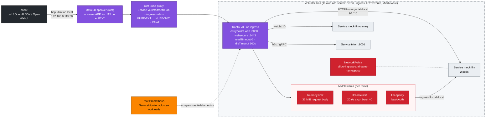
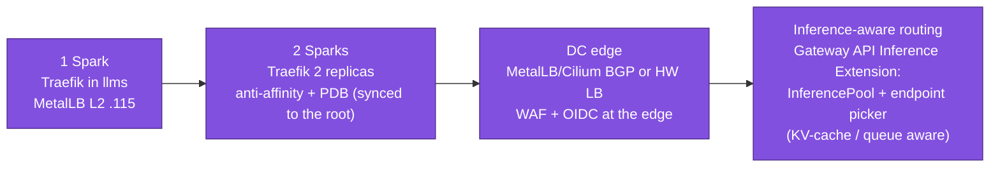

# Step 11 · Ingress Controllers & Gateway API for LLM APIs: Streaming, Limits, Auth, Canaries, TLS, gRPC

> **02-Kubernetes · Part III — Networking · Step 11 of 28** · ← [Step 10 · CoreDNS & service discovery](10-coredns-and-service-discovery.md) · [All steps](00-kubernetes-step-by-step-guide.md) · [Step 12 · Advanced workload controllers](12-advanced-workload-controllers.md) →

| | |
|---|---|
| **You will build** | Traefik v3 as both Ingress controller and Gateway API implementation in front of an OpenAI-compatible endpoint — running *inside* the `llms` vCluster as its API gateway, on a MetalLB address from the root. You'll prove token streaming isn't buffered, add body-size limits, rate limits and API-key auth, run a 90/10 canary with an `HTTPRoute`, terminate TLS and route gRPC to Triton. The mock LLM makes all of it GPU-free |
| **Hardware** | dgx-spark-1 (MetalLB answers for **192.168.0.115** on the mgmt LAN). Your laptop is the client |
| **Time** | 90 min |
| **Risk** | Low |
| **Clusters** | `llms` (Traefik in namespace `ingress`, Gateway API CRDs, Ingress/HTTPRoute/Middleware objects, mock-llm in `llm-serving`), `spark-root` (MetalLB, the synced LoadBalancer Service, Hubble) |
| **Lab files** | [`addons/traefik-values.yaml`](lab/addons/traefik-values.yaml), [`scripts/install-addons.sh`](lab/scripts/install-addons.sh) (`traefik`), [`manifests/llms/40-ingress/`](lab/manifests/llms/40-ingress/) (`mock_llm.py`, `middlewares.yaml`, `ingress.yaml`, `gateway-routes.yaml`), [`manifests/llms/10-tenancy/networkpolicies.yaml`](lab/manifests/llms/10-tenancy/networkpolicies.yaml), [`breakfix/08-selector-typo.yaml`](lab/breakfix/08-selector-typo.yaml), [`breakfix/09-buffered-stream.yaml`](lab/breakfix/09-buffered-stream.yaml) |

---

## 1. Why this matters on a Spark

LLM traffic breaks web-app assumptions:

| Web default | LLM reality | What breaks |
|---|---|---|
| responses in < 1 s | a long generation streams for minutes | proxy `readTimeout` 60 s cuts the stream (504) |
| small bodies | RAG prompts and base64 images run to megabytes | `413 Request Entity Too Large` |
| buffering responses is harmless | SSE tokens must flush one by one | the user waits 40 s then gets everything at once (drill 09) |
| round-robin per connection | clients keep connections alive | one replica hot, others idle (Step 09) |

> **Controller choice.** A kubeadm cluster ships no ingress controller, so the lab installs a pinned Traefik with `scripts/install-addons.sh traefik` — into the **llms vCluster**, not the root. Traefik reads Middlewares, IngressRoutes and HTTPRoutes from the API server it talks to: inside llms it sees the serving team's objects under their real names; on the root it would see the syncer's translated names (`llm-x-llm-serving-x-llms`) — and Ingresses, HTTPRoutes and Middlewares aren't synced at all. The gateway belongs to the cluster whose API it serves. The community **ingress-nginx** controller has been retired (best-effort maintenance ended March 2026), so new platforms should use Gateway API implementations (Traefik, Envoy Gateway, Cilium, NGINX Gateway Fabric).

---

## 2. Architecture — HLD



Two clusters cooperate on every request. The **root** owns the address (MetalLB) and the first NAT (kube-proxy, on the synced copy of Traefik's LoadBalancer Service). **llms** owns everything with an opinion: routes, middlewares, TLS secrets, and the EndpointSlices Traefik reads to pick a backend pod. Traefik then connects straight to that pod IP — a real root pod in `vc-llms` — balancing per request.

### 2.1 Ingress vs Gateway API

| | Ingress | Gateway API |
|---|---|---|
| Roles | one object does everything | `GatewayClass` (infra) → `Gateway` (platform team) → `HTTPRoute` (app team) |
| Traffic split / canary | controller-specific annotations | `backendRefs[].weight`, portable |
| Timeouts | annotations | `rules[].timeouts.request` |
| gRPC | annotations / `appProtocol` | `GRPCRoute` |
| Cross-namespace | no | `ReferenceGrant` |
| Status | minimal | per-route `Accepted` / `ResolvedRefs` conditions: *debuggable* |
| Where the CRDs live here | built in (every API server) | installed **into llms only** — the root and dev-lab don't have them |

---

## 3. LLD

| Item | Value |
|---|---|
| Traefik chart / app | 34.4.1 / v3.3.x (`TRAEFIK_CHART_VERSION` in [`versions.env`](lab/versions.env)) |
| Installed by | `scripts/install-addons.sh traefik`: llms `00-platform`, Gateway API **v1.2.1** standard-install CRDs (server-side apply into llms), then `helm --kube-context llms upgrade --install traefik-lab traefik/traefik -n ingress -f addons/traefik-values.yaml` |
| Namespace | `ingress` inside llms (PSA baseline) → root pods in `vc-llms` |
| Entrypoints | `web` 8000→80, `websecure` 8443→443, `traefik` 8080 (dashboard, internal) |
| Transport timeouts | `readTimeout: 0s`, `writeTimeout: 0s`, `idleTimeout: 600s` on web and websecure |
| Gateway | `ingress/lab-gateway`, listener `web` :8000 HTTP, `namespacePolicy: All` (created by the chart) |
| Service | `traefik-lab`, type LoadBalancer, annotation `metallb.io/loadBalancerIPs: 192.168.0.115`; synced to the root as `vc-llms/traefik-lab-x-ingress-x-llms`, where MetalLB serves it. Counts against llms' root quota `services.loadbalancers: 2` (API .112 + gateway .115) |
| Hostnames | `llm.lab.local` (Ingress), `gw.lab.local` (HTTPRoute) → add both to your laptop's `/etc/hosts` as `192.168.0.115` |
| Metrics | no Prometheus Operator inside llms: the chart exposes a plain `traefik-lab-metrics` Service; the root's ServiceMonitor `vcluster-workloads` scrapes it → `traefik_service_*{vcluster="llms", vnamespace="ingress"}` (KEDA uses these in Step 20) |
| Resources | 1 replica, requests 100m CPU / 128 Mi, limit 512 Mi — out of llms' 12 CPU / 88 Gi budget |

---

## 4. Integrations

- **NetworkPolicy (Step 08)**: `llm-serving` admits the `ingress` namespace (inside llms; synced to the root and enforced by Cilium). Without that allow, you get 504s (drill 06). The root's `vcluster-boundary` keeps dev-lab pods off Traefik's pod IP; the LoadBalancer IP stays reachable for everyone (Step 09 §5.7).
- **Source IPs (Step 09 §4)**: the LoadBalancer path is masqueraded with `externalTrafficPolicy: Cluster`, so Traefik sees the node, not the client. That matters for rate limits (§5.5) and access logs.
- **KEDA (Step 20)**: scales `mock-llm` on `traefik_service_open_connections`, queried through `default/prometheus` — the root's Prometheus replicated into llms.
- **Vault (01-Ansible Step 18)**: the `llm-api-users` htpasswd Secret and TLS keys belong in Vault KV, synced by Vault Agent or External Secrets into llms.
- **Open WebUI / LiteLLM (modules 03, 04)**: point them at `http://llm.lab.local/v1`.

---

## 5. Lab

Run from `02-Kubernetes/lab` with the lab kubeconfig (`export KUBECONFIG="$PWD/../../01-Ansible/lab/.cache/kubeconfig-spark-lab.yaml"`). Curl commands run on your laptop unless marked.

### 5.1 Install and check Traefik and the Gateway

```bash
cd "02-Kubernetes/lab"
scripts/install-addons.sh traefik                        # prints the LB IP at the end
kubectl --context llms -n ingress get pods,svc
kubectl --context llms get gatewayclass,gateway -A
# the same thing from the root's side
kubectl --context spark-root -n vc-llms get svc traefik-lab-x-ingress-x-llms
kubectl --context spark-root get crd | grep -c gateway.networking.k8s.io       # 0: the CRDs exist only in llms
kubectl --context spark-root -n vc-llms describe resourcequota vcluster-budget | grep loadbalancers
```

Expected: `svc/traefik-lab` `LoadBalancer` with `EXTERNAL-IP 192.168.0.115` in llms, and the same IP on the root's copy. GatewayClass `traefik` `ACCEPTED True`. Gateway `lab-gateway` `PROGRAMMED True`. `services.loadbalancers 2/2` on the root.

### 5.2 Deploy the mock API behind Ingress and HTTPRoute

```bash
kubectl --context llms apply -k manifests/llms/10-tenancy             # serving NetworkPolicy, quotas
kubectl --context llms apply -k manifests/llms/40-ingress
kubectl --context llms -n llm-serving get pods,ingress,httproute
kubectl --context llms -n llm-serving get httproute llm-gw -o jsonpath='{range .status.parents[0].conditions[*]}{.type}={.status} {end}{"\n"}'
echo "192.168.0.115 llm.lab.local gw.lab.local" | sudo tee -a /etc/hosts     # on your laptop
curl -s http://llm.lab.local/v1/models | jq
```

Expected: `Accepted=True ResolvedRefs=True`, and `{"object":"list","data":[{"id":"mock-llm",…}]}`.

`kubectl --context spark-root -n vc-llms get ingress` returns nothing: Ingresses, HTTPRoutes and Middlewares stay in llms. Only the pods and Services they point at are synced.

### 5.3 Prove streaming isn't buffered

```bash
curl -sN -o /dev/null -w 'TTFB %{time_starttransfer}s  total %{time_total}s\n' \
  http://llm.lab.local/v1/chat/completions -d '{"stream":true,"max_tokens":100}'
curl -sN http://llm.lab.local/v1/chat/completions -d '{"stream":true,"max_tokens":8}' | ts '%.s'   # moreutils ts
```

Expected: **TTFB ≈ 0.05 s, total ≈ 5 s** (100 tokens at 20 tok/s), and timestamps 50 ms apart. Now the broken version:

```bash
scripts/breakfix.sh inject 09                                         # Ingress bf09 + buffering middleware, in llms
echo "192.168.0.115 bf09.lab.local" | sudo tee -a /etc/hosts          # on your laptop
curl -sN -o /dev/null -w 'TTFB %{time_starttransfer}s  total %{time_total}s\n' \
  http://bf09.lab.local/v1/chat/completions -d '{"stream":true,"max_tokens":100}'
scripts/breakfix.sh reset 09
```

Expected with the buffering middleware: **TTFB ≈ total ≈ 5 s**. TTFB equal to total is the signature of a buffering proxy.

### 5.4 Long generations don't time out

```bash
time curl -sN http://llm.lab.local/v1/chat/completions -d '{"stream":true,"max_tokens":2000}' | tail -1
```

2000 tokens at 20 tok/s = 100 s, past the old 60 s default. Expected: ends with `data: [DONE]`. Set `readTimeout: 60s` under `ports.web.transport.respondingTimeouts` in [`addons/traefik-values.yaml`](lab/addons/traefik-values.yaml), re-run `scripts/install-addons.sh traefik` (a `helm upgrade` in llms), and watch it fail at 60 s. That's the #1 support ticket for self-hosted LLM APIs. Put it back to `0s` afterwards.

### 5.5 Body limit and rate limit

```bash
head -c 40000000 /dev/zero | tr '\0' 'a' | jq -Rs '{messages:[{role:"user",content:.}]}' > /tmp/big.json
curl -s -o /dev/null -w '%{http_code}\n' http://llm.lab.local/v1/chat/completions --data-binary @/tmp/big.json   # 413

seq 200 | xargs -P50 -I{} curl -s -o /dev/null -w '%{http_code}\n' http://llm.lab.local/v1/models | sort | uniq -c
```

Expected: `413`, then a mix of `200` and `429`. Roughly the burst (40) plus 20/s get through, and the rest are rejected.

The limit is "per client IP" — but which IP? Look at what Traefik saw:

```bash
kubectl --context llms -n ingress logs deploy/traefik-lab --tail=200 | grep -o '"ClientHost":"[^"]*"' | sort | uniq -c
```

The lab values don't enable access logs: add `logs: {access: {enabled: true}}` to [`addons/traefik-values.yaml`](lab/addons/traefik-values.yaml) for this step and re-run `scripts/install-addons.sh traefik`. You'll find one address — the node's, from kube-proxy's masquerade (Step 09 §4) — so every laptop on the LAN shares one bucket. `externalTrafficPolicy: Local` on the Traefik Service keeps the real client IP (on one node there's no downside).

### 5.6 API-key auth (basicAuth as a simple key)

```bash
htpasswd -nbB team-alpha "$(openssl rand -hex 16 | tee /tmp/alpha.key)" > /tmp/users
kubectl --context llms -n llm-serving create secret generic llm-api-users --from-file=users=/tmp/users
kubectl --context llms -n llm-serving annotate ingress llm --overwrite \
  traefik.ingress.kubernetes.io/router.middlewares=llm-serving-llm-body-limit@kubernetescrd,llm-serving-llm-ratelimit@kubernetescrd,llm-serving-llm-apikey@kubernetescrd
curl -s -o /dev/null -w '%{http_code}\n' http://llm.lab.local/v1/models                               # 401
curl -s -u "team-alpha:$(cat /tmp/alpha.key)" http://llm.lab.local/v1/models | jq -r '.data[0].id'   # mock-llm
```

The Secret is synced to the root (`vc-llms/llm-api-users-x-llm-serving-x-llms`), but Traefik reads it from llms' API server. A root admin can read every tenant Secret; plan key storage with that in mind (Vault, above).

For OpenAI SDKs that only send `Authorization: Bearer`, use LiteLLM (module 03) or Traefik's ForwardAuth to an auth service. basicAuth here teaches the middleware chain.

### 5.7 Canary with Gateway API weights

```bash
for i in $(seq 200); do curl -s http://gw.lab.local/v1/models | jq -r '.data[0].id'; done | sort | uniq -c
```

Expected: ≈ `180 mock-llm` / `20 mock-llm-canary`. Promote by editing the weights in [`gateway-routes.yaml`](lab/manifests/llms/40-ingress/gateway-routes.yaml) (90/10 → 50/50 → 0/100) and re-applying with `kubectl --context llms apply -k manifests/llms/40-ingress`. Every step is a Git diff — and in Step 28, an Argo CD sync to the llms destination.

### 5.8 TLS

```bash
openssl req -x509 -newkey ec -pkeyopt ec_paramgen_curve:prime256v1 -nodes -days 365 \
  -subj "/CN=llm.lab.local" -addext "subjectAltName=DNS:llm.lab.local" -keyout /tmp/tls.key -out /tmp/tls.crt
kubectl --context llms -n llm-serving create secret tls llm-tls --cert=/tmp/tls.crt --key=/tmp/tls.key
kubectl --context llms -n llm-serving patch ingress llm --type merge -p '{"spec":{"tls":[{"hosts":["llm.lab.local"],"secretName":"llm-tls"}]}}'
kubectl --context llms -n llm-serving annotate ingress llm traefik.ingress.kubernetes.io/router.entrypoints=web,websecure --overwrite
curl -s --cacert /tmp/tls.crt https://llm.lab.local/v1/models | jq -r '.data[0].id'
```

In production, cert-manager issues and renews these (`scripts/install-addons.sh kserve` installs cert-manager into llms).

### 5.9 gRPC to Triton (after Step 21)

The Triton Service declares `appProtocol: kubernetes.io/h2c` on port 8001, so Traefik speaks cleartext HTTP/2 to it. Apply with `kubectl --context llms apply -f -`:

```yaml
apiVersion: gateway.networking.k8s.io/v1
kind: GRPCRoute
metadata: {name: triton, namespace: llm-serving}
spec:
  parentRefs: [{name: lab-gateway, namespace: ingress}]
  hostnames: ["triton.lab.local"]
  rules:
    - backendRefs: [{name: triton, port: 8001}]
```

(`GRPCRoute` is in the Gateway API standard channel since v1.1. The lab pins v1.2.1.) Add `triton.lab.local` → `192.168.0.115` to `/etc/hosts`.

---

## 6. Verify

```bash
scripts/verify.sh ingress
```

```text
── ingress (Traefik inside llms)
[PASS] Traefik LoadBalancer IP 192.168.0.115 (MetalLB on the root)
[PASS] Ingress llm.lab.local/v1/models → 200
[PASS] SSE streaming through ingress (11 events)
[PASS] Gateway API HTTPRoute gw.lab.local → 200
```

---

## 7. Troubleshooting

| Symptom | Cause | Diagnose | Fix |
|---|---|---|---|
| `traefik-lab` EXTERNAL-IP `<pending>` | MetalLB can't serve .115 (outside the pool, already taken) or the root refused the synced Service (quota) | `kubectl --context spark-root -n vc-llms get svc,events \| grep traefik`; `kubectl --context spark-root -n metallb-system logs -l app.kubernetes.io/component=controller` | free the IP; `services.loadbalancers` in llms' root quota is 2 by design |
| .115 doesn't answer from the laptop, works on the Spark | ARP not reaching the laptop (wrong L2 interface, Wi-Fi isolation) or another host claims .115 | `arp -n` / `ip neigh` on the laptop — the Spark's mgmt MAC? MetalLB speaker logs | reserve 192.168.0.110–119 in DHCP; same L2 segment |
| `404 page not found` (Traefik) | no router matched: wrong Host header or ingressClass | `curl -v -H 'Host: …'`, Traefik dashboard `kubectl --context llms -n ingress port-forward deploy/traefik-lab 8080` → `http://localhost:8080/dashboard/` | fix host/path/`ingressClassName: traefik` |
| `503 no available server` | Service has no ready endpoints | `kubectl --context llms -n llm-serving get endpointslices -l kubernetes.io/service-name=…` | drill 08: selector/port mismatch. Or readiness failing |
| `504 Gateway Timeout` after exactly N s | timeout on entrypoint, route or client | which N? 60 → Traefik `readTimeout`. 600 → HTTPRoute `timeouts.request`. Other → client | raise where it cuts |
| 504 / hang for every route, pods Ready | NetworkPolicy drops gateway → backend traffic | `kubectl --context llms -n llm-serving get netpol`; `kubectl --context spark-root -n kube-system exec ds/cilium -c cilium-agent -- hubble observe --namespace vc-llms --verdict DROPPED` | drill 06: restore `allow-ingress-and-same-namespace` |
| Stream arrives all at once | response buffering (middleware, compression, another proxy in front) | TTFB ≈ total (§5.3) | remove response buffering. Set `X-Accel-Buffering: no` for NGINX hops |
| `413` | body limit | Traefik access log | raise `maxRequestBodyBytes` deliberately |
| `429` for everyone | rate limit keyed on the masqueraded node IP, not the client | Traefik logs `ClientHost` (§5.5) | `externalTrafficPolicy: Local`, or `ipStrategy.depth` / trust `X-Forwarded-For` from a known proxy |
| HTTPRoute `Accepted=False NotAllowedByListeners` | listener `namespacePolicy` excludes the route's namespace | `kubectl --context llms -n llm-serving describe httproute` | `namespacePolicy: All` or `Selector` |
| `no matches for kind "HTTPRoute"` / `"Middleware"` | applied to the wrong context — the CRDs are only in llms | `kubectl config current-context` | `--context llms` |
| gRPC `UNAVAILABLE: … protocol error` | proxy spoke HTTP/1.1 to the backend | Service port `appProtocol` | `kubernetes.io/h2c` |

---

## 8. Scale-out path



At two Sparks, MetalLB L2 still answers from one node at a time (failover, not load sharing); BGP mode gives you ECMP across nodes. Each tenant cluster keeping its own gateway, as llms does here, is the same pattern a platform uses with one gateway per product cluster behind a shared edge.

The **Gateway API Inference Extension** adds `InferencePool` / `InferenceModel` objects and an *endpoint picker* that chooses the model-server replica by queue depth and KV-cache hit (prefix affinity). It's the production answer to "round-robin is wrong for LLMs", and the natural next step after Step 23.

---

## 9. Checklist

- [ ] I can explain which parts of a request the root handles (address, first NAT) and which llms handles (routes, middlewares, backend choice), and why Traefik runs inside the vCluster.
- [ ] I proved streaming isn't buffered by comparing TTFB and total time.
- [ ] A 100-second generation completes through the proxy.
- [ ] I can add body limits, rate limits and auth as middlewares without touching the app — and know which client IP the rate limit sees.
- [ ] I ran a weighted canary with an `HTTPRoute` and read its status conditions.
