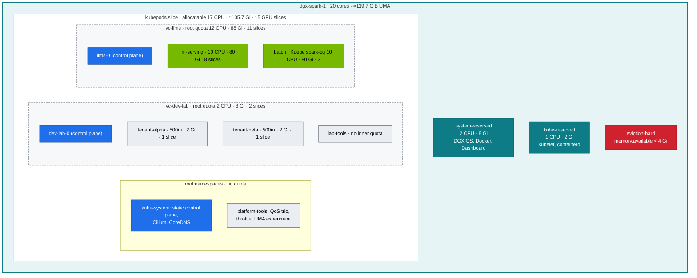

# Chapter 14 · Multi-Tenancy, Resource Quotas & cgroups: Quotas at Two Layers, LimitRanges, QoS, cgroups v2 & the Unified-Memory Question

> **02-Kubernetes · Part IV — Workloads, storage & tenancy · Chapter 14 of 28** · ← [Chapter 13 · Storage, CSI & high-performance volumes](13-storage-csi-and-high-performance-volumes.md) · [All chapters](00-kubernetes-step-by-step-guide.md) · [Chapter 15 · NVIDIA hardware & driver stack](15-nvidia-hardware-and-driver-stack.md) →

| | |
|---|---|
| **You will build** | A budget hierarchy on one node: kubelet reservations, root quotas that cap each vCluster (CPU, memory, GPU slices, storage, LoadBalancers), and tenant quotas inside a vCluster. You'll watch each layer refuse a pod in its own way, trace Kubernetes requests and limits to cgroup v2 files, reproduce CPU throttling and OOM kills, and run the experiment that decides how you protect a unified-memory node: *is CUDA memory charged to the pod?* |
| **Hardware** | dgx-spark-1 |
| **Time** | 90 min |
| **Risk** | Low. The OOM and UMA experiments are bounded by limits and `restartPolicy: Never`. §5.6 is optional and fills memory on purpose |
| **Clusters** | `spark-root` (kubelet, root budgets, QoS/cgroup experiments in `platform-tools`), `dev-lab` (tenant budgets, break/fix 01, 02, 04) |
| **Lab files** | [`manifests/root/05-vclusters/`](lab/manifests/root/05-vclusters) (`quotas.yaml`, `limitranges.yaml`), [`manifests/dev-lab/10-tenancy/`](lab/manifests/dev-lab/10-tenancy) (`quotas.yaml`, `limitranges.yaml`), [`manifests/llms/10-tenancy/quotas.yaml`](lab/manifests/llms/10-tenancy/quotas.yaml), [`manifests/root/12-cgroups/`](lab/manifests/root/12-cgroups) (`qos-trio.yaml`, `cpu-throttle.yaml`, `uma-cgroup-experiment.yaml`), [`scripts/cgroup-inspect.sh`](lab/scripts/cgroup-inspect.sh), [`scripts/uma-watch.sh`](lab/scripts/uma-watch.sh), [`breakfix/01-quota-exceeded.yaml`](lab/breakfix/01-quota-exceeded.yaml), [`02`](lab/breakfix/02-gpu-oversubscribed.yaml), [`04`](lab/breakfix/04-oomkilled.yaml), [`15`](lab/breakfix/15-uma-pressure.yaml), [`tests/budget_check.py`](lab/tests/budget_check.py), 01-Ansible [`roles/kubeadm_cluster`](../01-Ansible/lab/roles/kubeadm_cluster/defaults/main.yml) (kubelet reservations) |

---

## 1. Why this matters on a Spark

There are several layers of protection, and they fail differently:

| Layer | Enforced by | When it acts | Failure you'll see |
|---|---|---|---|
| **Tenant budget** (ResourceQuota, LimitRange inside a vCluster) | the vCluster's own API server | at object creation | `exceeded quota: tenant-budget`, in the vCluster |
| **vCluster budget** (ResourceQuota, LimitRange on `vc-*` at the root) | the root API server, when the syncer creates the host pod | after the tenant's object exists | pod `Pending` in the vCluster, sync error, **no scheduler events** |
| **Runtime** (cgroups v2) | Linux kernel | while the process runs | CPU throttling (slow, no error), `OOMKilled` (exit 137) |
| **Node** (kubelet reservations + eviction) | kubelet | when the node runs low | `Evicted: The node was low on resource: memory` — in any cluster |

Two facts shape everything below. First, **quotas are admission, cgroups are runtime**: there is no `vc-llms` cgroup. llms's 88 Gi is enforced as the *sum of its pods' declared limits*, and each pod's limit is enforced by its own `memory.max`. Second, on a UMA machine there's an awkward question: **CUDA allocations come from the same RAM, but are they counted in the pod's cgroup?** The answer decides whether any of these memory budgets protect the node from a greedy model server. §5.5 measures it on your DGX OS release instead of assuming.

---

## 2. Architecture — HLD



Everything inside `kubepods.slice` is a sibling at runtime: a tenant pod, an llms model server and the root's own kube-apiserver all sit next to each other in the same cgroup tree, grouped only by QoS class. The dashed boxes exist in the API servers, not in the kernel.

---

## 3. LLD

### 3.1 From node capacity to allocatable (kubelet)

| | CPU | Memory | Set in |
|---|---|---|---|
| capacity | 20 | ≈119.7 GiB (128 GB installed) | hardware |
| `systemReserved` | 2 | 8 Gi | 01-Ansible `kubeadm_cluster_system_reserved` |
| `kubeReserved` | 1 | 2 Gi | `kubeadm_cluster_kube_reserved` |
| `evictionHard` `memory.available` | — | 4 Gi | `kubeadm_cluster_eviction_hard` |
| **allocatable** | **17** | **≈105.7 GiB** | what the scheduler can hand out |

The role renders these into the `KubeletConfiguration` in [`kubeadm-init.yaml.j2`](../01-Ansible/lab/roles/kubeadm_cluster/templates/kubeadm-init.yaml.j2); on the node they live in `/var/lib/kubelet/config.yaml`.

On kubeadm, `kubeReserved` protects the kubelet and containerd — **not** the control plane. kube-apiserver, etcd, the scheduler and the controller-manager are static pods: they sit in `kubepods.slice`, their requests count against allocatable, and no quota covers `kube-system`. (On K3s the API server ran inside the k3s service, so kube-reserved covered it.) Docker containers started outside Kubernetes count against nothing but `systemReserved` and the eviction threshold.

### 3.2 Two budget layers

| Resource | Root: `vcluster-budget` on `vc-dev-lab` | Inside dev-lab: `tenant-budget` per tenant | Root: `vcluster-budget` on `vc-llms` | Inside llms: `serving-budget` on `llm-serving` |
|---|---|---|---|---|
| CPU | `requests.cpu: 2` | `requests.cpu` **and** `limits.cpu: 500m` | `requests.cpu: 12` | `requests.cpu: 10` |
| Memory | `requests.memory` = `limits.memory` = 8 Gi | `requests.memory` = `limits.memory` = 2 Gi | 88 Gi / 88 Gi | `limits.memory: 80Gi` |
| GPU slices | `requests.nvidia.com/gpu: 2` | 1 | 11 | 8 |
| Storage | 200 Gi, 20 PVCs | 100 Gi, 5 PVCs | 800 Gi, 20 PVCs | 600 Gi |
| Objects | 60 pods, 1 LoadBalancer (the API `.111`), 2 NodePorts (the API Service's ports) | 10 pods, 0 LBs, 0 NodePorts | 80 pods, 2 LBs (`.112`, `.115`), 4 NodePorts | — |

How the Spark is split ([`manifests/root/05-vclusters/quotas.yaml`](lab/manifests/root/05-vclusters/quotas.yaml) carries the same table in its header):

| | CPU (req) | Memory | GPU slices | Storage |
|---|---|---|---|---|
| Spark total | 20 | ≈119.7 GiB | 15 | ≈3.7 TiB |
| kubelet reservations | 3 (system 2 + kube 1) | 14 Gi (8 + 2 + 4 eviction) | – | – |
| allocatable | 17 | ≈105.7 GiB | 15 | |
| vCluster dev-lab | 2 | 8 Gi | 2 | 200 Gi |
| vCluster llms | 12 | 88 Gi | 11 | 800 Gi |
| root keeps (platform) | 3 | ≈9.7 GiB | 2 | the rest |

The split follows one rule per resource. The memory budgets plus the root's platform must fit allocatable memory: 8 + 88 + ≈9.7 = ≈105.7 GiB, with no overcommit, because on unified memory an overcommitted gigabyte is one a model server can't have. CPU may burst into idle cores (it's compressible), so a tight CPU split costs only latency. dev-lab stays small — tools and tenancy drills. llms gets the rest, because the models run there. The root's 2 slices are for `platform-tools`: GPU probes, the §5.5 UMA experiment and the preemption-demo filler (2 replicas).

Three design rules:

- **CPU is capped on requests only at the root.** A vCluster is guaranteed its share and may burst into idle CPU. dev-lab's *tenants* also have `limits.cpu`, so their pods get a hard `cpu.max`; llms's serving pods don't.
- **Memory is capped on requests *and* limits at the root.** On a unified-memory box memory is GPU memory too, so overcommit is how model servers die. Capping `limits.memory` forces every pod in a vCluster to declare a limit.
- **Inner quotas are ceilings, not reservations.** `tenant-alpha` + `tenant-beta` + `lab-tools` may promise more than dev-lab's 2 CPU / 8 Gi; whoever asks first gets it and the root refuses the next pod. llms's `llm-serving` (10 CPU · 80 Gi · 8 slices) plus Kueue's `spark-cq` (10 CPU · 80 Gi · 3 slices) exceed its 12 · 88 · 11 on purpose: either side can use most of llms while the other is idle, and the root quota, Kueue and PriorityClasses decide who waits. The slices are the exception — 8 + 3 fills llms's 11 exactly.

The root budget also pays for the vCluster itself: `llms-0` requests 250m and 768 Mi (limit 1536 Mi), and the vCluster's CoreDNS and every add-on (Traefik, Kueue, KEDA …) are synced pods in `vc-llms` — together about 1 CPU and 4 Gi, which the serving and batch ceilings (10 CPU · 80 Gi each) leave room for. [`tests/budget_check.py`](lab/tests/budget_check.py) fails if the vClusters together promise more than the Spark has.

### 3.3 LimitRanges fill the gaps

| Where | Object | Container default limit | Default request | Max |
|---|---|---|---|---|
| dev-lab `tenant-alpha`, `tenant-beta` | `defaults` | 250m · 512 Mi | 100m · 256 Mi | 500m · 2 Gi; PVC 50 Gi |
| dev-lab `lab-tools` | `defaults` | 256 Mi | 50m · 64 Mi | — |
| llms `llm-serving` / `batch` / `ingress` | `defaults` | 512 Mi / 1 Gi / 512 Mi | 50m·128 Mi / 100m·256 Mi / 50m·128 Mi | — |
| root `vc-dev-lab` | `vcluster-defaults` | 256 Mi | 50m · 128 Mi | 8 Gi |
| root `vc-llms` | `vcluster-defaults` | 512 Mi | 50m · 128 Mi | 40 Gi |

The inner LimitRange normally fills a pod's resources before it's synced; the root one is the safety net for anything that arrives bare (a namespace the tenant created without a LimitRange). Its `max` stops one pod from taking a whole vCluster's memory.

### 3.4 Requests/limits → cgroup v2

| Kubernetes | cgroup v2 file | Semantics |
|---|---|---|
| `limits.cpu: 500m` | `cpu.max = 50000 100000` | 50 ms of CPU per 100 ms period. Hard cap → **throttling** |
| `requests.cpu: 100m` | `cpu.weight` (shares = m×1024/1000 → weight = 1+((shares−2)×9999)/262142) | relative share under contention only |
| `limits.memory: 256Mi` | `memory.max = 268435456` | hard. Exceeding it → kernel OOM kill in the cgroup |
| `requests.memory` | none on the pod cgroup | scheduling + eviction ranking only |
| no limits | `cpu.max = max`, `memory.max = max` | bounded only by the parent `kubepods` slice |

With the systemd cgroup driver (containerd `SystemdCgroup = true`, kubelet `cgroupDriver: systemd`), a pod's directory is `/sys/fs/cgroup/kubepods.slice/kubepods-<qos>.slice/kubepods-<qos>-pod<uid>.slice/` (Guaranteed pods sit directly under `kubepods.slice`). The `<uid>` is the **root** pod's UID — a vCluster pod's cgroup belongs to its synced copy.

### 3.5 QoS classes

| Class | Rule | `oom_score_adj` | Evicted |
|---|---|---|---|
| Guaranteed | requests = limits for CPU **and** memory, every container | −997 | last |
| Burstable | anything in between | 2 … 999 (by request size) | middle |
| BestEffort | no requests/limits at all | 1000 | first |

**BestEffort can't exist inside a vCluster in this lab.** The root quota on every `vc-*` namespace covers memory, so a pod must declare memory, and the LimitRanges add it if it doesn't. A bare `kubectl run` in dev-lab comes out Burstable. That's why the QoS experiments run on the root in `platform-tools` (no quota there). Serving pods are Burstable on purpose (memory limit > request), because weights plus KV cache vary. Make them Guaranteed once you've measured their peak.

---

## 4. Integrations

- **vCluster (Chapter 04)**: resizing a vCluster *is* editing its root quota (Chapter 04 §6.5) — no reinstall.
- **Admission (Chapter 03)**: the quota admission plugin and the CEL GPU policy together keep tenants inside their slice — in each vCluster's own API server. The root runs quota admission a second time on the synced pod.
- **Kueue (Chapter 07)**: in llms, `batch` is governed by Kueue's `spark-cq`, `llm-serving` by `serving-budget`; both sit under the root budget. Don't put a quota *and* a ClusterQueue on one namespace — they double-count.
- **Grafana (Chapter 17)**: the *Tenancy* row plots the root quotas' `kube_resourcequota{type="used"}` against `hard` per `vc-*` namespace, plus the top-5 throttled containers.
- **01-Ansible (`roles/kubeadm_cluster`)** owns `systemReserved`, `kubeReserved`, `evictionHard` and `maxPods: 200`. kubeadm doesn't reconcile a running node: change the defaults there for rebuilds, and on a live node edit `/var/lib/kubelet/config.yaml` and restart the kubelet (the role prints exactly that when the config changed).

---

## 5. Lab

All commands run from `02-Kubernetes/lab` **on the Spark** (the cgroup scripts read `/sys/fs/cgroup`), as your normal user with `KUBECONFIG` set — the cgroup and `/proc` files the scripts read are world-readable:

```bash
cd "02-Kubernetes/lab"
export KUBECONFIG="$PWD/../../01-Ansible/lab/.cache/kubeconfig-spark-lab.yaml"
```

### 5.1 Capacity, allocatable, and both budget layers

```bash
kubectl --context spark-root get node dgx-spark-1 -o jsonpath='{.status.capacity}{"\n"}{.status.allocatable}{"\n"}' | jq -c '{cpu, memory, "nvidia.com/gpu"}'
sudo grep -A3 -E '^(systemReserved|kubeReserved|evictionHard):' /var/lib/kubelet/config.yaml
kubectl --context spark-root -n vc-dev-lab describe resourcequota vcluster-budget
kubectl --context dev-lab apply -k manifests/dev-lab/00-platform
kubectl --context dev-lab apply -k manifests/dev-lab/10-tenancy
kubectl --context dev-lab -n tenant-alpha describe resourcequota tenant-budget
```

Check the arithmetic: capacity memory minus 8 Gi, 2 Gi and 4 Gi is allocatable; 20 − 2 − 1 CPUs is 17. Note that `vcluster-budget` already shows usage before any tenant has done anything — dev-lab's own control plane and CoreDNS.

**Layer 1 — the tenant quota (inside dev-lab):**

```bash
scripts/breakfix.sh inject 01
kubectl --context dev-lab -n tenant-alpha get deploy bf01-big                     # 2/3
kubectl --context dev-lab -n tenant-alpha describe rs -l app=bf01 | grep -A2 FailedCreate
kubectl --context spark-root -n vc-dev-lab get pods | grep -c bf01               # 2: the third never reached the root
scripts/breakfix.sh reset 01
```

Expected: `exceeded quota: tenant-budget, requested: limits.cpu=250m,requests.cpu=250m, used: limits.cpu=500m,requests.cpu=500m, limited: limits.cpu=500m,requests.cpu=500m`. dev-lab's API server refused the pod; the ReplicaSet has the event because the pod was never created.

**Layer 2 — the vCluster budget (at the root):**

```bash
scripts/breakfix.sh inject 02
kubectl --context dev-lab -n lab-tools get pods -l app=bf02                      # 2 Running, 4 Pending
kubectl --context dev-lab -n lab-tools describe pod "$(kubectl --context dev-lab -n lab-tools get pods -l app=bf02 --field-selector=status.phase=Pending -o name | head -1 | cut -d/ -f2)" | tail -4
kubectl --context spark-root -n vc-dev-lab describe resourcequota vcluster-budget | grep gpu
scripts/breakfix.sh reset 02
```

Expected: the Pending pod's events come from the vCluster syncer and quote `exceeded quota: vcluster-budget, requested: requests.nvidia.com/gpu=1, used: requests.nvidia.com/gpu=2, limited: requests.nvidia.com/gpu=2`. `lab-tools` has no inner quota, so dev-lab's API server accepted all six; the root refused four host copies. The node still has 15 slices — it's not the scheduler that says no, so there are no scheduler events at all.

**And BestEffort is gone:**

```bash
kubectl --context dev-lab -n lab-tools run be --image=registry.k8s.io/pause:3.10
kubectl --context dev-lab -n lab-tools get pod be -o jsonpath='{.status.qosClass} {.spec.containers[0].resources}{"\n"}'
kubectl --context dev-lab -n lab-tools delete pod be
```

Expected: `Burstable {"limits":{"memory":"256Mi"},"requests":{"cpu":"50m","memory":"64Mi"}}` — the lab-tools LimitRange's defaults.

### 5.2 Read the cgroups behind each QoS class (root)

```bash
kubectl --context spark-root apply -k manifests/root/00-platform
kubectl --context spark-root apply -f manifests/root/12-cgroups/qos-trio.yaml
for p in guaranteed burstable besteffort; do scripts/cgroup-inspect.sh platform-tools qos-$p | sed -n '1,8p'; echo; done
```

Expected (key lines):

```text
pod spark-root platform-tools/qos-guaranteed → root platform-tools/qos-guaranteed  uid=…  qos=Guaranteed
cgroup /sys/fs/cgroup/kubepods.slice/kubepods-pod…slice
  cpu.max                50000 100000
  memory.max             268435456
    pid 81234    oom_score_adj=-997   /pause
pod spark-root platform-tools/qos-burstable → … qos=Burstable
  cpu.max                max 100000
  memory.max             536870912
pod spark-root platform-tools/qos-besteffort → … qos=BestEffort
  cpu.max                max 100000
  memory.max             max
    pid 81301    oom_score_adj=1000   /pause
```

Now the same script on a **vCluster** pod: pass the context and it finds the host copy through the syncer's annotations.

```bash
kubectl --context dev-lab -n lab-tools run qos-v --image=registry.k8s.io/pause:3.10
scripts/cgroup-inspect.sh lab-tools qos-v dev-lab | sed -n '1,6p'
kubectl --context dev-lab -n lab-tools delete pod qos-v
```

```text
pod dev-lab lab-tools/qos-v → root vc-dev-lab/qos-v-x-lab-tools-x-dev-lab  uid=…  qos=Burstable
cgroup /sys/fs/cgroup/kubepods.slice/kubepods-burstable.slice/kubepods-burstable-pod…slice
  cpu.max                max 100000
  memory.max             268435456
```

Same tree, same rules. Nothing in the path says "dev-lab": the kernel has never heard of vClusters.

```bash
kubectl --context spark-root delete -f manifests/root/12-cgroups/qos-trio.yaml
```

### 5.3 CPU throttling: slow with no error

```bash
kubectl --context spark-root apply -f manifests/root/12-cgroups/cpu-throttle.yaml
sleep 30; scripts/cgroup-inspect.sh platform-tools cpu-throttle | grep -A3 'cpu.stat'
kubectl --context spark-root -n platform-tools top pod cpu-throttle 2>/dev/null || true
kubectl --context spark-root delete -f manifests/root/12-cgroups/cpu-throttle.yaml
```

Expected: `nr_throttled` close to `nr_periods` and `throttled_usec` growing by a large amount every second (4 threads want 4 cores, the limit gives 0.2). In Grafana: *CPU throttling (top 5)*. **Throttling is the #1 hidden cause of slow tokenizers and data loaders.** Their CPU limit is far below their thread count. In this lab it bites dev-lab tenants first: `tenant-budget` requires `limits.cpu`, so every tenant pod gets a `cpu.max`.

### 5.4 Memory limit → OOMKilled (a vCluster pod)

```bash
scripts/breakfix.sh inject 04
sleep 20; kubectl --context dev-lab -n lab-tools get pod bf04-oom
kubectl --context dev-lab -n lab-tools get pod bf04-oom -o jsonpath='{.status.containerStatuses[0].lastState.terminated}{"\n"}' | jq
scripts/cgroup-inspect.sh lab-tools bf04-oom dev-lab | grep -A6 memory.events
scripts/breakfix.sh reset 04
```

Expected: `"reason":"OOMKilled","exitCode":137`, and `oom_kill` > 0 in `memory.events`. The kernel killed the process on the root; the kubelet reported it on the root pod; the syncer copied the status into dev-lab. A tenant sees the right answer without any access to the node.

### 5.5 The UMA question: is CUDA memory charged to the pod?

The experiment runs on the root in `platform-tools`: it needs a GPU slice and a 4 Gi limit it's allowed to blow through, and its answer is about the node, not about any tenant.

```bash
kubectl --context spark-root apply -f manifests/root/12-cgroups/uma-cgroup-experiment.yaml
kubectl --context spark-root -n platform-tools logs -f uma-cgroup-experiment
# in parallel, on the Spark:
scripts/uma-watch.sh platform-tools uma-cgroup-experiment spark-root 1
```

Two possible outcomes:

| Log | Meaning | How you protect the node |
|---|---|---|
| `start: … 0.3 GiB` → pod `OOMKilled` around 4 GiB | CUDA memory **is** charged to the pod cgroup | pod memory limits are a real GPU-memory guardrail — and so the root's `limits.memory` per vCluster really caps its GPU memory too. Size limits as weights + KV cache + overhead |
| `allocated 16 GiB … memory.current=0.6 GiB` → `survived` | CUDA memory **isn't** charged (driver-owned pages) | pod limits don't bound GPU use, and **neither do the vCluster memory budgets**: llms's 88 Gi counts declared limits, not what its model servers put on the GPU. Rely on engine flags (`--gpu-memory-utilization`, `--mem-fraction-static`), the `SparkUMAPressure` alert, PriorityClasses and eviction |

**Record your result in the lab log**, with the driver version (`nvidia-smi --query-gpu=driver_version --format=csv,noheader`). Re-run it after every DGX OS or driver upgrade. The rest of this module is written to be safe under either outcome. That's why every serving manifest sets both a pod memory limit *and* an engine memory fraction.

```bash
kubectl --context spark-root delete -f manifests/root/12-cgroups/uma-cgroup-experiment.yaml --ignore-not-found
```

### 5.6 (Optional, risky) Node-level pressure

```bash
scripts/breakfix.sh inject 15      # asks for confirmation; self-terminates after 150 s
kubectl --context spark-root describe node dgx-spark-1 | grep -A8 Conditions
kubectl --context spark-root get events -A --field-selector reason=Evicted
```

`bf15-uma` is a root pod in `platform-tools` with a 110 Gi limit — no quota stops it, and the vCluster budgets don't reserve anything for their tenants. Watch which pods the kubelet evicts first once `memory.available` drops below 4 Gi: BestEffort and `spark-preemptible` go before serving and platform. Evictions hit `vc-dev-lab` and `vc-llms` pods too; inside the vClusters they show up as failed pods that their controllers replace. `scripts/breakfix.sh reset 15` if it hasn't finished by itself.

---

## 6. Verify

```bash
scripts/verify.sh vclusters tenancy
python3 tests/budget_check.py
```

| Check | Expected |
|---|---|
| node allocatable | 17 CPU, ≈105.7 GiB, `nvidia.com/gpu: 15` |
| root budgets | `dev-lab root budget: 2 8Gi 2`, `llms root budget: 12 88Gi 11` |
| tenant quota `limits.cpu` | `500m` in both tenants |
| bf01 / bf02 | inner refusal in dev-lab / root refusal with no scheduler events |
| bare pod in dev-lab | `Burstable` |
| QoS trio | `oom_score_adj` −997 / (2…999) / 1000 |
| throttle pod | `nr_throttled / nr_periods` > 0.9 |
| UMA experiment | outcome recorded with the driver version |

---

## 7. Troubleshooting

| Symptom | Cause | Diagnose | Fix |
|---|---|---|---|
| `must specify limits.cpu` / `requests.memory` on create (inside a vCluster) | the tenant quota covers it and there's no LimitRange default | `kubectl --context <v> -n X describe limitrange` | add the LimitRange (lab has one) or set resources |
| Some replicas never appear | inner quota exhausted | ReplicaSet `FailedCreate` events in the vCluster | raise the quota / shrink requests (drill 01) |
| Pod Pending in a vCluster, **no** scheduler events | root `vcluster-budget` spent | pod events (from the syncer); `kubectl --context spark-root -n vc-<name> describe resourcequota vcluster-budget` | free capacity, Kueue, or move budget between vClusters (drill 02, Chapter 04 §6.5) |
| A pod is rejected with `maximum memory usage per Container is 8Gi` | root LimitRange `max` on `vc-dev-lab` | `kubectl --context spark-root -n vc-dev-lab get limitrange vcluster-defaults -o yaml` | by design; raise `max` with the budget |
| Job 5× slower than on the laptop, no errors | CPU throttling | `cgroup-inspect.sh <ns> <pod> <context>` → `nr_throttled` | raise the CPU limit or remove it (keep the request). Match thread count (`OMP_NUM_THREADS`, `torch.set_num_threads`) to the limit |
| `OOMKilled` (137) | container exceeded `memory.max` | `lastState.terminated`, `memory.events` | raise the limit to measured peak + 20 %, or fix the leak |
| `cgroup for pod uid … not found` | wrong context, or not run on the node hosting the pod | pass the vCluster context; `kubectl --context spark-root get pod -o wide` | run on that node |
| `Evicted … low on resource: memory` | node-level pressure | node Conditions, `memory.available` | find the greedy pod (`uma-watch.sh`), lower engine memory fractions, drop page cache |
| CUDA `out of memory` with plenty of pod limit left | UMA pool exhausted by *other* consumers (page cache, other pods, Docker containers) | `free -g`, `SparkUMAPressure` | headroom policy: sum of engine fractions ≤ 70 % |
| Allocatable lower than expected after a rebuild | kubelet reservations changed in 01-Ansible | `/var/lib/kubelet/config.yaml` | keep `tests/budget_check.py` green against the new numbers |

---

## 8. Scale-out path

| Lab | Datacenter |
|---|---|
| root quota per vCluster + tenant quotas inside | the same hierarchy, generated from a tenant catalog in Git; or Capsule / HNC for namespace-level hierarchies |
| quotas count declared limits, not usage | the same — plus admission policies that require realistic limits, and showback from measured usage |
| time-slicing, no GPU memory isolation | MIG (H100/B200) for hard isolation, or DRA with GPU partitioning (Chapter 07). **GB10 has no MIG** |
| all tenants share one kernel and one kubepods tree | separate nodes per tenant class (node selectors on the vCluster), or separate clusters for untrusted tenants |
| engine flags as the GPU-memory guardrail | the same, plus admission policies that *require* those flags on serving images |

---

## 9. Checklist

- [ ] I derived allocatable from capacity and the kubelet reservations, and know that on kubeadm the control plane lives inside allocatable.
- [ ] I can tell an inner-quota refusal from a root-quota refusal by where the event appears.
- [ ] I can explain why a vCluster in this lab can't run a BestEffort pod.
- [ ] I can map any `resources:` block to `cpu.max`, `cpu.weight` and `memory.max` — for a root pod and for a vCluster pod.
- [ ] I reproduced throttling and an OOM kill, and diagnosed both from the cgroup.
- [ ] I measured whether CUDA memory counts against the pod on *my* driver, wrote it down, and know what that means for the vCluster memory budgets.
