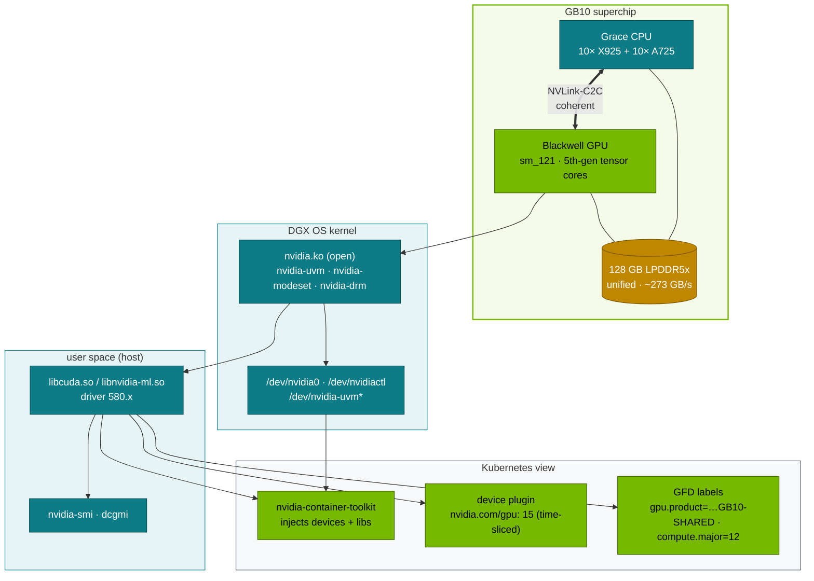

# Step 15 · NVIDIA Hardware & Driver Stack as Kubernetes Sees It: GB10, NVLink-C2C, Unified Memory, Drivers, CUDA Compatibility

> **02-Kubernetes · Part V — GPU platform · Step 15 of 28** · ← [Step 14 · Multi-tenancy & cgroups](14-multi-tenancy-resource-quotas-and-cgroups.md) · [All steps](00-kubernetes-step-by-step-guide.md) · [Step 16 · Container Toolkit & GPU sharing](16-nvidia-container-toolkit-and-gpu-virtualization.md) →

| | |
|---|---|
| **You will build** | A verified hardware and driver inventory of your Spark from the host and from inside a pod. You'll see how GPU Feature Discovery turns that inventory into node labels, set a GEMM throughput baseline, and learn the handful of `nvidia-smi` and `dmesg` checks that catch most GPU problems |
| **Hardware** | dgx-spark-1 |
| **Time** | 60 min |
| **Risk** | None |
| **Clusters** | `spark-root` (node labels, the benchmark in `platform-tools`), `dev-lab` (`gpu-smoke`, the arch test) |
| **Lab files** | [`manifests/root/70-gpu/gemm_bench.py`](lab/manifests/root/70-gpu/gemm_bench.py), [`gemm-solo.yaml`](lab/manifests/root/70-gpu/gemm-solo.yaml), [`manifests/dev-lab/70-gpu/gpu-smoke.yaml`](lab/manifests/dev-lab/70-gpu/gpu-smoke.yaml). Module [07-Nvidia](../07-Nvidia/README.md) goes to silicon depth |

---

## 1. Why this matters on a Spark

Kubernetes treats a GPU as an opaque integer (`nvidia.com/gpu: 1`). Everything that makes a GB10 different is invisible to the scheduler unless something turns it into labels and limits. And most "Kubernetes GPU problems" turn out to be host problems: driver/library mismatch, a missing kernel module, thermal throttling, an Xid. So check the host first, then the pod.

### 1.1 GB10 at a glance

| Property | DGX Spark (GB10 Grace Blackwell superchip) | Why you care in Kubernetes |
|---|---|---|
| CPU | 20 Arm cores: 10× Cortex-X925 + 10× Cortex-A725 | arm64 images only. CPU limits in whole-core terms (Step 14) |
| GPU | Blackwell, compute capability **12.1** (`sm_121`) | images and kernels must target sm_121 (or carry PTX) |
| Memory | **128 GB LPDDR5x, unified** (≈119.7 GiB visible to DGX OS), ~273 GB/s | no separate framebuffer. `nvidia-smi` memory reads **N/A**; the node's `memory` capacity is the GPU's memory too |
| CPU↔GPU link | NVLink-C2C (coherent, on package) | no PCIe copy between host RAM and "GPU RAM" |
| Tensor-core peak | up to 1 PFLOP FP4 (sparse) | FP4/FP8 quantised models are first-class (modules 03–06) |
| Network | ConnectX-7, 2× QSFP (200 GbE), 10 GbE RJ-45 | RDMA for 2-Spark NCCL (Step 18) |
| MIG | **not supported** | sharing = time-slicing / MPS (Step 16) |
| OS | DGX OS 7 (Ubuntu 24.04, arm64), open kernel modules | driver owned by DGX OS, not by the GPU Operator |

---

## 2. Architecture — HLD



---

## 3. LLD

### 3.1 Driver ↔ CUDA compatibility rules

| Rule | Practical meaning on the Spark |
|---|---|
| The **driver** (kernel module + `libcuda`) comes from the host | DGX OS 7 ships driver 580.x. The GPU Operator runs with `driver.enabled=false` (01-Ansible Step 20) |
| The **CUDA runtime/toolkit** comes from the container | `nvcr.io/nvidia/cuda:13.0.1-*`, NGC PyTorch 25.09 → CUDA 13 |
| Container CUDA major ≤ what the driver supports | driver 580 supports CUDA 13.0 → CUDA 12.x and 13.0 containers run. A CUDA 13.1+ container needs a newer driver (or forward-compat packages) |
| Kernels must include `sm_121` SASS or PTX for a lower arch | old wheels built only for sm_80/sm_90 without PTX fail with `no kernel image is available for execution on the device` |
| arm64 | an amd64-only image fails with `exec format error` before CUDA even loads |

### 3.2 What GFD/NFD labels (use them in selectors)

| Label | Example |
|---|---|
| `nvidia.com/gpu.product` | the product name the driver reports; with time-slicing GFD appends `-SHARED`. Because GFD owns and rewrites this label, the lab's selectors use `spark.lab/gpu=gb10`, which the 01-Ansible `kubeadm_cluster` role sets at join |
| `nvidia.com/gpu.compute.major` / `.minor` | `12` / `1` |
| `nvidia.com/cuda.driver-version.major` | `580` |
| `nvidia.com/gpu.count` | `1` |
| `nvidia.com/gpu.replicas` | `15` (time-slicing) |
| `nvidia.com/gpu.sharing-strategy` | `time-slicing` |
| `feature.node.kubernetes.io/cpu-model.vendor_id` | `ARM` |

### 3.3 Health signals

| Signal | Command | Healthy |
|---|---|---|
| GPU visible | `nvidia-smi -L` | `GPU 0: NVIDIA GB10 (UUID: GPU-…)` |
| Temperature / power | `nvidia-smi --query-gpu=temperature.gpu,power.draw --format=csv` | under ~85 °C under load |
| Throttle reasons | `nvidia-smi -q -d PERFORMANCE` | `Active` only for `Idle` / `Applications Clocks Setting` |
| Xid errors | `sudo dmesg -T \| grep -i xid` | none |
| Persistence / modules | `lsmod \| grep -E '^nvidia'` | `nvidia`, `nvidia_uvm`, `nvidia_modeset`, `nvidia_drm` |

---

## 4. Integrations

- **01-Ansible `spark_facts`** writes the same facts to `/etc/ansible/facts.d/spark.fact` (`ansible_local.spark.gpu.compute_cap == "12.1"`), and `playbooks/16-driver-audit.yml` holds NVIDIA packages so an `apt upgrade` can't break the Kubernetes layer.
- **Module 07-Nvidia** covers the silicon (SM, tensor cores, NVLink-C2C, UVM page faults) that this step only inventories.
- **Prometheus (Step 17)**: `spark_gpu_*` textfile metrics from the host, plus DCGM when GB10 support is confirmed.

---

## 5. Lab

### 5.1 Host inventory

```bash
ssh dgxadmin@192.168.0.100
nvidia-smi
nvidia-smi --query-gpu=name,compute_cap,driver_version,pstate,temperature.gpu,power.draw,clocks.sm,clocks.max.sm --format=csv
lscpu | grep -E 'Model name|^CPU\(s\)|Thread|Socket'
free -g; lsmod | grep -E '^nvidia'
cat /proc/driver/nvidia/version
```

Expected highlights:

```text
| NVIDIA GB10   On  | … | Memory-Usage: Not Supported |
name, compute_cap, driver_version, pstate, …
NVIDIA GB10, 12.1, 580.xx.xx, P8, 38, 4.xx W, …
Model name: Cortex-X925  … Model name: Cortex-A725
CPU(s): 20
```

`Memory-Usage: Not Supported` is correct for a UMA GPU. Use `free -g` and `/proc/meminfo` for the shared pool.

### 5.2 What Kubernetes knows

Only the root has real nodes; both vClusters show the same node, copied in (`sync.fromHost.nodes`):

```bash
cd "02-Kubernetes/lab"
export KUBECONFIG="$PWD/../../01-Ansible/lab/.cache/kubeconfig-spark-lab.yaml"
kubectl --context spark-root get node dgx-spark-1 -o json | jq '.metadata.labels | with_entries(select(.key|test("nvidia.com|cpu-model")))'
kubectl --context spark-root get node dgx-spark-1 -o jsonpath='{.status.capacity}{"\n"}{.status.allocatable}{"\n"}' | jq -c .
kubectl --context llms get node dgx-spark-1 -L spark.lab/gpu,nvidia.com/gpu.product,nvidia.com/gpu.replicas
```

Capacity shows `nvidia.com/gpu: 15` and a `memory` figure that is the whole unified pool; allocatable is lower by the kubelet reservations (Step 14 §3.1). Inside llms the node looks the same — 15 slices — although llms may only use 11: budgets are quotas, not node properties.

### 5.3 The same view from inside a pod

`gpu-smoke` is a tenant pod in dev-lab, so it exercises the whole chain: dev-lab API → syncer → root scheduler → kubelet → nvidia runtime.

```bash
kubectl --context dev-lab apply -f manifests/dev-lab/70-gpu/gpu-smoke.yaml
kubectl --context dev-lab -n tenant-beta wait --for=jsonpath='{.status.phase}'=Succeeded pod/gpu-smoke --timeout=180s
kubectl --context dev-lab -n tenant-beta logs gpu-smoke
kubectl --context dev-lab -n tenant-beta delete pod gpu-smoke
```

### 5.4 Throughput baseline (single time-slice, no contention)

The benchmark runs on the root in `platform-tools` — a platform job, outside any vCluster budget:

```bash
kubectl --context spark-root apply -k manifests/root/00-platform
kubectl --context spark-root apply -k manifests/root/70-gpu        # ConfigMap with gemm_bench.py (+ contention Deployment at 0 replicas)
kubectl --context spark-root apply -f manifests/root/70-gpu/gemm-solo.yaml
kubectl --context spark-root -n platform-tools logs -f job/gemm-solo
```

```json
{"pod": "gemm-solo-…", "device": "NVIDIA GB10", "cc": "12.1", "n": 8192, "tflops": 87.4, "mem_total_gib": 119.7, "mem_free_gib": 101.2}
```

The TFLOPS figure is illustrative, so **record your own**. It's your "one tenant, no contention" baseline for Step 16. `mem_total_gib` from CUDA equals the whole UMA pool, and `mem_free_gib` moves as the OS and other pods — in all three clusters — allocate.

### 5.5 Watch clocks and power under load

```bash
kubectl --context spark-root -n platform-tools delete job gemm-solo
kubectl --context spark-root apply -f manifests/root/70-gpu/gemm-solo.yaml
nvidia-smi dmon -s pucv -d 1         # on the Spark: power, util, clocks, violations
```

### 5.6 Break it: wrong architecture / wrong CUDA

```bash
# amd64-only image on arm64 → exec format error (a plain pod in dev-lab, no GPU needed)
kubectl --context dev-lab -n lab-tools run arch-test --image=docker.io/amd64/busybox:1.37 --restart=Never -- uname -m
sleep 10; kubectl --context dev-lab -n lab-tools logs arch-test; kubectl --context dev-lab -n lab-tools delete pod arch-test
```

Expected: `exec /bin/uname: exec format error`, with the pod in `Error`. Everything in this lab pins multi-arch or arm64 images for this reason.

---

## 6. Verify

| Check | Expected |
|---|---|
| `nvidia-smi --query-gpu=compute_cap --format=csv,noheader` | `12.1` |
| node labels `spark.lab/gpu` / `nvidia.com/gpu.product` | `gb10` / GFD's product name with `-SHARED` (on the root, and the same in both vClusters) |
| allocatable `nvidia.com/gpu` | `15` |
| `gpu-smoke` log | lists GB10 with the same UUID as the host |
| `gemm-solo` | JSON line with `cc: 12.1`. TFLOPS recorded as your baseline |
| `sudo dmesg -T \| grep -ci xid` | `0` |

---

## 7. Troubleshooting

| Symptom | Layer | Diagnose | Fix |
|---|---|---|---|
| `nvidia-smi: NVIDIA-SMI has failed…couldn't communicate with the driver` (host) | kernel module | `lsmod`, `dmesg`, `systemctl status nvidia-persistenced` | DGX OS update finished? Reboot. Re-install the DGX OS driver packages, not a runfile |
| Pod: `Failed to initialize NVML: Unknown Error` | cgroup device access after a systemd reload | `kubectl --context <cluster> logs`. Toolkit version | upgrade nvidia-container-toolkit. Use CDI mode (Step 16) |
| `no kernel image is available for execution on the device` | wheel/kernel lacks sm_121 | `python -c "import torch;print(torch.cuda.get_arch_list())"` | use NGC images or wheels built for sm_120/121 (+PTX) |
| `CUDA driver version is insufficient for CUDA runtime version` | container CUDA newer than the driver | compare `nvidia-smi` "CUDA Version" and the image's CUDA | older image tag, or upgrade DGX OS |
| `exec format error` | amd64 image | `docker manifest inspect` | arm64/multi-arch tag |
| Throughput half of baseline | thermal/power throttling or another tenant | `nvidia-smi -q -d PERFORMANCE`; GPU pods of *all* clusters: `kubectl --context spark-root get pods -A -o wide` (vCluster pods are in `vc-*`) | airflow. Step 16 contention |
| `Xid 13/31/43` in dmesg | app fault (bad kernel, illegal address) | `dmesg -T \| grep -i xid` | fix the workload. The node is fine |
| `Xid 79` / `GPU has fallen off the bus` / `48` | hardware / severe | same | drain + reboot (01-Ansible Step 29, role `node_drain` — on one Spark that stops all three clusters). If it repeats, open an RMA |

---

## 8. Scale-out path

| Spark | Datacenter DGX (e.g. B200/GB200) |
|---|---|
| 1 GPU, UMA, no MIG | 8 GPUs/node with HBM, NVLink/NVSwitch domain, MIG available |
| host-managed driver | GPU Operator may own the driver (precompiled/signed), or the OS image owns it (DGX OS, BCM) |
| `nvidia.com/gpu: 15` time-sliced, split by quota between clusters | whole GPUs or MIG profiles (`nvidia.com/mig-1g.23gb`), DRA claims |
| manual health checks | DCGM diagnostics (`dcgmi diag -r 3`) as a pre-admission gate, node-problem-detector, automated remediation |

---

## 9. Checklist

- [ ] I can state GB10's compute capability, core layout and memory model, and why `nvidia-smi` shows memory N/A.
- [ ] I know which parts of the CUDA stack come from the host and which from the image.
- [ ] I have a recorded single-slice GEMM baseline.
- [ ] I can triage a GPU pod failure to host driver, toolkit, image arch or CUDA version.
