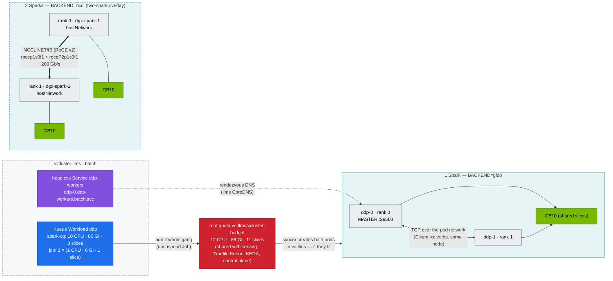

# Step 18 · Distributed AI Training & NCCL: torchrun, RoCE over CX-7 & Hang Diagnosis

> **02-Kubernetes · Part VI — Distributed training & fabrics · Step 18 of 28** · ← [Step 17 · NVIDIA GPU Operator & Network Operator](17-nvidia-gpu-operator-and-network-operator.md) · [All steps](00-kubernetes-step-by-step-guide.md) · [Step 19 · Large-scale SuperPOD & network fabrics](19-large-scale-superpod-and-network-fabrics.md) →

| | |
|---|---|
| **You will build** | A torchrun job that needs no training operator: an Indexed Job, a headless Service and Kueue gang admission, inside the `llms` vCluster's `batch` tier. You'll run an all-reduce bandwidth sweep that uses `gloo` on one Spark and NCCL over RoCE on two, find out what happens when Kueue admits a gang that the root budget can't hold, and learn a repeatable procedure for the two classic failures: the silent hang and the straggler |
| **Clusters** | `llms` (the job, Kueue, the headless Service) · `spark-root` (the root budget on `vc-llms`, the real pods, host-side evidence, dgx-spark-2) |
| **Hardware** | dgx-spark-1 (§5.1–5.4). dgx-spark-2 + QSFP cable for §5.5 |
| **Time** | 90 min |
| **Risk** | Low |
| **Lab files** | [`manifests/llms/80-distributed/base/`](lab/manifests/llms/80-distributed/base/) (`allreduce_bench.py`, `ddp-job.yaml`), [`two-spark/`](lab/manifests/llms/80-distributed/two-spark/kustomization.yaml), [`resilient/`](lab/manifests/llms/80-distributed/resilient/) (Step 25), [`manifests/llms/20-scheduling/kueue.yaml`](lab/manifests/llms/20-scheduling/kueue.yaml), [`manifests/root/05-vclusters/quotas.yaml`](lab/manifests/root/05-vclusters/quotas.yaml), [`manifests/llms/85-network-operator/`](lab/manifests/llms/85-network-operator/) |

---

## 1. Why this matters on a Spark

A single Spark trains and fine-tunes models up to its memory limit. Two Sparks joined by the CX-7 cable are a real 2-node distributed system, the smallest one that shows every production failure mode: rendezvous, NCCL transport selection, RDMA configuration, stragglers and hangs.

In this lab, training is a tenant workload. It runs in `llms` → `batch`, is admitted by Kueue's `spark-cq` **inside** the vCluster, and then has to fit the **root** budget of the whole `llms` vCluster, which it shares with the serving tier. That second gate is where single-box training most often surprises people.

### 1.1 The memory equation that decides single vs multi-node — and which budget

Training memory ≈ weights + gradients + optimizer state + activations. For mixed precision with Adam:

| Method | Bytes per parameter (approx.) | 7B model | 32B model | Fits one Spark (~105.7 GiB allocatable)? | Fits `llms` batch (spark-cq 80 Gi; ≤ 40 Gi per container at the root)? |
|---|---|---|---|---|---|
| Full fine-tune, BF16 + FP32 Adam | ~16 | ~112 GB + activations | ~512 GB | 7B: no. 32B: no | no |
| Full fine-tune, 8-bit Adam | ~10 | ~70 GB | ~320 GB | 7B: yes. 32B: no | no — 7B fits spark-cq, not one 40 Gi container |
| LoRA on BF16 base | ~2 (+ small adapter) | ~15 GB | ~65 GB | yes / yes | 7B: yes. 32B: no — fits spark-cq, not one 40 Gi container |
| QLoRA on 4-bit base | ~0.6 (+ adapter) | ~5 GB | ~20 GB | yes / yes | yes / yes |

The Spark has ~119.7 GiB of unified memory, ~105.7 GiB allocatable after reservations (Step 01 §3.3), and that is CPU *and* GPU memory. The `llms` vCluster gets 88 Gi of it (requests = limits), `spark-cq` lets batch use up to 80 Gi of that while serving is idle, and the root LimitRange on `vc-llms` caps one container at 40 Gi (`root/05-vclusters/limitranges.yaml`; the LimitRanges inside llms set defaults only, no max). Running models count against the same 88 Gi and the same UMA pool (Step 20 §2), so a big training job and a full serving tier don't run together. A bigger job is a decision for the platform team: resize `llms` (Step 04 §6.5) or run it as a root job in `platform-tools`. Two Sparks with FSDP/ZeRO-3 shard weights, gradients and optimizer state, which roughly halves the per-node figure (modules 03 and 05 go deep).

---

## 2. Architecture — HLD



**Why `gloo` on one Spark?** NCCL requires one distinct GPU per rank. Two ranks on two time-slices of the *same* GB10 fail with `Duplicate GPU detected`. On one Spark you learn the orchestration with gloo, and on two you get the real NCCL path.

**Why two gates?** Kueue lives in the vCluster because Jobs only exist there; it knows `spark-cq` and nothing else. The root quota on `vc-llms` knows the real budget but sees *pods*, one at a time, as the syncer creates them. Kueue's all-or-nothing promise therefore holds only if the root has room for the whole gang (§5.3).

---

## 3. LLD

### 3.1 Job wiring ([`ddp-job.yaml`](lab/manifests/llms/80-distributed/base/ddp-job.yaml))

| Piece | Value | Purpose |
|---|---|---|
| Job | `completionMode: Indexed`, `completions=parallelism=2`, `backoffLimit: 0` | rank = `JOB_COMPLETION_INDEX`. Any failure fails the job (no half-restarted ranks) |
| Pod DNS | `subdomain: ddp-workers` → `ddp-<i>.ddp-workers.batch.svc.cluster.local` | stable rendezvous address, answered by **llms's own CoreDNS** |
| Service | headless, `publishNotReadyAddresses: true` | rank 1 can resolve rank 0 before readiness. Synced to `vc-llms`, so the root's Cilium routes to the same pod IPs |
| Kueue | label `kueue.x-k8s.io/queue-name: train`, `suspend: true` | both ranks or neither — *inside spark-cq* (Step 07) |
| Resources per rank | requests = limits: `cpu: 1`, `memory: 6Gi`, `nvidia.com/gpu: 1` | gang total 2 CPU · 12 Gi · 2 slices; spark-cq then has 1 slice left, so a second 2-slice gang waits |
| Priority | `spark-batch` | below `spark-serving`: the root scheduler preempts training before serving |
| `/dev/shm` | `emptyDir: {medium: Memory, sizeLimit: 2Gi}` | NCCL/gloo and DataLoader workers use shared memory. The 64 MiB default breaks them. On UMA it's also GPU-side memory, so keep it sized |
| `TORCH_NCCL_ASYNC_ERROR_HANDLING=1` | turns a hung collective into an exception after the timeout | hangs become failures you can see |

### 3.2 Budget arithmetic: what fits beside what

| Consumer in `llms` | CPU req | Memory limit | Slices | Source |
|---|---|---|---|---|
| root budget `vc-llms` | **12** | **88 Gi** | **11** | `root/05-vclusters/quotas.yaml` |
| vCluster control plane `llms-0` | 250m | 1536Mi | — | `vclusters/llms.yaml` |
| Traefik, Kueue, KEDA, CoreDNS, mock-llm, Qdrant | read it live | read it live | — | `kubectl --context spark-root -n vc-llms describe resourcequota vcluster-budget` |
| `ddp` gang (this step) | 2 | 12 Gi | 2 | `80-distributed/base` |
| `resilient-train` (Step 25) | 1 | 12 Gi | 1 | `80-distributed/resilient` |
| `vllm` (Step 20) | 1500m | 32 Gi | 1 | `90-serving/vllm/vllm.yaml` |

Add the rows you plan to run together before you start. The `ddp` gang and `vllm` together ask for 3.5 CPU, 12 + 32 Gi and 3 slices out of 12, 88 and 11, before the platform pieces inside `llms` (≈1 CPU · 4 Gi). Two more 32 Gi engines next to them would not fit. Whatever doesn't fit is refused by the root, one pod at a time.

### 3.3 NCCL environment (two-spark overlay)

| Variable | Value | Why |
|---|---|---|
| `NCCL_SOCKET_IFNAME` | `enp1s0f1np1` | bootstrap/OOB over the CX-7, not the 10 GbE |
| `NCCL_IB_HCA` | `rocep1s0f1,roceP2p1s0f1` | both logical halves of the QSFP port (see 01-Ansible host_vars; confirm with `ibdev2netdev`) |
| `NCCL_IB_GID_INDEX` | `3` | RoCE v2 IPv4 GID (`show_gids` to confirm) |
| `NCCL_DEBUG` | `INFO` (then `WARN`) | shows the chosen transport: `NET/IB` good, `NET/Socket` bad |
| pod | `hostNetwork: true`, `dnsPolicy: ClusterFirstWithHostNet`, required pod anti-affinity on `kubernetes.io/hostname` | sees RoCE devices, one rank per Spark. Allowed because `batch` (inside) and `vc-llms` (root) enforce PSA `privileged`, warning at `baseline` |

Alternatives to `hostNetwork`, both giving the pod a second interface `net1` on the CX-7 — set `NCCL_SOCKET_IFNAME=net1`:

- Network Operator: `rdma/rdma_shared_cx7` + MacvlanNetwork `cx7-rdma` in `vc-llms` (Step 17 §5.6).
- 01-Ansible `13-multus-rdma.yml`: Multus + NADs `cx7-a`/`cx7-b` (static IPAM) in `platform-tools` and `vc-llms`. The pod picks its IP in the annotation, e.g. `k8s.v1.cni.cncf.io/networks: '[{"name":"cx7-a","ips":["192.168.100.21/24"]}]'`.

Either way the NAD must be in `vc-llms`: Multus runs on the root and looks in the pod's *root* namespace.

### 3.4 Bus bandwidth

`busbw = algbw × 2(n−1)/n` for all-reduce, where algbw = bytes / time. For n = 2, busbw = algbw. That's the number to compare against the link's line rate (200 Gb/s ≈ 25 GB/s).

---

## 4. Integrations

- **01-Ansible `10-nccl-test.yml` / `11-rdma-perftest.yml`** give the **host baseline** (`ib_write_bw`, `all_reduce_perf`) with no Kubernetes. If the pod result is much lower than the host result, the gap is in the pod setup: network path, `/dev/shm`, `IPC_LOCK`, GID — or CPU throttling from the 1-CPU limit.
- **Kueue (Step 07)** gangs the ranks inside `llms`. **Root budgets (Step 04 §5)** decide whether the gang fits. **Storage (Step 13)** holds checkpoints. **Step 25** covers elastic/fault-tolerant training with `80-distributed/resilient`.
- **Modules 03/05/06** replace `allreduce_bench.py` with real FSDP/DeepSpeed/Megatron jobs on the same wiring.

---

## 5. Lab

```bash
export KUBECONFIG="$PWD/01-Ansible/lab/.cache/kubeconfig-spark-lab.yaml"
cd "02-Kubernetes/lab"
scripts/install-addons.sh kueue                       # inside llms, once
kubectl --context llms apply -k manifests/llms/00-platform && kubectl --context llms apply -k manifests/llms/10-tenancy
kubectl --context llms apply -k manifests/llms/20-scheduling       # ResourceFlavor gb10, ClusterQueue spark-cq, LocalQueue batch/train
kubectl --context spark-root -n vc-llms describe resourcequota vcluster-budget   # note what's already used
```

### 5.1 One Spark: gang-admitted 2-rank job with gloo

```bash
kubectl --context llms apply -k manifests/llms/80-distributed/base
kubectl --context llms -n batch get workloads
kubectl --context llms -n batch get pods -l job-name=ddp -o wide
kubectl --context llms -n batch logs -f -l job-name=ddp --prefix --max-log-requests=2
```

Expected (rank 0; the numbers are illustrative):

```text
backend=gloo world=2 device=cpu
      size   time_ms  algbw_GB/s  busbw_GB/s
   1048576      0.61        1.72        1.72
   …
1073741824    312.40        3.44        3.44
correctness OK: sum(1..2) = 3.0
```

gloo moves CPU tensors over TCP through the pod network. The numbers measure *that* path (and a 1-CPU limit per rank), not the GPU.

See the same job from the platform's side:

```bash
kubectl --context spark-root -n vc-llms get pods -o wide | grep -- '-x-batch-x-llms'
kubectl --context spark-root -n vc-llms get svc | grep ddp-workers
```

Two pods, renamed `ddp-0-…-x-batch-x-llms`, on dgx-spark-1, and the headless Service. There is no Job, no Workload, no ClusterQueue on the root: those stayed in `llms`.

### 5.2 See NCCL refuse duplicate GPUs

```bash
kubectl --context llms -n batch delete job ddp
kubectl kustomize manifests/llms/80-distributed/base | sed 's/value: gloo/value: nccl/' | kubectl --context llms apply -f -
kubectl --context llms -n batch logs -l job-name=ddp --prefix | grep -iE 'duplicate|error' | head -3
kubectl --context llms -n batch delete job ddp
```

Expected: `ncclInvalidUsage … Duplicate GPU detected : rank 1 and rank 0 both on CUDA device …`. **One rank per physical GPU** is a hard NCCL rule, and time-slicing doesn't change it: the root's device plugin handed both pods the same GB10 UUID.

### 5.3 Rendezvous and the two gates

First the familiar failure: no gang at all. Leave exactly one GPU slice free in the `llms` root budget with a filler, then submit the job **without** its Kueue label:

```bash
kubectl --context llms -n batch create deployment slice-filler --replicas=0 \
  --image=nvcr.io/nvidia/cuda:13.0.1-base-ubuntu24.04 -- sleep infinity
kubectl --context llms -n batch set resources deploy slice-filler --limits=nvidia.com/gpu=1,memory=32Mi --requests=cpu=10m,memory=32Mi
read HARD USED < <(kubectl --context spark-root -n vc-llms get resourcequota vcluster-budget \
  -o jsonpath='{.status.hard.requests\.nvidia\.com/gpu} {.status.used.requests\.nvidia\.com/gpu}')
kubectl --context llms -n batch scale deploy slice-filler --replicas=$((HARD - USED - 1))
kubectl kustomize manifests/llms/80-distributed/base \
  | yq 'with(select(.kind=="Job"); del(.metadata.labels["kueue.x-k8s.io/queue-name"]) | .spec.suspend = false)' \
  | kubectl --context llms apply -f -
kubectl --context llms -n batch get pods -l job-name=ddp                 # one Running, one Pending
kubectl --context llms -n batch logs -l job-name=ddp --prefix --tail=3   # the running rank waits in c10d rendezvous
```

Now ask *why* the second rank is Pending:

```bash
P=$(kubectl --context llms -n batch get pods -l job-name=ddp --field-selector=status.phase=Pending -o name | head -1)
kubectl --context llms -n batch describe "$P" | tail -5
kubectl --context spark-root -n vc-llms get pods | grep -c -- '-x-batch-x-llms'
```

Expected: no scheduler events; a syncer warning that the root refused the pod — `exceeded quota: vcluster-budget, requested: requests.nvidia.com/gpu=1 …` (or `requests.cpu`, if `llms` is busy: read which resource). The Pending rank doesn't exist on the root, so the root scheduler never had a chance to queue it. Same deadlock as Step 07, different layer.

Then put the Kueue label back:

```bash
kubectl --context llms -n batch delete job ddp
kubectl --context llms apply -k manifests/llms/80-distributed/base
kubectl --context llms -n batch get workloads -o wide                    # ADMITTED: True
kubectl --context llms -n batch get pods -l job-name=ddp                 # still one Running, one Pending
```

Kueue admitted the gang: `spark-cq` had 3 free slices, 10 CPU and 80 Gi on its books; the gang needs 2 slices, 2 CPU and 12 Gi. It has no idea that the filler (outside any LocalQueue) or the serving tier spent the root budget. The syncer then created rank 0, the root quota let it in, and refused rank 1. **Kueue's all-or-nothing guarantee only holds when the root has room for the whole gang.** Three ways to make that true:

1. Size `spark-cq` from what the root leaves after serving's *guaranteed* share, not from the inner `serving-budget` ceiling.
2. Keep everything that uses GPU slices in `llms` under Kueue (serving included), so there is one ledger.
3. Raise the root budget (Step 04 §6.5) — the only fix that adds capacity.

Clean up:

```bash
kubectl --context llms -n batch delete job ddp
kubectl --context llms -n batch delete deploy slice-filler
```

### 5.4 Diagnose a hang and a straggler

Simulate a straggler: add a sleep to rank 1 only.

```bash
kubectl --context llms -n batch delete job ddp --ignore-not-found
kubectl kustomize manifests/llms/80-distributed/base | yq 'with(select(.kind=="Job");
  .spec.template.spec.containers[0].args[0] += " & if [ \"$JOB_COMPLETION_INDEX\" = 1 ]; then sleep 20; pkill -STOP -f \"allreduce_bench[.]py$\"; sleep 90; pkill -CONT -f \"allreduce_bench[.]py$\"; fi; wait")' \
  | kubectl --context llms apply -f -
kubectl --context llms -n batch logs -f -l job-name=ddp --prefix
```

After 20 s, rank 1's Python processes freeze (SIGSTOP) for 90 s. The pattern `allreduce_bench[.]py$` matches torchrun and its worker but not the wrapping shell, whose command line doesn't *end* in `.py`. Rank 0's all-reduce timings jump from milliseconds to ~90 s for one step, **with no error**. That's what a straggler (thermal throttle, noisy neighbour, bad link) looks like from the healthy rank.

The hang triage sequence, from the tenant's side:

```bash
R0=$(kubectl --context llms -n batch get pod -l job-name=ddp,batch.kubernetes.io/job-completion-index=0 -o name)
R1=$(kubectl --context llms -n batch get pod -l job-name=ddp,batch.kubernetes.io/job-completion-index=1 -o name)
kubectl --context llms -n batch exec "$R0" -- sh -c 'pip install -q py-spy && py-spy dump --pid $(pgrep -f "python.*allreduce_bench" | tail -1)'
kubectl --context llms -n batch exec "$R1" -- sh -c 'for p in $(pgrep -f allreduce_bench); do grep State /proc/$p/status; done'
```

…and from the platform's side, on the Spark, where the rank really runs:

```bash
scripts/cgroup-inspect.sh batch "${R1#pod/}" llms      # finds the root copy via vCluster's annotations
```

Look at `cpu.stat`: a rank capped at `cpu: 1` that runs a DataLoader with several workers shows `nr_throttled` climbing — a straggler the job built for itself (Step 14 §5.3).

| Evidence | Reading |
|---|---|
| all ranks in `all_reduce` / `ncclKernel` | collective waiting for a peer. Find the rank that *isn't* there |
| one rank in dataloader / I/O / `T (stopped)` | that rank is the straggler |
| one rank's cgroup with `nr_throttled` rising | CPU limit too tight for its data pipeline |
| a rank `Pending` in `llms` with a syncer quota event | not a hang: the gang never formed (§5.3) |
| `NCCL WARN … Timeout` then `ProcessGroupNCCL … watchdog` after `TORCH_NCCL_ASYNC_ERROR_HANDLING` | hang converted to an error. Check that rank's node |

```bash
kubectl --context llms -n batch delete job ddp
```

### 5.5 Two Sparks: NCCL over RoCE

Prerequisites: dgx-spark-2 joined the root as a worker (Step 05 §9) and both vClusters list it (`kubectl --context llms get nodes`), 01-Ansible `11-rdma-perftest.yml` ≥ 180 Gb/s. The gang still needs 2 CPU · 12 Gi · 2 slices of the `llms` budget; dgx-spark-2 adds 15 slices to the root, not to `llms`.

```bash
kubectl --context llms apply -k manifests/llms/80-distributed/two-spark
kubectl --context llms -n batch get pods -l job-name=ddp -o wide          # one on dgx-spark-1, one on dgx-spark-2
kubectl --context llms -n batch logs -l job-name=ddp --prefix | grep -E 'NCCL INFO (NET/|Using network|Channel 00)|busbw|correctness' | head -20
```

Look for:

```text
NCCL INFO NET/IB : Using [0]rocep1s0f1:1/RoCE [1]roceP2p1s0f1:1/RoCE ; OOB enp1s0f1np1:192.168.100.11<0>
NCCL INFO Using network IB
…
1073741824     48.9       21.96       21.96
correctness OK: sum(1..2) = 2+1 = 3.0
```

A large-message busbw in the low twenties of GB/s means you're close to line rate. If you see `NET/Socket` or single-digit GB/s, go to §7.

With `hostNetwork`, the pod IPs are the node IPs, and rank 1 still has to resolve `ddp-0.ddp-workers.batch.svc.cluster.local`. If rendezvous fails, check what DNS the synced pod really got:

```bash
kubectl --context spark-root -n vc-llms get pods -o wide | grep -- '-x-batch-x-llms'
kubectl --context spark-root -n vc-llms get pod <ddp-1 root name> -o jsonpath='{.spec.dnsPolicy}{"  "}{.spec.dnsConfig}{"\n"}'
```

The syncer rewrites pod DNS so names resolve through `llms`'s CoreDNS, not the root's.

```bash
kubectl --context llms delete -k manifests/llms/80-distributed/two-spark
```

---

## 6. Verify

| Check | Expected |
|---|---|
| gloo job | `correctness OK`, both ranks admitted together, two `-x-batch-x-llms` pods on the root |
| NCCL on one GPU | `Duplicate GPU detected` (by design) |
| Kueue vs root budget | with the filler, the Workload is `Admitted` and one rank is refused by `vcluster-budget` — you can name the resource |
| 2 Sparks | `Using network IB`, busbw at 1 GiB ≥ 80 % of the 01-Ansible host baseline |

---

## 7. Troubleshooting

| Symptom | Cause | Diagnose | Fix |
|---|---|---|---|
| rank 0 waits forever at start, rank 1 Pending in `llms` with **no** scheduler events | root quota on `vc-llms` refused rank 1 — even though Kueue admitted the gang | `kubectl --context llms -n batch describe pod <rank1>`; `kubectl --context spark-root -n vc-llms describe resourcequota vcluster-budget` | free budget (scale serving or other batch down), size `spark-cq` to what the root really leaves, or resize `llms` (§5.3, Step 04 §6.5) |
| rank 0 waits forever, rank 1 Pending with `Insufficient nvidia.com/gpu` | all 15 slices on the node taken (root, dev-lab, llms together) | root scheduler event; `kubectl --context spark-root get cm -n platform-tools gpu-slice-ledger -o yaml` | free slices; Kueue can't see other clusters' use |
| rank 0 waits forever, both Running | rank 1 can't resolve the master | `getent hosts ddp-0.ddp-workers.batch.svc.cluster.local` from rank 1 | `publishNotReadyAddresses` on the headless Service; check llms CoreDNS (`kubectl --context llms -n kube-system get pods`) |
| Workload never admitted | spark-cq full, or the LocalQueue/ClusterQueue missing | `kubectl --context llms -n batch describe workload <name>` | apply `llms/20-scheduling`; free spark-cq quota |
| `Duplicate GPU detected` | two ranks on one GPU | NCCL log | 1 rank per GPU. gloo for single-GPU tests |
| `NET/Socket` instead of `NET/IB` | RDMA devices not visible in the pod | `ibv_devices` inside the pod | hostNetwork or `net1` via Network Operator / Multus (NAD in `vc-llms`). `NCCL_IB_HCA` names |
| pod rejected: `violates PodSecurity "baseline": host namespaces` | PSA on `batch` (inside) or `vc-llms` (root) tightened | the warning names the namespace and cluster | `privileged` enforce on both for RDMA work (`llms/00-platform`, root `05-vclusters`) |
| `ibv_create_qp failed` / `Cannot allocate memory` | no `IPC_LOCK` / memlock limit | pod securityContext | add `IPC_LOCK` (batch is privileged for this) |
| NCCL connects then very slow | wrong GID index (RoCE v1 vs v2), MTU mismatch, only one of the two logical ports used | `show_gids`, `ip link` MTU on both, NCCL log channel list | `NCCL_IB_GID_INDEX=3`, MTU 9000 both ends, list both HCAs |
| One rank consistently slower | CPU throttling at the 1-CPU limit, thermal throttle | `scripts/cgroup-inspect.sh batch <pod> llms`; `nvidia-smi -q -d PERFORMANCE` | more CPU for the rank (and for spark-cq), fewer DataLoader workers |
| `Bus error` / DataLoader crash | `/dev/shm` too small | `df -h /dev/shm` in the pod | memory-backed emptyDir (the lab sets 2 Gi; it counts toward the container's memory) |
| Job restarts one rank only | `backoffLimit > 0` with non-elastic torchrun | job events | `backoffLimit: 0` + restart the whole job, or elastic torchrun (Step 25) |

---

## 8. Scale-out path

| Lab | Datacenter |
|---|---|
| Indexed Job + headless Service | JobSet / Kubeflow Trainer (`TrainJob`) / MPI Operator: same wiring, more features |
| Kueue inside a vCluster + a root quota | Kueue on the platform cluster with cohorts per team (one ledger), or MultiKueue dispatching to worker clusters |
| 2 ranks, 1 link | 8 GPUs/node over NVLink (NCCL `P2P/NVLS`) + 8 rails of 400 Gb/s IB/RoCE between nodes (Step 19) |
| hostNetwork RoCE | SR-IOV VFs per rail, GPUDirect RDMA, topology-aware placement (Kueue TAS), SHARP in-network reductions |
| gloo on one GPU | not needed. Real GPUs per rank |

---

## 9. Checklist

- [ ] I launched a gang-admitted 2-rank torchrun job with no training operator, inside a vCluster, and found its pods on the root.
- [ ] I can explain why NCCL refuses two ranks on one time-sliced GPU.
- [ ] I reproduced "Kueue admitted, root refused" and can name the three ways to prevent it.
- [ ] I produced and diagnosed a straggler from the healthy rank's point of view and from the host.
- [ ] (2 Sparks) NCCL reports `NET/IB` over both CX-7 halves, near line rate.
