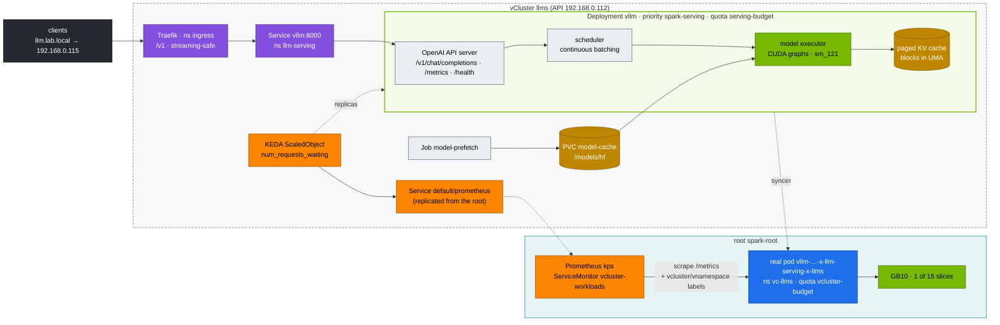

# Chapter 20 · vLLM High-Throughput LLM Serving: KV-Cache Budgeting, Probes, Autoscaling & Load Testing

> **02-Kubernetes · Part VII — LLM serving · Chapter 20 of 28** · ← [Chapter 19 · Large-scale SuperPOD & network fabrics](19-large-scale-superpod-and-network-fabrics.md) · [All chapters](00-kubernetes-step-by-step-guide.md) · [Chapter 21 · NVIDIA Triton Inference Server](21-nvidia-triton-inference-server.md) →

| | |
|---|---|
| **You will build** | A production-shaped vLLM Deployment inside the `llms` vCluster: shared model cache, startup/readiness/liveness probes, graceful drain, UMA-aware memory flags, metrics scraped by the root's Prometheus, queue-depth autoscaling with KEDA, a repeatable benchmark that gives you TTFT/TPOT/throughput for your GB10 — and a sizing table that shows which engines fit the `llms` budget together |
| **Hardware** | dgx-spark-1 |
| **Time** | 90 min |
| **Risk** | Low. The engine takes ~24 GiB of UMA at `--gpu-memory-utilization 0.20`; the pod may use up to 32 Gi of the `llm-serving` budget |
| **Clusters** | `llms` (the Deployment, the `serving-budget` quota, KEDA, Traefik) · `spark-root` (the real pod and its cgroup, the `vcluster-budget` quota, Prometheus, alerts) |
| **Lab files** | [`manifests/llms/90-serving/vllm/`](lab/manifests/llms/90-serving/vllm/) (`vllm.yaml`, `vllm-bench.yaml`), [`manifests/llms/60-storage/model-prefetch-job.yaml`](lab/manifests/llms/60-storage/model-prefetch-job.yaml), [`manifests/llms/90-serving/autoscaling.yaml`](lab/manifests/llms/90-serving/autoscaling.yaml), [`manifests/llms/10-tenancy/quotas.yaml`](lab/manifests/llms/10-tenancy/quotas.yaml), [`manifests/root/95-observability/`](lab/manifests/root/95-observability/) (`rules.yaml`, `vcluster-workloads.yaml`), [`scripts/uma-watch.sh`](lab/scripts/uma-watch.sh) |

---

## 1. Why this matters on a Spark

vLLM's throughput comes from **PagedAttention** (the KV cache is paged in fixed blocks, like virtual memory, so it doesn't fragment) and **continuous batching** (new requests join the running batch at every decode step). On a Spark there's one extra rule: `--gpu-memory-utilization` is a fraction of the **whole unified pool** (≈119.7 GiB), the same memory DGX OS, the kubeadm control plane, both vCluster control planes, the page cache and every other pod use. On a discrete GPU, 0.90 is normal. Here, 0.90 would starve the whole machine.

And there are **two budgets**, both of which must hold:

1. **vLLM's own**: weights + activations + KV cache ≤ fraction × 119.7 GiB. At 0.20 that's ≈ 24 GiB.
2. **The cluster's**: the pod's memory limit (32 Gi) must fit `serving-budget` in `llm-serving` (80 Gi, inside llms) *and* the root's `vcluster-budget` on `vc-llms` (88 Gi for everything in llms). Whether CUDA allocations are charged to the pod's cgroup is something you measure (Chapter 14 §5.5); the manifests are sized as if they are.

| Flag | What it controls | Lab value | Rule of thumb on a Spark |
|---|---|---|---|
| `--gpu-memory-utilization` | weights + activations + KV cache ≤ fraction × total | 0.20 | sum over all engines running at once ≲ 0.70 (§2) |
| `--max-model-len` | longest context per sequence | 8192 | only what users need. KV grows linearly |
| `--max-num-seqs` | concurrent sequences in the batch | 64 | lower → better latency, higher → throughput |
| `--enable-prefix-caching` | reuse KV for shared prefixes (system prompts, RAG templates) | on | almost always on |
| `--download-dir` / `HF_HOME` | where weights live | `/models/hf` (PVC `model-cache`) | never inside the container layer |

---

## 2. Architecture — HLD



Everything you write lives in llms. Everything that *runs* is on the root: the syncer turns the vLLM pod into `vllm-…-x-llm-serving-x-llms` in `vc-llms`, the root scheduler hands it a time-slice, the root's kube-proxy routes the Service, and the root's Prometheus scrapes it. KEDA inside llms reads that Prometheus through a Service vCluster replicates into the vCluster (`networking.replicateServices.fromHost` in [`vclusters/llms.yaml`](lab/vclusters/llms.yaml)).

**Model memory in llms.** The `llms` vCluster has 88 Gi. About 4 Gi of it goes to its control plane, CoreDNS, Traefik, Kueue and KEDA, which leaves **about 84 GiB for model servers**. In `--gpu-memory-utilization` terms that is 84 / 119.7 ≈ 0.70, so the rule is: **the sum of the util values of all models running at the same time ≲ 0.70**. Each util value is a fraction of the whole pool (util × ~119.7 GiB). Sets that fit:

| Set running together | util values | Sum | ≈ UMA |
|---|---|---|---|
| three 7–8B models, 16k context | 0.20 + 0.20 + 0.20 | 0.60 | 3 × 24 GiB |
| one 32B FP8 + one 7B | 0.40–0.45 + 0.25 | 0.65–0.70 | 48–54 + 30 GiB |
| r1-32b BF16, alone | 0.70 | 0.70 | 84 GiB |

The quota is the second check, not the first: `serving-budget` (80 Gi of limits) holds two of the lab's 32 Gi engines, and the root LimitRange on `vc-llms` caps one container at 40 Gi. A set near 0.70 needs pod limits sized from the Chapter 14 §5.5 measurement (is CUDA memory charged to the cgroup?), not from the util value. §9 has the lab's combinations.

---

## 3. LLD

### 3.1 KV-cache math

Per token, per sequence: `2 (K and V) × layers × kv_heads × head_dim × bytes_per_element`.

| Model | Layers | KV heads | Head dim | KV / token (BF16) | 8K context, 1 seq | 64 seqs × 2K tokens |
|---|---|---|---|---|---|---|
| Qwen2.5-0.5B-Instruct (lab smoke) | 24 | 2 | 64 | **12 KiB** | 96 MiB | 1.5 GiB |
| Qwen2.5-7B-Instruct | 28 | 4 | 128 | **56 KiB** | 448 MiB | 7 GiB |
| Llama-3.1-8B-Instruct | 32 | 8 | 128 | **128 KiB** | 1 GiB | 16 GiB |
| Qwen2.5-32B-Instruct | 64 | 8 | 128 | **256 KiB** | 2 GiB | 32 GiB |

Budget at `--gpu-memory-utilization 0.20` ≈ 24 GiB: the 0.5B model (≈1 GiB weights, a little more for activations and CUDA graphs) leaves ~21 GiB for KV — about 1.8 M tokens, far more than 64 × 8K. A 7B model in BF16 (~15 GiB weights) leaves ~7 GiB, ≈ 130 K tokens: it fits, at lower concurrency. A 32B model in BF16 (~64 GiB weights) doesn't fit 0.20 at all; it needs 0.70, all of llms's model memory, and runs alone (§2). FP8 or AWQ-INT4 (~17–35 GiB) at 0.40–0.45 leaves room for a 7B beside it (modules 03/04). vLLM logs the exact figure at startup: `Available KV cache memory` / `GPU KV cache size: … tokens`.

### 3.2 Probes and lifecycle

| Mechanism | Setting | Protects against |
|---|---|---|
| `startupProbe` | `/health`, 10 s × 180 = 30 min | killing a pod that's still downloading or compiling (breakfix 05) |
| `readinessProbe` | `/health`, 5 s | routing to a loading or overloaded pod. Required in `llm-serving` by the CEL policy `spark-serving-needs-readiness` |
| `livenessProbe` | `/health`, 15 s × 4 | a wedged engine |
| `preStop: sleep 15` + `terminationGracePeriodSeconds: 120` | — | cutting in-flight streams on rollout (Chapter 09 §5.6) |
| `strategy: Recreate` | — | two copies of the model in UMA (and 2 × 32 Gi in the quota) during a rollout |
| `/dev/shm` 8 Gi | memory-backed emptyDir | tensor-parallel and worker IPC |

The probes are executed by the **root's** kubelet against the real pod; their results come back to llms through the syncer's status copy. The `preStop` sleep covers the propagation that matters for traffic: the pod leaving the *root's* EndpointSlice, which is what the root's kube-proxy routes by (Chapter 09).

### 3.3 Metrics you'll use

| Metric | Meaning |
|---|---|
| `vllm:num_requests_running` / `vllm:num_requests_waiting` | batch size / queue depth. **Scale on waiting** |
| `vllm:kv_cache_usage_perc` (older: `gpu_cache_usage_perc`) | KV-cache fill. Near 1.0 → preemptions |
| `vllm:num_preemptions` | sequences evicted and recomputed |
| `vllm:time_to_first_token_seconds` | TTFT histogram (prefill + queue) |
| `vllm:inter_token_latency_seconds` (older: `time_per_output_token_seconds`) | decode speed per token |
| `vllm:prompt_tokens` / `vllm:generation_tokens` | token throughput counters |

The root ServiceMonitor [`vcluster-workloads`](lab/manifests/root/95-observability/vcluster-workloads.yaml) keeps only the engine Services and copies vCluster's identity annotations into labels, so every series carries `vcluster="llms"`, `vnamespace="llm-serving"`, `vservice="vllm"` and `vpod`. `namespace` and `pod` keep the root names (`vc-llms`, `vllm-…-x-llm-serving-x-llms`). The lab's rules in [`rules.yaml`](lab/manifests/root/95-observability/rules.yaml) aggregate by `vcluster, vnamespace` and use `A or B` so they work with both metric generations.

---

## 4. Integrations

- **Storage (Chapter 13)**: the prefetch Job fills `model-cache` (`local-nvme-retain`, a root StorageClass synced into llms), and vLLM starts from local NVMe. On the Spark the weights are under `/data/k8s/retain/vc-llms/model-cache-x-llm-serving-x-llms` — root namespace, root PVC name.
- **Ingress (Chapter 11)**: Traefik runs *inside* llms (`ingress` namespace, `192.168.0.115`). Point an HTTPRoute at `vllm:8000` instead of `mock-llm` once you've proven the path with the mock.
- **Autoscaling**: KEDA reads the root's Prometheus. On one GB10, extra replicas mostly add *queueing* capacity, not compute — and a second replica, which now fits `serving-budget` (§9), costs another 0.20 of model memory for that. `maxReplicaCount: 1` until dgx-spark-2 joins.
- **Scheduling (Chapter 07)**: `spark-serving` is synced to the root as a PriorityClass, so the root scheduler can preempt a `spark-preemptible` pod — in either vCluster — to start vLLM.
- **Modules 03–06**: each model family is a kustomize-style variation of this Deployment (model, quantisation, engine flags, chat template), sized against §9.

---

## 5. Lab

All commands run from `02-Kubernetes/lab` with the lab kubeconfig:

```bash
cd "02-Kubernetes/lab"
export KUBECONFIG="$PWD/../../01-Ansible/lab/.cache/kubeconfig-spark-lab.yaml"
scripts/apply-lab.sh llms                                   # namespaces, quotas, model-cache PVC, mock-llm, Qdrant
kubectl --context llms -n llm-serving describe resourcequota serving-budget
```

### 5.1 Prefetch weights, then deploy

```bash
kubectl --context llms -n llm-serving create secret generic hf-token --from-literal=token="${HF_TOKEN:-none}" \
  --dry-run=client -o yaml | kubectl --context llms apply -f -
kubectl --context llms apply -f manifests/llms/60-storage/model-prefetch-job.yaml
kubectl --context llms -n llm-serving wait --for=condition=complete job/model-prefetch --timeout=30m
ssh dgxadmin@192.168.0.100 "sudo sh -c 'sync; echo 3 > /proc/sys/vm/drop_caches'"   # start the load with a clean page cache
kubectl --context llms apply -k manifests/llms/90-serving/vllm
kubectl --context llms -n llm-serving logs -f deploy/vllm | grep -E 'Loading|weights|KV cache|blocks|CUDA graph|Uvicorn|ERROR'
```

`vllm.yaml` carries an `hf-token` Secret with a placeholder value, so applying it overwrites the token you just created. For the public Qwen smoke model that doesn't matter; for gated models, re-create the Secret after the apply (or remove it from the file and keep tokens in Vault — Chapter 28).

Expected log landmarks:

```text
INFO … Loading weights took 1.9 seconds
INFO … Model loading took 0.93 GiB and 3.1 seconds
INFO … Available KV cache memory: 21.2 GiB
INFO … GPU KV cache size: 1,850,000 tokens
INFO … Capturing CUDA graphs … took 12 seconds
INFO:     Uvicorn running on http://0.0.0.0:8000
```

(Numbers are illustrative. Note yours.) Then look at what the quota layers charged:

```bash
kubectl --context llms -n llm-serving describe resourcequota serving-budget | grep -E 'limits.memory|requests.cpu|gpu'
kubectl --context spark-root -n vc-llms describe resourcequota vcluster-budget | grep -E 'limits.memory|requests.cpu|gpu'
kubectl --context spark-root -n vc-llms get pods -o wide | grep vllm
```

The same 32 Gi limit, 1.5 CPU and 1 slice appear **twice**: once in llms (the tenant ceiling, checked when the llms API server admits the pod), once on the root (the vCluster's hard cap, checked when the syncer creates the real pod). The root count also includes the llms control plane, Traefik, Kueue and KEDA.

### 5.2 First request (streaming)

```bash
kubectl --context llms -n llm-serving port-forward svc/vllm 8000 &
curl -s localhost:8000/v1/models | jq -r '.data[].id'
curl -sN localhost:8000/v1/chat/completions -H 'Content-Type: application/json' -d '{
  "model":"qwen2.5-0.5b","stream":true,"max_tokens":64,
  "messages":[{"role":"user","content":"In one sentence: what is unified memory on the DGX Spark?"}]}' \
  | sed -n 's/^data: //p' | grep -v DONE | jq -rj '.choices[0].delta.content // empty'; echo
```

The port-forward goes laptop → llms API server (`192.168.0.112`) → the root's kubelet → the real pod. vCluster proxies `port-forward`, `exec` and `logs` the same way.

### 5.3 Watch UMA during load and restart

On the Spark (the script reads `/sys/fs/cgroup`, and finds the root pod through vCluster's annotations):

```bash
scripts/uma-watch.sh llm-serving "$(kubectl --context llms -n llm-serving get pod -l app=vllm -o jsonpath='{.items[0].metadata.name}')" llms 2
```

The `pod.mem.max` column is the 32 Gi limit as the kernel sees it, in the cgroup of the *root* pod. While it runs, restart the Deployment in another terminal (`kubectl --context llms -n llm-serving rollout restart deploy/vllm`) and restart `uma-watch.sh` on the new pod. `Recreate` frees the old pod's memory before the new one allocates. Change the strategy to `RollingUpdate` and repeat: the rollout goes through, because a second 32 Gi pod fits `serving-budget` (66.4 of 80 Gi, §9), and MemAvailable dips by roughly *two* engines' worth (0.40 of the pool) while both copies are up. The quota no longer stops a double copy; memory is the limit, which is why the lab keeps `Recreate`. Set it back.

### 5.4 Graceful rollout with streams in flight

```bash
( for i in $(seq 5); do curl -sN localhost:8000/v1/chat/completions -H 'Content-Type: application/json' \
   -d '{"model":"qwen2.5-0.5b","stream":true,"max_tokens":1500,"messages":[{"role":"user","content":"Count slowly."}]}' \
   | tail -1 & done; wait ) &
sleep 3; kubectl --context llms -n llm-serving rollout restart deploy/vllm; wait
```

Expected: each stream ends with `data: [DONE]`. The preStop sleep and 120 s grace let running generations finish before SIGTERM. Streams longer than 120 s would still be cut, so size the grace to your longest generation. The grace period travels with the delete: the syncer deletes the root pod with the same grace period the llms API server gave the virtual one. Restart the port-forward afterwards (it was bound to the old pod).

### 5.5 Benchmark

The benchmark client is small: 500m CPU and a 1.5 Gi memory limit bring `serving-budget` to 2.4 of 10 CPU and 35.9 of 80 Gi next to vLLM (§9). Check the headroom first if other engines are running:

```bash
kubectl --context llms -n llm-serving describe resourcequota serving-budget | grep -E 'requests.cpu|limits.memory'
kubectl --context llms apply -f manifests/llms/90-serving/vllm/vllm-bench.yaml
kubectl --context llms -n llm-serving logs -f job/vllm-bench
```

If it is refused (`exceeded quota: serving-budget`), other engines beside vLLM are holding the rest of the 80 Gi; park one of them (§9).

Record, per concurrency (1 / 8 / 32): **output token throughput**, **mean and P99 TTFT**, **mean and P99 TPOT/ITL**. The shape to expect:

| Concurrency | Throughput | TTFT | TPOT |
|---|---|---|---|
| 1 | lowest | lowest | lowest |
| 8 | ~5–7× higher | slightly up | slightly up |
| 32 | highest (continuous batching) | up (queueing, prefill contention) | up |

Now repeat with `gemm-contention` at 2 replicas **on the root** (`kubectl --context spark-root -n platform-tools scale deploy gemm-contention --replicas=2`, Chapter 16). Those pods don't appear in any llms quota — they come out of the root's 2 slices — but they share the same GB10. The drop is what a noisy GPU neighbour from another cluster costs your SLO. Scale it back to 0.

### 5.6 Observability and alerts

```bash
curl -s localhost:8000/metrics | grep -E '^vllm:(num_requests_(running|waiting)|kv_cache_usage_perc|gpu_cache_usage_perc|num_preemptions)' | head
kubectl --context spark-root apply -k manifests/root/95-observability
kubectl --context spark-root -n observability port-forward svc/kps-prometheus 9090 &
curl -s 'localhost:9090/api/v1/query' --data-urlencode 'query=vllm:num_requests_running' \
  | jq -r '.data.result[].metric | "\(.vcluster) \(.vnamespace) \(.vpod)  ←  \(.namespace)/\(.pod)"'
```

Expected: one line, `llms llm-serving vllm-… ← vc-llms/vllm-…-x-llm-serving-x-llms` — the tenant's name and the root's name for the same series. In Grafana (`http://192.168.0.100:32000`), row *Serving SLOs*: TTFT p95, TPOT p95, queue and KV cache. Force a `VLLMQueueBacklog` alert (more than 32 waiting) by setting `--max-num-seqs=16` in `vllm.yaml` and running the benchmark loop with `--max-concurrency 256`; put both back afterwards.

### 5.7 Queue-depth autoscaling (KEDA)

```bash
scripts/install-addons.sh keda                                      # inside llms
kubectl --context llms -n default get svc prometheus                # the root's Prometheus, replicated into llms
kubectl --context llms apply -f manifests/llms/90-serving/autoscaling.yaml
kubectl --context llms -n llm-serving get scaledobject,hpa
```

KEDA creates an HPA inside llms; the llms controller-manager scales the Deployment; the syncer creates or deletes root pods. With `maxReplicaCount: 1`, the vLLM ScaledObject only shows the metric (`kubectl --context llms -n llm-serving get hpa -w` → current/target). The `mock-llm` ScaledObject really scales on in-flight connections at Traefik (needs `192.168.0.115 llm.lab.local` in your laptop's `/etc/hosts`):

```bash
seq 400 | xargs -P64 -I{} curl -sN -o /dev/null http://llm.lab.local/v1/chat/completions -d '{"stream":true,"max_tokens":200}' &
kubectl --context llms -n llm-serving get deploy mock-llm -w        # 2 → up to 6, back after cooldown
```

From now on, KEDA owns `deploy/vllm`'s replica count: `kubectl scale` alone is undone at the next poll. To swap engines (Chapters 21–23), use the pause annotation in §9.

---

## 6. Verify

```bash
scripts/verify.sh storage serving observability
```

| Check | Expected |
|---|---|
| `vLLM answered a chat completion` | PASS |
| startup log | `KV cache size` line recorded |
| both quotas | the vLLM pod counted in `serving-budget` (llms) and `vcluster-budget` (root) |
| rollout with 5 streams | 5 × `[DONE]` |
| benchmark | table for c = 1/8/32 saved, with and without a root GPU neighbour |
| Prometheus | `vllm:*` series with `vcluster="llms"` |
| KEDA | `mock-llm` scales out under load and back after the cooldown |

---

## 7. Troubleshooting

| Symptom | Cause | Diagnose | Fix |
|---|---|---|---|
| `ValueError: … memory … is less than the model` / CUDA OOM at startup | fraction too small for weights + activations, **or** UMA already used by others (any cluster, or the page cache) | log line with requested vs available. `free -g` on the Spark | raise the fraction carefully, drop page cache, scale down neighbours (`kubectl --context spark-root get pods -A -o wide`), quantise |
| `No available memory for the cache blocks` | weights fit, no room for KV | startup log | raise the fraction, or lower `--max-model-len` |
| Deployment shows 0/1, `exceeded quota: serving-budget` in llms events | other engines already hold most of the 80 Gi in `llm-serving` | `kubectl --context llms -n llm-serving describe resourcequota serving-budget` | park an engine (§9) |
| Pod `Pending` in llms with **no scheduler events** | the root's `vcluster-budget` on `vc-llms` is spent (batch jobs, add-ons) | `kubectl --context spark-root -n vc-llms describe resourcequota vcluster-budget` | free capacity in llms, or resize the vCluster (Chapter 04 §6.5) |
| PVC `model-cache` refused: `exceeded quota … requests.storage` | the PVC asks for more than `serving-budget` (600 Gi), or more than the root's 800 Gi minus the llms control-plane PVC | `kubectl --context llms -n llm-serving describe resourcequota serving-budget` | request a size that fits both layers |
| Pod `OOMKilled` (137) | pod memory limit < CPU-side peak (tokenizer, CUDA graphs, host buffers, CUDA memory if charged) | `kubectl --context llms -n llm-serving describe pod`, Chapter 14 §5.5 result | raise the limit to measured peak + 20 % — and check §9 still adds up |
| Restarts during first start | liveness fires before load completes | events `Liveness probe failed` | startupProbe (as in the lab) |
| `no kernel image is available` | wheel/image without sm_121 | image tag | NGC vLLM image for DGX Spark / arm64 |
| High TTFT, low GPU use | queueing in front (ingress rate limit) or prefill-heavy prompts | `num_requests_waiting` vs running | raise `max-num-seqs`, chunked prefill (default in recent vLLM), prefix caching |
| Tokens arrive in bursts | buffering proxy | TTFB ≈ total (Chapter 11 §5.3) | remove response buffering |
| `KV cache usage` ~1.0 and preemptions rising | too many long sequences | `vllm:num_preemptions` | lower `max-num-seqs`/`max-model-len`, or add capacity |
| `kubectl scale deploy vllm --replicas=0` doesn't stick | KEDA's HPA scales it back to `minReplicaCount` | `kubectl --context llms -n llm-serving get scaledobject vllm` | pause the ScaledObject (§9) |
| KEDA `ScaledObject` not Ready, `connection refused` | `default/prometheus` not replicated, or kps not installed on the root | `kubectl --context llms -n default get svc,endpoints prometheus` | `scripts/install-addons.sh kps`, then re-run `scripts/install-addons.sh vclusters` |

---

## 8. Scale-out path

| Lab | 2 Sparks | Datacenter |
|---|---|---|
| 1 replica, 1 slice | 2 replicas (one per Spark) behind Traefik, weights on NFS, KEDA `maxReplicaCount: 2` — `serving-budget` already holds two 32 Gi engines, and each replica's 0.20 is taken from its own Spark's pool (§9). Both vClusters see dgx-spark-2 as soon as it joins the root | many replicas, prefix/KV-aware routing (Gateway API Inference Extension, llm-d) |
| single-GPU model | tensor/pipeline parallel across the CX-7 (`--tensor-parallel-size 2` with Ray, or `--pipeline-parallel-size 2`) for models that don't fit one Spark | TP within NVLink domains, PP/EP across nodes, disaggregated prefill/decode (Chapter 23) |
| KEDA on queue depth | same | + SLO-based scaling and admission control |
| one serving vCluster | same | a serving cluster per environment or business unit; budgets per cluster, promoted by GitOps (Chapter 28) |

---

## 9. The llms budget: which engines fit together

Chapters 20–23 all deploy into `llm-serving`, which has one ceiling ([`manifests/llms/10-tenancy/quotas.yaml`](lab/manifests/llms/10-tenancy/quotas.yaml)) inside one vCluster budget ([`manifests/root/05-vclusters/quotas.yaml`](lab/manifests/root/05-vclusters/quotas.yaml)):

```text
root   vc-llms      12 CPU · 88 Gi · 11 slices · 800 Gi  ← the real cap (control plane, add-ons, serving, batch)
llms   llm-serving  10 CPU · 80 Gi · 8 slices · 600 Gi   ← ceiling for model servers
llms   spark-cq     10 CPU · 80 Gi · 3 slices            ← Kueue ceiling for batch
rest   ≈ 1 CPU · 4 Gi                                    ← llms control plane, CoreDNS, Traefik, Kueue, KEDA
```

Serving and batch add up to more than the root allows on purpose: the inner numbers are ceilings, not reservations. Either side can use most of llms while the other is idle; the root quota, Kueue and the PriorityClasses decide who waits. What each lab object charges to `serving-budget` (CPU requests, memory **limits**, slices, from the manifests), and the share of the UMA pool it asks vLLM/SGLang for:

| Object | CPU | Memory limit | Slices | util | Volume |
|---|---|---|---|---|---|
| `mock-llm` ×2 + `mock-llm-canary` (always on) | 150m | 384 Mi | 0 | – | 09 (KEDA may scale mock-llm to 6: +200m, +512 Mi) |
| `qdrant` (always on) | 250m | 2 Gi | 0 | – | 10 |
| `vllm` | 1500m | 32 Gi | 1 | 0.20 | 21 |
| `vllm-bench` Job | 500m | 1.5 Gi | 0 | – | 21 |
| `triton` + `triton-perf` | 1000m + 500m | 12 Gi + 2 Gi | 1 | small (toy models) | 22 |
| `sglang` | 1500m | 32 Gi | 1 | 0.20 (`--mem-fraction-static`) | 23 |
| KServe `qwen-small` predictor | 1500m | 32 Gi | 1 | 0.20 | 23 |
| `vllm-prefill` + `vllm-decode` + `pd-proxy` | 1600m | 40.25 Gi | 2 | 0.15 + 0.15 | 24 |

| Combination | CPU | Memory | util sum | Fits 10 CPU · 80 Gi (and ≲ 0.70)? |
|---|---|---|---|---|
| always-on + vLLM | 1.9 | 34.4 Gi | 0.20 | yes — 45.6 Gi to spare |
| always-on + vLLM + bench (§5.5) | 2.4 | 35.9 Gi | 0.20 | yes |
| always-on + vLLM + Triton + perf | 3.4 | 48.4 Gi | 0.20 + small | yes |
| always-on + Triton + perf | 1.9 | 16.4 Gi | small | yes |
| always-on + vLLM + one of SGLang / KServe | 3.4 | 66.4 Gi | 0.40 | yes |
| always-on + vLLM + SGLang + KServe | 4.9 | 98.4 Gi | 0.60 | **no** — memory limits → park one |
| always-on + P/D | 2.0 | 42.6 Gi | 0.30 | yes |
| always-on + vLLM + P/D | 3.5 | 74.6 Gi | 0.50 | yes — 5.4 Gi to spare |

So the rule for 21–24 is **two engines side by side**: `serving-budget` holds two 32 Gi engines (or vLLM + Triton, or vLLM + P/D), and memory, i.e. the sum of their util values, is the real limit (§2). Three 32 Gi engines overflow the quota even though their util sum (0.60) would fit; running three 7–8B models needs limits trimmed to the measured peak (Chapter 14 §5.5). To make room for a third engine, park one like this:

```bash
# park vLLM (KEDA-safe: the annotation scales to 0 and keeps it there)
kubectl --context llms -n llm-serving annotate scaledobject vllm autoscaling.keda.sh/paused-replicas=0 --overwrite \
  || kubectl --context llms -n llm-serving scale deploy vllm --replicas=0
while kubectl --context llms -n llm-serving get pod -l app=vllm -o name | grep -q .; do sleep 5; done
# bring it back
kubectl --context llms -n llm-serving annotate scaledobject vllm autoscaling.keda.sh/paused-replicas- \
  || kubectl --context llms -n llm-serving scale deploy vllm --replicas=1
```

Two things the inner table doesn't show. First, the **root** quota also carries the llms control plane (1.5 Gi limit), CoreDNS, Traefik, Kueue, KEDA and — after Chapter 22 — cert-manager and KServe, and every batch job Kueue admits: serving at its full 80 Gi plus the ≈4 Gi of platform pieces leaves batch almost nothing of 88 Gi. Read the real total with `kubectl --context spark-root -n vc-llms describe resourcequota vcluster-budget` before starting a batch job next to running engines. Second, quotas count *limits*, the GB10 counts *bytes*: an engine's `--gpu-memory-utilization` share of 119.7 GiB is taken from the same pool as every other cluster's pods, and no quota sees the root's `platform-tools` benchmarks or a `docker run` on the host. Keep the util sum ≲ 0.70 yourself.

---

## 10. Checklist

- [ ] I can compute KV bytes per token for any model from its config and turn that into a context/concurrency budget.
- [ ] My vLLM pod starts from a pre-filled cache, drains gracefully, and never runs two copies during a rollout.
- [ ] I can show the same vLLM pod charged to both quota layers, and find its cgroup on the root.
- [ ] I have TTFT/TPOT/throughput numbers for three concurrency levels, with and without a GPU neighbour.
- [ ] Alerts and autoscaling key off queue depth, not GPU utilisation — and read the root's Prometheus from inside llms.
- [ ] I can tell from §9 whether a new engine fits beside the running ones — by quota and by util sum — and park one without fighting KEDA.
