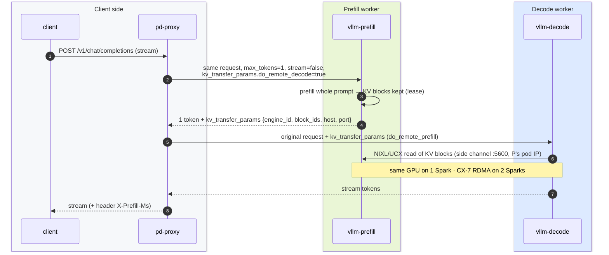
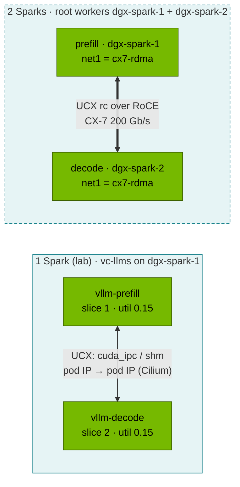

# Step 23 · Disaggregated Prefill & Decode: KV-Cache Transfer with vLLM + NIXL, Routing, and When It Pays Off

> **02-Kubernetes · Part VII — LLM serving · Step 23 of 28** · ← [Step 22 · SGLang, TensorRT-LLM & KServe](22-llm-inference-alternatives-and-kserve.md) · [All steps](00-kubernetes-step-by-step-guide.md) · [Step 24 · Accelerators & compilers](24-hyperscaler-silicon-and-compilers.md) →

| | |
|---|---|
| **You will build** | A working prefill/decode (P/D) split inside the `llms` vCluster: two vLLM instances with the NIXL KV connector and a small proxy that routes each request prefill → decode. You'll see the KV handoff in logs and headers, plus a transfer-time model that tells you when disaggregation is worth it. On two Sparks, the KV cache moves over the CX-7 |
| **Hardware** | dgx-spark-1 (both roles share the GB10 via 2 slices: mechanics, not speed). 2 Sparks for §5.5 |
| **Time** | 90 min |
| **Risk** | Medium-low. Experimental feature: pin versions, and verify `import nixl` in your image first. Prefill + decode need 40 Gi of memory limits — more than `llm-serving`'s 36 Gi ceiling, so §5.2 lifts it for the experiment |
| **Clusters** | `llms` (P, D, proxy, the `serving-budget` ceiling) · `spark-root` (the `vcluster-budget` cap, pod IPs, Cilium, and on two Sparks the CX-7 NetworkAttachmentDefinition in `vc-llms`) |
| **Lab files** | [`manifests/llms/90-serving/pd-disagg/`](lab/manifests/llms/90-serving/pd-disagg/) (`pd.yaml`, `pd_proxy.py`), [`manifests/llms/10-tenancy/quotas.yaml`](lab/manifests/llms/10-tenancy/quotas.yaml), [`manifests/llms/85-network-operator/rdma-test-pod.yaml`](lab/manifests/llms/85-network-operator/rdma-test-pod.yaml) |

---

## 1. Why this matters

LLM inference has two phases with opposite hardware appetites:

| | Prefill | Decode |
|---|---|---|
| Work | process the whole prompt in parallel | one token per step per sequence |
| Bound by | **compute** (big GEMMs) | **memory bandwidth** (read all weights + KV each step) |
| Latency metric | TTFT | TPOT / inter-token latency |
| Batch behaviour | a few long prompts saturate the GPU | many sequences needed to use the GPU |

In one engine, a burst of long prompts stalls every in-flight decode (TPOT spikes), and a crowd of decoders delays new prefills (TTFT spikes). **Disaggregation** runs them on separate workers sized and scaled independently, at the cost of moving the prompt's KV cache from P to D.

---

## 2. Architecture — HLD





The side channel uses `VLLM_NIXL_SIDE_CHANNEL_HOST=status.podIP`. That IP is the **root's** pod IP (from the root's 10.42.0.0/16 pod CIDR, assigned by Cilium) — vCluster doesn't have a network of its own, so the virtual pod reports the real address and the two engines reach each other directly, without any Service.

---

## 3. LLD

### 3.1 Components

| Object | Key settings |
|---|---|
| `vllm-prefill`, `vllm-decode` Deployments | `--kv-transfer-config={"kv_connector":"NixlConnector","kv_role":"kv_both"}`, `--enforce-eager`, `--gpu-memory-utilization=0.15` each, `VLLM_NIXL_SIDE_CHANNEL_HOST=<podIP>`, port 5600, `UCX_TLS=all`; 750m · 8 Gi req / 20 Gi limit · 1 slice each |
| `pd-proxy` | stdlib Python (`pd_proxy.py`): prefill with `max_tokens=1` → copy `kv_transfer_params` → decode, streaming passthrough, `X-Prefill-Ms` header; 100m · 256 Mi limit |
| Services | `vllm-prefill:8000`, `vllm-decode:8000`, `pd-proxy:8000` |

| Budget (Step 20 §9) | CPU | Memory limit | Slices |
|---|---|---|---|
| P + D + proxy | 1.6 | 40.25 Gi | 2 |
| + always-on (mocks, Qdrant) | 2.0 | 42.6 Gi | 2 |
| `serving-budget` (inner ceiling) | 2.5 | **36 Gi** | 6 |
| `vcluster-budget` (root cap, everything in llms) | 4 | 48 Gi | 8 |

The experiment doesn't fit the tenant ceiling but does fit the vCluster — if nothing else big is running in llms. That's exactly the case the two layers were built for: the llms admin may lift a tenant ceiling temporarily; nobody inside llms can lift the root's.

### 3.2 KV-transfer time model

KV bytes for a prompt = prompt tokens × KV bytes/token (Step 20 §3.1). Transfer time ≈ bytes / effective bandwidth.

| Model | Prompt | KV size | CX-7 RDMA (~22 GB/s eff.) | 10 GbE TCP (~1.1 GB/s) | Same GPU (UMA copy) |
|---|---|---|---|---|---|
| Qwen2.5-0.5B | 4K tokens | 48 MiB | ~2 ms | ~45 ms | < 1 ms |
| Qwen2.5-7B | 4K | 224 MiB | ~10 ms | ~210 ms | ~1 ms |
| Llama-3.1-8B | 32K | 4 GiB | ~195 ms | ~3.9 s | ~15 ms |

**Rule:** disaggregation pays off when the TTFT/TPOT interference you remove is larger than the transfer you add. That means long prompts, strict TPOT SLOs, and a fast interconnect. Over the 10 GbE management network (where Cilium's VXLAN overlay carries pod traffic between Sparks), it rarely pays off.

---

## 4. Integrations

- **Step 20** supplies the model cache and monitoring. Both P and D export `vllm:*` metrics; the root ServiceMonitor keeps `vllm-prefill` and `vllm-decode`, so the dashboard's TTFT comes from prefill, TPOT from decode, both labelled `vcluster="llms"`.
- **Steps 17/18**: on two Sparks, UCX needs the RDMA devices in the pods: the Multus `cx7-rdma` NetworkAttachmentDefinition (in root namespace `vc-llms` — synced pods keep their `k8s.v1.cni.cncf.io/networks` annotation and Multus resolves it in the pod's *root* namespace), `rdma/rdma_shared_cx7`, `IPC_LOCK`, and `UCX_NET_DEVICES=rocep1s0f1:1,roceP2p1s0f1:1`.
- **Step 08**: P↔D traffic on port 5600 stays inside `vc-llms`; the root's `vcluster-boundary` policy only blocks dev-lab ↔ llms. A tenant NetworkPolicy in `llm-serving` that default-denies ingress must allow 5600 between the two Deployments.
- **Step 11 §8**: at scale, the proxy's job moves into the gateway (Gateway API Inference Extension / llm-d / Dynamo routers), which also pick decode workers by KV-cache locality.

---

## 5. Lab

```bash
cd "02-Kubernetes/lab"
export KUBECONFIG="$PWD/../../01-Ansible/lab/.cache/kubeconfig-spark-lab.yaml"
```

### 5.1 Pre-flight: does the image have NIXL?

P/D uses the same image as Step 20's vLLM, so ask the running engine before parking it:

```bash
kubectl --context llms -n llm-serving exec deploy/vllm -- python3 -c "import nixl, vllm; print('nixl OK, vllm', vllm.__version__)"
# park every 32 Gi engine (Step 20 §9)
kubectl --context llms -n llm-serving annotate scaledobject vllm autoscaling.keda.sh/paused-replicas=0 --overwrite \
  || kubectl --context llms -n llm-serving scale deploy vllm --replicas=0
kubectl --context llms -n llm-serving scale deploy sglang triton --replicas=0 2>/dev/null
kubectl --context llms -n llm-serving delete inferenceservice qwen-small --ignore-not-found 2>/dev/null
```

If `import nixl` fails, use a newer NGC vLLM tag that bundles it, or build a thin image `FROM nvcr.io/nvidia/vllm:<tag>` with `RUN pip install nixl` (and pin it).

### 5.2 Lift the tenant ceiling, then deploy P, D and the proxy

Check the root has room for 40 Gi more in llms, then raise `serving-budget` for the experiment:

```bash
kubectl --context spark-root -n vc-llms describe resourcequota vcluster-budget | grep -E 'limits.memory|requests.cpu|gpu'
kubectl --context llms -n llm-serving patch resourcequota serving-budget --type merge -p '{"spec":{"hard":{"limits.memory":"44Gi"}}}'
kubectl --context llms apply -k manifests/llms/90-serving/pd-disagg
kubectl --context llms -n llm-serving rollout status deploy/vllm-prefill --timeout=30m
kubectl --context llms -n llm-serving rollout status deploy/vllm-decode --timeout=30m
kubectl --context llms -n llm-serving logs deploy/vllm-prefill | grep -iE 'nixl|kv_transfer|connector' | head
```

Expected: both engines log that the `NixlConnector` initialised (role `kv_both`) with a side-channel port. If `vcluster-budget` shows less than ~41 Gi free under `limits.memory`, the root will refuse the second engine: the pod sits `Pending` in llms with no scheduler events. Free memory in llms first (batch jobs, Step 25) rather than patching the root — that quota is the platform's promise to the other vCluster. If Argo CD already manages llms (Step 28), its `selfHeal` reverts this patch (and §5.5's namespace label) within minutes: pause `spark-llms-10-tenancy` and `spark-llms-00-platform` for the experiment, as Step 28 §2.3 shows.

Prove the side-channel address is a root pod IP:

```bash
kubectl --context llms -n llm-serving get pods -l pd-role -o custom-columns=NAME:.metadata.name,IP:.status.podIP,ROLE:.metadata.labels.pd-role
kubectl --context spark-root -n vc-llms get pods -o wide | grep -E 'vllm-(prefill|decode)'     # same IPs
```

### 5.3 Send traffic through the proxy

```bash
kubectl --context llms -n llm-serving port-forward svc/pd-proxy 8000 &
curl -sN -D /tmp/h localhost:8000/v1/chat/completions -H 'Content-Type: application/json' -d '{
  "model":"Qwen/Qwen2.5-0.5B-Instruct","stream":true,"max_tokens":64,
  "messages":[{"role":"user","content":"Explain prefill vs decode in two sentences."}]}' \
  | sed -n 's/^data: //p' | grep -v DONE | jq -rj '.choices[0].delta.content // empty'; echo
grep -i x-prefill-ms /tmp/h
kubectl --context llms -n llm-serving logs deploy/vllm-decode --since=1m | grep -iE 'nixl|remote|transfer' | tail -5
```

Evidence of a real handoff: the decode log shows remote-prefill/NIXL read activity for the request, and the prefill log shows a request with `max_tokens=1`. The proxy header reports how long prefill took. On one Spark you can also watch the flow on the root with Hubble — `hubble observe --namespace vc-llms --port 5600` shows the side-channel handshake between the two pod IPs; the KV bytes themselves move through `cuda_ipc`/shared memory, not the network.

### 5.4 Compare with a monolithic engine under mixed load

```bash
python3 scripts/ttft_probe.py --url http://localhost:8000 --model Qwen/Qwen2.5-0.5B-Instruct -n 10      # through P/D
kill %1
kubectl --context llms delete -k manifests/llms/90-serving/pd-disagg
kubectl --context llms apply -k manifests/llms/10-tenancy                 # serving-budget back to 36 Gi
kubectl --context llms -n llm-serving annotate scaledobject vllm autoscaling.keda.sh/paused-replicas- \
  || kubectl --context llms -n llm-serving scale deploy vllm --replicas=1
kubectl --context llms -n llm-serving rollout status deploy/vllm --timeout=30m
kubectl --context llms -n llm-serving port-forward svc/vllm 8000 &
python3 scripts/ttft_probe.py --url http://localhost:8000 --model qwen2.5-0.5b -n 10; kill %1
```

On one GB10 expect **no latency win**, and possibly a small loss: both roles share the same compute, and the proxy adds a hop. That's the honest result, and it's the point. Disaggregation is an *interference* fix for separate hardware. Write down both numbers. §5.5 is where the architecture starts to make sense.

### 5.5 (2 Sparks) Prefill on dgx-spark-1, decode on dgx-spark-2

dgx-spark-2 joins the **root** (01-Ansible `k8s_workers`); llms sees it immediately through node sync, and `13-multus-rdma.yml` has put the `cx7-rdma` NetworkAttachmentDefinition into `vc-llms`. Check the plumbing with the lab's test pod first:

```bash
kubectl --context llms get nodes                                          # dgx-spark-1, dgx-spark-2
kubectl --context spark-root -n vc-llms get network-attachment-definitions  # cx7-rdma
kubectl --context llms apply -f manifests/llms/85-network-operator/rdma-test-pod.yaml
kubectl --context llms -n batch logs rdma-test                            # net1 + the rocep* devices
kubectl --context llms -n batch delete pod rdma-test
```

`llm-serving` enforces Pod Security **baseline**, which forbids the `IPC_LOCK` capability RDMA needs (`batch` is privileged for that reason). For the experiment, relax it the same way `batch` is labelled, and put it back afterwards:

```bash
kubectl --context llms label ns llm-serving pod-security.kubernetes.io/enforce=privileged --overwrite
# afterwards: kubectl --context llms apply -k manifests/llms/00-platform
```

Then add to the prefill Deployment `nodeSelector: {kubernetes.io/hostname: dgx-spark-1}`, to decode `dgx-spark-2`, plus on both:

```yaml
      metadata:
        annotations:
          k8s.v1.cni.cncf.io/networks: cx7-rdma       # resolved by Multus in root namespace vc-llms
      spec:
        containers:
          - name: vllm
            env:
              - {name: UCX_NET_DEVICES, value: "rocep1s0f1:1,roceP2p1s0f1:1"}
              - {name: UCX_TLS, value: "rc,cuda_copy,cuda_ipc"}
            securityContext: {capabilities: {add: [IPC_LOCK]}}
            resources: {limits: {rdma/rdma_shared_cx7: "1"}}     # Network Operator / Multus (Step 17 §5.6)
```

`nodeSelector` works inside llms because the nodes it sees are the real ones, with their real `kubernetes.io/hostname` labels. Then run a prefill-heavy mix (long prompts, short outputs) against both setups with `vllm bench serve --random-input-len 8192 --random-output-len 64`. Now decode TPOT stays flat while prefill runs on the other Spark.

---

## 6. Verify

| Check | Expected |
|---|---|
| `import nixl` in the image | OK |
| `serving-budget` | lifted to 44 Gi for the run, back to 36 Gi afterwards |
| P and D pod IPs | identical in llms and on the root |
| proxy response | streamed tokens + `X-Prefill-Ms` header |
| decode log | NIXL/remote-prefill activity per request |
| written result | P/D vs monolithic TTFT on 1 Spark (and on 2 if available) |

---

## 7. Troubleshooting

| Symptom | Cause | Diagnose | Fix |
|---|---|---|---|
| `vllm-decode` 0/1, `exceeded quota: serving-budget` | P + D (40 Gi) over the 36 Gi ceiling | `kubectl --context llms -n llm-serving describe resourcequota serving-budget` | §5.2 patch |
| a P/D pod Pending in llms, **no** scheduler events | the root `vcluster-budget` on `vc-llms` is spent | `kubectl --context spark-root -n vc-llms describe resourcequota vcluster-budget` | stop batch jobs / other engines in llms |
| decode recomputes the prompt (slow, no NIXL logs) | `kv_transfer_params` not forwarded, or prefill returned none | proxy logic, prefill response JSON | proxy must copy `kv_transfer_params` from the prefill response |
| `NIXL handshake failed / timeout` | side-channel host/port unreachable | `VLLM_NIXL_SIDE_CHANNEL_HOST` = pod IP, containerPort 5600, NetworkPolicy; `hubble observe --namespace vc-llms --port 5600 --verdict DROPPED` | allow 5600 between the two Deployments (same namespace is allowed in the lab) |
| UCX errors `no usable transports` | UCX can't find RDMA/cuda transports | `UCX_LOG_LEVEL=info` | set `UCX_TLS`, give pods RDMA devices + `IPC_LOCK` |
| pod rejected: `violates PodSecurity "baseline" … IPC_LOCK` | §5.5 on a baseline namespace | `kubectl --context llms get ns llm-serving --show-labels` | relabel for the experiment (§5.5) |
| no `net1` in the pod | NAD looked up in the wrong namespace | `kubectl --context spark-root -n vc-llms get net-attach-def` | the NAD must exist in the *root* namespace `vc-llms` |
| KV blocks freed before decode reads them | lease too short under load | prefill log `lease expired` | `kv_connector_extra_config.kv_lease_duration` |
| OOM when both start | two engines × fraction > free UMA | `free -g` on the Spark | 0.15 each (lab), scale other engines to 0 |

---

## 8. Scale-out path

| Lab | Datacenter |
|---|---|
| 1 P + 1 D, stdlib proxy | xP + yD pools sized from traffic mix (prefill-heavy RAG vs decode-heavy chat), KV-aware router (llm-d, NVIDIA Dynamo, Gateway API Inference Extension) |
| UCX over one CX-7 link | NIXL over IB/RoCE rails, GPUDirect RDMA, KV offload tiers (CPU memory → NVMe → remote, e.g. LMCache) |
| a tenant ceiling lifted by hand | separate budgets per pool (a prefill quota and a decode quota), sized from SLOs |
| manual comparison | SLO-driven autoscaling per pool (TTFT for P, TPOT for D) |

---

## 9. Checklist

- [ ] I can explain why prefill and decode interfere, and which metric each one hurts.
- [ ] I ran a P/D split and found evidence of the KV handoff in logs and headers.
- [ ] I lifted a tenant ceiling inside llms after checking the root cap — and put it back.
- [ ] I can estimate KV-transfer time for any model/prompt/link and decide whether P/D pays off.
- [ ] I have an honest one-Spark result, and a plan for the two-Spark experiment.
