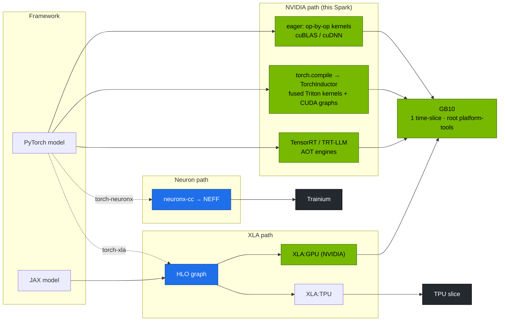

# Chapter 24 · Hyperscaler Silicon & Compilers: TPU, Trainium, Blackwell, and What Compilers Buy You

> **02-Kubernetes · Part VIII — Scale & resilience · Chapter 24 of 28** · ← [Chapter 23 · Disaggregated prefill & decode serving](23-disaggregated-prefill-and-decode-serving.md) · [All chapters](00-kubernetes-step-by-step-guide.md) · [Chapter 25 · Ultra-scale cluster resilience & fault tolerance](25-ultra-scale-cluster-resilience-and-fault-tolerance.md) →

| | |
|---|---|
| **You will build** | A measured answer, on your GB10, to "what does a compiler buy me?" (eager vs `torch.compile` vs max-autotune, with the generated kernels), plus a practical map of how Kubernetes schedules GPUs, TPU slices and Trainium devices, so you can read or port manifests between clouds |
| **Hardware** | dgx-spark-1 |
| **Time** | 60 min |
| **Risk** | None. The benchmark takes one of the root's 2 GPU slices for a few minutes |
| **Clusters** | `spark-root` (namespace `platform-tools`: benchmarking the hardware is a platform job) · `llms` (only to compare what a tenant sees) |
| **Lab files** | [`manifests/root/70-gpu/compile_compare.py`](lab/manifests/root/70-gpu/compile_compare.py), [`compile-compare.yaml`](lab/manifests/root/70-gpu/compile-compare.yaml), [`kustomization.yaml`](lab/manifests/root/70-gpu/kustomization.yaml) (ConfigMap `gemm-bench`), [`manifests/root/45-controller/`](lab/manifests/root/45-controller/) (slice ledger) |

---

## 1. Why this matters

Your Spark runs the same software stack as NVIDIA's datacenter systems (CUDA, cuDNN, NCCL, TensorRT, Triton). Hyperscalers also run their own silicon behind different compilers. Kubernetes hides some of the differences, but not all. Two practical skills transfer:

1. **Reading an accelerator from its programming model**: who fuses the kernels, who schedules memory, what the unit of allocation is.
2. **Recognising compiler effects in your own numbers**: why the same model is 1.3–2× faster after compilation, and what it costs (compile time, recompiles, cold starts).

| | NVIDIA Blackwell (GB10, B200, GB200) | Google TPU (v5e/v5p/Trillium/…) | AWS Trainium2 / Inferentia2 |
|---|---|---|---|
| Core | SMs + tensor cores, SIMT | systolic MXUs + vector/scalar units | NeuronCores (tensor/vector/scalar/GPSIMD engines) |
| Memory | HBM (datacenter) / **LPDDR5x UMA (GB10)** | HBM per chip | HBM per chip |
| Scale-up | NVLink / NVSwitch (GB10: C2C on package only) | ICI torus + optical circuit switches | NeuronLink |
| Primary stack | CUDA → cuBLAS/cuDNN/CUTLASS, Triton, TensorRT(-LLM); PyTorch eager or `torch.compile` | JAX/PyTorch-XLA → XLA (HLO) → TPU executable | PyTorch/JAX → Neuron compiler (neuronx-cc) |
| Compile model | optional (eager works) | **required** (whole-graph) | **required** (ahead-of-time graphs) |
| K8s resource | `nvidia.com/gpu` (or MIG/DRA) | `google.com/tpu` + topology node selectors | `aws.amazon.com/neuron` / `neuroncore` |

### 1.1 Why the benchmark runs on the root

The lab puts hardware benchmarking in the root's `platform-tools` namespace, not in a vCluster. A compiler benchmark measures the *GB10*, and its result is a platform fact (like the baseline TFLOPS in Chapter 05 §4 Task 6) that every tenant's numbers are compared against. `platform-tools` has no ResourceQuota: the root's share of the Spark (3 CPU, ~9.7 GiB, 2 of the 15 time-slices) is kept by convention and watched by the slice ledger, not enforced. That is the usual platform-team trade — more freedom, more responsibility. Take a 3rd slice and a tenant pod inside llms or dev-lab gets `Insufficient nvidia.com/gpu` from the root scheduler even though its vCluster quota still has room. This Job alone asks for more than that share (4 CPU requested, 16 Gi memory limit, §3.2): CPU can burst into idle cores, but memory can't, so run it while the vClusters' engines and batch jobs are quiet.

---

## 2. Architecture — HLD



---

## 3. LLD

### 3.1 What the compiler changes in the lab benchmark

The benchmark block is `Linear(D→4D) → GELU → Linear(4D→D) + residual → RMSNorm`, BF16, B=8, T=1024, D=4096 (env `B`, `T`, `D` in the Job override them).

| Mode | Kernels per forward (approx.) | What changes |
|---|---|---|
| eager | ~8–10 (2 GEMMs + each elementwise op + reductions) | each op reads/writes memory. Launch overhead per op |
| `torch.compile` (default) | ~4 (2 GEMMs + 1–2 fused Triton kernels) | GELU, residual and norm fused: fewer memory round trips |
| `mode="max-autotune"` | same or fewer, + CUDA graphs | autotuned GEMM/Triton configs. Launch overhead gone |

On a **memory-bandwidth-limited** part like GB10 (≈273 GB/s shared), fusion that removes memory traffic matters proportionally more than on an HBM GPU. And because that bandwidth is shared with the CPU, a noisy neighbour in *any* cluster (a vLLM decode loop in llms, a page-cache-heavy job on the host) moves your eager numbers more than your fused ones.

### 3.2 The Job

| Field | Value | Why |
|---|---|---|
| namespace | `platform-tools` (root, PSA privileged, no quota) | platform benchmark |
| script | ConfigMap `gemm-bench` (`gemm_bench.py`, `compile_compare.py`), created by `kubectl --context spark-root apply -k manifests/root/70-gpu` | one ConfigMap for all GPU benchmarks |
| resources | requests 4 CPU · 8 Gi, limits 16 Gi · `nvidia.com/gpu: 1` | Inductor compiles kernels on the CPU in parallel; max-autotune benchmarks many candidates |
| `TORCH_LOGS` | empty; set to `output_code` to print the generated Triton kernels | §5.2 |
| PriorityClass | none → priority 0 (the root has no default PriorityClass, Chapter 07 §3.1) | a benchmark may be preempted by `spark-serving` |

### 3.3 Scheduling other accelerators in Kubernetes (reference)

```yaml
# Google TPU slice (GKE): topology is part of scheduling
nodeSelector:
  cloud.google.com/gke-tpu-accelerator: tpu-v5-lite-podslice
  cloud.google.com/gke-tpu-topology: 2x4
resources:
  limits: {google.com/tpu: 8}        # all chips of the host in the slice
---
# AWS Trainium (EKS + Neuron device plugin)
resources:
  limits: {aws.amazon.com/neuron: 1}  # or aws.amazon.com/neuroncore: 2
---
# NVIDIA (this lab)
resources:
  limits: {nvidia.com/gpu: 1}         # one of 15 time-slices of the GB10 (GPU Operator)
```

| Concern | GPU (lab) | TPU | Trainium |
|---|---|---|---|
| multi-host job | NCCL over IB/RoCE. Gang via Kueue/JobSet | a *slice* is gang-allocated by the platform. JobSet + `TPU_WORKER_HOSTNAMES` | Neuron collectives over EFA. Gang via Kueue/JobSet |
| sharing | time-slicing / MPS / MIG | whole hosts per slice | per NeuronCore |
| who sees the device | the root's device plugin; a vCluster only sees the count on the synced node | the node's device plugin | the node's device plugin |
| image | CUDA arm64/x86 | JAX/PyTorch-XLA for TPU | Neuron SDK DLCs |

The middle row is the nested-cluster version of a cloud fact: device plugins, DRA drivers and the TPU/Neuron node agents belong to whoever owns the nodes. In this lab that's the root; a vCluster tenant writes `nvidia.com/gpu: 1` and the root's scheduler and kubelet do the rest. On GKE or EKS it's the cloud provider.

---

## 4. Integrations

- **Module 06-Gemma** uses JAX/XLA and MaxText on NVIDIA. The XLA:GPU path above runs on your Spark with NVIDIA's JAX containers.
- **Module 07-Nvidia** goes inside the kernels (SASS, Nsight Compute). Point it at the fused kernels this chapter generates.
- **Serving (Chapters 20–22)**: vLLM and SGLang already use CUDA graphs and `torch.compile` internally. That's part of their startup time ("Capturing CUDA graphs") and part of why their startup probes allow 30 minutes.
- **Chapter 16**: the same ConfigMap drives `gemm-solo` and `gemm-contention`; compare compiled vs eager *under contention* by scaling `gemm-contention` while §5.1 runs.

---

## 5. Lab

```bash
cd "02-Kubernetes/lab"
export KUBECONFIG="$PWD/../../01-Ansible/lab/.cache/kubeconfig-spark-lab.yaml"
```

### 5.1 Eager vs compiled on the GB10

```bash
kubectl --context spark-root apply -k manifests/root/70-gpu                 # ConfigMap gemm-bench (+ gemm-contention at 0 replicas)
kubectl --context spark-root get cm -n platform-tools gpu-slice-ledger -o yaml   # who holds slices right now (Chapter 06 controller)
kubectl --context spark-root apply -f manifests/root/70-gpu/compile-compare.yaml
kubectl --context spark-root -n platform-tools logs -f job/compile-compare
```

Expected shape (numbers illustrative, so record yours):

```text
device=NVIDIA GB10 cc=(12, 1) torch=2.9.0a0+…
           eager:   29.60 ms/iter     74.3 TFLOPS
 compile-default:   26.10 ms/iter     84.3 TFLOPS
     compile-max:   25.20 ms/iter     87.3 TFLOPS
compile time: default 35s, max-autotune 180s
```

While it runs, compare the two views of the GPU: `kubectl --context spark-root describe node dgx-spark-1 | grep -A8 'Allocated resources'` counts the slice you just took, and `kubectl --context llms describe node dgx-spark-1 | grep -A8 'Allocated resources'` shows the same node as a tenant sees it — real allocatable and real labels, synced from the root.

### 5.2 See the generated kernels

```bash
kubectl --context spark-root -n platform-tools delete job compile-compare
kubectl --context spark-root apply -f manifests/root/70-gpu/compile-compare.yaml --dry-run=client -o json \
  | jq '.spec.template.spec.containers[0].env[0].value="output_code"' | kubectl --context spark-root apply -f -
kubectl --context spark-root -n platform-tools logs job/compile-compare | grep -E '^def triton_|@triton.jit' | head
kubectl --context spark-root -n platform-tools logs job/compile-compare | grep -A25 'def triton_' | head -40
```

Look for one kernel that loads the GEMM output, applies `tanh`-GELU, adds the residual and computes the RMS reduction. That's fusion made visible.

### 5.3 The cost side: cold starts and recompiles

Change `T` (sequence length) between calls and compilation reruns for each new shape unless you mark it dynamic:

```bash
kubectl --context spark-root -n platform-tools run recompile --rm -i --restart=Never --image=nvcr.io/nvidia/pytorch:25.09-py3 \
  --overrides='{"spec":{"containers":[{"name":"recompile","image":"nvcr.io/nvidia/pytorch:25.09-py3","stdin":true,"command":["python3","-c","import torch,time\nm=torch.compile(torch.nn.Linear(1024,1024).cuda())\nfor T in (128,256,512,1024):\n  t=time.time(); m(torch.randn(T,1024,device=\"cuda\")); torch.cuda.synchronize(); print(T, round(time.time()-t,2), \"s\")"],"resources":{"requests":{"cpu":"2","memory":"4Gi"},"limits":{"nvidia.com/gpu":"1","memory":"8Gi"}}}]}}'
```

Expected: the first two or three shapes take seconds each (compile), and then PyTorch switches to a dynamic-shape graph, so later shapes are fast. In serving, this is why engines pre-compile or capture graphs for a fixed set of batch sizes at startup.

### 5.4 Clean up

```bash
kubectl --context spark-root -n platform-tools delete job compile-compare --ignore-not-found
```

---

## 6. Verify

| Check | Expected |
|---|---|
| compile-compare | compiled modes faster than eager. Numbers recorded |
| generated code | at least one fused `triton_` kernel containing GELU + reduction |
| recompile probe | first shapes slow, later shapes fast |
| slice accounting | the benchmark's slice visible on the root node (and in the ledger), not in any vCluster quota |

---

## 7. Troubleshooting

| Symptom | Cause | Fix |
|---|---|---|
| `torch.compile` errors about Triton / `sm_121` | Triton in the image lacks Blackwell (sm_120/121) support | use the NGC PyTorch image for DGX Spark (25.09+) |
| Job Pending, `Insufficient nvidia.com/gpu` | all 15 slices taken across the three clusters | `kubectl --context spark-root get cm -n platform-tools gpu-slice-ledger -o yaml`; stop the root's `gemm-contention` before touching tenants |
| `configmap "gemm-bench" not found` | `compile-compare.yaml` applied without the kustomization | `kubectl --context spark-root apply -k manifests/root/70-gpu` |
| max-autotune takes very long | exhaustive GEMM/Triton config search | cache: set `TORCHINDUCTOR_CACHE_DIR` to a PVC so pods reuse results |
| compiled slower than eager | graph breaks (Python side effects), tiny shapes | `TORCH_LOGS=graph_breaks`. Compile larger regions |
| out of memory during compile | autotune benchmarks many configs | smaller batch while tuning. Leave UMA headroom — check what the vClusters' engines hold first |

---

## 8. Scale-out path

| On the Spark | In a hyperscaler/datacenter |
|---|---|
| `torch.compile` per pod | shared compile caches (PVC/object store), AOT-compiled artefacts (TensorRT engines, AOTInductor, XLA executables) baked into images |
| `nvidia.com/gpu` time-slices from the root's device plugin | TPU slices with topology-aware placement, Trainium NeuronCores, NVIDIA MIG/DRA. Kueue ResourceFlavors per accelerator type |
| platform benchmarks in a root namespace without quota | a dedicated benchmark pool (or cluster) per accelerator generation, results published as the reference for tenants |
| one arch (sm_121) | CI builds per target (sm_90, sm_100, sm_121, TPU, Neuron) with per-target numerical tests |

---

## 9. Checklist

- [ ] I measured eager vs compiled on the GB10 and can explain the gap in terms of kernels and memory traffic.
- [ ] I found a fused kernel in the generated code.
- [ ] I can read a TPU or Trainium pod spec and map it to the GPU equivalent — and say who owns the device plugin.
- [ ] I know the operational costs of compilation (cold start, recompiles, caches).
- [ ] I can explain why the root's slices are a convention, and what happens to tenants when the platform takes too many.
