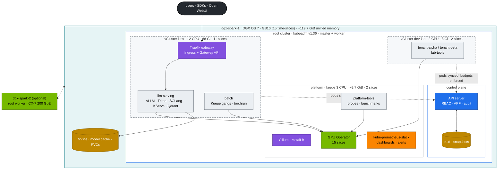

# 02-Kubernetes · Kubernetes for AI Infrastructure on NVIDIA DGX Spark

Twenty-eight chapters that turn one DGX Spark into a small but complete **AI datacenter platform**. The [01-Ansible](../01-Ansible/README.md) lab builds a **root Kubernetes cluster with kubeadm** (the Spark is its control plane *and* its worker) and two **virtual clusters** inside it: `dev-lab` for tenants and experiments, `llms` for model serving and training. On top of that you build a hardened control plane, budgeted tenants, GPU sharing, gang-scheduled training, an LLM API gateway, vLLM/Triton/SGLang serving, observability, drills and GitOps. Every chapter's document follows the same shape: **HLD → LLD → integrations → lab → verification with expected output → troubleshooting → scale-out path**. Every command runs against the files in [`lab/`](lab/README.md), and every chapter says which of the three clusters it uses.

**Prerequisite:** the [01-Ansible step-by-step guide](../01-Ansible/00-ansible-step-by-step-guide.md) through Chapter 20, which leaves the root cluster, the GPU Operator and both vClusters running, and the kubeconfig on your MacBook (`01-Ansible/lab/tools/fetch-kubeconfig.sh sema01`).

## How this module is organised

| Level | Name | In this module |
|---|---|---|
| Folder | **Module** | `02-Kubernetes` |
| Group of documents | **Part** | Part I — Control plane & the nested lab … Part IX — Operations |
| Document | **Chapter** | Chapter 00 · Kubernetes Step-by-Step Guide … Chapter 28 · Production MLOps & GitOps |
| Heading in a document | **Section** | §3.4 |
| Hands-on exercise in a document | **Task** | Chapter 01 Task 1 · Preflight |
| Semaphore item | **Template** | the 01-Ansible templates that build the platform: `19.1 Kubernetes`, `20.1 GPU Operator`, `20.2 vClusters` |

References read "Chapter 08 §3.4" inside this module and "01-Ansible Chapter 19" across modules. A template's number is `<chapter>.<n>`: the 01-Ansible chapter that explains it. The numbered folders under `lab/manifests` (`00-platform`, `05-vclusters` …) are apply-order layers, not chapters.

## Start here

1. **[Chapter 00 · Step-by-step guide](00-kubernetes-step-by-step-guide.md)**: the build order. One section per chapter, each linking its document, with the commands to run and a "Done when" check.
2. **[Chapter 01 · Kubernetes core architecture](01-kubernetes-core-architecture.md)**: the first chapter, preflight and one pod traced end to end. Then follow the guide.
3. **[`lab/README.md`](lab/README.md)**: the lab layout, quick start and "which cluster am I talking to?".

---

## The lab in one picture: three clusters nested on one Spark

Read it from the outside in:

1. **Your MacBook is a client, nothing more.** It holds a browser, `git` and `kubectl` (+ `helm`), and one kubeconfig with three contexts. No Kubernetes component and no automation run on it; it reaches the lab over the home LAN — a browser to Semaphore, Grafana and the LLM gateway, `kubectl` to three API endpoints. Its kubeconfig is fetched from sema01 with `01-Ansible/lab/tools/fetch-kubeconfig.sh sema01` after each `19.1 Kubernetes` / `20.2 vClusters` run.
2. **The management plane sits outside the Spark.** `sema01` (192.168.0.210) runs **every** lab playbook as a Semaphore task; `vault01` (192.168.0.211) hands each task a **15-minute SSH certificate** for `svc-ansible` and holds the lab's secrets. Both were built in [01-Ansible Chapter 01](../01-Ansible/01-management-plane-semaphore-and-vault.md), and [Chapter 04](../01-Ansible/04-dgx-spark-as-semaphore-target.md) made the Spark their target — so a reset or a rebuild of the Spark never takes the tool that rebuilds it.
3. **The DGX Spark is the whole datacenter.** Every cluster, pod and GPU slice lives on this one box. DGX OS provides the driver, CUDA, containerd and Docker; swap is off.
4. **The root cluster (`spark-root`) is the platform.** kubeadm installs a real control plane — API server, etcd, scheduler, controller-manager — and the Spark is also its only worker. It owns everything physical: the node and its kubelet/containerd, the network (Cilium, MetalLB), storage, the GPU (GPU Operator → 15 time-slices) and observability. Reach it at `192.168.0.100:6443` with `--context spark-root`.
5. **Inside it, two virtual clusters.** `dev-lab` (`192.168.0.111`) and `llms` (`192.168.0.112`) each have their own API server, controller-manager, CoreDNS and datastore — so their users get their own namespaces, RBAC, CRDs and policies — but those run as ordinary pods in the root namespaces `vc-dev-lab` and `vc-llms`. They have no nodes of their own.
6. **The syncer is the bridge.** When you create a pod in `llms`, the llms API server stores it and the llms syncer copies it to the root (`vllm-…-x-llm-serving-x-llms` in `vc-llms`). From there the **root** scheduler places it, the root kubelet starts it in containerd, Cilium wires its network and the GPU Operator's device plugin hands it a slice.
7. **Budgets are enforced at the root.** A ResourceQuota on `vc-dev-lab` (2 CPU · 8 Gi · 2 slices) and `vc-llms` (12 CPU · 88 Gi · 11 slices) caps each vCluster as a whole; quotas inside a vCluster only divide its share among its own teams. After the kubelet reservations (3 CPU · 14 GiB), the root keeps the rest (3 CPU · ~9.7 GiB · 2 slices) for the platform. Memory is never overcommitted; llms is the large one because the models run there.

So a tenant's request crosses **two** API servers — the vCluster's (who are you, what may you do, does it fit your team's quota) and then, through the syncer, the root's (does it fit the vCluster's budget, which node, which GPU). [Chapter 04](04-nested-clusters-with-vcluster.md) walks one pod through every hop; [Chapter 05](05-dgx-spark-datacenter-simulation-lab.md) builds the whole thing in order with a check after each stage.

> **Convention:** `ansible-playbook playbooks/<chapter>.<n>-….yml` in this module = run the Semaphore template `<chapter>.<n> …` in project `spark-lab` — the number is the 01-Ansible chapter that explains it (`00-vault-cert` and `site` are the exceptions) ([01-Ansible Chapter 04](../01-Ansible/04-dgx-spark-as-semaphore-target.md#7-build-the-lab-from-semaphore)); the CLI form is break-glass from the MacBook (`-l dgx-spark-1,localhost -K`).

## Platform at a glance

**Diagram colour key** (all chapters): blue = control plane · teal = host/node · green = GPU · purple = network · amber = storage · orange = observability · red = security/policy · black = external · grey = tenant workload.

---

## Curriculum

Every document carries its chapter number. Work through them in order with the [step-by-step guide](00-kubernetes-step-by-step-guide.md). Chapters 04 and 05 explain the lab's shape: [Chapter 04](04-nested-clusters-with-vcluster.md) the nesting, [Chapter 05](05-dgx-spark-datacenter-simulation-lab.md) the whole platform with its gates.

### Part I — Control plane & the nested lab

| Chapter | Document | What you build |
|---|---|---|
| 01 | [Kubernetes core architecture](01-kubernetes-core-architecture.md) | read the kubeadm control plane, trace one `kubectl apply` through API → scheduler → kubelet → containerd → nvidia runtime, and through a vCluster |
| 02 | [etcd database deep dive](02-etcd-database-deep-dive.md) | kubeadm's stacked etcd, SQLite in the vClusters, 3-member sandbox (elections, quorum loss, NOSPACE), restore drill |
| 03 | [kube-apiserver internals](03-kube-apiserver-internals.md) | x509 users per cluster, 4 CEL policies with dry-run fixtures, fair-queuing lanes for tenants and syncers, audit queries |
| 04 | [Nested clusters with vCluster](04-nested-clusters-with-vcluster.md) | the lab's shape: budgets, sync, names, the pod's path through three API servers, resize/add/back up a vCluster |
| 05 | [DGX Spark datacenter simulation lab](05-dgx-spark-datacenter-simulation-lab.md) | the whole platform: root, both vClusters, gates, capacity plan, day-2 ops, dgx-spark-2 plan |

### Part II — Controllers & scheduling

| Chapter | Document | What you build |
|---|---|---|
| 06 | [kube-controller-manager & controllers](06-kube-controller-manager-and-controllers.md) | reconciliation cascades, GC, a dependency-free GPU-slice ledger controller |
| 07 | [kube-scheduler & AI batch scheduling](07-kube-scheduler-and-ai-batch-scheduling.md) | preemption ladder, a reproduced partial-gang deadlock, Kueue fix |

### Part III — Networking

| Chapter | Document | What you build |
|---|---|---|
| 08 | [Kubernetes networking deep dive](08-kubernetes-networking-deep-dive.md) | packet path map, MTU proof, tenant isolation, the vCluster boundary, Hubble |
| 09 | [kube-proxy & ClusterIP mechanics](09-kube-proxy-and-cluster-ip-mechanics.md) | iptables reading, keep-alive pinning, graceful stream draining |
| 10 | [CoreDNS & service discovery](10-coredns-and-service-discovery.md) | measured query amplification, custom zones, outage drill |
| 11 | [Ingress controllers & Gateway API](11-ingress-controllers-and-gateway-api.md) | unbuffered streaming, limits, auth, canary, TLS, gRPC |

### Part IV — Workloads, storage & tenancy

| Chapter | Document | What you build |
|---|---|---|
| 12 | [Advanced workload controllers](12-advanced-workload-controllers.md) | Qdrant with durable data, GPU probe DaemonSet, sharded tokenizer, safe drains |
| 13 | [Storage, CSI & high-performance volumes](13-storage-csi-and-high-performance-volumes.md) | Retain/Delete classes, prefetch Job, AI-shaped fio baseline |
| 14 | [Multi-tenancy, resource quotas & cgroups](14-multi-tenancy-resource-quotas-and-cgroups.md) | two-layer budgets (root + tenant), throttling/OOM reproduced, *is CUDA memory charged to the pod?* |

### Part V — GPU platform

| Chapter | Document | What you build |
|---|---|---|
| 15 | [NVIDIA hardware & driver stack](15-nvidia-hardware-and-driver-stack.md) | host/pod inventory, GEMM baseline, arch/CUDA triage |
| 16 | [NVIDIA Container Toolkit & GPU virtualization](16-nvidia-container-toolkit-and-gpu-virtualization.md) | contention table, leak closed |
| 17 | [NVIDIA GPU Operator & Network Operator](17-nvidia-gpu-operator-and-network-operator.md) | per-node profiles, kps + host exporters, alerts, RDMA pod networking |

### Part VI — Distributed training & fabrics

| Chapter | Document | What you build |
|---|---|---|
| 18 | [Distributed AI training & NCCL](18-distributed-ai-training-and-nccl.md) | operator-free torchrun, gloo vs NCCL, straggler/hang triage, RoCE over CX-7 |
| 19 | [Large-scale SuperPOD & network fabrics](19-large-scale-superpod-and-network-fabrics.md) | NIC counters, degraded-link experiment, fat-tree calculator |

### Part VII — LLM serving

| Chapter | Document | What you build |
|---|---|---|
| 20 | [vLLM high-throughput LLM serving](20-vllm-high-throughput-llm-serving.md) | KV-cache budgeting, probes, graceful rollouts, benchmarks, KEDA |
| 21 | [NVIDIA Triton Inference Server](21-nvidia-triton-inference-server.md) | CPU→GPU ensemble, measured dynamic batching, perf_analyzer |
| 22 | [LLM inference alternatives & KServe](22-llm-inference-alternatives-and-kserve.md) | prefix-cache probe on two engines, JSON-schema output, KServe RawDeployment |
| 23 | [Disaggregated prefill & decode serving](23-disaggregated-prefill-and-decode-serving.md) | vLLM + NIXL P/D split, KV-transfer time model |

### Part VIII — Scale & resilience

| Chapter | Document | What you build |
|---|---|---|
| 24 | [Hyperscaler silicon & compilers](24-hyperscaler-silicon-and-compilers.md) | eager vs `torch.compile` on GB10, generated kernels, cross-cloud pod specs |
| 25 | [Ultra-scale cluster resilience & fault tolerance](25-ultra-scale-cluster-resilience-and-fault-tolerance.md) | MTBF/goodput calculator, async-checkpoint resume, SDC canary, quarantine |

### Part IX — Operations

| Chapter | Document | What you build |
|---|---|---|
| 26 | [Cluster diagnostics & failure scenarios](26-cluster-diagnostics-and-failure-scenarios.md) | triage tree, runbooks, Xid matrix, 15 drills |
| 27 | [Hands-on practice exercises workbook](27-hands-on-practice-exercises-workbook.md) | timed challenges, 60-minute rebuild |
| 28 | [Production MLOps & GitOps](28-production-mlops-and-gitops.md) | Argo CD app-of-apps, drift correction, model promotion |

---

## Reference lab

| Item | Value |
|---|---|
| Nodes | dgx-spark-1 `192.168.0.100` (kubeadm control plane + worker). Optional dgx-spark-2 `192.168.0.101` (worker) |
| Clusters (contexts) | `spark-root` (kubeadm) · `dev-lab` (vCluster, `https://192.168.0.111`) · `llms` (vCluster, `https://192.168.0.112`) — one kubeconfig: `01-Ansible/lab/.cache/kubeconfig-spark-lab.yaml` |
| Budgets | dev-lab 2 CPU · 8 Gi · 2 slices · 200 Gi — llms 12 CPU · 88 Gi · 11 slices · 800 Gi — root keeps 3 CPU · ~9.7 GiB · 2 slices, after 3 CPU · 14 GiB of kubelet reservations ([Chapter 04](04-nested-clusters-with-vcluster.md)) |
| CX-7 | `192.168.100.0/24` + `192.168.101.0/24`, MTU 9000 |
| Pods / Services / DNS | `10.42.0.0/16` / `10.43.0.0/16` / `10.43.0.10` (Cilium VXLAN, kube-proxy iptables) |
| LoadBalancer IPs | MetalLB `192.168.0.110–119`: dev-lab API `.111`, llms API `.112`, llms gateway (Traefik) `.115` |
| Entry points | root API `:6443` · Grafana `:32000` · Hubble UI `:31235` · llms gateway `192.168.0.115:80` |
| GPU | GB10, compute capability 12.1, 15 time-slices, no MIG |
| Versions | [`lab/versions.env`](lab/versions.env) (Kubernetes v1.36.5, Cilium 1.20.2, vCluster 0.37.1, GPU Operator v26.7.1, Kueue v0.13.4, Traefik chart 34.4.1, kps 70.4.2, NGC 25.09 images) |

## How this module was verified

Without a Spark attached, the lab was applied with **server-side dry-run against real Kubernetes 1.36 API servers** standing in for the root and the two vClusters, carrying the Cilium, Kueue, Gateway API, Traefik, Prometheus Operator and KEDA CRDs: every layer applies, the tenancy checks and the 11 allow/deny admission fixtures pass, and all 39 pod templates are admitted in their target cluster. Both vCluster values files validate against the vCluster 0.37.1 chart schema and the Traefik values against its chart schema; [`tests/budget_check.py`](lab/tests/budget_check.py) proves the budgets fit the Spark. The Python tools (mock OpenAI server, P/D proxy, slice-ledger controller, checkpoint/resume trainer, calculators) were run for real, and all Mermaid diagrams were rendered. CI ([`k8s-lab-ci.yml`](../.github/workflows/k8s-lab-ci.yml)) repeats the static checks, then builds the same shape on kind — kind as the root with a fake GB10, plus vCluster `dev-lab` and `llms` from the lab's own values — applies the lab to all three, runs the fixtures and the Kueue gang test on every PR. GPU-dependent results (TFLOPS, TTFT, NCCL bandwidth, the UMA cgroup experiment) are marked in the documents as **"record yours"**. Those are the numbers to measure on your Spark.
