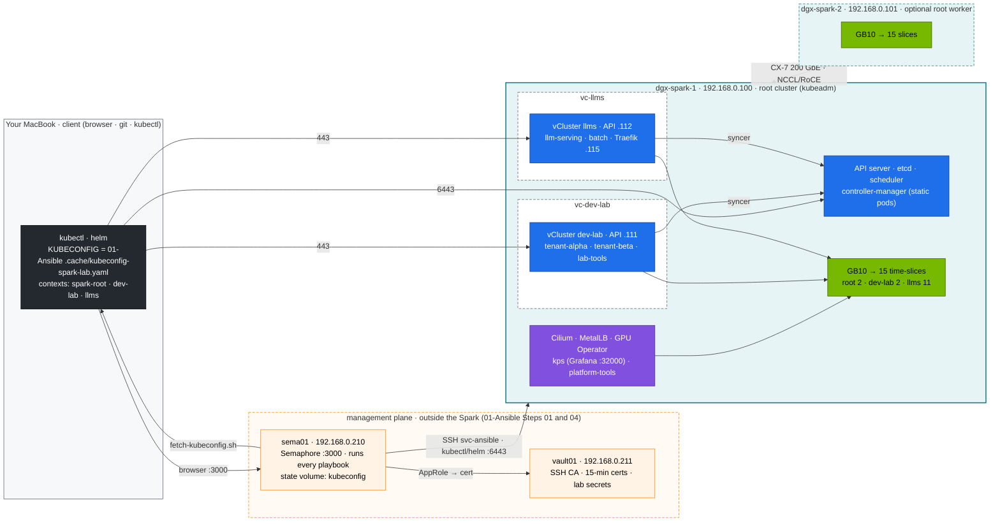

# 02-Kubernetes Lab · Runnable Companion to Steps 01–28

Everything the 28 steps of the [step-by-step guide](../00-kubernetes-step-by-step-guide.md) teach, as manifests, scripts and drills. The [01-Ansible lab](../../01-Ansible/lab/README.md) builds the base on one DGX Spark (a second Spark is optional):

- a **root cluster** with kubeadm — dgx-spark-1 is control plane *and* worker — with Cilium, MetalLB and the GPU Operator (15 time-slices), and
- two **vClusters** inside it ([Step 04](../04-nested-clusters-with-vcluster.md)): `dev-lab` (2 CPU · 8 Gi · 2 slices) and `llms` (12 CPU · 88 Gi · 11 slices); the root keeps 3 CPU · ~10 GiB · 2 slices for its platform.

This directory holds their definitions and everything that runs on them. Every code block in the steps is taken from here.

> **Convention:** `ansible-playbook playbooks/NN-….yml` in this module = run Semaphore template NN in project `spark-lab` ([01-Ansible Step 04](../../01-Ansible/04-dgx-spark-as-semaphore-target.md#7-build-the-lab-from-semaphore)); the CLI form is break-glass from the MacBook (`-l dgx-spark-1,localhost -K`).

```
lab/
├── versions.env                 # every pinned version, in one place
├── kubeadm/                     # audit policy of the root API server (copy of 01-Ansible's)          (Step 03)
├── vclusters/                   # Helm values: dev-lab.yaml, llms.yaml (vCluster 0.37, k8s distro)    (Step 04)
├── addons/                      # Helm values (kps, metrics-server, Traefik) + StorageClasses         (Steps 04, 11, 13, 17)
├── manifests/
│   ├── common/                  # shared: PriorityClasses, CEL admission policies, RuntimeClass nvidia
│   ├── root/                    # → context spark-root (the platform)
│   │   ├── 00-platform/         #   observability + platform-tools namespaces, PriorityClasses        (Steps 05, 07)
│   │   ├── 05-vclusters/        #   vc-dev-lab / vc-llms: namespaces, root budgets, Cilium boundary   (Step 04)
│   │   ├── 12-cgroups/          #   QoS trio, CPU throttling, the UMA cgroup experiment               (Step 14)
│   │   ├── 16-apf/              #   API fairness lane for the vCluster syncers                        (Step 03)
│   │   ├── 20-scheduling/       #   preemption demo (needs the node full)                             (Step 07)
│   │   ├── 30-networking/       #   netshoot-host, CoreDNS Corefile                                   (Steps 08–10)
│   │   ├── 45-controller/       #   slice-ledger: a dependency-free controller                        (Step 06)
│   │   ├── 50-workloads/        #   node-probe DaemonSet                                              (Step 12)
│   │   ├── 60-storage/          #   fio AI profiles                                                   (Step 13)
│   │   ├── 70-gpu/              #   GEMM benchmark, time-slice contention, torch.compile              (Steps 15–17, 24)
│   │   ├── 85-network-operator/ #   NicClusterPolicy + macvlan RDMA network for 2 Sparks              (Step 17)
│   │   └── 95-observability/    #   host exporters, vCluster workload scraping, alerts, dashboard     (Steps 17, 26)
│   ├── dev-lab/                 # → context dev-lab (vCluster #1)
│   │   ├── 00-platform/         #   tenant-alpha, tenant-beta, lab-tools                              (Step 14)
│   │   ├── 10-tenancy/          #   tenant quotas, LimitRanges, RBAC, NetworkPolicies                 (Steps 03, 08, 14)
│   │   ├── 15-admission/        #   CEL policies (common)                                             (Step 03)
│   │   ├── 16-apf/              #   API fairness for tenant users                                     (Step 03)
│   │   ├── 20-scheduling/       #   the no-Kueue deadlock, taints & affinity                          (Step 07)
│   │   ├── 30-networking/       #   netshoot, echo + headless Service, ndots lab                      (Steps 08–10)
│   │   ├── 50-workloads/        #   sharded tokenizer Indexed Job                                     (Step 12)
│   │   └── 70-gpu/              #   gpu-smoke: a tenant pod through the whole chain                   (Steps 16, 17)
│   └── llms/                    # → context llms (vCluster #2)
│       ├── 00-platform/         #   llm-serving, batch, ingress                                       (Step 20)
│       ├── 10-tenancy/          #   serving budget, LimitRanges, CI deployer, NetworkPolicy           (Step 14)
│       ├── 15-admission/        #   CEL policies (common)                                             (Step 03)
│       ├── 20-scheduling/       #   Kueue flavors/queues, gang demo                                   (Step 07)
│       ├── 40-ingress/          #   mock OpenAI API, Traefik middlewares, Ingress, HTTPRoute          (Step 11)
│       ├── 50-workloads/        #   Qdrant StatefulSet + PDBs                                         (Step 12)
│       ├── 60-storage/          #   model-cache PVC, prefetch Job                                     (Step 13)
│       ├── 80-distributed/      #   torchrun all-reduce (1 Spark gloo · 2 Sparks NCCL/RoCE), resilient/ (Steps 18, 25)
│       ├── 85-network-operator/ #   RDMA test pod                                                     (Step 17)
│       └── 90-serving/          #   vLLM, Triton ensemble, SGLang, KServe, prefill/decode split, KEDA (Steps 20–23)
├── etcd-sandbox/                # throw-away 3-member etcd (docker compose) for Raft drills           (Step 02)
├── gitops/                      # Argo CD app-of-apps across the three clusters                      (Step 28)
├── scripts/                     # preflight, install-addons, apply-lab, verify, breakfix, diag, etcd drill/sandbox,
│                                #   cgroup/netns/iptables inspectors (vCluster-aware), make-user, uma-watch,
│                                #   merge-vcluster-kubeconfig, argocd-register-vclusters,
│                                #   ttft_probe.py, fabric_calc.py, mtbf_calc.py
├── breakfix/                    # 15 fault-injection scenarios across root, dev-lab and llms           (Steps 26, 27)
└── tests/                       # local checks, budget check, admission fixtures, fake-GPU node, Kueue gang test (CI)
```

## Topology



**Diagram colour key (used in every step):** blue = control plane · teal = node/host ·
green = GPU · purple = network · amber = storage · orange = observability · red = security ·
black = external/user · grey = tenant workload.

## Quick start

```bash
# 0. The 01-Ansible lab has built the root cluster + GPU Operator (+ the vClusters), as Semaphore
#    templates 05 Kubernetes → 06 GPU Operator → 06b vClusters on sema01. Then, from the repo root:
"01-Ansible/lab/tools/fetch-kubeconfig.sh" sema01   # kubeconfig from sema01 → 01-Ansible/lab/.cache/
export KUBECONFIG="$PWD/01-Ansible/lab/.cache/kubeconfig-spark-lab.yaml"
cd "02-Kubernetes/lab"
tests/run-local-checks.sh                   # proves your toolchain, no Spark needed

# 1. On the Spark
scripts/preflight.sh                        # host, kubeadm, Cilium, MetalLB, 15 slices, vCluster contexts
scripts/install-addons.sh all               # root: storage, metrics-server, kps, vClusters · llms: Traefik, Kueue, KEDA
scripts/apply-lab.sh                        # root → dev-lab → llms, layer by layer
scripts/verify.sh                           # PASS/WARN/FAIL for every layer of every cluster
```

Then follow the [step-by-step guide](../00-kubernetes-step-by-step-guide.md) from Step 01, or jump straight into the drills (Step 26):

```bash
scripts/breakfix.sh list                    # each scenario names the cluster it breaks
scripts/breakfix.sh inject 02     # diagnose it, fix it, `scripts/breakfix.sh answer 02` if stuck
```

## Which cluster am I talking to?

Every script and every command in the steps names a context. The rule of thumb:

| You are … | Context | Examples |
|---|---|---|
| the platform team | `spark-root` | nodes, etcd, CNI, GPU Operator, storage classes, root budgets, benchmarks in `platform-tools` |
| a tenant / developer | `dev-lab` | `tenant-alpha`, `tenant-beta`, `lab-tools`: quotas, RBAC, admission, networking labs |
| the ML / serving team | `llms` | `llm-serving`, `batch`, `ingress`: vLLM, Triton, Kueue, KEDA, Traefik |

`scripts/cgroup-inspect.sh`, `pod-netns.sh`, `svc-trace.sh` and `uma-watch.sh` take an optional context as the last argument and find a vCluster pod's real copy on the root for you.

## The Spark is the playground

Break things freely. Two ways back:

```bash
scripts/breakfix.sh reset all                                         # undo every drill
```

For a full reset, run the Semaphore template `99 Reset Kubernetes` (extra var `reset_confirm=RESET`; wipes Kubernetes, keeps DGX OS/drivers/Docker), then `05 Kubernetes` → `06 GPU Operator` → `06b vClusters`, then `"01-Ansible/lab/tools/fetch-kubeconfig.sh" sema01` and `scripts/install-addons.sh all`. sema01 and vault01 are outside the Spark, so the reset never touches them. A rebuild from scratch takes well under an hour.

## No Spark yet?

Almost everything except CUDA runs on any Kubernetes ≥ 1.34. CI builds the same shape on kind: kind plays the root, `tests/fake-gpu-node.sh` makes its node advertise 15 `nvidia.com/gpu` with GB10 labels, and the two vClusters come from `vclusters/*.yaml`. Quotas, admission, Kueue and scheduling labs work there; GPU benchmarks don't.

## Versions

See [`versions.env`](versions.env). Re-check them before a fresh build. NGC image tags in
particular move monthly, and a DGX Spark needs **arm64** images built for **sm_121**.
