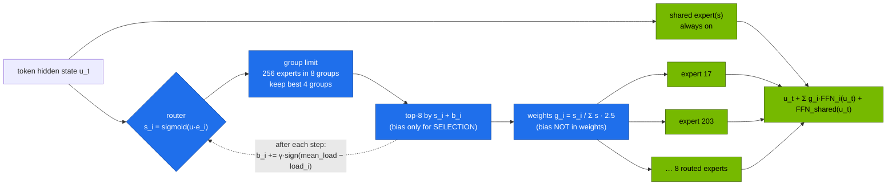

# Volume 02 — DeepSeekMoE: Fine-Grained Experts, Group-Limited Routing and Auxiliary-Loss-Free Balancing

> **Module 03 · Part I — Architecture** · Prev: [01 MLA](01-multi-head-latent-attention-mla.md) · Next: [03 Multi-token prediction](03-multi-token-prediction-mtp.md)

| | |
|---|---|
| **You will build** | DeepSeek-V3's router in simulation (sigmoid affinities, 8-group/4-group limit, top-8, bias-based balancing), watching load imbalance collapse step by step. Then you'll hook the real router inside DeepSeek-V2-Lite on the GB10 and see which experts code, maths, chat and Chinese text actually use |
| **Hardware** | CPU for §5.1–5.2. spark-01 for §5.3 (≈31 GB of unified memory) |
| **Time** | 75 min |
| **Risk** | None |
| **Lab files** | [`tools/moe_router_demo.py`](lab/tools/moe_router_demo.py), [`tools/moe_router_probe.py`](lab/tools/moe_router_probe.py), [`tools/model_math.py`](lab/tools/model_math.py), [`k8s/jobs/gpu-probes.yaml`](lab/k8s/jobs/gpu-probes.yaml) |

---

## 1. Why this matters on a Spark

A Mixture-of-Experts layer replaces one big feed-forward block with many small ones (experts), and a **router** that sends each token to a few of them. Compute per token follows the *active* parameters, memory follows the *total*:

| Model | Total params | Active per token | Weights (BF16) | Fits one Spark? |
|---|---|---|---|---|
| DeepSeek-V2-Lite | 15.7 B | ~2.4 B (2.7 B incl. embeddings) | 29 GiB | ✅ |
| DeepSeek-Coder-V2-Lite | 15.7 B | ~2.4 B | 29 GiB | ✅ |
| Mixtral-8x7B | 46.7 B | 12.9 B | 87 GiB | ⚠️ only quantised |
| DeepSeek-V3 / R1 | 671 B | 37 B | 1.25 TiB (FP8: 625 GiB) | ❌ (Vol 14) |

On a bandwidth-limited GB10 (~273 GB/s), decode speed depends mostly on **bytes read per token**, which tracks active parameters. A 16B MoE with 2.4B active decodes at roughly the speed of a 3B dense model, while carrying 16B of knowledge. That trade, more memory for cheaper tokens, suits a box with lots of memory and modest bandwidth very well.

---

## 2. Architecture — HLD



### 2.1 Three design decisions, and why

| Decision | DeepSeekMoE choice | Alternative (Mixtral, GShard) | Why it helps |
|---|---|---|---|
| Expert granularity | **many small** experts (256 × 2048 hidden), top-8 | few big ones (8 experts, top-2) | far more combinations, so experts specialise more finely |
| Shared experts | 1 (V3) or 2 (V2) always-on experts | none | common knowledge lives in one place, not duplicated in every routed expert |
| Balancing | **auxiliary-loss-free**: a per-expert bias added only for top-k selection, nudged after each step | auxiliary loss term in the training objective | balance without a loss term that fights the language-modelling objective |

V3 adds **group-limited (node-limited) routing**: experts are grouped (8 groups ≈ 8 nodes in training), and a token may use at most 4 groups. That caps cross-node all-to-all traffic, which is what makes expert parallelism (Vol 09, 14) affordable.

---

## 3. LLD

### 3.1 Router parameters (config files)

| Key | DeepSeek-V3 | DeepSeek-V2-Lite |
|---|---|---|
| `n_routed_experts` | 256 | 64 |
| `n_shared_experts` | 1 | 2 |
| `n_activated_experts` (top-k) | 8 | 6 |
| `n_expert_groups` / `n_limited_groups` | 8 / 4 | 1 / 1 (no group limit) |
| `score_func` | sigmoid | softmax |
| `route_scale` | 2.5 | 1.0 |
| `moe_inter_dim` (expert hidden) | 2048 | 1408 |
| `n_dense_layers` (first layers without MoE) | 3 | 1 |

### 3.2 The efficiency tax

The step time of an expert-parallel layer is set by the **most loaded GPU**. `max/mean GPU load` is therefore the multiplier on MoE layer time. 1.0 is perfect.

---

## 4. Integrations

- **Vol 09 (EPLB)** takes the per-expert loads measured in §5.3 and fixes *placement*, by replicating hot experts. The bias in this volume fixes *routing* during training. Inference still needs placement.
- **vLLM** runs MoE layers with fused MoE kernels (Triton or CUTLASS). With one GPU there's no expert parallelism. The router still runs, and the loads still matter for kernel efficiency.
- **`model_math.py`** splits total and active parameters, which is how the catalog chooses `util` for MoE models.

---

## 5. Lab

### 5.1 Simulate V3's router on skewed traffic

```bash
cd "03 DeepSeek/lab"
python3 tools/moe_router_demo.py
```

```text
== WITHOUT aux-loss-free bias balancing (256 experts, top-8, groups 4/8)
 step   max/mean expert load   idle experts   max/mean GPU load (EP=8)
    1                  11.50             11                   1.84
   60                  11.71             13                   1.86

== WITH aux-loss-free bias balancing (256 experts, top-8, groups 4/8)
 step   max/mean expert load   idle experts   max/mean GPU load (EP=8)
    1                  11.50             11                   1.84
   20                   9.70              5                   1.59
   40                   6.91              2                   1.37
   60                   3.81              0                   1.14
 bias range after 60 steps: [-0.120, 0.120]
```

Traffic comes from four "topics" with a 55/25/15/5 mix. Without balancing, the hottest expert gets 11.7× the average load and a dozen experts sit idle. With the bias update (γ = 0.002), imbalance falls steadily and every expert gets work. The bias never enters the combine weights, so the model's output scale is untouched.

### 5.2 Experiment with the knobs

```bash
python3 tools/moe_router_demo.py --gamma 0.01            # faster balancing; watch for oscillation
python3 tools/moe_router_demo.py --groups 1 --limited 1  # no group limit
python3 tools/moe_router_demo.py --experts 64 --topk 6 --groups 1 --limited 1 --gpus 8   # V2-Lite shape
```

Questions to answer in your notes: what happens to *idle experts* when γ is too small? Does removing the group limit change GPU imbalance in this synthetic setup? (It shouldn't much. Its purpose is cross-node *traffic*, not balance.)

### 5.3 Hook the real router (spark-01)

```bash
kubectl -n llm-serving scale deploy vllm --replicas=0          # free ~30 GB
kubectl apply -k . && kubectl apply -f k8s/jobs/gpu-probes.yaml
kubectl -n llm-serving logs -f job/gpu-probes | sed -n '/hooked/,$p'
```

`moe_router_probe.py` loads DeepSeek-V2-Lite-Chat in BF16, hooks every gate module and feeds 12 prompts from four domains. Expected shape:

```text
hooked 26 router modules; top-6 of 64 routed experts
layer 14: top-5 experts per domain
  code     [3, 11, 27, 40, 58]
  math     [3, 19, 27, 33, 51]
  chat     [6, 12, 22, 41, 60]
  chinese  [8, 15, 29, 44, 63]

overlap of top-5 sets (Jaccard):
  code     vs math    : 0.25
  code     vs chat    : 0.00
  …
layer 14 load max/mean = 2.9
saved per-expert loads of layer 14 → /tmp/loads.json
```

(The expert IDs are illustrative, so record yours.) Low overlap between domains is specialisation you can see. The load ratio and the saved JSON feed Vol 09:

```bash
kubectl -n llm-serving logs job/gpu-probes | sed -n 's/^LOADS_JSON: //p' > /tmp/loads.json
python3 tools/eplb_sim.py --experts 64 --gpus 8 --redundant 8 --loads /tmp/loads.json
```

---

## 6. Verify

| Check | Expected |
|---|---|
| `moe_router_demo.py` with balancing | max/mean expert load falls below ~4 by step 60; idle experts → 0 |
| without balancing | ratio stays ~11–12 |
| probe on V2-Lite | 26 hooked gates (27 layers − 1 dense), domain top-5 sets differ |

---

## 7. Troubleshooting

| Symptom | Cause | Fix |
|---|---|---|
| probe: `hooked 0 router modules` | class names differ in your transformers version | print `{type(m).__name__ for m in model.modules()}` and adjust the match in the script |
| CUDA OOM loading V2-Lite | vLLM or another engine still holds UMA | scale engines to 0. `sync; echo 3 > /proc/sys/vm/drop_caches` |
| demo oscillates at large γ | bias overshoots | γ ≈ 1e-3 is the paper's order of magnitude. Too large flips experts between hot and cold |
| MoE decode slower than expected | memory, not compute: all *selected* experts' weights must be read per step, and batching spreads tokens over more experts | measure tokens/s at batch 1 vs 32 (Vol 15). Large batches touch most experts |

---

## 8. Scale-out path

| One Spark | Datacenter |
|---|---|
| 16B MoE, all experts on one GPU | V3: 256 experts sharded by expert parallelism (EP=8…320), all-to-all dispatch/combine (DeepEP), group-limited routing to bound cross-node traffic |
| bias balancing seen in simulation | the same mechanism in training, plus EPLB replicas in serving (Vol 09) |
| router probe on 12 prompts | production expert-load telemetry per layer, driving periodic re-placement |

---

## 9. Checklist

- [ ] I can explain fine-grained + shared experts and why V3 uses sigmoid scores with top-k on biased scores.
- [ ] I watched bias balancing remove idle experts without changing output weights.
- [ ] I measured real expert specialisation in DeepSeek-V2-Lite on the GB10.
- [ ] I know why active parameters, not total, set decode speed on a bandwidth-limited GPU.
