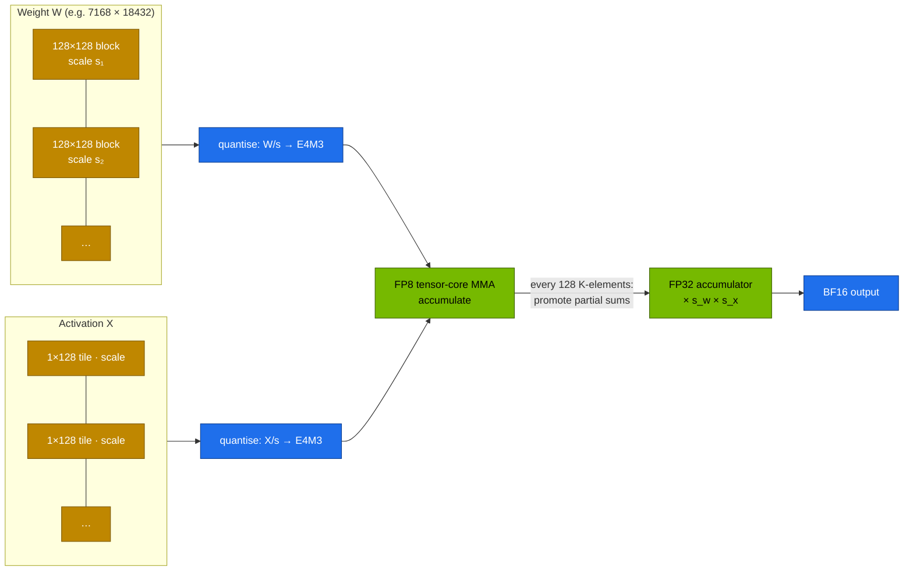

# Volume 04 — FP8 in Practice: Block Scaling, DeepSeek-V3's Training Recipe, and FP8 Serving on the GB10

> **Module 03 · Part I — Architecture** · Prev: [03 MTP](03-multi-token-prediction-mtp.md) · Next: [05 R1 & GRPO](05-deepseek-r1-and-grpo-reasoning.md)

| | |
|---|---|
| **You will build** | A measured understanding of why DeepSeek scales FP8 per 128×128 block and not per tensor. You'll benchmark FP8 vs BF16 matrix multiplies on the GB10's tensor cores, and serve the same 32B model in BF16 and FP8 to compare memory, speed and accuracy |
| **Hardware** | CPU for §5.1. spark-01 for §5.2–5.4 |
| **Time** | 75 min |
| **Risk** | None |
| **Lab files** | [`tools/fp8_blockscale.py`](lab/tools/fp8_blockscale.py), [`k8s/models/r1-32b`](lab/k8s/models/r1-32b/kustomization.yaml), [`k8s/models/r1-32b-fp8`](lab/k8s/models/r1-32b-fp8/kustomization.yaml), [`tools/eval_harness.py`](lab/tools/eval_harness.py) |

---

## 1. Why this matters on a Spark

Every halving of bytes per parameter halves weight memory **and** roughly doubles single-stream decode speed on a bandwidth-bound GPU. That makes number formats the most powerful knob on a GB10:

| Format | Bits | Exponent/mantissa | Range | Where you meet it |
|---|---|---|---|---|
| FP32 | 32 | 8/23 | huge | optimizer state, master weights |
| BF16 | 16 | 8/7 | same as FP32 | default training and serving |
| FP8 **E4M3** | 8 | 4/3 | ±448 | weights and activations (forward) |
| FP8 E5M2 | 8 | 5/2 | ±57,344 | gradients (wider range, less precision) |
| NVFP4 | 4 | 2/1 + an FP8 scale per 16 values | — | Blackwell 4-bit inference (GB10's 1 PFLOP figure is FP4 sparse) |

E4M3 can only represent about 18 binades (powers of two) of magnitude. LLM tensors have **outliers**: a handful of values hundreds or thousands of times larger than the rest. Scale the whole tensor so the largest fits, and the small values lose precision or underflow to zero. DeepSeek-V3 was the first frontier model trained mostly in FP8, and the key was **fine-grained scaling**.

---

## 2. Architecture — HLD



### 2.1 DeepSeek-V3's recipe, in five rules

| Rule | Why |
|---|---|
| Weights scaled per **128×128 block**, activations per **1×128 tile** | an outlier only damages its own block or tile |
| FP8 **E4M3 everywhere** (not E5M2 for gradients) | fine-grained scaling makes the extra mantissa bit worth more than the range |
| **Promote** partial sums to FP32 every 128 elements of K | Hopper's FP8 tensor-core accumulation keeps limited precision. Periodic promotion bounds error growth |
| Keep sensitive parts in BF16/FP32: embeddings, output head, MoE gates, norms, attention softmax | a small fraction of compute, a large share of numerical risk |
| Master weights, gradients for the optimizer and Adam moments in higher precision | the update step needs the precision |

The open-source pieces: **DeepGEMM** (Vol 07) implements exactly these block-scaled FP8 GEMMs, and the released V3/R1 weights are stored in this FP8 block format with `weight_scale_inv` tensors.

### 2.2 Serving formats you will actually use on a Spark

| Checkpoint style | Example | vLLM flag | Notes |
|---|---|---|---|
| FP8 **dynamic** (W8A8, per-channel weights, per-token activations computed on the fly) | `RedHatAI/DeepSeek-R1-Distill-Qwen-32B-FP8-dynamic` | auto-detected (`compressed-tensors`) | no calibration data needed. Catalog entry `r1-32b-fp8` |
| FP8 **block** (DeepSeek-native 128×128) | `deepseek-ai/DeepSeek-V3` | auto-detected | the format of the full V3/R1 checkpoints |
| AWQ / GPTQ INT4 | `Qwen/Qwen2.5-32B-Instruct-AWQ` | `--quantization awq_marlin` | 4-bit weights, BF16 activations |
| FP8 **KV cache** | any model | `--kv-cache-dtype fp8` | halves KV memory, small accuracy cost |

---

## 3. LLD

### 3.1 Error study (from `fp8_blockscale.py`, 1024×1024 weight, 16 outliers)

| Outlier size | Max/typical | Per-tensor: rel. error · flushed to 0 | 128×128 block: rel. error · flushed to 0 |
|---|---|---|---|
| 1 | 50 | 0.0266 · 0.0 % | 0.0265 · 0.0 % |
| 100 | 5,000 | 0.0265 · 0.9 % | 0.0264 · 0.2 % |
| 1,000 | 50,000 | **0.0630 · 8.7 %** | 0.0377 · 1.9 % |
| 5,000 | 250,000 | **0.3147 · 41.4 %** | 0.1491 · 9.1 % |

With modest outliers both work. Per-tensor scaling then **collapses** while blocks degrade gracefully. Real activations in long training runs do produce such outliers.

### 3.2 32B on one Spark: BF16 vs FP8

| | `r1-32b` (BF16) | `r1-32b-fp8` |
|---|---|---|
| Weights | 61.0 GiB | 30.5 GiB |
| `--gpu-memory-utilization` | 0.70 | 0.45 |
| KV budget → tokens (model_math) | 19.8 GiB → 80,952 | 20.4 GiB → 83,361 |
| Max context / seqs in the catalog | 16K / 16 | 32K / 32 |
| Room left for other services | little | bge-m3, Open WebUI, a tenant pod |

---

## 4. Integrations

- **Vol 07 (DeepGEMM)** is the kernel library behind this recipe.
- **Vol 12 (memory math)** and **Vol 15 (vLLM)** use the FP8 numbers to choose catalog settings.
- **Eval harness** answers the only question that matters about a quantised model: did accuracy on *your* tasks move?

---

## 5. Lab

### 5.1 Why blocks: the error sweep (CPU)

```bash
cd "03 DeepSeek/lab"
python3 tools/fp8_blockscale.py
```

Compare your output with §3.1. Then read `q_block`: it reshapes the matrix into `(M/128, 128, N/128, 128)`, takes the max per block, and stores one scale per block. That's the `weight_scale_inv` tensor you'll find in DeepSeek's checkpoint files.

### 5.2 FP8 vs BF16 GEMM on the GB10

```bash
kubectl apply -k . && kubectl apply -f k8s/jobs/gpu-probes.yaml   # if not already run in Vol 01/02
kubectl -n llm-serving logs job/gpu-probes | sed -n '/BF16 GEMM/,/FP8  GEMM/p'
```

Expected shape (**record yours**):

```text
NVIDIA GB10  cc=(12, 1)  n=8192
  BF16 GEMM :   …  TFLOPS
  FP8  GEMM :   …  TFLOPS  (≈1.5–2× BF16)
```

`torch._scaled_mm` with per-tensor scales exercises the FP8 tensor-core path. If it reports `unavailable`, the PyTorch build lacks FP8 kernels for sm_121. Use a newer NGC PyTorch image.

### 5.3 Serve the 32B in BF16, then FP8

```bash
scripts/serve-model.sh r1-32b
kubectl -n llm-serving port-forward svc/vllm 8000 &
python3 tools/eval_harness.py --url http://localhost:8000 --model r1-32b --out results/r1-32b-bf16.json
kill %1

scripts/serve-model.sh r1-32b-fp8
kubectl -n llm-serving port-forward svc/vllm 8000 &
python3 tools/eval_harness.py --url http://localhost:8000 --model r1-32b-fp8 --out results/r1-32b-fp8.json
python3 tools/eval_harness.py --report results/r1-32b-*.json
```

Fill in:

| | BF16 | FP8 |
|---|---|---|
| math / code / json accuracy | | |
| aggregate tok/s | | |
| `free -g` on the host while serving | | |
| vLLM `GPU KV cache size` (log) | | |

The usual outcome: accuracy within noise, about half the weight memory, faster single-stream decode.

### 5.4 FP8 KV cache

```bash
kubectl -n llm-serving patch deploy vllm --type json -p '[{"op":"add","path":"/spec/template/spec/containers/0/args/-","value":"--kv-cache-dtype=fp8"}]'
kubectl -n llm-serving rollout status deploy/vllm --timeout=30m
kubectl -n llm-serving logs deploy/vllm | grep -i 'KV cache size'
```

The KV token count roughly doubles. Re-run the eval to check accuracy. Restore with `scripts/serve-model.sh r1-32b-fp8`.

---

## 6. Verify

| Check | Expected |
|---|---|
| error sweep | per-tensor collapses (≥ 8 % flushed) at 50,000× outliers, blocks don't |
| GEMM probe | FP8 TFLOPS > BF16 TFLOPS on the GB10 |
| BF16 vs FP8 eval | accuracy difference within a few points. FP8 uses about half the weight memory |

---

## 7. Troubleshooting

| Symptom | Cause | Fix |
|---|---|---|
| `_scaled_mm … not supported on this device` | PyTorch build without sm_121 FP8 kernels | NGC PyTorch 25.09+ (or newer) built for DGX Spark |
| vLLM: `quantization method … not supported for capability 121` | quantisation backend not compiled for consumer Blackwell | newer vLLM image. Try another checkpoint format (FP8-dynamic vs AWQ) |
| FP8 model much worse on code/maths | aggressive activation quantisation, or a bad calibration on static checkpoints | prefer dynamic per-token FP8. Keep KV in BF16. Compare checkpoints with the harness |
| no memory saving | weights dequantised at load (fallback path) | log line `Loading weights took … GiB` should be ~half of BF16 |

---

## 8. Scale-out path

| One Spark | Datacenter |
|---|---|
| FP8 inference, FP8 KV | FP8 training at scale (DeepSeek-V3 recipe, Transformer Engine, MXFP8 on Blackwell datacenter GPUs) |
| NVFP4 checkpoints where available | NVFP4/MXFP4 inference on B200/GB200 with FP8 KV |
| one GEMM probe | per-layer numerics monitoring: amax histograms, outlier tracking, loss-spike alerts |

---

## 9. Checklist

- [ ] I can explain why per-tensor FP8 scaling fails with outliers, and what 128×128 blocks and 1×128 tiles change.
- [ ] I measured FP8 vs BF16 GEMM throughput on my GB10.
- [ ] I compared a BF16 and an FP8 checkpoint of the same model on accuracy, memory and speed.
- [ ] I know which parts of a model stay in high precision, and why.
