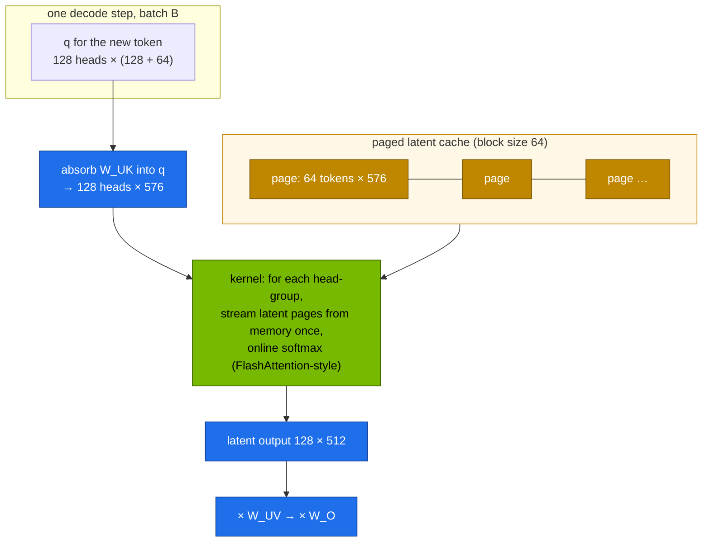

# Volume 06 — FlashMLA and MLA Decode Kernels: What the Kernel Does, What Runs on GB10, and How to Measure It

> **Module 03 · Part II — DeepSeek infrastructure** · Prev: [05 R1 & GRPO](05-deepseek-r1-and-grpo-reasoning.md) · Next: [07 DeepGEMM](07-deepgemm-fp8-library.md)

| | |
|---|---|
| **You will build** | A timed comparison of the two ways to run MLA at decode time: naive (rebuild K/V) and absorbed (attend on the latent). That comparison is the design decision FlashMLA is built around. You'll identify which MLA kernel vLLM picks on your GB10, switch backends, and measure decode throughput of DeepSeek-V2-Lite across batch sizes |
| **Hardware** | CPU for §5.1. spark-01 for §5.2–5.4 |
| **Time** | 60 min |
| **Risk** | None |
| **Lab files** | [`tools/mla_attention_demo.py`](lab/tools/mla_attention_demo.py) (`--decode-bench`), [`k8s/jobs/gpu-probes.yaml`](lab/k8s/jobs/gpu-probes.yaml), [`k8s/models/v2-lite`](lab/k8s/models/v2-lite/kustomization.yaml) |

---

## 1. Why this matters on a Spark

MLA (Vol 01) shrinks the cache. It only pays off at decode time if the kernel reads that small cache *as is*, instead of expanding it back into per-head keys and values for every cached token at every step. **FlashMLA** is DeepSeek's open-source CUDA kernel that does exactly this, with a paged latent cache, for Hopper (SM90) and later datacenter Blackwell (SM100).

The GB10 is compute capability **12.1** (sm_121), a different Blackwell variant from the datacenter B200 (SM100). Kernels compiled only for SM90/SM100 **don't run on it**. So on a Spark the practical questions are: which MLA implementation does my serving engine fall back to, and how fast is it?

---

## 2. Architecture — HLD



**Why it's fast:** decode is memory-bound. The absorbed form reads the latent cache once (576 values/token/layer) and shares it across all 128 heads. That raises arithmetic intensity enough to use tensor cores instead of being purely bandwidth-limited.

### 2.1 MLA backends you may see in vLLM

| Backend (names vary by vLLM version) | Hardware | Notes |
|---|---|---|
| `FLASHMLA` | SM90, SM100 | DeepSeek's kernel. Paged, block size 64 |
| `CUTLASS_MLA` | SM100 | NVIDIA CUTLASS implementation for datacenter Blackwell |
| `FLASHINFER_MLA` | depends on build | FlashInfer's MLA kernels |
| `TRITON_MLA` | **portable** | Triton-generated. The usual choice where the others aren't built: **expect this on GB10** |

Force one with `VLLM_ATTENTION_BACKEND=<name>`. vLLM refuses or falls back if it's unsupported, and the log says which happened.

---

## 3. LLD

### 3.1 The cost difference (CPU run of `--decode-bench`, V3 layer sizes)

| Form | What each step does | Time / layer (CPU, batch 2, 1,024 cached) |
|---|---|---|
| naive | rebuild K and V for every cached token (`c_kv × W_UK`, `c_kv × W_UV`), then attend | 467 ms |
| absorbed | 2 small projections of q and o, attend over 576-wide latents | **4.1 ms (≈115×)** |

The ratio grows with cache length: naive work is O(cache × r × heads × head_dim) **per step**, absorbed is O(cache × r × heads). On the GB10 the absolute numbers drop by orders of magnitude, but the ratio holds.

### 3.2 Decode throughput sweep

| Batch | What to expect on a bandwidth-bound GPU |
|---|---|
| 1 | limited by reading active weights (~2.4B params for V2-Lite) per token |
| 8–32 | throughput rises almost linearly. Weights are read once per step for all sequences |
| 64+ | KV reads and attention compute start to dominate. Gains flatten |

---

## 4. Integrations

- **Vol 01** proves the absorbed form is mathematically identical.
- **Vol 15** uses the same vLLM deployment. The backend choice is an env var on the container.
- **Module 07 Nvidia** (Nsight Systems/Compute) lets you open the chosen kernel and check whether it's memory- or compute-bound.

---

## 5. Lab

### 5.1 Naive vs absorbed (CPU, then GPU)

```bash
cd "03 DeepSeek/lab"
python3 tools/mla_attention_demo.py --decode-bench 1024 --batch 2
```

```text
decode step, batch 2, 1024 cached tokens, latent cache 4 MiB/layer
  naive (rebuild K/V each step):   467.28 ms/layer
  absorbed (attend on latent)  :     4.07 ms/layer   → 114.9× faster
```

On the Spark the GPU probe runs it at 8,192 cached tokens, batch 8, in BF16:

```bash
kubectl apply -k . && kubectl apply -f k8s/jobs/gpu-probes.yaml
kubectl -n llm-serving logs job/gpu-probes | sed -n '/decode step/,+2p'
```

**Record yours.** Expect milliseconds for absorbed versus tens to hundreds of milliseconds for naive.

### 5.2 Which MLA kernel does vLLM use on GB10?

```bash
scripts/serve-model.sh v2-lite
kubectl -n llm-serving logs deploy/vllm | grep -iE 'mla|attention backend|flash' | head
```

Write down the backend. If the log shows FlashMLA or CUTLASS MLA being skipped for capability 12.1, that's expected.

### 5.3 Try forcing a backend

```bash
kubectl -n llm-serving set env deploy/vllm VLLM_ATTENTION_BACKEND=FLASHMLA
kubectl -n llm-serving rollout status deploy/vllm --timeout=20m || kubectl -n llm-serving logs deploy/vllm | tail -20
kubectl -n llm-serving set env deploy/vllm VLLM_ATTENTION_BACKEND-          # back to automatic
```

An unsupported backend should fail fast with a clear message about compute capability, not crash mid-request. That's the behaviour you want to see before trusting a new image.

### 5.4 Decode throughput vs batch size

```bash
kubectl -n llm-serving port-forward svc/vllm 8000 &
for c in 1 4 16 32; do
  python3 tools/eval_harness.py --url http://localhost:8000 --model v2-lite --suites json math \
    --concurrency $c --temperature 0.3 --out results/v2lite-c$c.json | grep 'tok/s aggregate'
done
```

Plot tokens/s against concurrency (**record yours**). Compare with a dense 7B (`scripts/serve-model.sh qwen2.5-7b-tools`, same loop). The MoE with ~2.4B active should decode faster per stream than the dense 7B, despite having twice the total parameters.

---

## 6. Verify

| Check | Expected |
|---|---|
| decode bench | absorbed ≫ faster than naive, on CPU and GPU |
| vLLM log | an MLA backend named. You know whether it's Triton or a native kernel |
| sweep | aggregate tok/s rises with concurrency, then flattens |

---

## 7. Troubleshooting

| Symptom | Cause | Fix |
|---|---|---|
| `FlashMLA is only supported on … SM90/SM100` | GB10 is sm_121 | use the automatic choice (Triton MLA) |
| very low decode speed for V2-Lite | falling back to a non-MLA path that expands K/V | check the log. Use a newer vLLM with MLA support for your arch |
| building FlashMLA from source fails | `TORCH_CUDA_ARCH_LIST` doesn't include a supported arch | there's no supported arch on GB10. Don't fight it |
| probe OOM at large cache | the naive path materialises K/V for the whole cache | lower `--decode-bench` or `--batch`. The naive path is a deliberate worst case |

---

## 8. Scale-out path

| One Spark | Datacenter |
|---|---|
| Triton MLA on sm_121 | FlashMLA / CUTLASS MLA on H100/H200/B200. FP8 latent caches |
| one GPU holds the whole cache | data-parallel attention + expert-parallel MoE (V3 serving at scale), MLA cache sharded per DP rank |
| measure with the harness | per-kernel profiling with Nsight Compute (module 07) |

---

## 9. Checklist

- [ ] I can explain why decode kernels use the absorbed form and how much work it saves.
- [ ] I know which MLA backend runs on my GB10, and why FlashMLA doesn't.
- [ ] I measured decode throughput vs batch size for an MLA MoE and a dense model.
