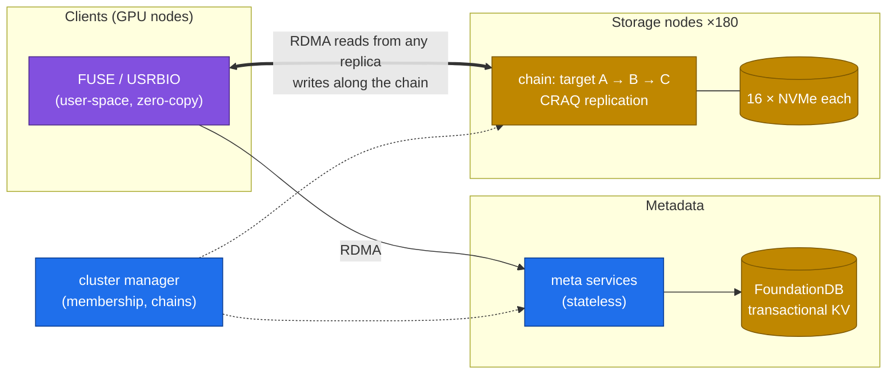
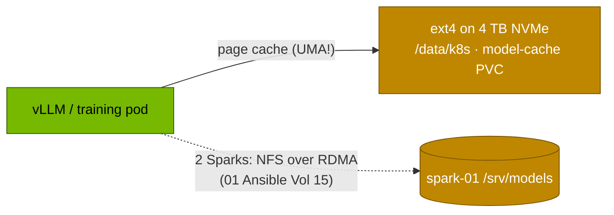

# Volume 10 — 3FS and the I/O Side of LLMs: What DeepSeek's File System Solves, Measured Against Your Spark's NVMe

> **Module 03 · Part II — DeepSeek infrastructure** · Prev: [09 EPLB](09-eplb-expert-parallelism-load-balancer.md) · Next: [11 R1-32B and Qwen-32B](11-deepseek-r1-32b-and-qwen-32b-models.md)

| | |
|---|---|
| **You will build** | An I/O budget for every LLM workload that touches storage (weight loading, checkpointing, data loading, KV-cache spill), measured on your Spark's NVMe and set against the published 3FS cluster figures. You'll know which problems a single box has and which only clusters have |
| **Hardware** | spark-01 |
| **Time** | 45 min |
| **Risk** | Low. fio writes scratch data on a PVC |
| **Lab files** | [`02 Kubernetes/lab/manifests/60-storage/fio-job.yaml`](../02%20Kubernetes/lab/manifests/60-storage/fio-job.yaml), [`scripts/serve-model.sh`](lab/scripts/serve-model.sh), [`tools/weights_verify.py`](lab/tools/weights_verify.py). Module [08 Storage](../08%20Storage/README.md) goes deeper |

---

## 1. What 3FS is, and why DeepSeek built it

**3FS (Fire-Flyer File System)** is DeepSeek's open-source distributed file system for AI clusters. It's built on SSDs and RDMA, with metadata in FoundationDB (a transactional key-value store) and **CRAQ** (chain replication with apportioned queries) for strongly consistent replication. Design choices that matter:

| Choice | Consequence |
|---|---|
| Disaggregated: storage nodes with many NVMe drives, clients anywhere on the RDMA network | aggregate bandwidth scales with storage nodes |
| Strong consistency (CRAQ) | applications don't need to reason about stale reads |
| **No client-side page cache**, direct I/O via a user-space shared-memory interface (USRBIO) | predictable, CPU-light reads for random-access training data |
| Stateless metadata services over FoundationDB | metadata scales out independently |

Published figure (3FS README): about **6.6 TiB/s aggregate read throughput** from 180 storage nodes (each with 2×200 Gb/s InfiniBand and 16×14 TiB NVMe) serving a training cluster's clients. DeepSeek uses it for training data loading, checkpoints, the KVCache for inference (reusing prefixes across requests from SSD instead of DRAM), and dataset preparation (GraySort).

---

## 2. Architecture — HLD



### 2.1 The Spark's equivalent



---

## 3. LLD: the I/O budget

| Workload | Pattern | Size | What limits it on a Spark | Cluster answer |
|---|---|---|---|---|
| Load weights at server start | large sequential reads, once | 15–66 GB | NVMe read bandwidth + page-cache pressure on UMA (02 Vol 11) | parallel FS, local cache, weights streamed over RDMA |
| Save a training checkpoint | large sequential writes | weights + optimizer (×3–6 of weights) | NVMe write bandwidth, etcd fsync contention (02 Vol 03) | async checkpoints to parallel FS (02 Vol 26) |
| Training data loader | random reads of shards | small–medium | random-read IOPS, CPU decode | 3FS random reads at TiB/s |
| KV-cache spill / reuse | random reads/writes of KV blocks | 30–256 KiB per token per model | on UMA, "offload to CPU memory" is the **same memory**, so only NVMe adds capacity | 3FS KVCache: prefix KV on SSD shared across nodes |

**Weight load time estimate:** `seconds ≈ weight_bytes / read_bandwidth`. 66 GB at 5 GB/s is about 13 s from a cold page cache. The real load time also includes deserialisation, CUDA graph capture and compilation, which often dominate.

---

## 4. Integrations

- **02 Vol 11** benchmarks the NVMe with AI-shaped fio profiles. This volume puts those numbers into LLM terms.
- **Vol 20** caches weights on NVMe (the `model-cache` PVC) so restarts never touch the internet.
- **Vol 33** verifies the cached bytes with sha256 manifests.
- **Module 08 Storage** covers parallel file systems (Weka, VAST, Lustre, GPFS), GPUDirect Storage and checkpoint engines in depth.

---

## 5. Lab

### 5.1 Measure the NVMe the way LLM workloads use it

```bash
cd "02 Kubernetes/lab"
kubectl apply -f manifests/60-storage/fio-job.yaml
kubectl -n lab-tools logs -f job/fio-ai | grep -E '^\S+:|READ:|WRITE:'
```

Record (**yours**):

| fio profile | Stands for | GB/s or IOPS |
|---|---|---|
| `weights-seqread-1m` | loading weights | |
| `checkpoint-seqwrite-1m` | saving a checkpoint | |
| `dataloader-randread-128k` | shuffled training shards | |
| `small-randread-4k` | KV-block / metadata access | |

### 5.2 Cold vs warm weight load

```bash
cd "../../03 DeepSeek/lab"
scripts/serve-model.sh r1-7b                      # drops page cache first → cold load
kubectl -n llm-serving logs deploy/vllm | grep -E 'Loading weights took|Model loading took|init engine'
kubectl -n llm-serving rollout restart deploy/vllm && kubectl -n llm-serving rollout status deploy/vllm --timeout=20m
kubectl -n llm-serving logs deploy/vllm | grep -E 'Loading weights took|Model loading took|init engine'   # warm
```

| | Cold (cache dropped) | Warm (page cache) | Predicted (size ÷ fio seq read) |
|---|---|---|---|
| Loading weights took | | | 15 GB ÷ … |
| total engine init | | | — |

The gap between "loading weights" and "engine init" is compilation and CUDA graph capture. Storage can't fix that part.

### 5.3 The UMA twist on KV offloading

Many engines can offload KV cache to "CPU memory". On a GB10, CPU and GPU memory are the **same** LPDDR5x pool, so offloading to CPU frees nothing. Only offloading to **NVMe** (e.g. via LMCache's disk backend) adds capacity, at NVMe latency. Work out the read time for one 16K-token R1-32B prefix (16384 × 256 KiB = 4 GiB) at your measured sequential read speed, and compare it with re-running prefill for 16K tokens (TTFT from Vol 08's needle test). That comparison tells you when SSD-backed KV reuse would pay off on your box.

---

## 6. Verify

| Check | Expected |
|---|---|
| fio summary | four numbers recorded |
| cold vs warm | warm weight load measurably faster. Engine init dominated by non-I/O work |
| KV offload calculation | you can say whether NVMe KV reuse beats recompute for your model and prefix length |

---

## 7. Troubleshooting

| Symptom | Cause | Fix |
|---|---|---|
| cold load much slower than fio predicts | many small files, safetensors deserialisation on CPU, CPU throttled by the pod limit | check the pod's CPU limit (02 Vol 12). Larger shards. Prefer safetensors |
| warm load not faster | page cache evicted by other workloads (UMA pressure) | `free -g`, `scripts/uma-watch.sh` (02) |
| fio p99 latency spikes | competing writers (checkpoints, image pulls) | schedule heavy I/O off-peak. `ionice` |

---

## 8. Scale-out path

| Spark(s) | Cluster |
|---|---|
| local NVMe + NFS-RDMA between 2 Sparks | 3FS / Weka / VAST / Lustre over IB or RoCE |
| page-cache-based loads | direct I/O, GPUDirect Storage, weight streaming |
| no KV reuse across restarts | SSD-backed KV caches (3FS KVCache, LMCache, Mooncake) shared across a fleet |

---

## 9. Checklist

- [ ] I can describe 3FS's architecture (CRAQ chains, FoundationDB metadata, RDMA clients, no page cache) and the problems it targets.
- [ ] I measured my NVMe in LLM terms and predicted weight-load time.
- [ ] I can explain why CPU offload of KV cache does nothing on a UMA GB10.
