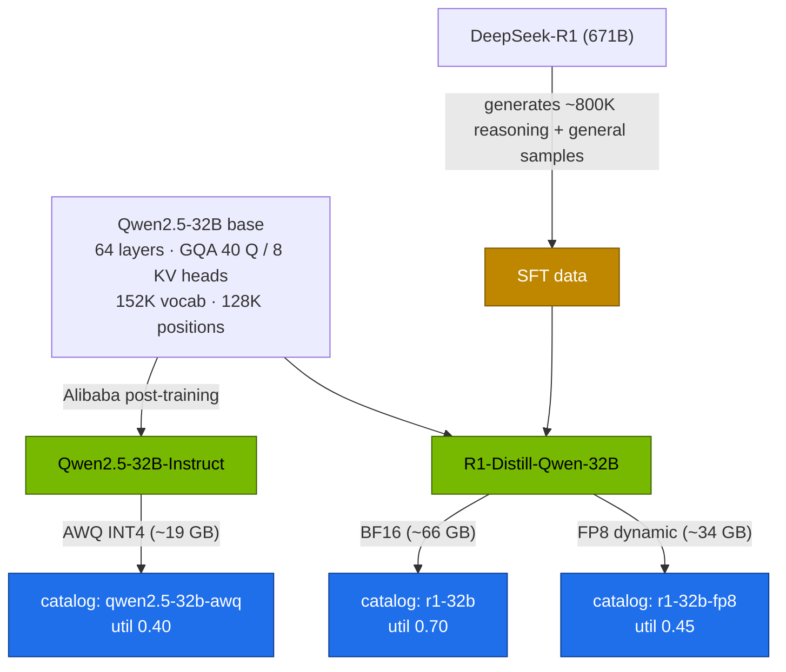

# Volume 11 — R1-Distill-Qwen-32B vs Qwen2.5-32B: Choosing, Serving and Comparing the 32B Sweet Spot

> **Module 03 · Part III — Models & memory** · Prev: [10 3FS](10-3fs-fire-flyer-file-system.md) · Next: [12 Memory math](12-memory-math-for-30b-32b-on-gb10.md)

| | |
|---|---|
| **You will build** | A data-backed choice between a 32B reasoning model and a 32B instruction model on one Spark. You'll serve each in a memory-efficient format (FP8, AWQ), run the same evaluation suites, and compare accuracy, tokens spent, latency and cost per task |
| **Hardware** | spark-01 |
| **Time** | 2 h (mostly downloads and eval runs) |
| **Risk** | None |
| **Lab files** | [`models.yaml`](lab/models.yaml) (`r1-32b`, `r1-32b-fp8`, `qwen2.5-32b-awq`), [`scripts/serve-model.sh`](lab/scripts/serve-model.sh), [`tools/eval_harness.py`](lab/tools/eval_harness.py), [`tools/model_math.py`](lab/tools/model_math.py) |

---

## 1. Why 32B on a Spark

The 32B class is the largest dense model that fits one GB10 comfortably in BF16 and runs with real concurrency in FP8 or INT4. It's also where reasoning distillation pays off most among the R1 distills.

| Model | Base | Training | Licence | Strength |
|---|---|---|---|---|
| **DeepSeek-R1-Distill-Qwen-32B** | Qwen2.5-32B | SFT on ~800K samples generated by DeepSeek-R1 (no RL) | MIT (base model Apache 2.0) | maths, code, multi-step reasoning. Long outputs |
| **Qwen2.5-32B-Instruct** | Qwen2.5-32B | Alibaba's SFT + RLHF | Apache 2.0 | instruction following, tool calling, structured output, multilingual. Short outputs |

Same architecture, same tokenizer, same memory math: 64 layers, 8 KV heads × 128, 32.8B parameters. The difference is behaviour.

---

## 2. Architecture — HLD



---

## 3. LLD

### 3.1 Catalog entries

| Name | HF repo | Weights | util | Context / seqs | Extra flags |
|---|---|---|---|---|---|
| `r1-32b` | deepseek-ai/DeepSeek-R1-Distill-Qwen-32B | ~66 GB | 0.70 | 16K / 16 | `--reasoning-parser=deepseek_r1` |
| `r1-32b-fp8` | RedHatAI/DeepSeek-R1-Distill-Qwen-32B-FP8-dynamic | ~34 GB | 0.45 | 32K / 32 | `--reasoning-parser=deepseek_r1` |
| `qwen2.5-32b-awq` | Qwen/Qwen2.5-32B-Instruct-AWQ | ~19 GB | 0.40 | 32K / 32 | `--quantization=awq_marlin` |

### 3.2 Sampling settings

| | R1 distill | Qwen2.5-Instruct |
|---|---|---|
| temperature / top_p | 0.6 / 0.95 | 0.7 / 0.8 (Qwen's generation_config) |
| system prompt | avoid. Instructions in the user turn | normal |
| `max_tokens` | 4K–32K (thinking) | 512–2K |
| tool calling | weak (not trained for it) | `--enable-auto-tool-choice --tool-call-parser hermes` |

---

## 4. Integrations

- **LiteLLM (Vol 28)** exposes both behind aliases (`reasoning` → R1, a fast instruct alias → Qwen). Clients pick by task.
- **Vol 12** derives the util and context numbers.
- **Vol 34–37** extend the same comparison to Llama, Mistral and closed models.

---

## 5. Lab

### 5.1 Predict memory before downloading

```bash
cd "03 DeepSeek/lab"
python3 tools/model_math.py deepseek-r1-distill-qwen-32b --util 0.70 --ctx 16384
python3 tools/model_math.py deepseek-r1-distill-qwen-32b --dtype fp8 --util 0.45 --ctx 32768
python3 tools/model_math.py qwen2.5-32b --dtype awq --util 0.40 --ctx 32768
```

### 5.2 Serve and evaluate each

```bash
mkdir -p results
for m in r1-32b-fp8 qwen2.5-32b-awq; do
  scripts/serve-model.sh $m
  kubectl -n llm-serving port-forward svc/vllm 8000 >/dev/null & pf=$!; sleep 3
  temp=$([ $m = r1-32b-fp8 ] && echo 0.6 || echo 0.7)
  python3 tools/eval_harness.py --url http://localhost:8000 --model $m --temperature $temp \
    --max-tokens 8192 --concurrency 8 --out results/$m.json
  kill $pf
done
python3 tools/eval_harness.py --report results/r1-32b-fp8.json results/qwen2.5-32b-awq.json
```

Fill in (**record yours**):

| | r1-32b-fp8 | qwen2.5-32b-awq |
|---|---|---|
| math acc | | |
| code acc | | |
| json acc | | |
| mean output tokens | | |
| reasoning share | | |
| p50 latency per math item | | |
| aggregate tok/s | | |

### 5.3 Turn it into a routing rule

From your table, write the routing rule your gateway will use, for example: *multi-step maths/code → R1; extraction, JSON, tools, chit-chat → Qwen*. Vol 28 implements it as LiteLLM aliases.

### 5.4 (Optional) BF16 vs FP8 of the same model

```bash
scripts/serve-model.sh r1-32b          # BF16, uses ~0.70 of the box
```

Re-run the math suite and compare with `r1-32b-fp8` (Vol 04 §5.3 has the full procedure).

---

## 6. Verify

| Check | Expected |
|---|---|
| both models serve | `scripts/serve-model.sh` ends with `answer: 144` |
| report table | 3 suites × 2 models filled in |
| routing rule | written down, with the numbers that justify it |

---

## 7. Troubleshooting

| Symptom | Cause | Fix |
|---|---|---|
| AWQ model fails to load: `awq_marlin not supported` | kernel not built for sm_121 | try `--quantization awq`, or the FP8 variant of Qwen2.5-32B |
| R1 scores low on JSON | reasoning text leaks into content, or it wraps JSON in prose | reasoning parser on (drill D01). The harness extracts the first `{…}`. Use Qwen for JSON |
| R1 math items time out | long chains at concurrency 8 | raise `--max-tokens`. Lower concurrency. Check `ReasoningTruncated` |
| harness 404 | wrong model name (drill D08) | use the catalog name (`--served-model-name`) |

---

## 8. Scale-out path

| One Spark | More |
|---|---|
| one 32B at a time | two Sparks: one model each, LiteLLM routes. Or 70B FP8 with tensor parallelism (Vol 14) |
| manual eval | continuous evaluation on every model or engine change (Vol 33, 40) |

---

## 9. Checklist

- [ ] I can explain how R1-Distill-Qwen-32B and Qwen2.5-32B-Instruct differ despite identical architecture.
- [ ] I served both in a memory-efficient format and measured them on the same suites.
- [ ] I wrote a task-based routing rule backed by my own numbers.
