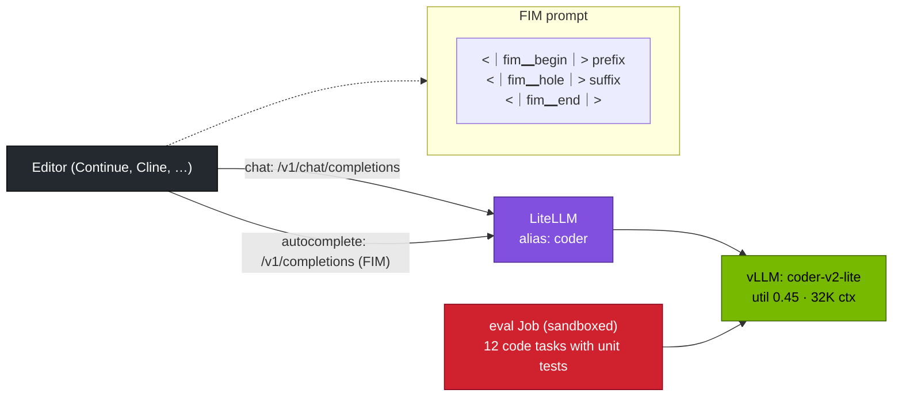

# Volume 13 — DeepSeek-Coder-V2-Lite and Maths Reasoning: Code Completion, Fill-in-the-Middle and Measured Accuracy

> **Module 03 · Part III — Models & memory** · Prev: [12 Memory math](12-memory-math-for-30b-32b-on-gb10.md) · Next: [14 V3/R1 671B](14-deepseek-v3-671b-moe-sharding.md)

| | |
|---|---|
| **You will build** | A local coding assistant backend: DeepSeek-Coder-V2-Lite (16B MoE, ~2.4B active) serving chat *and* fill-in-the-middle completions. You'll evaluate it against an R1 reasoning distill and a general instruct model on the lab's unit-tested code tasks and maths problems, and wire it into an editor through LiteLLM |
| **Hardware** | spark-01 |
| **Time** | 90 min |
| **Risk** | The code suite executes model-written Python. It runs in a sandboxed Job (`k8s/jobs/eval.yaml`), not on your laptop |
| **Lab files** | [`k8s/models/coder-v2-lite`](lab/k8s/models/coder-v2-lite/kustomization.yaml), [`data/code_tasks.jsonl`](lab/data/code_tasks.jsonl), [`data/math_word.jsonl`](lab/data/math_word.jsonl), [`tools/eval_harness.py`](lab/tools/eval_harness.py), [`k8s/jobs/eval.yaml`](lab/k8s/jobs/eval.yaml) |

---

## 1. Why this matters on a Spark

Code completion is latency-critical (an editor waits on every keystroke) and runs all day. That makes it a natural workload to keep local:

| Model | Type | Active params | Why use it |
|---|---|---|---|
| **DeepSeek-Coder-V2-Lite-Instruct** | MLA + DeepSeekMoE, 16B total | ~2.4B | fast (decodes like a ~3B model), FIM-trained, 128K context, 338 programming languages per its model card |
| R1-Distill-Qwen-7B/32B | dense reasoning | 7.6/32.8B | harder algorithmic problems, at the cost of long thinking |
| Qwen2.5-7B-Instruct | dense instruct | 7.6B | balanced chat/tools. A good non-reasoning baseline |

For maths, DeepSeek's earlier DeepSeek-Math-7B (where GRPO was introduced) has been overtaken by the R1 distills, which are the maths models to serve today.

---

## 2. Architecture — HLD



---

## 3. LLD

### 3.1 Serving settings

| Setting | Value | Note |
|---|---|---|
| catalog name | `coder-v2-lite` | |
| util / context / seqs | 0.45 / 32K / 32 | MLA keeps KV tiny: ~30 KiB/token |
| `--trust-remote-code` | on | DeepSeek-V2 architecture code |
| chat endpoint | `/v1/chat/completions` | instruct template from the tokenizer |
| FIM endpoint | `/v1/completions` with the raw FIM prompt | no chat template |
| sampling | temperature 0–0.2 for completion, ~0.3 for chat | determinism matters in editors |

### 3.2 The code suite

12 original tasks (`data/code_tasks.jsonl`), each a function spec plus `assert` tests, for example `parse_quantity('6Gi') == 6 * 2**30` or `kv_cache_bytes(28, 4, 128, 1) == 57344`. The harness extracts the fenced code block, runs it with the tests in an isolated subprocess (10 s timeout) and counts passes.

---

## 4. Integrations

- **LiteLLM (Vol 28):** add a `coder` alias. Editors point at `http://api.lab.local/v1` with the LiteLLM key.
- **Kubernetes sandbox:** `k8s/jobs/eval.yaml` runs as non-root with no capabilities, a read-only root filesystem and no ServiceAccount token. That's the minimum for executing untrusted code.
- **Vol 30** uses the same models for tool calling, where Qwen is the stronger choice.

---

## 5. Lab

### 5.1 Serve Coder-V2-Lite and try chat and FIM

```bash
cd "03 DeepSeek/lab"
scripts/serve-model.sh coder-v2-lite
kubectl -n llm-serving port-forward svc/vllm 8000 &
python3 - <<'PY'
import json, urllib.request
def post(path, body):
    r = urllib.request.Request("http://localhost:8000" + path, json.dumps(body).encode(), {"Content-Type": "application/json"})
    return json.load(urllib.request.urlopen(r, timeout=300))
prefix = "def kv_cache_bytes(layers, kv_heads, head_dim, tokens, bytes_per_elem=2):\n    \"\"\"KV cache size of a GQA model.\"\"\"\n"
suffix = "\n\nprint(kv_cache_bytes(28, 4, 128, 1))\n"
fim = "<｜fim▁begin｜>" + prefix + "<｜fim▁hole｜>" + suffix + "<｜fim▁end｜>"
out = post("/v1/completions", {"model": "coder-v2-lite", "prompt": fim, "max_tokens": 64, "temperature": 0})
print("FIM middle →", repr(out["choices"][0]["text"]))
PY
```

Expected: a middle like `    return 2 * layers * kv_heads * head_dim * tokens * bytes_per_elem`. The model fills the hole using both the prefix and the suffix.

### 5.2 Evaluate three models on code and maths (sandboxed)

```bash
kubectl apply -k .
for m in coder-v2-lite r1-7b qwen2.5-7b-tools; do
  scripts/serve-model.sh $m
  kubectl -n llm-serving delete job eval --ignore-not-found
  yq "(.spec.template.spec.containers[0].args) = [\"--url\",\"http://vllm.llm-serving:8000\",\"--model\",\"$m\",\"--suites\",\"code\",\"math\",\"--concurrency\",\"8\",\"--max-tokens\",\"8192\"]" k8s/jobs/eval.yaml | kubectl apply -f -
  kubectl -n llm-serving wait --for=condition=complete job/eval --timeout=60m
  echo "== $m"; kubectl -n llm-serving logs job/eval | grep -E '^(math|code)|tok/s'
done
```

| Model | code (/12) | math (/40) | mean output tokens | tok/s |
|---|---|---|---|---|
| coder-v2-lite | | | | |
| r1-7b | | | | |
| qwen2.5-7b-tools | | | | |

**Record yours.** A typical pattern: the coder model is fastest with solid code scores, the reasoning model is strongest on maths and slowest, and the instruct model sits in between.

### 5.3 Wire it into an editor

Add an alias to LiteLLM (Vol 28 shows the full config):

```yaml
- model_name: coder
  litellm_params: {model: hosted_vllm/coder-v2-lite, api_base: http://vllm.llm-serving:8000/v1, api_key: none}
```

Then configure your editor's OpenAI-compatible provider: base URL `http://api.lab.local/v1`, model `coder`, and the LiteLLM key.

---

## 6. Verify

| Check | Expected |
|---|---|
| FIM | a plausible one-line body. `print` would output 57344 |
| eval Job | completes. Results for all three models recorded |
| sandbox | `kubectl -n llm-serving get pod -l job-name=eval -o jsonpath='{.items[0].spec.automountServiceAccountToken}'` → `false` |

---

## 7. Troubleshooting

| Symptom | Cause | Fix |
|---|---|---|
| FIM returns chat-style prose | sent to `/v1/chat/completions`, or the special tokens were mangled (ASCII `|` instead of `｜`) | raw `/v1/completions` and the exact tokens from the tokenizer config |
| code accuracy 0 for one model | it doesn't fence code. The extractor falls back to the whole reply | check `errors` in the result JSON. Adjust the system prompt |
| eval Job `OOMKilled` | runaway model code | limits in the Job (1 GiB) did their job. That item counts as failed |
| `trust_remote_code` errors | transformers/vLLM version mismatch for DeepSeek-V2 code | use the pinned NGC vLLM image |

---

## 8. Scale-out path

| One Spark | Team scale |
|---|---|
| one coder model shared by your editors | dedicated small model for autocomplete (low latency) plus a large model for chat/agents, routed by LiteLLM |
| 12 local tests | your own repository's tests as the eval set. Track pass@1 per model version |

---

## 9. Checklist

- [ ] I served a code model with both chat and FIM completions.
- [ ] I compared code and maths accuracy across three model types in a sandboxed Job.
- [ ] My editor uses the local model through the gateway.
