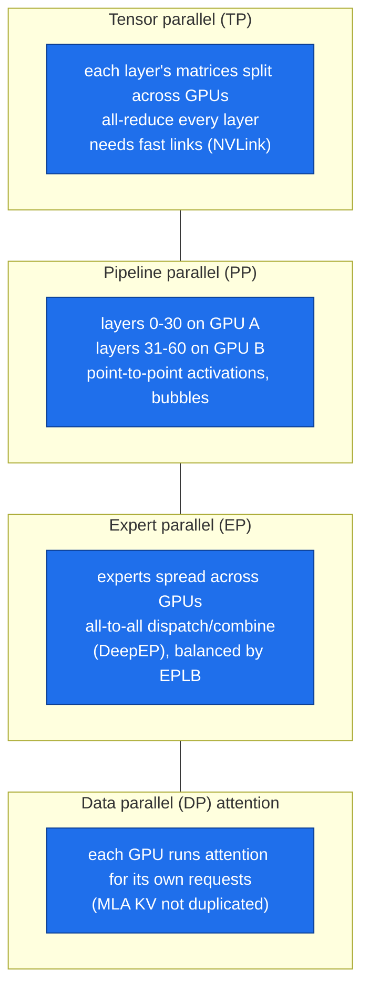
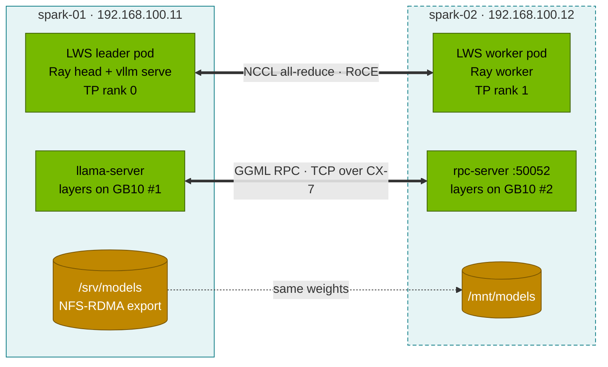

# Volume 14 — DeepSeek-V3/R1 671B: Sharding Strategies, What Two Sparks Can Run, and Tensor Parallelism over CX-7

> **Module 03 · Part III — Models & memory** · Prev: [13 Coder & maths](13-deepseek-coder-v2-and-math-models.md) · Next: [15 vLLM serving](15-vllm-serving-deepseek-and-qwen.md)

| | |
|---|---|
| **You will build** | A sizing plan for the full 671B model on any hardware. On two Sparks joined by the CX-7 cable, you'll run (a) a 70B reasoning model with **tensor parallelism** via LeaderWorkerSet + Ray + vLLM, and (b) the actual **DeepSeek-R1 671B** in a 1.58-bit dynamic GGUF split across both GB10s with llama.cpp RPC |
| **Hardware** | CPU for §5.1. **2 Sparks** + QSFP cable + NFS-RDMA model share (01 Ansible Vol 15) for §5.2–5.4 |
| **Time** | 3 h (downloads: ~71 GB and ~131 GB) |
| **Risk** | Medium. Both Sparks fully loaded. Use the `llm-multinode` namespace (hostNetwork) |
| **Lab files** | [`tools/model_math.py`](lab/tools/model_math.py), [`k8s/multinode/`](lab/k8s/multinode/) (`namespace.yaml`, `lws-vllm-70b.yaml`), [`k8s/llamacpp/`](lab/k8s/llamacpp/) (`Dockerfile`, `rpc-2spark.yaml`) |

---

## 1. Why this matters

DeepSeek-V3 and R1 have 671B parameters (37B active). Their native FP8 weights alone are ~625 GiB, five times what one Spark holds and more than two. You can't serve them as-is on Sparks. You can learn every sharding technique they need, and with aggressive quantisation you can run R1 itself across two Sparks.

| Hardware | Memory | DeepSeek-V3/R1 FP8 (625 GiB)? | What fits |
|---|---|---|---|
| 1 Spark | ~120 GiB | ❌ | 32B BF16, 70B FP8 (tight), 16B MoE |
| **2 Sparks** | ~240 GiB | ❌ (FP8) / ✅ **1.58-bit GGUF (~131 GB)** | 70B FP8 with TP=2 and room for KV. R1 671B at very low bit-width |
| 8× H200 (141 GB) | 1.1 TB | ✅ | V3/R1 FP8, TP=8 + EP |
| 8× B200 (180 GB) | 1.4 TB | ✅ | V3/R1 FP8/FP4 |
| DeepSeek's production | many nodes | ✅ | prefill/decode disaggregated, EP32 prefill / EP144 decode, data-parallel MLA attention |

---

## 2. Architecture — the parallelism menu (HLD)



| Strategy | Traffic per token | Suits the CX-7 (200 Gb/s, ~µs) link? |
|---|---|---|
| TP=2 | 2 all-reduces of hidden size per layer | OK for 70B at modest batch. Latency-sensitive |
| PP=2 | one activation hand-off per micro-batch per stage | yes. Lower bandwidth need, pipeline bubbles |
| EP | all-to-all of routed tokens per MoE layer | fine at 2 nodes. The pattern V3 needs at scale |
| llama.cpp RPC | layers offloaded to a remote GGML backend (PP-like) | yes. Simple, slow-ish, works for 671B |

### 2.1 What runs in this lab



---

## 3. LLD

### 3.1 Sizing (from `model_math.py`)

| Plan | Weights | Verdict |
|---|---|---|
| V3/R1 FP8 on 2 Sparks | 624.9 GiB | ✗ |
| V3/R1 INT4 on 2 Sparks | 312.5 GiB | ✗ |
| V3/R1 IQ1_S (1.58-bit dynamic) on 2 Sparks, util 0.92 | ~123 GiB | ✓ (llama.cpp, not vLLM) |
| R1-Distill-Llama-70B FP8, TP=2, util 0.60 | 65.7 GiB total (≈33 GiB per Spark) | ✓, 235K KV tokens |
| R1-Distill-Llama-70B FP8 on **one** Spark, util 0.65 | 65.7 GiB | ✓ but only ~30K KV tokens |

### 3.2 `lws-vllm-70b.yaml`

| Piece | Setting |
|---|---|
| Group | `size: 2`, `RecreateGroupOnPodRestart`: if either pod dies, both restart (TP ranks can't survive alone) |
| Network | `hostNetwork: true`, `NCCL_SOCKET_IFNAME=enp1s0f1np1`, `NCCL_IB_HCA=rocep1s0f1,roceP2p1s0f1`, GID 3, `IPC_LOCK` |
| Ray | head on 192.168.100.11, worker joins over CX-7. vLLM `--distributed-executor-backend ray` |
| Model | `RedHatAI/DeepSeek-R1-Distill-Llama-70B-FP8-dynamic`, `--tensor-parallel-size 2`, util 0.60, 16K |
| Weights | NFS-RDMA share: `/srv/models` on spark-01, `/mnt/models` on spark-02 |

### 3.3 `rpc-2spark.yaml`

| Piece | Setting |
|---|---|
| spark-02 | `rpc-server --host 192.168.100.12 --port 50052`. Exposes its GB10 as a remote GGML backend |
| spark-01 | `llama-server -m …UD-IQ1_S-00001-of-00003.gguf --rpc 192.168.100.12:50052 -ngl 999 -c 8192` |
| Image | built on the Spark from `k8s/llamacpp/Dockerfile` (`CMAKE_CUDA_ARCHITECTURES=121`, `GGML_RPC=ON`) and imported into k3s |

---

## 4. Integrations

- **01 Ansible**: `02-fabric.yml` (CX-7), `11-rdma-perftest.yml` (≥ 180 Gb/s gate), `09-nfs-rdma.yml` (weights share), `05-k3s.yml` (spark-02 joins as agent).
- **02 Vol 17**: the NCCL environment and the bandwidth you should see.
- **LiteLLM (Vol 28)**: add `r1-70b` and `r1-671b-iq1` as aliases once they're up.

---

## 5. Lab

### 5.1 Plan on paper (CPU)

```bash
cd "03 DeepSeek/lab"
python3 tools/model_math.py deepseek-v3 --dtype fp8 --sparks 2
python3 tools/model_math.py deepseek-v3 --dtype iq1_s --util 0.92 --sparks 2 --ctx 8192
python3 tools/model_math.py deepseek-r1-distill-llama-70b --dtype fp8 --util 0.60 --sparks 2 --ctx 16384
python3 tools/model_math.py deepseek-r1-distill-llama-70b --dtype fp8 --util 0.65
```

How many 8-GPU H200 nodes would V3 FP8 need with 128K context for 32 concurrent users? (Weights 625 GiB + 32 × 131072 × 68.6 KiB ≈ 274 GiB of KV ≈ 900 GiB. One 8×H200 node has ~1.05 TiB of HBM, so one node, just.)

### 5.2 Preconditions (2 Sparks)

```bash
kubectl get nodes -o wide                                              # spark-01 + spark-02 Ready
kubectl apply --server-side -f https://github.com/kubernetes-sigs/lws/releases/download/v0.7.0/manifests.yaml
kubectl apply -f k8s/multinode/namespace.yaml
ssh nvidia@192.168.0.101 'mount | grep /mnt/models'                       # NFS-RDMA from spark-01
```

### 5.3 70B with tensor parallelism over CX-7

```bash
# weights into the shared export once (on spark-01; `hf` comes from: pip install --user "huggingface_hub[cli]")
ssh nvidia@192.168.0.100 'hf download RedHatAI/DeepSeek-R1-Distill-Llama-70B-FP8-dynamic --cache-dir /srv/models/hf'
kubectl apply -f k8s/multinode/lws-vllm-70b.yaml
kubectl -n llm-multinode get pods -o wide -w                           # vllm-70b-0 (leader, spark-01), vllm-70b-0-1 (worker, spark-02)
kubectl -n llm-multinode logs -f vllm-70b-0 | grep -E 'NCCL INFO (NET/IB|Using network)|tensor_parallel|Uvicorn'
```

Then from spark-01: `curl -s 192.168.100.11:8000/v1/models`, and run the eval harness against it with `--model r1-70b`. Record tokens/s at concurrency 1 and 16. Compare with the same model on **one** Spark (util 0.65, 8K context) to see what TP buys you (KV capacity) and costs you (per-token communication).

### 5.4 DeepSeek-R1 671B at 1.58 bit across two Sparks

```bash
# 1. build llama.cpp for sm_121 on BOTH Sparks and import into k3s
for h in 192.168.0.100 192.168.0.101; do
  scp k8s/llamacpp/Dockerfile nvidia@$h:/tmp/ && ssh nvidia@$h \
   'cd /tmp && docker build -t spark-local/llama.cpp:server-sm121 . && docker save spark-local/llama.cpp:server-sm121 | sudo k3s ctr images import -'
done
# 2. weights (~131 GB) into the share
ssh nvidia@192.168.0.100 'sudo mkdir -p /srv/models/gguf && sudo chown nvidia /srv/models/gguf && \
  hf download unsloth/DeepSeek-R1-GGUF --include "DeepSeek-R1-UD-IQ1_S/*" --local-dir /srv/models/gguf'
# 3. run
kubectl -n llm-multinode scale lws vllm-70b --replicas=0 2>/dev/null
kubectl apply -f k8s/llamacpp/rpc-2spark.yaml
kubectl -n llm-multinode logs -f deploy/llama-r1-671b | grep -E 'RPC|offloaded|model size|server is listening'
curl -s 192.168.100.11:8081/v1/chat/completions -d '{"model":"r1-671b-iq1","messages":[{"role":"user","content":"What is 17*23? Think briefly."}],"max_tokens":512}' | jq -r '.choices[0].message.content' | tail -3
curl -s 192.168.100.11:8081/metrics | grep -E 'tokens_predicted_seconds|prompt_tokens_seconds'
```

**Record yours:** prompt tok/s and generation tok/s. Expect single-digit generation tokens per second. It's the real 671B R1 reasoning on desk-side hardware, not a production server. Use it to compare answer quality with the distills on a handful of hard maths items.

---

## 6. Verify

| Check | Expected |
|---|---|
| LWS group | 2 pods on 2 nodes. Leader log `Using network IB` and TP=2 |
| 70B served | `/v1/models` lists `r1-70b`. Eval runs |
| 671B RPC | llama-server log shows layers offloaded to both CUDA0 and the RPC device. A coherent answer |

---

## 7. Troubleshooting

| Symptom | Cause | Fix |
|---|---|---|
| leader waits forever for `/2.0 GPU` | worker can't reach the Ray head on 6379 | worker log. ufw. Both pods on hostNetwork |
| NCCL falls back to sockets | RDMA devices or IPC_LOCK missing | 02 Vol 17 §7 |
| worker OOM while loading | each rank loads its shard plus temporary buffers | lower util. Drop page cache on both Sparks |
| llama.cpp: `failed to connect to RPC server` | rpc-server not listening on the CX-7 IP | worker pod log. Pod on spark-02 (nodeSelector). Port 50052 open |
| llama.cpp very slow (< 1 tok/s) | weights paged from NFS instead of resident | ensure enough free memory on both Sparks. Watch `free -g` during load |
| `PodSecurity … hostNetwork` rejected | applied into `llm-serving` | use `llm-multinode` (privileged PSA) |

---

## 8. Scale-out path

| Two Sparks | Datacenter |
|---|---|
| TP=2 over one 200 Gb/s link | TP within an NVLink domain (8 GPUs), PP/EP across nodes |
| llama.cpp RPC for 671B | vLLM/SGLang with EP + DP attention + MTP + PD disaggregation on H200/B200 |
| LWS group of 2 | LWS groups per replica, many replicas behind an inference gateway |

---

## 9. Checklist

- [ ] I can size V3/R1 for any GPU and format, including KV for a target context and user count.
- [ ] I can explain TP, PP, EP and DP-attention and what each sends over the network.
- [ ] I ran a 70B model with TP=2 across two Sparks and measured the trade-off.
- [ ] I ran DeepSeek-R1 671B itself, quantised, across two GB10s.
