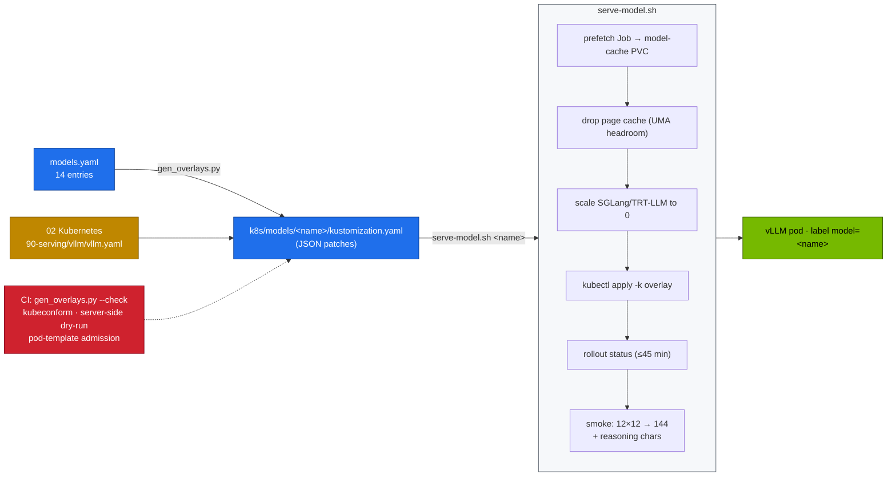

# Volume 15 — Serving DeepSeek and Qwen with vLLM: Catalog-Driven Deployments, Parsers, Benchmarks and Drills

> **Module 03 · Part IV — Serving engines** · Prev: [14 V3/R1 671B](14-deepseek-v3-671b-moe-sharding.md) · Next: [16 SGLang](16-sglang-and-radix-attention-serving.md)

| | |
|---|---|
| **You will build** | A model catalog that drives every vLLM deployment: one YAML entry per model generates a kustomize overlay of the 02 platform's vLLM Deployment. A one-command model switch with smoke test, the parsers that make R1 and tool calling work, a throughput/latency benchmark per model, and three serving drills |
| **Hardware** | spark-01 |
| **Time** | 90 min |
| **Risk** | Low |
| **Lab files** | [`models.yaml`](lab/models.yaml), [`scripts/gen_overlays.py`](lab/scripts/gen_overlays.py), [`k8s/models/`](lab/k8s/models/), [`scripts/serve-model.sh`](lab/scripts/serve-model.sh), [`02 …/90-serving/vllm/vllm.yaml`](../02%20Kubernetes/lab/manifests/90-serving/vllm/vllm.yaml), [`breakfix/`](lab/breakfix/) D01–D03 |

---

## 1. Why a catalog

Every model needs slightly different flags: memory fraction, context, parsers, `trust-remote-code`, quantisation. Hand-editing a Deployment per model drifts quickly. The lab keeps **one source of truth** (`models.yaml`), **generates** the overlays (`gen_overlays.py`), and **checks in CI** that the committed overlays match (`gen_overlays.py --check`). The base Deployment (02 Vol 21) supplies probes, graceful drain, `Recreate` strategy, `/dev/shm`, the model-cache PVC and metrics.

---

## 2. Architecture — HLD



---

## 3. LLD

### 3.1 The catalog (`models.yaml`)

| Name | HF repo | util | max len | Extra args | Use |
|---|---|---|---|---|---|
| r1-1.5b | deepseek-ai/DeepSeek-R1-Distill-Qwen-1.5B | 0.15 | 16K | reasoning parser | fastest reasoner. Speculative draft |
| r1-7b | …-Qwen-7B | 0.30 | 32K | reasoning parser | everyday reasoning |
| r1-32b | …-Qwen-32B | 0.70 | 16K | reasoning parser, 16 seqs | best single-Spark quality (BF16) |
| r1-32b-fp8 | RedHatAI/…-32B-FP8-dynamic | 0.45 | 32K | reasoning parser, 32 seqs | 32B at half the memory |
| v2-lite | deepseek-ai/DeepSeek-V2-Lite-Chat | 0.45 | 16K | trust-remote-code | MLA + MoE on one Spark |
| coder-v2-lite | …/DeepSeek-Coder-V2-Lite-Instruct | 0.45 | 32K | trust-remote-code | code, FIM |
| qwen2.5-7b-tools | Qwen/Qwen2.5-7B-Instruct | 0.30 | 32K | auto tool choice, hermes parser | agents, JSON |
| qwen2.5-32b-awq | Qwen/Qwen2.5-32B-Instruct-AWQ | 0.40 | 32K | awq_marlin | dense 32B baseline |
| r1-llama-8b | deepseek-ai/DeepSeek-R1-Distill-Llama-8B | 0.30 | 32K | reasoning parser | R1 distilled into Llama-3.1-8B (Vol 34) |
| qwq-32b-awq | Qwen/QwQ-32B-AWQ | 0.40 | 32K | awq_marlin, reasoning parser | Qwen's RL-trained reasoner (Vol 35) |
| llama-3.1-8b | meta-llama/Llama-3.1-8B-Instruct | 0.30 | 32K | llama3_json tool parser | Meta baseline (gated) |
| mistral-7b | mistralai/Mistral-7B-Instruct-v0.3 | 0.30 | 32K | mistral tokenizer/config/load formats | Mistral baseline |
| mixtral-8x7b-fp8 | RedHatAI/Mixtral-8x7B-Instruct-v0.1-FP8 | 0.55 | 32K | 32 seqs | Mistral's MoE baseline (Vol 36) |
| nemotron-nano-8b | nvidia/Llama-3.1-Nemotron-Nano-8B-v1 | 0.30 | 32K | — | NVIDIA reasoning model |

### 3.2 Common args every overlay sets

`$(MODEL) --served-model-name=$(SERVED_NAME) --host=0.0.0.0 --port=8000 --gpu-memory-utilization=<util> --max-model-len=<len> --enable-prefix-caching --download-dir=/models/hf`. The served name is the catalog name. Clients use `r1-7b`, not the HF repo id (drill D08).

### 3.3 Parsers

| Parser | Flag | Effect |
|---|---|---|
| reasoning | `--reasoning-parser=deepseek_r1` | `<think>…</think>` → `message.reasoning_content`. Streaming deltas split the same way |
| tool calls (Qwen2.5) | `--enable-auto-tool-choice --tool-call-parser=hermes` | `<tool_call>{…}</tool_call>` → OpenAI `tool_calls` |
| tool calls (Llama 3.1) | `--tool-call-parser=llama3_json` | JSON function calls → `tool_calls` |

---

## 4. Integrations

- **02 Vol 21** owns the base Deployment and the benchmark Job.
- **Vol 31 (Ansible)** reads the same catalog, so automation and manual operation can't diverge.
- **Vol 38** dashboards and alerts key on the pod label `model`.

---

## 5. Lab

### 5.1 Regenerate and check overlays

```bash
cd "03 DeepSeek/lab"
python3 scripts/gen_overlays.py --check          # 14 overlays checked, 0 drifted
scripts/serve-model.sh list
kubectl kustomize k8s/models/r1-7b | yq 'select(.kind=="Deployment") | .spec.template.spec.containers[0].args'
```

### 5.2 Switch models with the smoke test

```bash
scripts/serve-model.sh r1-7b
```

```text
[....] prefetching deepseek-ai/DeepSeek-R1-Distill-Qwen-7B into model-cache
[PASS] weights cached
[....] page cache dropped (UMA headroom for the load)
[....] waiting for vLLM (r1-7b) — first start compiles CUDA graphs
[PASS] vLLM ready with r1-7b
[PASS] answer: 144  (reasoning chars: 412)
```

### 5.3 Add a model to the catalog

Add an entry (for example `deepseek-ai/DeepSeek-R1-Distill-Qwen-14B`, util 0.40, 32K, reasoning parser), then:

```bash
python3 tools/model_math.py deepseek-r1-distill-qwen-14b --util 0.40 --ctx 32768   # sanity-check util
python3 scripts/gen_overlays.py && git diff --stat k8s/models
scripts/serve-model.sh r1-14b
```

### 5.4 Benchmark each model the same way

```bash
kubectl -n llm-serving port-forward svc/vllm 8000 &
for c in 1 8 32; do
  python3 tools/eval_harness.py --url http://localhost:8000 --model r1-7b --suites json --limit 8 \
    --concurrency $c --max-tokens 2048 | grep 'tok/s'
done
```

For a deeper load test use 02's `vllm-bench.yaml` with `--model r1-7b --tokenizer deepseek-ai/DeepSeek-R1-Distill-Qwen-7B`. Keep one table per model (**record yours**): tok/s at c = 1/8/32, p50 TTFT, p50 latency.

### 5.5 Three serving drills

```bash
scripts/breakfix.sh list
scripts/breakfix.sh inject D01     # reasoning parser missing: <think> text appears in content
scripts/breakfix.sh inject D02     # util 0.95: vLLM refuses to start
scripts/breakfix.sh inject D03     # 131072 context on r1-32b: KV can't hold one sequence
```

Diagnose each from `kubectl -n llm-serving logs deploy/vllm` and the response JSON. Then `scripts/breakfix.sh answer Dxx` and `scripts/breakfix.sh reset Dxx`.

---

## 6. Verify

```bash
scripts/verify.sh platform serving
```

| Check | Expected |
|---|---|
| overlays | `0 drifted` |
| serving | `vLLM serving '<name>'`, `/v1/models → <name>`, metrics exposed |
| drills | each diagnosed from logs in under 10 minutes |

---

## 7. Troubleshooting

| Symptom | Cause | Fix |
|---|---|---|
| `Model architectures [...] are not supported` | model newer than the image's vLLM | newer NGC vLLM image (check its arm64/sm_121 support) |
| startup > 30 min, then restarted | first download inside the pod, or CUDA-graph compile on a slow cache | prefetch (`serve-model.sh` does it). The startupProbe allows 30 min |
| `KeyError: 'reasoning_content'` in clients | parser off, or client reads the wrong field | parser on. Read `reasoning_content` for the thinking and `content` for the answer |
| answers fine via curl, garbage via a client | client sends a system prompt and `temperature: 0` to an R1 model | R1 settings (Vol 05 §3.2) |
| `403 … gated repo` during prefetch | gated model, no token (drill D05) | Vault → hf-token (Vol 32) |

---

## 8. Scale-out path

| One Spark | Fleet |
|---|---|
| one catalog entry serving at a time | catalog → many Deployments, scheduled by GPU type. Same YAML |
| `serve-model.sh` | GitOps (02 production-mlops): catalog change → PR → CI → Argo CD sync → post-sync eval gate |

---

## 9. Checklist

- [ ] I can add a model to the catalog and deploy it with one command.
- [ ] I know which parser each model family needs, and what breaks without it.
- [ ] I have a benchmark table per model I serve.
- [ ] I solved D01–D03 from symptoms.
