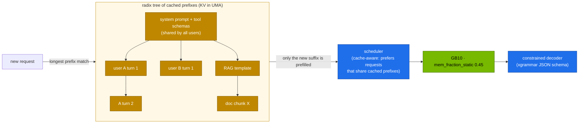

# Volume 16 — SGLang for DeepSeek: RadixAttention Prefix Reuse, Constrained JSON, and a Head-to-Head with vLLM

> **Module 03 · Part IV — Serving engines** · Prev: [15 vLLM](15-vllm-serving-deepseek-and-qwen.md) · Next: [17 Ollama & llama.cpp](17-ollama-and-llamacpp-local-gguf.md)

| | |
|---|---|
| **You will build** | R1-Distill-Qwen-32B (FP8) served by SGLang with its reasoning parser. You'll measure prefix-cache reuse on agent-style multi-turn traffic, force schema-valid JSON, and compare SGLang and vLLM on the same model, prompts and memory budget |
| **Hardware** | spark-01 |
| **Time** | 75 min |
| **Risk** | Low. One engine at a time |
| **Lab files** | [`k8s/sglang/r1-32b-fp8`](lab/k8s/sglang/r1-32b-fp8/kustomization.yaml), [`02 …/90-serving/sglang/sglang.yaml`](../02%20Kubernetes/lab/manifests/llms/90-serving/sglang/sglang.yaml), [`02 …/scripts/ttft_probe.py`](../02%20Kubernetes/lab/scripts/ttft_probe.py), [`tools/eval_harness.py`](lab/tools/eval_harness.py) |

---

## 1. Why SGLang for DeepSeek-style workloads

SGLang came out of the LMSYS team and is one of the engines DeepSeek-V3/R1 were launched with on day one. Three features matter here:

| Feature | What it does | Why reasoning/agent traffic cares |
|---|---|---|
| **RadixAttention** | keeps KV for *all* recent prefixes in a radix tree, reuses any shared prefix automatically, evicts LRU | agents resend the same system prompt, tool schemas and growing conversation every turn |
| Constrained decoding (xgrammar) | JSON schema / regex / EBNF enforced token by token | tool calls and structured outputs never fail to parse |
| Reasoning parser | `--reasoning-parser deepseek-r1` splits thinking from the answer | same client contract as vLLM |

vLLM's automatic prefix caching (block-hash based) covers much of the same ground. This volume measures how they compare on *your* traffic.

---

## 2. Architecture — HLD



---

## 3. LLD

### 3.1 The overlay (`k8s/sglang/r1-32b-fp8`)

| Arg | Value | vLLM equivalent |
|---|---|---|
| `--model-path` | RedHatAI/DeepSeek-R1-Distill-Qwen-32B-FP8-dynamic | positional model |
| `--served-model-name` | r1-32b-fp8 | same |
| `--mem-fraction-static` | 0.45 | `--gpu-memory-utilization 0.45` |
| `--context-length` | 32768 | `--max-model-len` |
| `--reasoning-parser` | deepseek-r1 | `deepseek_r1` |
| `--enable-metrics` | on | always on |
| port | 30000 | 8000 |

### 3.2 Metrics to watch

| SGLang metric | Meaning |
|---|---|
| `sglang:cache_hit_rate` | fraction of prompt tokens served from the radix cache |
| `sglang:num_running_reqs` / `sglang:num_queue_reqs` | batch size and queue |
| `sglang:gen_throughput` | output tokens/s |
| `sglang:time_to_first_token_seconds` | TTFT histogram |

---

## 4. Integrations

- **LiteLLM (Vol 28)** already lists `reasoning-sglang` as a fallback for `reasoning`. Clients don't change when you swap engines.
- **Vol 30** uses constrained decoding for agents.
- **`serve-model.sh`** scales SGLang to 0 when it switches vLLM models. This volume does the reverse.

---

## 5. Lab

### 5.1 vLLM baseline on the same model

```bash
cd "03 DeepSeek/lab"
scripts/serve-model.sh r1-32b-fp8
kubectl -n llm-serving port-forward svc/vllm 8000 &
python3 "../../02 Kubernetes/lab/scripts/ttft_probe.py" --url http://localhost:8000 --model r1-32b-fp8 -n 10 --max-tokens 16
python3 tools/eval_harness.py --url http://localhost:8000 --model r1-32b-fp8 --suites json math --concurrency 8 --out results/vllm-32b-fp8.json
kill %1
```

### 5.2 Swap to SGLang

```bash
kubectl -n llm-serving scale deploy vllm --replicas=0
kubectl apply -k k8s/sglang/r1-32b-fp8
kubectl -n llm-serving rollout status deploy/sglang --timeout=45m
kubectl -n llm-serving port-forward svc/sglang 30000 &
python3 "../../02 Kubernetes/lab/scripts/ttft_probe.py" --url http://localhost:30000 --model r1-32b-fp8 -n 10 --max-tokens 16
python3 tools/eval_harness.py --url http://localhost:30000 --model r1-32b-fp8 --suites json math --concurrency 8 --out results/sglang-32b-fp8.json
python3 tools/eval_harness.py --report results/vllm-32b-fp8.json results/sglang-32b-fp8.json
curl -s localhost:30000/metrics | grep -E '^sglang:(cache_hit_rate|gen_throughput)'
```

| | vLLM | SGLang |
|---|---|---|
| shared-prefix TTFT (ms) | | |
| unique-prefix TTFT (ms) | | |
| math acc / json acc | | |
| aggregate tok/s at c=8 | | |
| cache hit rate | (vLLM: `vllm:prefix_cache_hits_total / queries`) | `sglang:cache_hit_rate` |

**Record yours.** Accuracy should match within noise (same weights). Differences are engine performance.

### 5.3 Schema-valid JSON, every time

```bash
curl -s localhost:30000/v1/chat/completions -H 'Content-Type: application/json' -d '{
 "model":"r1-32b-fp8","temperature":0.6,"max_tokens":4096,
 "messages":[{"role":"user","content":"Ticket 4821: the vLLM pod in llm-serving was OOMKilled; severity high. Extract the fields."}],
 "response_format":{"type":"json_schema","json_schema":{"name":"ticket","schema":{"type":"object",
   "properties":{"ticket":{"type":"integer"},"namespace":{"type":"string"},"reason":{"type":"string"},
     "severity":{"type":"string","enum":["low","medium","high"]}},
   "required":["ticket","namespace","reason","severity"],"additionalProperties":false}}}}' \
 | jq -r '.choices[0].message.content' | jq .
```

The thinking stays in `reasoning_content` and the constrained part is the answer. Remove `response_format` and run it 10 times to see how often free-form output breaks a parser.

### 5.4 Back to the default

```bash
kubectl -n llm-serving scale deploy sglang --replicas=0 && scripts/serve-model.sh r1-7b
```

---

## 6. Verify

| Check | Expected |
|---|---|
| SGLang ready | `/health` 200, `/v1/models` lists `r1-32b-fp8` |
| prefix reuse | shared-prefix TTFT clearly below unique-prefix TTFT on both engines |
| JSON | output parses and matches the schema on every try |

---

## 7. Troubleshooting

| Symptom | Cause | Fix |
|---|---|---|
| `exec format error` / no sm_121 kernels | wrong image tag | the DGX Spark build (`lmsysorg/sglang:spark` in `versions.env`). Check current tags |
| OOM at start | vLLM still running, or page cache full | scale vLLM to 0. Drop caches |
| `--reasoning-parser` unknown | older SGLang | upgrade, or parse `<think>` client-side |
| JSON schema ignored | `response_format` shape differs by version | try `{"type":"json_object"}`, or SGLang's native `regex`/`json_schema` sampling params |

---

## 8. Scale-out path

| One Spark | Datacenter |
|---|---|
| SGLang single GPU | SGLang with DP attention + EP for DeepSeek-V3, PD disaggregation, the SGLang router for cache-aware load balancing across replicas |

---

## 9. Checklist

- [ ] I can explain RadixAttention and how it differs from block-hash prefix caching.
- [ ] I compared SGLang and vLLM on identical weights and prompts.
- [ ] I forced schema-valid JSON from a reasoning model.
