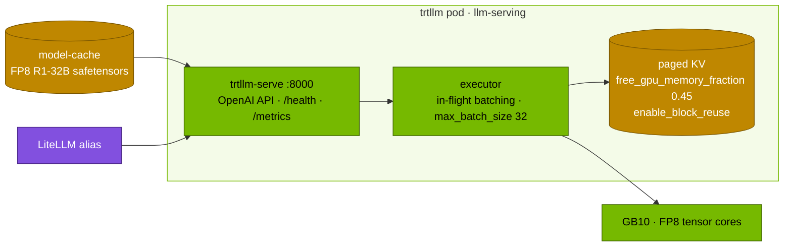

# Volume 18 — TensorRT-LLM on the Spark: `trtllm-serve`, the PyTorch Backend vs Built Engines, and a Fair Comparison

> **Module 03 · Part IV — Serving engines** · Prev: [17 llama.cpp & Ollama](17-ollama-and-llamacpp-local-gguf.md) · Next: [19 Kubernetes manifests](19-kubernetes-manifests-for-deepseek.md)

| | |
|---|---|
| **You will build** | NVIDIA's TensorRT-LLM serving the FP8 R1-32B on the GB10 behind an OpenAI-compatible endpoint. You'll learn its two workflows (PyTorch backend vs ahead-of-time engines), run it with block reuse, and compare it with vLLM and SGLang on the same weights, prompts and memory budget |
| **Hardware** | spark-01 |
| **Time** | 75 min |
| **Risk** | Low. Image tags move quickly: confirm the DGX Spark-capable tag on NGC first |
| **Lab files** | [`k8s/trtllm/trtllm-serve.yaml`](lab/k8s/trtllm/trtllm-serve.yaml), [`versions.env`](lab/versions.env) (`TRTLLM_IMAGE`), [`tools/eval_harness.py`](lab/tools/eval_harness.py) |

---

## 1. Why TensorRT-LLM

TensorRT-LLM (TRT-LLM) is NVIDIA's inference library for LLMs. It has hand-optimised kernels for each NVIDIA architecture, in-flight batching, paged KV with block reuse, speculative decoding (including DeepSeek MTP), and FP8/NVFP4 paths. It powers NVIDIA NIM containers and Triton's TRT-LLM backend.

| Workflow | How | Pros | Cons |
|---|---|---|---|
| **PyTorch backend** (lab default) | `trtllm-serve <hf-model> --backend pytorch` | no build step, any HF checkpoint, fast iteration | slightly behind the engine path on some models |
| TensorRT engines | `trtllm-build` per model × GPU × max shapes, then serve | maximum performance, fixed graph | rebuild on every change. Engines aren't portable across GPU types |

---

## 2. Architecture — HLD



---

## 3. LLD

| Setting (`trtllm-serve.yaml`) | Value | vLLM equivalent |
|---|---|---|
| `--backend pytorch` | PyTorch flow | — |
| `--max_seq_len` | 32768 | `--max-model-len` |
| `--max_batch_size` | 32 | `--max-num-seqs` |
| `kv_cache_config.free_gpu_memory_fraction` | 0.45 of **free** memory *after* weights | different semantics: vLLM's util covers weights + KV |
| `kv_cache_config.enable_block_reuse` | true | `--enable-prefix-caching` |
| replicas | 0 by default | scale to 1 after scaling vLLM/SGLang to 0 |

> **UMA note:** a fraction of *free* memory depends on what else is running. Start TRT-LLM only after other engines are scaled down, and check `free -g` afterwards.

---

## 4. Integrations

- **02 Vol 22 (Triton)**: the same engine runs inside Triton via the TRT-LLM backend, next to non-LLM models.
- **NVIDIA NIM**: prebuilt containers that package TRT-LLM (or vLLM) per model. Check the NIM catalogue for DGX Spark support of the model you want.
- **Vol 03**: TRT-LLM supports MTP speculative decoding for full DeepSeek-V3/R1 (datacenter scale).

---

## 5. Lab

### 5.1 Pick and pull the image

```bash
cd "03 DeepSeek/lab"
grep TRTLLM_IMAGE versions.env
# on the Spark: confirm the tag has an arm64 manifest
docker manifest inspect nvcr.io/nvidia/tensorrt-llm/release:1.1.0 | grep -A2 '"architecture": "arm64"'
```

If there's no arm64 entry, pick the newest tag that has one (NGC lists DGX Spark support in the release notes) and update both `versions.env` and the manifest.

### 5.2 Serve the FP8 32B

```bash
scripts/serve-model.sh r1-32b-fp8                       # caches the weights; then free the GPU:
kubectl -n llm-serving scale deploy vllm sglang --replicas=0
kubectl apply -f k8s/trtllm/trtllm-serve.yaml
kubectl -n llm-serving scale deploy trtllm --replicas=1
kubectl -n llm-serving rollout status deploy/trtllm --timeout=45m
kubectl -n llm-serving logs deploy/trtllm | grep -iE 'kv cache|max_batch|fp8|listening' | head
```

### 5.3 Same tests as vLLM and SGLang

```bash
kubectl -n llm-serving port-forward svc/trtllm 8000 &
python3 "../../02 Kubernetes/lab/scripts/ttft_probe.py" --url http://localhost:8000 --model RedHatAI/DeepSeek-R1-Distill-Qwen-32B-FP8-dynamic -n 10 --max-tokens 16
python3 tools/eval_harness.py --url http://localhost:8000 --model RedHatAI/DeepSeek-R1-Distill-Qwen-32B-FP8-dynamic \
  --suites json math --concurrency 8 --out results/trtllm-32b-fp8.json
python3 tools/eval_harness.py --report results/vllm-32b-fp8.json results/sglang-32b-fp8.json results/trtllm-32b-fp8.json
```

`trtllm-serve` names the model after its path or repo, so pass that as `--model`. The served name usually differs from the catalog name (drill D08). Fill in the three-engine table (**record yours**):

| | vLLM | SGLang | TRT-LLM |
|---|---|---|---|
| shared-prefix TTFT (ms) | | | |
| aggregate tok/s at c=8 | | | |
| math / json accuracy | | | |
| reasoning separated? | yes (parser) | yes (parser) | check: if not, parse `<think>` client-side |

### 5.4 Clean up

```bash
kubectl -n llm-serving scale deploy trtllm --replicas=0 && scripts/serve-model.sh r1-7b
```

---

## 6. Verify

| Check | Expected |
|---|---|
| `trtllm` ready | `/health` 200. `/v1/models` lists the model |
| results | accuracy within noise of the other engines (same weights) |
| decision | you can state which engine you'd run for this model on a Spark, and why |

---

## 7. Troubleshooting

| Symptom | Cause | Fix |
|---|---|---|
| image pull: `no matching manifest for linux/arm64` | x86-only tag | an arm64/DGX Spark tag |
| `CUDA error: no kernel image` / unsupported SM | release predates sm_121 support | newer release |
| OOM during KV allocation | another engine still holds memory (fraction of *free* memory) | scale others to 0 first. Lower `free_gpu_memory_fraction` |
| flags rejected | CLI changed between releases | `trtllm-serve --help` in your image. Extra options go in the YAML file |

---

## 8. Scale-out path

| One Spark | Datacenter |
|---|---|
| PyTorch backend, one GPU | TRT-LLM with TP/EP for DeepSeek-V3/R1, MTP, FP8/NVFP4, disaggregated serving. Or NIM |
| manual comparison | per-model engine choice in the catalog, benchmarked in CI on each image update |

---

## 9. Checklist

- [ ] I can explain the PyTorch-backend and built-engine workflows and when each fits.
- [ ] I served the same FP8 model on three engines and compared them on identical tests.
- [ ] I know how TRT-LLM's KV fraction differs from vLLM's utilisation on a UMA machine.
