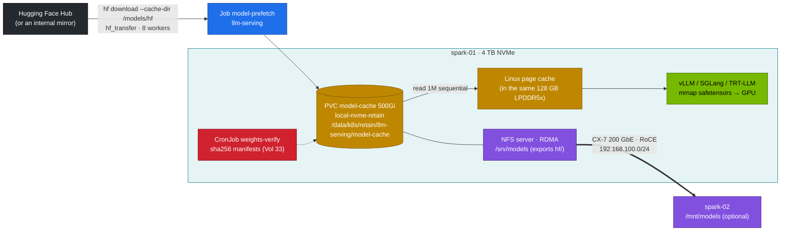

# Volume 20 — NVMe and Weight Caching: The Model Cache, Load-Time Math, Page Cache on UMA, and a Shared Store for Two Sparks

> **Module 03 · Part V — Platform integration** · Prev: [19 Kubernetes manifests](19-kubernetes-manifests-for-deepseek.md) · Next: [21 Ingress & streaming](21-ingress-and-realtime-streaming-gateways.md)

| | |
|---|---|
| **You will build** | A measured picture of where model weights live and how fast they move: the `model-cache` PVC on the Spark's NVMe, a prefetch-first workflow, cold vs warm load times, what the Linux page cache costs on unified memory, a disk budget for the whole catalog, and an NFS-over-RDMA model share for spark-02 |
| **Hardware** | spark-01 (spark-02 optional for §5.6) |
| **Time** | 75 min |
| **Risk** | Low. §5.4 drops the page cache, which is harmless but slows the next read |
| **Lab files** | [`02 …/addons/local-path-nvme.yaml`](../02%20Kubernetes/lab/addons/local-path-nvme.yaml), [`02 …/60-storage/`](../02%20Kubernetes/lab/manifests/llms/60-storage/), [`scripts/serve-model.sh`](lab/scripts/serve-model.sh), [`tools/weights_verify.py`](lab/tools/weights_verify.py) |

---

## 1. Why storage matters for LLM serving

A DeepSeek-R1-Distill-Qwen-32B checkpoint in BF16 is ~65 GB. Every engine restart, model switch or node reboot reads it again. Three things decide how long the GPU sits idle while that happens:

| Factor | Bad | Good |
|---|---|---|
| Where weights come from | Hugging Face on each start (minutes to hours, rate limits, outages) | local NVMe cache, prefetched once |
| Who downloads | every replica races to download the same files | one prefetch Job, then servers start read-only |
| Memory during load | page cache full of old models competing with the GPU for the *same* LPDDR5x | page cache dropped before a big load (UMA-specific) |

---

## 2. Architecture — HLD



---

## 3. LLD

### 3.1 Storage classes (from 02)

| Class | Reclaim | Host path | Used for |
|---|---|---|---|
| `local-nvme` | Delete | `/data/k8s/<ns>/<pvc>` | scratch, fio, Prometheus |
| `local-nvme-retain` | **Retain** | `/data/k8s/retain/<ns>/<pvc>` | `model-cache`, Qdrant, Open WebUI, `deepseek-ckpt` |

Both are `WaitForFirstConsumer`: the volume binds when the first pod schedules, on that pod's node.

### 3.2 Hugging Face cache layout inside the PVC

```text
/models/hf/
  models--deepseek-ai--DeepSeek-R1-Distill-Qwen-7B/
    refs/main                      → commit hash
    blobs/<sha256>                 ← the actual bytes, deduplicated
    snapshots/<commit>/            ← symlinks into blobs/, what engines open
      config.json  tokenizer.json  model-00001-of-00002.safetensors …
/models/manifests/<repo>@<commit>.json   ← weights-verify (Vol 33)
/models/gguf/                            ← llama.cpp (Vol 17)
```

### 3.3 Load-time math

```text
cold load time ≈ checkpoint bytes / NVMe sequential read  +  engine init (graph capture, KV alloc)
warm load time ≈ checkpoint bytes / memory copy rate      +  engine init      (pages already cached)
```

| Model | Bytes on disk | Cold read at 5 GB/s (example) | Your NVMe (**record yours**) |
|---|---|---|---|
| r1-7b BF16 | ~15 GB | ~3 s | |
| r1-32b-fp8 | ~34 GB | ~7 s | |
| r1-32b BF16 | ~66 GB | ~13 s | |
| R1 671B IQ1_S GGUF | ~131 GB | ~26 s | |

In practice engine init (CUDA-graph capture, compilation, KV allocation) dominates once the read is local. The win from prefetching is avoiding the *download*, which runs at WAN speed.

### 3.4 Page cache on unified memory

On a discrete-GPU server the page cache uses host RAM, and VRAM is separate. On the GB10 they're **the same 128 GB**. After reading a 66 GB checkpoint, the kernel keeps those pages cached. vLLM then asks for `--gpu-memory-utilization × 119.7 GiB`. The kernel can reclaim clean page cache, but under pressure that's slow and can trigger OOM kills elsewhere. `serve-model.sh` therefore runs `sync; echo 3 > /proc/sys/vm/drop_caches` between prefetch and load.

### 3.5 Disk budget for the catalog

| Group | Models | Approx. total |
|---|---|---|
| reasoning | r1-1.5b, r1-7b, r1-32b, r1-32b-fp8 | ~120 GB |
| MoE | v2-lite, coder-v2-lite | ~63 GB |
| baselines | qwen2.5-7b-tools, qwen2.5-32b-awq, llama-3.1-8b, mistral-7b, nemotron-nano-8b | ~85 GB |
| embeddings + GGUF | bge-m3, R1-7B GGUFs | ~20 GB |
| **total** | | **~290 GB of the 500Gi PVC** |

---

## 4. Integrations

- **02 Vol 11** covers CSI, local-path and fio from the Kubernetes side. This volume applies it to weights.
- **Vol 33** pins every snapshot with sha256 manifests and verifies them nightly.
- **Vol 14** uses the NFS-RDMA share to give both Sparks the same 131 GB GGUF without copying it twice.
- **08 Storage** (later module) goes deep on NVMe, NFS-RDMA and GPUDirect Storage.

---

## 5. Lab

### 5.1 Find the cache on the host

```bash
kubectl -n llm-serving get pvc model-cache -o jsonpath='{.spec.volumeName}{"\n"}'
sudo du -sh /data/k8s/retain/llm-serving/model-cache/hf/models--* | sort -h
df -h /data
```

### 5.2 Benchmark the NVMe from a pod

```bash
kubectl apply -f "../02 Kubernetes/lab/manifests/root/60-storage/fio-job.yaml"
kubectl -n lab-tools logs -f job/fio-ai | grep -E '^\[|READ:|WRITE:'
```

Record `weights-seqread-1m` bandwidth. That's the denominator for the cold-load estimate in §3.3.

### 5.3 Prefetch vs download-on-start

```bash
cd "03 DeepSeek/lab"
# A: prefetch path (the default)
time scripts/serve-model.sh r1-7b
# B: second switch to the same model — weights already cached
kubectl -n llm-serving rollout restart deploy/vllm
time kubectl -n llm-serving rollout status deploy/vllm --timeout=30m
kubectl -n llm-serving logs deploy/vllm | grep -E 'Loading weights took|Model loading took|Graph capturing finished'
```

| | Wall time | Weight load (log) | Graph capture (log) |
|---|---|---|---|
| first serve (download + load) | | | |
| restart (cached, warm page cache) | | | |
| restart after `drop_caches` (cold) | | | |

**Record yours.** The restart rows should be dominated by graph capture, not weight loading.

### 5.4 Watch the page cache compete for UMA

```bash
free -g                                            # note buff/cache
cat /data/k8s/retain/llm-serving/model-cache/hf/models--deepseek-ai--DeepSeek-R1-Distill-Qwen-7B/snapshots/*/*.safetensors > /dev/null
free -g                                            # buff/cache grows by ~15 GB
sudo sh -c 'sync; echo 3 > /proc/sys/vm/drop_caches'
free -g                                            # back down
```

### 5.5 Pin what you just downloaded

```bash
kubectl apply -f k8s/ops/weights-verify.yaml
kubectl -n llm-serving create job --from=cronjob/weights-verify wv-now
kubectl -n llm-serving logs -f job/wv-now
```

Expected: `== NEW  deepseek-ai_DeepSeek-R1-Distill-Qwen-7B@<commit>` for each snapshot on the first run, `== CHECK … OK` on later runs.

### 5.6 (Two Sparks) share the cache over NFS-RDMA

On spark-01 (01 Ansible lab configures the export and RDMA transport):

```bash
showmount -e localhost                             # /srv/models 192.168.100.0/24
# on spark-02
mount | grep /mnt/models                           # proto=rdma,port=20049
dd if=/mnt/models/hf/models--deepseek-ai--DeepSeek-R1-Distill-Qwen-7B/blobs/$(ls /mnt/models/hf/models--deepseek-ai--DeepSeek-R1-Distill-Qwen-7B/blobs | head -1) of=/dev/null bs=16M status=progress
```

Compare with the local NVMe read from §5.2 (**record yours**).

---

## 6. Verify

| Check | Expected |
|---|---|
| PVC | `model-cache` Bound, class `local-nvme-retain`, reclaim `Retain` |
| prefetch | `kubectl -n llm-serving logs job/model-prefetch` ends with `downloaded <repo> in Ns` |
| warm restart | weight-load line in the vLLM log is seconds, not minutes |
| manifests | one JSON per snapshot in `/models/manifests` |

---

## 7. Troubleshooting

| Symptom | Cause | Fix |
|---|---|---|
| PVC `Pending` forever | `WaitForFirstConsumer` and no pod uses it yet | normal. It binds when the first pod schedules |
| two pods downloading the same model, `.incomplete` files | servers started before prefetch | always prefetch first (`serve-model.sh` does) |
| `No space left on device` during prefetch | catalog grew past 500Gi or `/` is full (same NVMe) | `hf cache scan --dir /models/hf` / `hf cache delete`, then remove unused snapshots |
| vLLM OOM at load right after a big download | page cache holding the checkpoint | drop caches. Lower `--gpu-memory-utilization` |
| deleted the PVC, weights gone? | no: `Retain` | the PV is `Released`. Clear `claimRef` to re-bind, or copy from `/data/k8s/retain/…` |
| NFS mount falls back to TCP | `rpcrdma` module missing, or wrong port | `modprobe rpcrdma`. Mount with `proto=rdma,port=20049` |

---

## 8. Scale-out path

| One / two Sparks | Datacenter |
|---|---|
| local NVMe + prefetch Job | node-local NVMe cache filled from an object store or internal HF mirror |
| NFS-RDMA from spark-01 | parallel file system (Lustre, WEKA, VAST) or 3FS (Vol 10). GPUDirect Storage straight into GPU memory |
| `drop_caches` before load | dedicated host RAM. Page cache doesn't compete with HBM |

---

## 9. Checklist

- [ ] I know where every model's bytes live on the host, and how much space is left.
- [ ] I measured cold and warm load times and know what dominates each.
- [ ] I can explain why page cache matters more on UMA than on a discrete-GPU server.
- [ ] My cached snapshots have sha256 manifests.
