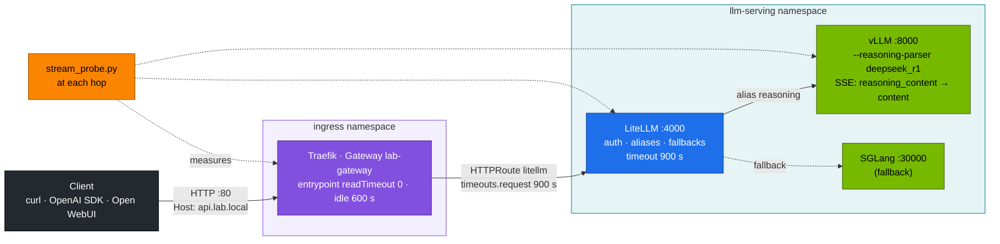
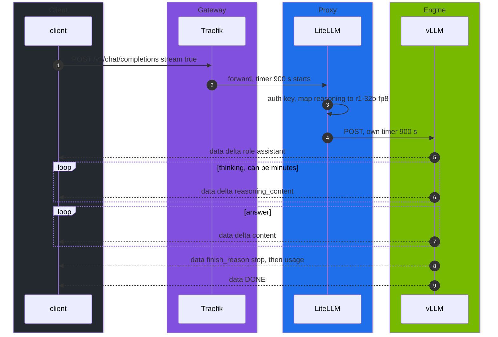

# Volume 21 — Ingress and Streaming for Reasoning Models: SSE Through Every Hop, Timeouts That Fit a Chain of Thought, and Spotting a Buffering Proxy

> **Module 03 · Part V — Platform integration** · Prev: [20 NVMe & weight caching](20-nvme-local-storage-and-weight-caching.md) · Next: [22 Autoscaling with KServe & Kueue](22-autoscaling-with-kserve-and-kueue.md)

| | |
|---|---|
| **You will build** | The full request path, client → Traefik Gateway → LiteLLM → vLLM, with server-sent events (SSE) that stream reasoning and answer tokens separately. You'll measure TTFT, time-to-first-answer and inter-token latency at each hop with `stream_probe.py`, set timeouts that survive a 10-minute chain of thought, and catch a hop that buffers the stream |
| **Hardware** | spark-01 |
| **Time** | 60 min |
| **Risk** | Low. Drill D04 changes LiteLLM's timeout. `breakfix.sh reset D04` restores it |
| **Lab files** | [`tools/stream_probe.py`](lab/tools/stream_probe.py), [`k8s/apps/litellm.yaml`](lab/k8s/apps/litellm.yaml), [`02 …/addons/traefik.yaml`](../02%20Kubernetes/lab/addons/traefik.yaml), [`02 …/40-ingress/`](../02%20Kubernetes/lab/manifests/40-ingress/) |

---

## 1. Why reasoning models stress gateways

A chat model answers in seconds. A reasoning model like R1 can **think for minutes** before the first answer token. Every proxy on the path has its own idea of how long a request may live and whether to pass bytes on immediately:

| Property | Typical default | What R1 needs |
|---|---|---|
| request/read timeout | 30–60 s on many proxies | ≥ 900 s end to end |
| response buffering | some middlewares buffer whole responses | none: SSE chunks must flush as they arrive |
| idle timeout | 60–180 s | covered by the steady token stream, as long as nothing buffers |
| client timeout | OpenAI Python SDK: 600 s | ≥ the server's longest generation |

The *shortest* timeout on the path wins, and the symptom ("the answer stops", "504", "it just hangs") rarely names the hop.

---

## 2. Architecture — HLD



### 2.1 One streamed R1 request



---

## 3. LLD

### 3.1 Timeouts per hop (lab values)

| Hop | Setting | Lab value | Where |
|---|---|---|---|
| client | SDK `timeout`, curl `--max-time` | ≥ 900 s | your code |
| Traefik entrypoint `web` | `respondingTimeouts.readTimeout / writeTimeout / idleTimeout` | 0 / 0 / 600 s | `02 …/addons/traefik.yaml` |
| HTTPRoute `litellm`, `open-webui` | `rules[].timeouts.request` | 900 s | `k8s/apps/*.yaml` |
| LiteLLM | `router_settings.timeout`, `litellm_settings.request_timeout` | 900 s | `litellm-config` |
| Open WebUI → LiteLLM | `AIOHTTP_CLIENT_TIMEOUT` | the image default. Raise it if long chats cut off | env |
| vLLM | none on the server. Bounded by `max_tokens` × ITL | — | — |
| vLLM shutdown | `preStop sleep 15` + `terminationGracePeriodSeconds 120` | — | 02 base Deployment |

### 3.2 The SSE wire format with the reasoning parser

```text
data: {"choices":[{"index":0,"delta":{"role":"assistant","content":""}}]}
data: {"choices":[{"index":0,"delta":{"reasoning_content":"The trip runs from 09:40"}}]}
…
data: {"choices":[{"index":0,"delta":{"content":"205 minutes."}}]}
data: {"choices":[{"index":0,"delta":{},"finish_reason":"stop"}]}
data: {"choices":[],"usage":{"prompt_tokens":38,"completion_tokens":611}}
data: [DONE]
```

`stream_options.include_usage` adds the final usage chunk. LiteLLM passes `reasoning_content` through for `hosted_vllm/` models.

### 3.3 What `stream_probe.py` measures

| Field | Meaning | Healthy (**record yours**) |
|---|---|---|
| `ttfb` | first byte of the response | ≈ queue + prefill |
| `first reasoning` | first thinking token | ≈ TTFT |
| `first answer` | first token after `</think>` | seconds to minutes. This is what users *feel* |
| `ITL p50 / p99` | gap between chunks | p50 ≈ 1 / decode tok/s. Gateways add < 1 ms |
| `BUFFERED` | all chunks arrived in one burst at the end | must never appear |
| `TRUNCATED` | `finish_reason=length` | the client's `max_tokens` is too small for the chain of thought |

---

## 4. Integrations

- **02 Vol 09** set up the Gateway, the Traefik middlewares and the canary route. This volume applies them to reasoning traffic.
- **Vol 28** covers LiteLLM's keys, budgets and fallbacks. **Vol 27** puts Open WebUI on the same path.
- **Vol 38** alert `ReasoningTruncated` fires when >20 % of requests end with `finish_reason=length`.

---

## 5. Lab

Prerequisites: `scripts/serve-model.sh r1-7b`, `kubectl apply -k k8s/apps`, and on your workstation `/etc/hosts` has `10.10.10.11 api.lab.local webui.lab.local`.

```bash
cd "03 DeepSeek/lab"
KEY=$(kubectl -n llm-serving get secret litellm-master-key -o jsonpath='{.data.key}' | base64 -d)
```

### 5.1 Hop 1 — straight to vLLM

```bash
kubectl -n llm-serving port-forward svc/vllm 8000 &
python3 tools/stream_probe.py --url http://localhost:8000 --model r1-7b
```

```text
http://localhost:8000  model=r1-7b
  ttfb      41 ms | first reasoning      41 ms | first answer   36930 ms | total 39.70 s
  chunks 642 (reasoning 598, answer 44) | ITL p50 61.5 ms p99 70.3 ms | ≈16 chunks/s
  finish_reason=stop  usage={'prompt_tokens': 38, 'completion_tokens': 643, …}
```

(Illustrative numbers for a BF16 7B: one stream can't beat the ~18 tok/s bandwidth ceiling `model_math.py` prints. **Record yours**.)

### 5.2 Hop 2 — through LiteLLM

```bash
kubectl -n llm-serving port-forward svc/litellm 4000 &
python3 tools/stream_probe.py --url http://localhost:4000 --api-key "$KEY" --model reasoning-fast
```

### 5.3 Hop 3 — through the Gateway

```bash
python3 tools/stream_probe.py --url http://api.lab.local --api-key "$KEY" --model reasoning-fast
# or by IP, without /etc/hosts
python3 tools/stream_probe.py --url http://10.10.10.11 --host api.lab.local --api-key "$KEY" --model reasoning-fast
```

| Hop | ttfb (ms) | first answer (s) | ITL p50 (ms) | ITL p99 (ms) |
|---|---|---|---|---|
| vLLM | | | | |
| + LiteLLM | | | | |
| + Traefik | | | | |

Expected: each hop adds a few ms to `ttfb` and almost nothing to ITL. `first answer` is set by the model's thinking length, not by the network.

### 5.4 Watch raw SSE

```bash
curl -sN http://api.lab.local/v1/chat/completions -H "Authorization: Bearer $KEY" -H 'Content-Type: application/json' \
  -d '{"model":"reasoning-fast","stream":true,"messages":[{"role":"user","content":"Is 221 prime?"}]}' | head -20
```

### 5.5 Drill D04 — the 30-second gateway

```bash
scripts/breakfix.sh inject D04
python3 tools/stream_probe.py --url http://api.lab.local --api-key "$KEY" --model reasoning-fast --max-tokens 16384 \
  --prompt "Prove that there are infinitely many primes of the form 4k+3, step by step."
scripts/breakfix.sh hint D04
```

Expected: the stream dies at ~30 s with an error or a cut-off stream, while §5.1 against vLLM directly completes. Find which hop gave up (LiteLLM logs: `kubectl -n llm-serving logs deploy/litellm | grep -i timeout`), then `scripts/breakfix.sh answer D04` and `scripts/breakfix.sh reset D04`.

### 5.6 Make a hop buffer, then catch it

Attach 02's `llm-body-limit` middleware (Traefik `buffering`) to the LiteLLM route:

```bash
kubectl -n llm-serving patch httproute litellm --type json -p '[{"op":"add","path":"/spec/rules/0/filters","value":[
  {"type":"ExtensionRef","extensionRef":{"group":"traefik.io","kind":"Middleware","name":"llm-body-limit"}}]}]'
python3 tools/stream_probe.py --url http://api.lab.local --api-key "$KEY" --model reasoning-fast
kubectl apply -f k8s/apps/litellm.yaml          # remove the filter
```

Expected: if your Traefik version buffers responses in that middleware, the probe prints `BUFFERED` and `first answer ≈ total`. Users see nothing until the whole answer is done. Lesson: put request-size limits on a separate non-streaming route, or enforce them in LiteLLM.

---

## 6. Verify

| Check | Expected |
|---|---|
| three hops | all `finish_reason=stop`, no `BUFFERED`, ITL p50 within ~1 ms of each other |
| long reasoning | a 5-minute generation completes through the Gateway |
| D04 | diagnosed by comparing hops, and reset |

---

## 7. Troubleshooting

| Symptom | Cause | Fix |
|---|---|---|
| `504 Gateway Timeout` after exactly N seconds | shortest timeout on the path | probe each hop. Raise that hop to ≥ 900 s |
| stream cut at 600 s from Python | OpenAI SDK default timeout | `OpenAI(timeout=900)` |
| nothing for minutes, then the whole answer | a hop buffers SSE (`BUFFERED`) | remove buffering/compression middleware from streaming routes |
| `finish_reason=length`, answer empty | client `max_tokens` used up by thinking | raise `max_tokens` (R1: 8K–32K). Alert `ReasoningTruncated` |
| thinking shows inside `content` | no reasoning parser (D01) | `--reasoning-parser=deepseek_r1` |
| `401` at the Gateway, `200` at vLLM | LiteLLM needs the key | `Authorization: Bearer $KEY` |
| `404` from Traefik | Host header doesn't match the HTTPRoute | `api.lab.local` in `/etc/hosts`, or `--host` |
| streams break during a model switch | `Recreate` stops the old pod | expected downtime. Switch models in a maintenance window, or add spark-02 |

---

## 8. Scale-out path

| One Spark | Fleet |
|---|---|
| Traefik + LiteLLM, 900 s everywhere | an L7 gateway with per-route timeouts, plus an LLM-aware router (queue- and prefix-cache-aware, e.g. Gateway API Inference Extension) |
| `stream_probe.py` by hand | synthetic probes per region every minute, TTFT and ITL SLOs in Prometheus |
| `Recreate` downtime | rolling updates across replicas. Drain by `num_requests_running == 0` |

---

## 9. Checklist

- [ ] I measured TTFT, time-to-first-answer and ITL at every hop.
- [ ] I know every timeout on the path and its value.
- [ ] I can recognise a buffering hop from the probe output alone.
- [ ] I solved D04.
