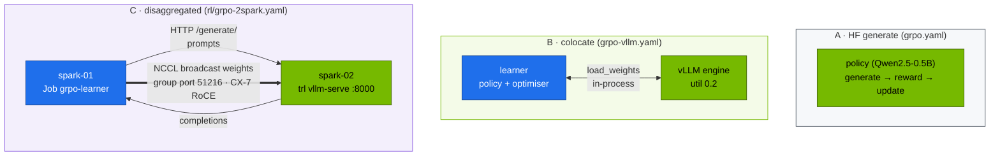
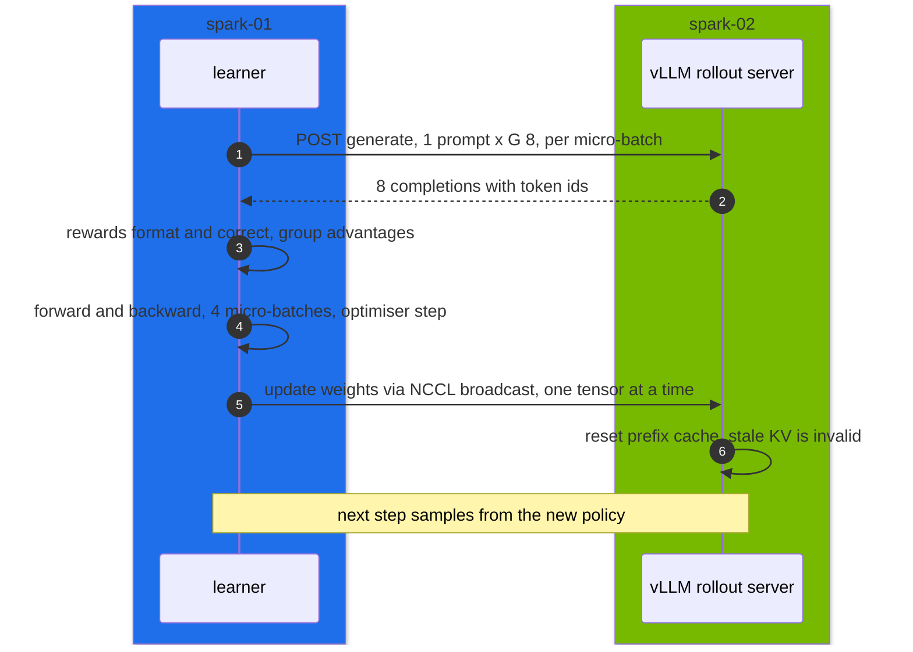

# Volume 25 — RL Rollout Infrastructure: Where GRPO Spends Its Time, Colocated vs Disaggregated Rollouts, and Weight Sync over CX-7

> **Module 03 · Part VI — Fine-tuning and RL** · Prev: [24 Unsloth & LLaMA-Factory](24-unsloth-and-llama-factory-workflows.md) · Next: [26 DeepSpeed ZeRO-3 & FSDP](26-distributed-deepspeed-zero3-and-fsdp.md)

| | |
|---|---|
| **You will build** | The R1-style GRPO loop from Vol 05 run three ways: rollouts from Hugging Face `generate`, from vLLM inside the trainer (colocate), and from a separate vLLM server on spark-02 that receives fresh weights over NCCL after every step (disaggregated). You'll measure where each step's time goes, size the weight-sync traffic, and finish with the SFT → GRPO recipe |
| **Hardware** | spark-01. spark-02 + the QSFP cable for §5.5 |
| **Time** | 2.5 h |
| **Risk** | Low. Everything runs in `batch` |
| **Lab files** | [`tools/grpo_tiny.py`](lab/tools/grpo_tiny.py), [`k8s/jobs/grpo.yaml`](lab/k8s/jobs/grpo.yaml), [`k8s/jobs/grpo-vllm.yaml`](lab/k8s/jobs/grpo-vllm.yaml), [`k8s/rl/grpo-2spark.yaml`](lab/k8s/rl/grpo-2spark.yaml), [`tools/format_check.py`](lab/tools/format_check.py) |

---

## 1. Why RL needs its own infrastructure

Supervised fine-tuning reads fixed data. RL **generates its own data** every step with the current policy, scores it and learns from it. For GRPO (Vol 05):

```text
per step:  for each prompt → sample G completions with the CURRENT weights   (rollout: inference)
           score each completion with rule-based rewards                     (reward: CPU, cheap)
           advantage_i = (r_i − mean(r)) / std(r) within the group            (no value network)
           policy-gradient update                                            (learner: training)
           push new weights to whatever generates rollouts                   (weight sync)
```

Rollout usually dominates: completions are long (R1 chains run thousands of tokens), and autoregressive decoding is memory-bandwidth-bound. So RL frameworks put a fast inference engine (vLLM, SGLang) in the loop, and the main design question is **where that engine runs**:

| Layout | Rollout engine | Weight sync | Fits |
|---|---|---|---|
| HF `generate` | the training model itself | none | tiny experiments |
| **Colocate** | vLLM in the trainer process, same GPU, time-shared | in-process copy | one GPU or node, memory permitting |
| **Disaggregated** | vLLM server(s) on other GPUs or nodes | NCCL broadcast learner → servers | when rollout and training need different scale |

DeepSeek-R1's own RL ran on thousands of GPUs with separate rollout and training pools. This volume builds the same shapes at the smallest scale.

---

## 2. Architecture — HLD

### 2.1 The three layouts



### 2.2 One disaggregated step



---

## 3. LLD

### 3.1 The lab's GRPO configuration (`grpo_tiny.py`)

| Setting | Value | Effect |
|---|---|---|
| model | Qwen2.5-0.5B-Instruct (or an SFT checkpoint) | small enough that all three layouts fit on one GB10 |
| `num_generations` (G) | 8 | completions per prompt. The group the advantage is computed over |
| `per_device_train_batch_size` × grad-accum | 8 × 4 | 32 completions (4 prompts) per optimiser step |
| `max_completion_length` | 256 | ≤ 8,192 generated tokens per step |
| `temperature` | 0.9 | diversity within a group. With no diversity, std = 0 and there's no learning signal |
| `beta` (KL) | 0.0 | no reference model in memory (common in recent GRPO practice) |
| rewards | format 1.0, correct 2.0 | verifiable, no reward model |
| lr | 1e-6 | RL updates are small |

### 3.2 Metrics that tell you it's working

| Logged metric (TRL) | Healthy trend |
|---|---|
| `reward` | rises from ~0–0.5 towards 2–3 |
| `rewards/reward_format/mean` | rises first (the model learns the tags) |
| `rewards/reward_correct/mean` | rises later and more slowly |
| `reward_std` | stays above 0. If it collapses to 0, groups are identical and the gradient is zero |
| `frac_reward_zero_std` | fraction of groups with no signal. Lower is better |
| `completions/mean_length` | stable or slowly growing. Sudden growth hitting `max_completion_length` means truncation |

### 3.3 Weight-sync budget

Every optimiser step, the full policy goes from learner to rollout engine:

| Policy (bf16) | Bytes per sync | Over 200 GbE RoCE (~20 GB/s achievable, **record yours** with 02 Vol 17's all-reduce bench) | Colocate |
|---|---|---|---|
| 0.5B | ~1 GB | ~0.05 s | in-process |
| 7B | ~15 GB | ~0.8 s | in-process |
| 32B | ~65 GB | ~3.3 s | doesn't fit with optimiser state on one GB10 |

With LoRA, only the adapter would need syncing (MBs), which is one reason LoRA-GRPO is popular. TRL merges the adapter before syncing to vLLM.

### 3.4 Memory on one GB10 (colocate, 0.5B)

| Component | Approx. |
|---|---|
| policy bf16 + grads + AdamW fp32 states | ~8 GiB |
| vLLM engine (`vllm_gpu_memory_utilization` 0.2) | ~24 GiB (weights + KV) |
| activations for 8 × (160 + 256) tokens | ~2 GiB |

Colocate works when **learner state + rollout engine** fit together. For R1-32B that's impossible on one Spark. That's exactly where disaggregation (and in a datacenter, separate pools) comes in.

---

## 4. Integrations

- **Vol 05**: the algorithm and the reward design. This volume covers the infrastructure.
- **Vol 23**: SFT first, then GRPO from the merged SFT checkpoint (§5.6).
- **Vol 22**: the single-Spark Jobs are Kueue workloads. The two-Spark layout is pinned to nodes and runs outside Kueue.
- **02 Vol 17**: NCCL over the CX-7 link. Same environment variables.

---

## 5. Lab

```bash
cd "03 DeepSeek/lab"
kubectl apply -k . && kubectl apply -f k8s/jobs/train-common.yaml
python3 tools/grpo_tiny.py --dry-run
```

### 5.1 Layout A — HF generate

```bash
kubectl apply -f k8s/jobs/grpo.yaml
kubectl -n batch logs -f job/grpo | grep -E "'reward'|it/s|s/it"
```

Record the seconds per step and the reward at steps 20, 100 and 200.

### 5.2 Layout B — colocated vLLM

```bash
kubectl -n batch wait --for=condition=complete job/grpo --timeout=3h
kubectl apply -f k8s/jobs/grpo-vllm.yaml
kubectl -n batch logs -f job/grpo-vllm | grep -E "vLLM|KV cache|'reward'|s/it"
```

### 5.3 Compare

| Layout | s/step (**record yours**) | reward @200 | peak `free -g` used |
|---|---|---|---|
| A · HF generate | | | |
| B · colocate vLLM | | | |
| C · disaggregated (2×) | | | |

Expected: B's step time is several times shorter than A's, because generation dominates and vLLM batches the 8 completions with paged KV. Reward curves should look similar: same algorithm, same data.

### 5.4 Check the learned behaviour

The checkpoint is a full model (`/ckpt/grpo-vllm`). Publish and serve it:

```bash
scripts/publish-adapter.sh grpo-vllm
kubectl apply -k k8s/models/r1-1.5b                          # any small base overlay
kubectl -n llm-serving set env deploy/vllm MODEL=/models/adapters/grpo-vllm SERVED_NAME=grpo-0.5b
kubectl -n llm-serving rollout status deploy/vllm --timeout=20m
kubectl -n llm-serving port-forward svc/vllm 8000 &
python3 tools/format_check.py --url http://localhost:8000 --model grpo-0.5b -n 50
```

The overlay keeps `--reasoning-parser=deepseek_r1`. `format_check.py` re-assembles the thinking either way, so the score is unaffected. Compare with the untrained Qwen2.5-0.5B (format ≈ 0 %).

### 5.5 Layout C — disaggregated across two Sparks (2×)

```bash
kubectl apply -f k8s/rl/grpo-2spark.yaml
kubectl -n batch rollout status deploy/grpo-rollout --timeout=30m
curl -s http://192.168.100.12:8000/health/ && echo " rollout server up"
kubectl -n batch patch job grpo-learner -p '{"spec":{"suspend":false}}'
kubectl -n batch logs -f job/grpo-learner | grep -E "NCCL|communicator|'reward'|s/it"
```

On spark-02, watch the link during weight updates:

```bash
watch -n1 "ethtool -S enp1s0f1np1 | grep -E 'rx_bytes_phy|tx_bytes_phy'"
```

Expected: NCCL selects the `NET/IB` transport on the RoCE device, and a burst of ~1 GB crosses the link after every optimiser step. Clean up with `kubectl delete -f k8s/rl/grpo-2spark.yaml`.

### 5.6 The R1 recipe in miniature: SFT, then GRPO

```bash
# from Vol 23: /ckpt/sft-lora-merged (R1-Distill-Qwen-1.5B taught the format)
yq '.metadata.name = "grpo-from-sft"
    | .spec.template.spec.containers[0].args[0] |= sub("--model Qwen/Qwen2.5-0.5B-Instruct"; "--model /ckpt/sft-lora-merged --max-len 512")
    | .spec.template.spec.containers[0].args[0] |= sub("/ckpt/grpo-vllm"; "/ckpt/grpo-from-sft")' k8s/jobs/grpo-vllm.yaml | kubectl apply -f -
```

Expected: `reward_format` starts near its maximum (SFT already taught the tags), so the RL signal goes into `reward_correct`. That's the reason R1 used a "cold-start" SFT before RL.

---

## 6. Verify

| Check | Expected |
|---|---|
| A and B complete | `reward` trending up, `reward_std` > 0 |
| speed-up | B faster per step than A |
| learned format | `format_check.py` format % ≫ base model |
| (2×) sync | NCCL init logs on both sides. Link bursts once per step |

---

## 7. Troubleshooting

| Symptom | Cause | Fix |
|---|---|---|
| `reward_std` ≈ 0, reward flat | every completion in a group gets the same reward | raise `temperature`, raise G, or make the task easier/harder so rewards differ |
| reward rises, then collapses | lr too high, or reward hacking | lower lr. Check completions for exploits (e.g. empty think). Tighten the regex |
| `completions/mean_length` pinned at max | truncation. Rewards stay low | raise `--max-len`. Check for repetition loops |
| colocate: CUDA OOM at vLLM init | learner + vLLM exceed memory | lower `vllm_gpu_memory_utilization`. Use a smaller model or LoRA |
| server mode: learner hangs at "Initializing communicator" | group port 51216 blocked, or NCCL picked the wrong NIC | hostNetwork both sides. `NCCL_SOCKET_IFNAME`. `NCCL_DEBUG=INFO` |
| server mode: rewards don't improve | weights not reaching the server | `kubectl -n batch logs deploy/grpo-rollout | grep update_named_param` should show requests after every step. Start the server *before* the learner |
| `pip` replaced vLLM's torch | dependency resolution | install only `trl` + the pins listed. Never `pip install vllm` on the NGC image |

---

## 8. Scale-out path

| One Spark | Two Sparks | Datacenter |
|---|---|---|
| colocate, ≤ 1.5B full or LoRA 7B | learner on one, rollout on the other | rollout pool (many vLLM/SGLang replicas, DP) + learner pool (FSDP/Megatron). Async off-policy rollouts. Frameworks: verl, OpenRLHF, NeMo-RL |
| sync every step | same | sync every N steps. Partial rollouts for long chains |

---

## 9. Checklist

- [ ] I can draw the GRPO step and say which part dominates time.
- [ ] I ran HF-generate and colocated-vLLM rollouts and compared step time.
- [ ] I can estimate weight-sync cost for a model size and link speed.
- [ ] (2×) I ran disaggregated rollouts with weights pushed over NCCL.
