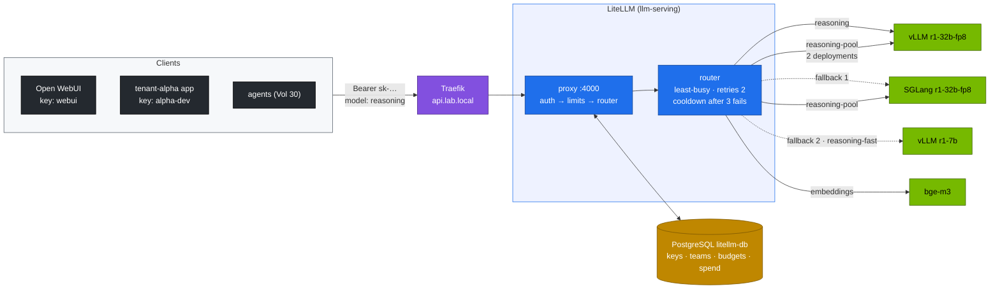

# Volume 28 — LiteLLM as the AI Gateway: Model Aliases, Virtual Keys with Budgets and Rate Limits, Fallbacks, and Load Balancing

> **Module 03 · Part VII — Applications** · Prev: [27 Open WebUI](27-open-webui-deployment-and-integration.md) · Next: [29 Enterprise RAG](29-enterprise-rag-with-qdrant-and-bge.md)

| | |
|---|---|
| **You will build** | One OpenAI-compatible endpoint (`api.lab.local`) in front of every engine on the Spark. Clients ask for stable aliases (`reasoning`, `reasoning-fast`, `embeddings`) while operators decide which model serves each. Tenants get virtual keys with model allow-lists, budgets and rate limits stored in PostgreSQL. Failures fall back to another engine, and a two-deployment pool shows least-busy load balancing |
| **Hardware** | spark-01 (the pool in §5.6 is most useful with spark-02) |
| **Time** | 75 min |
| **Risk** | Low |
| **Lab files** | [`k8s/apps/litellm.yaml`](lab/k8s/apps/litellm.yaml), [`k8s/apps/litellm-db.yaml`](lab/k8s/apps/litellm-db.yaml), [`tools/stream_probe.py`](lab/tools/stream_probe.py), [`scripts/breakfix.sh`](lab/scripts/breakfix.sh) (D04, D08) |

---

## 1. Why a gateway between clients and engines

Without a gateway, every client hard-codes an engine URL and a served model name. Swapping r1-7b for r1-32b-fp8, or vLLM for SGLang, then breaks every client (drill D08). There's also no per-team limit on a shared GPU.

| Capability | Without LiteLLM | With LiteLLM |
|---|---|---|
| Model naming | `r1-32b-fp8` at `vllm:8000` | `reasoning` at `api.lab.local`. Ops remap freely |
| Access control | anyone who reaches the port | virtual key per tenant: allowed models, expiry |
| Fair use | first come, first served | per-key/team RPM and TPM limits, budgets |
| Resilience | client sees the error | retries, cooldown of failing deployments, fallbacks to other aliases |
| Accounting | none | per-key spend from token usage × your cost per token |

---

## 2. Architecture — HLD



---

## 3. LLD

### 3.1 Model list (`litellm-config`)

| Alias | Deployment(s) | Notes |
|---|---|---|
| `reasoning` | `hosted_vllm/r1-32b-fp8` at vLLM | falls back to `reasoning-sglang`, then `reasoning-fast` |
| `reasoning-fast` | `hosted_vllm/r1-7b` at vLLM | everyday model |
| `reasoning-sglang` | `openai/r1-32b-fp8` at SGLang :30000 | used as a fallback |
| `embeddings` | `hosted_vllm/bge-m3` | Open WebUI and RAG |
| `reasoning-pool` | **two** deployments (vLLM, SGLang), `rpm: 60` each, cost per token set | load-balancing demo |

`hosted_vllm/` tells LiteLLM the backend is vLLM, so vLLM-specific fields such as `reasoning_content` pass through. `openai/` treats the backend as generic OpenAI-compatible.

### 3.2 Router and reliability settings

| Setting | Value | Behaviour |
|---|---|---|
| `routing_strategy` | `least-busy` | pick the deployment with the fewest in-flight requests |
| `num_retries` | 2 | retry transient errors on the same alias |
| `allowed_fails` / `cooldown_time` | 3 / 60 s | a deployment failing 3 times in a minute is skipped for 60 s |
| `fallbacks` | `reasoning → [reasoning-sglang, reasoning-fast]` | other aliases, tried in order when retries are exhausted |
| `timeout` / `request_timeout` | 900 s | long reasoning (D04 lowers it to 30 s) |
| `drop_params` | true | drop OpenAI params a backend doesn't support instead of failing |

### 3.3 Keys, teams and limits (stored in PostgreSQL)

| Object | Created with | Limits you can set |
|---|---|---|
| master key | Secret `litellm-master-key` (Vault) | admin only. Never give it to apps |
| team | `POST /team/new` | `max_budget`, `budget_duration`, `models`, `rpm_limit`, `tpm_limit` |
| virtual key | `POST /key/generate` | same, plus `team_id`, `key_alias`, `duration` (expiry) |

Cost per token (`model_info.input_cost_per_token`, `output_cost_per_token`) is **yours to set** for self-hosted models. Vol 37's eval harness gives a local $/1M output tokens from power and amortised hardware. Divide by 10⁶ and put it here, and spend becomes meaningful.

### 3.4 Status codes a client should handle

| Code | Meaning |
|---|---|
| 401 | missing or invalid key |
| 400/401 with "key not allowed to access model" | model not in the key's allow-list |
| 429 | RPM/TPM limit hit. Back off and retry |
| 400 "Budget has been exceeded" | budget used up for the period |
| 500/502 with fallbacks exhausted | all candidate deployments failed |

---

## 4. Integrations

- **Vol 21**: LiteLLM sits behind the same Gateway and timeouts.
- **Vol 27**: give Open WebUI its own key (§5.3) instead of the master key.
- **Vol 32**: the master key and DB password come from Vault through `vault-sync`.
- **Vol 38**: spend and per-key usage come from LiteLLM's API and spend logs. Engine latency comes from vLLM metrics.

---

## 5. Lab

```bash
cd "03 DeepSeek/lab"
kubectl apply -k k8s/apps
kubectl -n llm-serving rollout status sts/litellm-db --timeout=5m
kubectl -n llm-serving rollout status deploy/litellm --timeout=10m      # runs DB migrations on first start
KEY=$(kubectl -n llm-serving get secret litellm-master-key -o jsonpath='{.data.key}' | base64 -d)
API=http://api.lab.local
H=(-H "Authorization: Bearer $KEY" -H 'Content-Type: application/json')
curl -s $API/v1/models "${H[@]}" | jq -r '.data[].id'
```

### 5.1 A team and a scoped key

```bash
TEAM=$(curl -s $API/team/new "${H[@]}" -d '{"team_alias":"tenant-alpha","max_budget":5,"budget_duration":"30d"}' | jq -r .team_id)
ALPHA=$(curl -s $API/key/generate "${H[@]}" -d "{\"team_id\":\"$TEAM\",\"key_alias\":\"alpha-dev\",
  \"models\":[\"reasoning-fast\",\"embeddings\"],\"rpm_limit\":5,\"max_budget\":1,\"duration\":\"30d\"}" | jq -r .key)
echo "$ALPHA"
```

### 5.2 Test the limits

```bash
A=(-H "Authorization: Bearer $ALPHA" -H 'Content-Type: application/json')
# allowed model
curl -s $API/v1/chat/completions "${A[@]}" -d '{"model":"reasoning-fast","max_tokens":512,"messages":[{"role":"user","content":"2+2?"}]}' | jq -r '.choices[0].message.content'
# model not in the allow-list
curl -s -o /dev/null -w '%{http_code}\n' $API/v1/chat/completions "${A[@]}" -d '{"model":"reasoning","messages":[{"role":"user","content":"hi"}]}'
# rate limit: 8 quick requests at rpm_limit 5
for i in $(seq 8); do curl -s -o /dev/null -w '%{http_code} ' $API/v1/chat/completions "${A[@]}" \
  -d '{"model":"reasoning-fast","max_tokens":8,"messages":[{"role":"user","content":"hi"}]}'; done; echo
```

Expected: an answer, then `401` for `reasoning`, then something like `200 200 200 200 200 429 429 429`.

### 5.3 Spend per key

```bash
curl -s "$API/key/info?key=$ALPHA" "${H[@]}" | jq '.info | {key_alias, spend, max_budget, rpm_limit, models}'
curl -s "$API/spend/logs?api_key=$ALPHA" "${H[@]}" | jq '.[0] | {model, total_tokens, spend, startTime}'
```

Now give Open WebUI its own key instead of the master key:

```bash
WEBUI=$(curl -s $API/key/generate "${H[@]}" -d '{"key_alias":"open-webui","models":["reasoning","reasoning-fast","embeddings"],"rpm_limit":120}' | jq -r .key)
kubectl -n llm-serving create secret generic webui-litellm-key --from-literal=key="$WEBUI"
kubectl -n llm-serving patch sts open-webui --type json -p '[{"op":"replace","path":"/spec/template/spec/containers/0/env/1/valueFrom/secretKeyRef","value":{"name":"webui-litellm-key","key":"key"}}]'
```

Open WebUI saves connection settings in its database after the first start, so also paste the new key in **Admin Panel → Settings → Connections**. Env values only seed a fresh install.

### 5.4 Fallbacks in action

Serve only r1-7b (vLLM), so `reasoning` (r1-32b-fp8) has no backend and SGLang is scaled to 0:

```bash
scripts/serve-model.sh r1-7b
curl -si $API/v1/chat/completions "${H[@]}" -d '{"model":"reasoning","max_tokens":256,"messages":[{"role":"user","content":"Is 91 prime?"}]}' \
  | grep -iE '^x-litellm-(model-id|model-api-base|attempted-retries|attempted-fallbacks)|"model"'
```

Expected: the request succeeds. Headers show fallbacks were attempted, and the response `model` is r1-7b. The client never knew. **Record** the extra latency the failed attempts added.

### 5.5 Drills

```bash
scripts/breakfix.sh inject D04      # gateway timeout 30 s — see Vol 21 §5.5
scripts/breakfix.sh reset D04
scripts/breakfix.sh inject D08      # client uses the HF repo id — then explain how aliases prevent it
```

### 5.6 (Optional, best with 2×) Load balancing a pool

Bring up both engines on the same model (on one Spark: vLLM and SGLang at ≤ 0.40 each with nothing else running; with two Sparks put SGLang on spark-02 and change its `api_base`):

```bash
scripts/serve-model.sh r1-32b-fp8
kubectl apply -k k8s/sglang/r1-32b-fp8
for i in $(seq 20); do curl -si $API/v1/chat/completions "${H[@]}" \
  -d '{"model":"reasoning-pool","max_tokens":64,"messages":[{"role":"user","content":"hi"}]}' \
  | grep -i '^x-litellm-model-id' & done; wait | sort | uniq -c
```

Expected: both `pool-vllm` and `pool-sglang` appear. With concurrent requests, least-busy spreads load across both.

---

## 6. Verify

```bash
scripts/verify.sh apps
```

| Check | Expected |
|---|---|
| DB | `litellm-db ready`. LiteLLM starts without Prisma errors |
| aliases | `/v1/models` lists all aliases |
| limits | 401 for disallowed models, 429 above the RPM |
| spend | `key/info` shows non-zero spend after requests |
| fallback | `reasoning` answers while its primary is down |

---

## 7. Troubleshooting

| Symptom | Cause | Fix |
|---|---|---|
| `/key/generate` says a DB is required | `DATABASE_URL` unset or DB unreachable | `kubectl get sts litellm-db`. Check the env in the pod |
| LiteLLM CrashLoop on first start with Prisma errors | DB not ready yet, or wrong password | the startupProbe allows 5 min. Verify the `litellm-db` Secret matches |
| `reasoning_content` missing through LiteLLM | `openai/` prefix used for vLLM | `hosted_vllm/` for vLLM backends |
| 429s although traffic is low | `rpm_limit` on the team *and* key, or a shared key | inspect `key/info` and `team/info` |
| fallback never happens | the error isn't one LiteLLM falls back on, or retries keep succeeding slowly | check `allowed_fails`/`cooldown_time`. Read the LiteLLM logs for the error class |
| spend always 0 | no cost per token for self-hosted models | set `model_info` costs (§3.3) |
| config change has no effect | ConfigMap mounted, process not restarted | `kubectl -n llm-serving rollout restart deploy/litellm` |

---

## 8. Scale-out path

| One Spark | Production |
|---|---|
| one LiteLLM, Postgres on local NVMe | 2+ LiteLLM replicas + Redis (shared rate-limit counters and router state) + managed PostgreSQL |
| static ConfigMap model list | GitOps-managed list. Per-region deployments. Model access tied to SSO groups |
| least-busy across two engines | inference-aware routing (KV-cache and queue-aware, Gateway API Inference Extension) under the gateway |

---

## 9. Checklist

- [ ] Clients use aliases. I can swap the model behind `reasoning` without touching a client.
- [ ] Each tenant has a scoped key with limits, and I've seen the 401 and 429.
- [ ] I can show spend per key.
- [ ] I watched a fallback rescue a request whose primary was down.
