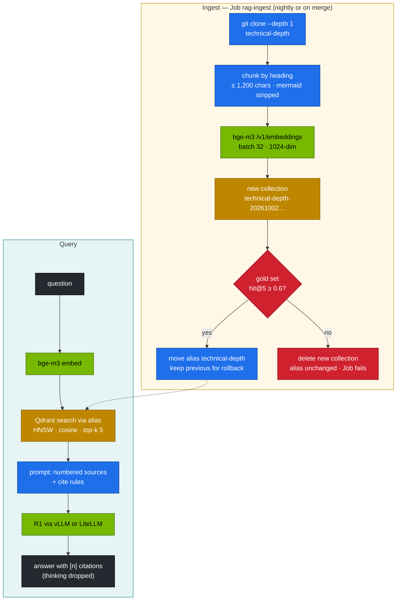

# Volume 29 — Enterprise RAG on the Spark: bge-m3 Embeddings, Qdrant, Blue/Green Re-Indexing with a Quality Gate, and Measured Retrieval

> **Module 03 · Part VII — Applications** · Prev: [28 LiteLLM gateway](28-litellm-proxy-gateway-load-balancing.md) · Next: [30 Tool calling & agents](30-tool-calling-and-agentic-json.md)

| | |
|---|---|
| **You will build** | Retrieval-augmented generation over this repository, run like a production service. bge-m3 embeds on the GB10 next to the chat model. Qdrant stores the vectors behind an alias, so a re-index builds a new collection, is scored against a gold question set, and only then goes live. You can roll back in one command. Answers come from R1 with numbered citations |
| **Hardware** | spark-01 |
| **Time** | 90 min |
| **Risk** | Low. Re-indexing never touches the live collection until it passes the gate |
| **Lab files** | [`tools/rag_demo.py`](lab/tools/rag_demo.py), [`data/rag_gold.jsonl`](lab/data/rag_gold.jsonl), [`k8s/jobs/rag-ingest.yaml`](lab/k8s/jobs/rag-ingest.yaml), [`k8s/apps/bge-m3.yaml`](lab/k8s/apps/bge-m3.yaml), [`02 …/50-workloads/qdrant-statefulset.yaml`](../02%20Kubernetes/lab/manifests/50-workloads/qdrant-statefulset.yaml) |

---

## 1. Why RAG, and why "enterprise" changes how you build it

A model only knows what it was trained on. RAG retrieves relevant passages at question time and asks the model to answer *from them*, with citations. A demo can stop there. A service needs more:

| Concern | Demo | This lab |
|---|---|---|
| Re-indexing | drop and rebuild the collection. Queries fail meanwhile | build `technical-depth-<timestamp>`, then atomically move alias `technical-depth` |
| Quality | "looks right" | `rag_demo.py eval`: hit@1, hit@5 and MRR on 16 gold questions |
| Bad index | discovered by users | **gate**: a new index below hit@5 0.6 is deleted and never goes live |
| Rollback | re-run ingest and hope | `rag_demo.py rollback` re-points the alias to the previous collection |
| Where embeddings run | a hosted API | bge-m3 on the GB10 (6 % of memory). No data leaves the box |
| Answers | free text | numbered sources, `[n]` citations, "say so" when the answer isn't in them |

---

## 2. Architecture — HLD



---

## 3. LLD

### 3.1 Components and budgets

| Component | Setting | Footprint |
|---|---|---|
| bge-m3 (vLLM `--task=embed`) | 1024-dim, max 8,192 tokens, multilingual | util 0.06 ≈ 7 GiB, 1 time-slice |
| Qdrant v1.13 | StatefulSet, `local-nvme-retain` 20Gi, REST :6333 | ~1–2 GiB RAM for this corpus |
| Collection | Cosine distance, HNSW defaults (m 16, ef_construct 100) | ~1,400 points × 1024 × 4 B ≈ 6 MB of vectors |
| Chat | r1-7b or r1-32b-fp8 | as served |

### 3.2 Chunking rules (`rag_demo.py`)

| Rule | Why |
|---|---|
| split at `#`, `##` and `###` headings, keep the heading as payload | sections are semantic units. The heading becomes the citation label |
| ≤ 1,200 characters per chunk, drop pieces < 80 characters | fits comfortably in bge-m3's window. Avoids empty fragments |
| strip Mermaid blocks | diagram syntax embeds as noise |
| embed `heading + text` | the heading adds context that short chunks lack |
| deterministic point IDs (sha1 of path, heading, text) | the same content gives the same ID, so upserts are idempotent |

### 3.3 Blue/green collections

```text
technical-depth            → alias (what every reader queries)
technical-depth-20261001…  → previous (kept for rollback)
technical-depth-20261002…  → live
```

Qdrant applies alias changes atomically (`POST /collections/aliases` with `delete_alias` + `create_alias` in one request). Searches and point counts work through the alias name.

### 3.4 Retrieval metrics

| Metric | Definition | Use |
|---|---|---|
| hit@1 | expected file is the top result | precision of the first source |
| hit@k | expected file appears in the top k | does the context contain the answer at all |
| MRR | mean of 1/rank of the expected file | rewards ranking it higher |

The gold set (`data/rag_gold.jsonl`) holds 16 questions with the file that answers each. Grow it every time a user reports a bad answer. It's your regression suite for retrieval.

### 3.5 The answer prompt

```text
system: Answer only from the numbered sources. Cite them like [1].
        If the sources do not contain the answer, say so.
user:   Sources:
        [1] (02 Kubernetes/21-…md § 3. LLD) …
        [2] …
        Question: …
```

`temperature 0.3` for grounded answers. For R1 models the thinking is dropped before display (the parser puts it in `reasoning_content`, and the tool also strips any `</think>` prefix).

---

## 4. Integrations

- **02 Vol 10**: Qdrant's StatefulSet, PVC and headless Service.
- **Vol 27**: Open WebUI's own RAG covers ad-hoc uploads. This index covers the shared corpus.
- **Vol 28**: in production, call embeddings and chat through LiteLLM (`embeddings`, `reasoning`) with a scoped key.
- **Vol 30**: the agent's `search_docs` tool can call this retrieval.
- **Vol 33**: run `rag-ingest` nightly. The gate stops a broken corpus or embedder from going live.

---

## 5. Lab

### 5.1 Prerequisites

```bash
kubectl apply -k "02 Kubernetes/lab/manifests/50-workloads"         # Qdrant (if not already)
cd "03 DeepSeek/lab"
kubectl apply -k . && kubectl apply -k k8s/apps
kubectl -n llm-serving rollout status deploy/bge-m3 --timeout=20m
scripts/serve-model.sh r1-7b
```

### 5.2 Index with the gate

```bash
kubectl -n llm-serving delete job rag-ingest --ignore-not-found
kubectl apply -f k8s/jobs/rag-ingest.yaml
kubectl -n llm-serving logs -f job/rag-ingest
```

```text
…  files → 1,4xx chunks
collection technical-depth-2026100215….: 1,4xx points, dim 1024
16 questions  hit@1 0.xx  hit@5 0.xx  MRR 0.xx
gate passed
alias technical-depth: (none) → technical-depth-2026100215…
```

**Record yours.** With bge-m3, expect hit@5 well above the gate.

### 5.3 Measure retrieval from your workstation

```bash
kubectl -n llm-serving port-forward svc/qdrant 6333 &
kubectl -n llm-serving port-forward svc/bge-m3 8001:8000 &
E="--qdrant http://localhost:6333 --embed-url http://localhost:8001"
for k in 1 3 5 10; do python3 tools/rag_demo.py eval $E -k $k | tail -1; done
```

| k | hit@k | MRR |
|---|---|---|
| 1 | | |
| 3 | | |
| 5 | | |
| 10 | | |

Every `MISS` line names the question, the wanted file and what came first. Read two misses and decide whether to fix chunking, the question or the document.

### 5.4 Ask with citations

```bash
kubectl -n llm-serving port-forward svc/vllm 8000 &
python3 tools/rag_demo.py ask "Why does the vLLM Deployment use Recreate and a preStop sleep?" $E \
  --chat-url http://localhost:8000 --chat-model r1-7b --show-context | tail -15
python3 tools/rag_demo.py ask "What is the capital of Australia?" $E --chat-url http://localhost:8000 --chat-model r1-7b | head -3
```

Expected: the first answer cites sources from `02 Kubernetes/21-…`. The second says the sources don't contain the answer. That's the refusal behaviour the system prompt asks for.

### 5.5 Rollback drill

```bash
python3 tools/rag_demo.py ingest --repo ../.. --dirs "02 Kubernetes" "03 DeepSeek" $E      # a second, newer index
curl -s localhost:6333/aliases | jq '.result.aliases'
python3 tools/rag_demo.py rollback $E
curl -s localhost:6333/aliases | jq '.result.aliases'
```

Expected: the alias points at the older collection. Queries never failed during either switch.

### 5.6 Gate drill

```bash
python3 tools/rag_demo.py ingest --repo ../.. --dirs "02 Kubernetes" "03 DeepSeek" $E --gate 0.99; echo "exit $?"
```

Expected: `GATE FAILED … alias technical-depth unchanged` and exit 1. Nothing users see changed.

### 5.7 Latency budget

```bash
time python3 tools/rag_demo.py ask "How does GRPO compute advantages?" $E --chat-url http://localhost:8000 --chat-model r1-7b >/dev/null
```

| Stage | Typical (**record yours**) |
|---|---|
| embed question (bge-m3) | tens of ms |
| Qdrant search (top-5) | a few ms |
| R1 generation | seconds to minutes. Dominates |

Retrieval is almost never the bottleneck. Reasoning length is.

---

## 6. Verify

```bash
scripts/verify.sh rag
```

| Check | Expected |
|---|---|
| alias | `technical-depth` resolves. `points/count` > 100 |
| quality | hit@5 ≥ 0.6 on the gold set |
| citations | answers cite `[n]` and the sources list matches |
| rollback | alias moves to the previous collection |
| gate | a failing index is deleted. Exit code 1 |

---

## 7. Troubleshooting

| Symptom | Cause | Fix |
|---|---|---|
| `Wrong input: Vector dimension error` | collection created with another embedder's dimension | the alias scheme creates a fresh collection per ingest. Don't mix embedders in one |
| hit@5 low everywhere | wrong embedding model, or the query wasn't embedded with the same model | same `--embed-model` for ingest and query. Check `/v1/models` on bge-m3 |
| hit@5 fine, answers wrong | chat model ignores sources, or the context is truncated | lower k, raise `max_tokens`. Check `--show-context` |
| answer has no citations | model or prompt drift | keep the system prompt. A stronger model (r1-32b-fp8) follows it better |
| `409 Conflict` creating an alias | a plain collection has the alias's name | `rag_demo.py` migrates it automatically on the next ingest |
| ingest Job slow | bge-m3 on a busy time-slice | run ingest when chat traffic is low. Raise `--batch` |
| bge-m3 OOM at start | util too high next to a big chat model | keep util 0.06. Check `free -g` |

---

## 8. Scale-out path

| One Spark | Production |
|---|---|
| dense bge-m3, top-k | hybrid search (bge-m3 sparse + dense, or BM25), plus a cross-encoder reranker (bge-reranker) on the top 50 |
| one Qdrant node | Qdrant cluster with replication and sharding. Snapshots to object storage |
| gold set of 16 | hundreds of graded questions, answer-level eval (faithfulness, citation accuracy) in CI |
| repo Markdown | connectors to wikis and tickets, document ACLs stored as payload filters per user |

---

## 9. Checklist

- [ ] I can re-index without downtime and roll back in one command.
- [ ] I measure retrieval with hit@k and MRR, not by eye.
- [ ] A bad index can't go live because the gate stops it.
- [ ] Answers cite sources and refuse when the sources are silent.
