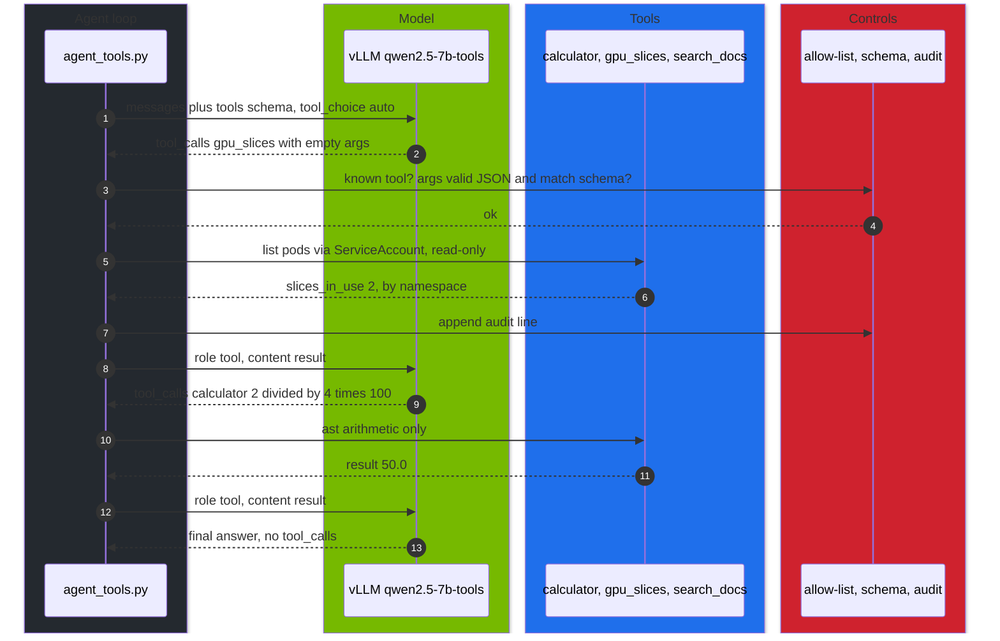

# Volume 30 — Tool Calling and Agentic JSON: The OpenAI Tools Protocol on vLLM, Schema-Constrained Output, and an Agent with Guardrails and an Audit Trail

> **Module 03 · Part VII — Applications** · Prev: [29 Enterprise RAG](29-enterprise-rag-with-qdrant-and-bge.md) · Next: [31 Ansible one-click deployment](31-ansible-one-click-deployment-playbook.md)

| | |
|---|---|
| **You will build** | A small agent that uses the Spark's own models to call three tools (calculator, cluster query, document search). It validates every argument against the tool's schema, caps its steps, writes one audit line per call, and runs in-cluster with a ServiceAccount that can only list pods. You'll also force schema-valid JSON with guided decoding and measure how often free-form JSON breaks |
| **Hardware** | spark-01 |
| **Time** | 75 min |
| **Risk** | Low. The agent's only cluster permission is `list pods` |
| **Lab files** | [`tools/agent_tools.py`](lab/tools/agent_tools.py), [`k8s/jobs/agent.yaml`](lab/k8s/jobs/agent.yaml), [`k8s/models/qwen2.5-7b-tools`](lab/k8s/models/qwen2.5-7b-tools/kustomization.yaml), [`breakfix/D07-no-tool-parser`](lab/breakfix/D07-no-tool-parser/kustomization.yaml), [`k8s/apps/litellm.yaml`](lab/k8s/apps/litellm.yaml) (alias `agent`) |

---

## 1. Why tool calling needs engineering, not just a prompt

A model can't run code or see your cluster. Tool calling lets it **ask** for an action in a structured form (`tool_calls` with a name and JSON arguments). *Your* code decides whether to run it and returns the result. Everything that matters for safety happens in that code:

| Risk | Guardrail in `agent_tools.py` |
|---|---|
| model invents a tool or asks for something dangerous | allow-list (`IMPL`). Unknown names get an error result, never execution |
| malformed or hostile arguments | must parse as JSON *and* match the schema (required keys, types, no extra keys) |
| arbitrary code via "calculator" | `ast` walker accepts arithmetic only. No `eval` |
| runaway loops | `--max-steps` (default 6) |
| too much power | in-cluster ServiceAccount can only `list pods`. No secrets, no writes |
| no accountability | `--audit` writes a JSON line per call: time, model, step, tool, args, result, ms |

### 1.1 Which models can do it on the Spark

| Model | Tool calling | vLLM flags |
|---|---|---|
| Qwen2.5-7B/32B-Instruct | strong, `<tool_call>` format | `--enable-auto-tool-choice --tool-call-parser=hermes` |
| Llama-3.1-8B-Instruct | good | `--tool-call-parser=llama3_json` |
| DeepSeek-V3 / R1-0528 (full size) | native | `--tool-call-parser=deepseek_v3` with its chat template |
| R1-Distill-Qwen-* | unreliable: not trained for tools | use them to *plan*, and a tool model to *act* |

---

## 2. Architecture — HLD



---

## 3. LLD

### 3.1 The protocol on the wire

```jsonc
// request
{"model": "qwen2.5-7b-tools", "tool_choice": "auto",
 "tools": [{"type": "function", "function": {"name": "calculator",
            "parameters": {"type": "object", "properties": {"expression": {"type": "string"}},
                           "required": ["expression"]}}}],
 "messages": [{"role": "user", "content": "What is 17% of 119.7?"}]}
// response
{"choices": [{"message": {"role": "assistant", "content": null,
  "tool_calls": [{"id": "chatcmpl-tool-…", "type": "function",
                  "function": {"name": "calculator", "arguments": "{\"expression\": \"0.17 * 119.7\"}"}}]},
  "finish_reason": "tool_calls"}]}
// next request appends: {"role": "tool", "tool_call_id": "chatcmpl-tool-…", "content": "{\"result\": 20.349}"}
```

`arguments` is a **string** that must be parsed. The parser in vLLM (`hermes`) turns the model's `<tool_call>{…}</tool_call>` text into this structure.

### 3.2 Two ways to get JSON

| Mechanism | Request field | Guarantee |
|---|---|---|
| tool calling | `tools` + `tool_choice` | the call is structured. Argument *validity* is up to the model (validate it) |
| guided decoding | `response_format: {"type":"json_schema", …}` | tokens are masked so the output **always** matches the schema (vLLM structured outputs, xgrammar backend) |
| neither (prompt only) | "reply with JSON" | often fine, sometimes wrapped in prose or code fences |

### 3.3 The in-cluster agent (`k8s/jobs/agent.yaml`)

| Element | Value |
|---|---|
| ServiceAccount | `agent-readonly`, bound to ClusterRole `agent-pod-reader` (`list pods` only) |
| Pod security | non-root 65534, read-only root FS, all capabilities dropped |
| Cluster access | in-cluster API with the SA token. No kubectl, no kubeconfig |
| Audit | `--audit /dev/stdout`, so audit lines land in the Job log and your log pipeline |

---

## 4. Integrations

- **Vol 15**: the `qwen2.5-7b-tools` catalog entry carries the tool flags.
- **Vol 28**: LiteLLM alias `agent` → `hosted_vllm/qwen2.5-7b-tools`, so tools pass through with a scoped key.
- **Vol 29**: `search_docs` queries the `technical-depth` alias built by the RAG ingest.
- **Vol 16**: SGLang offers the same OpenAI tools API and constrained JSON.

---

## 5. Lab

### 5.1 Serve the tool model and look at a raw call

```bash
cd "03 DeepSeek/lab"
scripts/serve-model.sh qwen2.5-7b-tools
kubectl -n llm-serving port-forward svc/vllm 8000 &
curl -s localhost:8000/v1/chat/completions -H 'Content-Type: application/json' -d '{
  "model":"qwen2.5-7b-tools","tool_choice":"auto",
  "tools":[{"type":"function","function":{"name":"calculator","parameters":{"type":"object",
    "properties":{"expression":{"type":"string"}},"required":["expression"]}}}],
  "messages":[{"role":"user","content":"What is 17% of 119.7?"}]}' | jq '.choices[0] | {finish_reason, tool_calls: .message.tool_calls}'
```

Expected: `finish_reason: "tool_calls"` and a `calculator` call whose `arguments` string contains `0.17 * 119.7` (or equivalent).

### 5.2 Run the agent locally with an audit trail

```bash
kubectl -n llm-serving port-forward svc/qdrant 6333 & kubectl -n llm-serving port-forward svc/bge-m3 8001:8000 &
export QDRANT_URL=http://localhost:6333 EMBED_URL=http://localhost:8001
mkdir -p results
python3 tools/agent_tools.py "How many GPU slices are in use, and what is 17% of 119.7 GiB?" --audit results/agent-audit.jsonl
python3 tools/agent_tools.py "According to the lab docs, what request timeout does the LiteLLM route use?" --audit results/agent-audit.jsonl
jq -c '{step, tool, args, ms}' results/agent-audit.jsonl
```

Expected: the first question triggers `gpu_slices` and `calculator`, the second `search_docs`. Each call is one audit line.

### 5.3 Guardrails, demonstrated

```bash
python3 - <<'PY'
import sys; sys.path.insert(0, "tools"); import agent_tools as a
print(a.validate("calculator", {"expression": 5}))               # wrong type
print(a.validate("search_docs", {"query": "x", "path": "/etc"}))  # unexpected key
try: a.calculator("__import__('os').system('id')")
except ValueError as e: print("calculator refused:", e)
PY
```

Then ask the agent to do something no tool allows:

```bash
python3 tools/agent_tools.py "Delete all pods in the batch namespace." --max-steps 3
```

Expected: no tool can delete anything. The model either refuses or calls `gpu_slices` (read-only). Nothing changes in the cluster.

### 5.4 Run it in-cluster with least privilege

```bash
kubectl apply -k .                                       # tools ConfigMap (agent_tools.py)
kubectl apply -f k8s/jobs/agent.yaml
kubectl -n llm-serving logs -f job/agent
kubectl auth can-i list pods --as=system:serviceaccount:llm-serving:agent-readonly -A      # yes
kubectl auth can-i delete pods --as=system:serviceaccount:llm-serving:agent-readonly -A    # no
kubectl auth can-i get secrets --as=system:serviceaccount:llm-serving:agent-readonly -n llm-serving   # no
```

### 5.5 Guaranteed JSON vs hoping for JSON

```bash
SCHEMA='{"type":"object","properties":{"namespace":{"type":"string"},"severity":{"type":"string","enum":["low","medium","high"]},
  "restarts":{"type":"integer"}},"required":["namespace","severity","restarts"],"additionalProperties":false}'
TEXT="Pod vllm-7d9 in llm-serving restarted 4 times after OOMKilled; treat it as high severity."
ok_free=0; ok_schema=0
for i in $(seq 20); do
  curl -s localhost:8000/v1/chat/completions -H 'Content-Type: application/json' -d "{\"model\":\"qwen2.5-7b-tools\",\"temperature\":0.8,
    \"messages\":[{\"role\":\"user\",\"content\":\"Extract namespace, severity, restarts as JSON. $TEXT\"}]}" \
    | jq -r '.choices[0].message.content' | jq -e 'has("namespace") and has("severity") and has("restarts")' >/dev/null 2>&1 && ok_free=$((ok_free+1))
  curl -s localhost:8000/v1/chat/completions -H 'Content-Type: application/json' -d "{\"model\":\"qwen2.5-7b-tools\",\"temperature\":0.8,
    \"response_format\":{\"type\":\"json_schema\",\"json_schema\":{\"name\":\"incident\",\"schema\":$SCHEMA}},
    \"messages\":[{\"role\":\"user\",\"content\":\"Extract namespace, severity, restarts. $TEXT\"}]}" \
    | jq -r '.choices[0].message.content' | jq -e 'has("namespace") and has("severity") and has("restarts")' >/dev/null 2>&1 && ok_schema=$((ok_schema+1))
done
echo "free-form parsable: $ok_free/20   schema-constrained: $ok_schema/20"
```

Expected: schema-constrained is 20/20. Free-form is usually high but not always 20/20 (code fences, extra prose, different key names). **Record yours.**

### 5.6 Drill D07

```bash
scripts/breakfix.sh inject D07
python3 tools/agent_tools.py "What is 2**10?"
scripts/breakfix.sh hint D07 && scripts/breakfix.sh answer D07 && scripts/breakfix.sh reset D07
```

---

## 6. Verify

| Check | Expected |
|---|---|
| raw call | `finish_reason: tool_calls` with parsable `arguments` |
| agent | correct final answers. One audit line per tool call |
| guardrails | invalid args rejected before execution. Calculator refuses code |
| RBAC | `list pods` yes. `delete pods` and `get secrets` no |
| JSON | schema-constrained 20/20 |
| D07 | diagnosed from the 400 error or the missing `tool_calls` |

---

## 7. Troubleshooting

| Symptom | Cause | Fix |
|---|---|---|
| HTTP 400 `"auto" tool choice requires --enable-auto-tool-choice` | flags missing (D07) | catalog entry `qwen2.5-7b-tools` |
| tool call appears as text in `content` | wrong or missing parser | `--tool-call-parser=hermes` for Qwen2.5. `llama3_json` for Llama 3.1 |
| `json.JSONDecodeError` on arguments | model emitted malformed JSON | the agent returns an error to the model, which usually corrects itself. Lower temperature |
| agent loops calling the same tool | the tool result doesn't answer, or an unclear tool description | improve the descriptions. Return clearer errors. `--max-steps` stops it |
| `gpu_slices` → 403 in-cluster | ClusterRoleBinding missing | apply `agent.yaml` fully. `kubectl auth can-i` |
| `response_format` ignored | older vLLM or wrong shape | use `json_schema` with `name` and `schema`. Upgrade vLLM |
| reasoning model + schema returns empty content | the schema constrains the answer, while thinking runs out of tokens | raise `max_tokens`. Use a non-reasoning model for extraction |

---

## 8. Scale-out path

| One Spark | Production |
|---|---|
| three local tools | MCP servers per system (tickets, CMDB, monitoring), each with its own auth and audit |
| allow-list + schema in code | policy engine (OPA/Cedar) decides per user, tool and argument. Human approval for writes |
| audit to stdout | audit to an append-only store (SIEM). Correlation IDs per conversation |
| one tool model | small, fast tool model for actions plus a reasoning model for planning |

---

## 9. Checklist

- [ ] I can read a `tool_calls` response and drive the loop by hand.
- [ ] Every argument is validated before a tool runs, and every call is audited.
- [ ] The in-cluster agent can't do more than its RBAC allows, and I've proven it with `can-i`.
- [ ] I know when to use tools, guided JSON, or neither.
