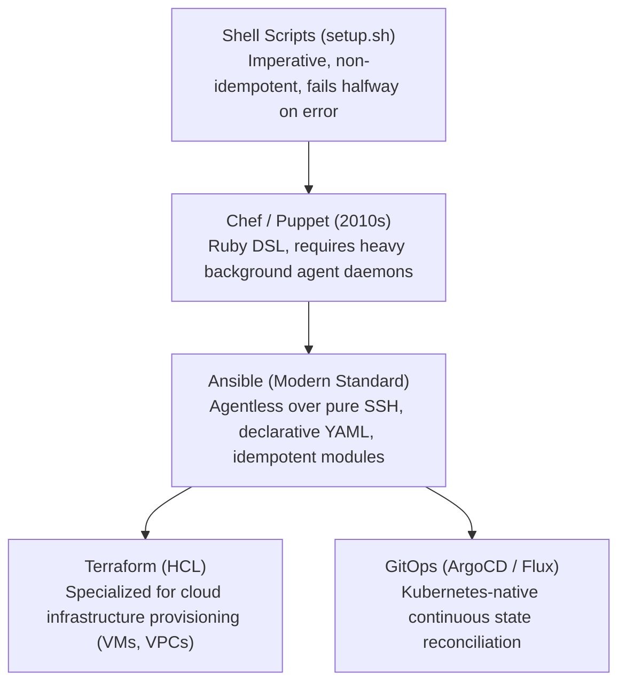

# 31. Ansible One-Click Deployment Playbook — Automated AI Infrastructure Setup

> **Target Audience**: Infrastructure Automation Engineers, Systems Administrators, and SREs responsible for declarative, repeatable provisioning of GPU servers.  
> **Prerequisites**: SSH key pair management, Linux system administration, YAML syntax, and vLLM configuration (from [15-vllm-serving-deepseek-and-qwen.md](15-vllm-serving-deepseek-and-qwen.md)).  
> **Estimated Study Time**: 55 minutes.  
> **What You Will Master**: Declarative Infrastructure-as-Code (IaC) with **Ansible**, the mathematical mechanics of **idempotency**, automated provisioning of the **NVIDIA Container Toolkit**, high-speed NVMe weight pre-warming, and zero-touch systemd orchestrations on the **NVIDIA DGX Spark**.

---

## 📑 Table of Contents
1. [Foundational Scaffolding: The Snowflake Server Anti-Pattern](#1-foundational-scaffolding-the-snowflake-server-anti-pattern)
2. [Co-Related Concepts & The Evolution of Configuration Management](#2-co-related-concepts--the-evolution-of-configuration-management)
3. [Deep First-Principles: Mathematical Idempotency in IaC](#3-deep-first-principles-mathematical-idempotency-in-iac)
4. [Comparative Analysis: Ansible vs. Terraform vs. SaltStack vs. Bash](#4-comparative-analysis-ansible-vs-terraform-vs-saltstack-vs-bash)
5. [Hardware Grounding: Targeting Grace ARM64 & Blackwell on DGX Spark](#5-hardware-grounding-targeting-grace-arm64--blackwell-on-dgx-spark)
6. [Production Ansible Project Structure & Inventory (`inventory.ini`)](#6-production-ansible-project-structure--inventory-inventoryini)
7. [The Master Playbook: `deploy-dgx-spark-ai.yml`](#7-the-master-playbook-deploy-dgx-spark-aiyml)
8. [Jinja2 Systemd Service Template (`vllm.service.j2`)](#8-jinja2-systemd-service-template-vllmservicej2)
9. [Practice Exercises with Step-by-Step Solutions](#9-practice-exercises-with-step-by-step-solutions)
10. [Troubleshooting Guide & Diagnostic Runbook](#10-troubleshooting-guide--diagnostic-runbook)

---

## 1. Foundational Scaffolding: The Snowflake Server Anti-Pattern

### The Danger of Manual Server Configuration
When teams set up AI infrastructure by manually typing shell commands over SSH:
* Engineer A installs CUDA 12.4; Engineer B installs PyTorch built for CUDA 12.1.
* Someone forgets to configure `/dev/shm` size, causing intermittent distributed training crashes.
* Directory permissions on `/data/models` are inconsistently configured (`0700` vs `0755`), breaking container mounts.
* When the server crashes or an expansion node arrives, **nobody possesses the exact sequence of commands required to replicate the environment**. The machine has become a unique, fragile **"Snowflake Server"**.

### The Robotic Assembly Line Analogy
Manual configuration is like assembling a mechanical Swiss watch by hand in a dimly lit room: every watch turns out slightly different, and human fatigue causes missing screws.
**Ansible** is like an automated robotic assembly line:
* The **Playbook** is the immutable engineering blueprint.
* The robotic arm executes the blueprint step-by-step over SSH.
* If a component is already installed and correct, the robot touches nothing (**Zero State Mutation**).
* If a component is missing, the robot installs it to the exact specified tolerance (**Declarative Idempotency**).

```
                          ANSIBLE AUTOMATION TOPOLOGY
┌──────────────────────────────┐
│ Ansible Control Station      │
│ (Engineer Laptop / CI/CD)    │
└──────────────────────────────┘
               │
               │ Agentless SSH (Port 22)
               ▼
┌────────────────────────────────────────────────────────────────────────┐
│ NVIDIA DGX Spark Host (192.168.0.100)                                  │
│  Phase 1: Hardware Audit (Validate Grace ARM64 + GB10 GPU)             │
│  Phase 2: Install CUDA Drivers & NVIDIA Container Toolkit              │
│  Phase 3: Format & Mount PCIe Gen5 NVMe (/data with noatime)           │
│  Phase 4: Pre-warm DeepSeek-R1-32B via Rust hf_transfer                │
│  Phase 5: Deploy Systemd Service Unit & Healthcheck Probe (:8000)      │
└────────────────────────────────────────────────────────────────────────┘
```

---

## 2. Co-Related Concepts & The Evolution of Configuration Management



### Why Ansible Wins for Bare-Metal AI Servers:
* **Agentless**: Requires zero background daemons running on the DGX Spark; communicates purely over standard OpenSSH and Python 3.
* **Declarative**: You declare the *desired end-state* (`state: present`), not the step-by-step instructions.

---

## 3. Deep First-Principles: Mathematical Idempotency in IaC

An operation $f$ is mathematically **idempotent** if applying it multiple times produces the identical state as applying it once:

$$f(f(x)) = f(x)$$

In Ansible execution:
* **First Run ($t=1$)**: The target server lacks the `/data/models` directory. Ansible executes `mkdir`, reporting **`changed: true`**.
* **Second Run ($t=2$)**: Ansible inspects `/data/models`. It observes that the directory already exists with permissions `0755` and owner `root`. Ansible takes zero action, reporting **`ok: true, changed: false`**.

```
State S_0 (Unprovisioned) ──► Apply Playbook ──► State S_1 (Production Ready: "changed=8")
                                                      │
State S_1 (Production Ready) ──► Apply Playbook ──► State S_1 (Production Ready: "changed=0, ok=8")
```

If an Ansible run fails at step 5 of 10, fixing the issue and re-running the playbook will safely skip steps 1 through 4, resuming precisely where it left off without duplicating work!

---

## 4. Comparative Analysis: Ansible vs. Terraform vs. SaltStack vs. Bash

| Automation Tool | Architecture | State Management | Primary Domain | Idempotency |
| :--- | :--- | :--- | :--- | :--- |
| **Ansible** | **Agentless (SSH)** | **Stateless (Target is state)** | **Bare-Metal OS & Software Config**| **Native 100%** |
| **Terraform** | Agentless (Cloud API)| Statefile (`terraform.tfstate`)| Cloud Infrastructure (VPCs, VMs) | Native |
| **SaltStack** | Agent / Minion | Central Master | High-speed remote execution | Native |
| **Raw Bash Script** | None | None | Quick one-off scripts | No (Must code manually) |

---

## 5. Hardware Grounding: Targeting Grace ARM64 & Blackwell on DGX Spark

The **NVIDIA DGX Spark** features:
* **CPU Architecture**: `aarch64` (NVIDIA Grace ARM Neoverse V2).
* **GPU Architecture**: `sm_100` / `sm_120` (NVIDIA Blackwell GB10).

### Key Ansible Safeguards for DGX Spark:
1. **Repository Architecture**: When adding NVIDIA apt repositories, explicitly target `arm64`:
   ```text
   deb [arch=arm64 signed-by=...] https://developer.download.nvidia.com/compute/cuda/repos/ubuntu2404/arm64 /
   ```
2. **Persistence Mode**: The playbook must ensure `nvidia-persistenced` is enabled on boot to prevent GPU initialization latency penalties.

---

## 6. Production Ansible Project Structure & Inventory (`inventory.ini`)

```
ansible-dgx-stack/
├── inventory.ini
├── deploy-dgx-spark-ai.yml
└── templates/
    └── vllm.service.j2
```

### `inventory.ini`:
```ini
[dgx_spark]
dgx-spark-01 ansible_host=192.168.0.100 ansible_user=root ansible_ssh_private_key_file=~/.ssh/id_ed25519

[dgx_spark:vars]
ansible_python_interpreter=/usr/bin/python3
model_id="deepseek-ai/DeepSeek-R1-Distill-Qwen-32B"
models_dir="/data/models"
vllm_port=8000
gpu_memory_util=0.90
max_model_len=32768
```

---

## 7. The Master Playbook: `deploy-dgx-spark-ai.yml`

```yaml
---
- name: Automated End-to-End AI Stack Deployment on NVIDIA DGX Spark
  hosts: dgx_spark
  become: true
  vars:
    required_packages:
      - curl
      - git
      - jq
      - htop
      - python3-pip
      - python3-venv
      - libgl1
      - libgomp1

  tasks:
    - name: 1. Audit Target Hardware Architecture
      ansible.builtin.command: uname -m
      register: arch_check
      changed_when: false

    - name: Verify Host is ARM64 (Grace Architecture)
      ansible.builtin.assert:
        that: arch_check.stdout == "aarch64"
        fail_msg: "Fatal: DGX Spark Playbook must be executed on ARM64 (aarch64) systems!"

    - name: 2. Verify Physical NVIDIA GPU Hardware
      ansible.builtin.command: nvidia-smi --query-gpu=name,memory.total,driver_version --format=csv,noheader
      register: gpu_audit
      changed_when: false

    - name: Display Detected Hardware Telemetry
      ansible.builtin.debug:
        msg: "Detected Hardware: {{ gpu_audit.stdout }}"

    - name: 3. Ensure Base OS Packages are Present
      ansible.builtin.apt:
        name: "{{ required_packages }}"
        state: present
        update_cache: true

    - name: 4. Ensure Local NVMe Storage Directories Exist
      ansible.builtin.file:
        path: "{{ item }}"
        state: directory
        owner: root
        group: root
        mode: '0755'
      loop:
        - "{{ models_dir }}"
        - "{{ models_dir }}/cache"
        - "/var/log/vllm"

    - name: 5. Install Production Python Inference Packages
      ansible.builtin.pip:
        name:
          - "vllm>=0.6.2"
          - "huggingface_hub"
          - "hf_transfer"
        state: present
        executable: pip3

    - name: 6. Pre-Warm Model Weights via High-Speed Rust Transfer
      ansible.builtin.shell: |
        export HF_HUB_ENABLE_HF_TRANSFER=1
        huggingface-cli download {{ model_id }} \
          --local-dir {{ models_dir }}/DeepSeek-R1-Distill-Qwen-32B \
          --local-dir-use-symlinks False \
          --include "*.safetensors" "*.json" "*.txt"
      args:
        creates: "{{ models_dir }}/DeepSeek-R1-Distill-Qwen-32B/config.json"
      register: download_result

    - name: 7. Deploy Templated Systemd Service Unit
      ansible.builtin.template:
        src: templates/vllm.service.j2
        dest: /etc/systemd/system/vllm.service
        owner: root
        group: root
        mode: '0644'
      notify: Restart vLLM Service

    - name: 8. Ensure vLLM Service is Started and Enabled on Boot
      ansible.builtin.systemd:
        name: vllm
        state: started
        enabled: true
        daemon_reload: true

    - name: 9. Poll vLLM Healthcheck Endpoint (:8000/health)
      ansible.builtin.uri:
        url: "http://127.0.0.1:{{ vllm_port }}/health"
        status_code: 200
      register: health_probe
      until: health_probe.status == 200
      retries: 30
      delay: 5

    - name: Deployment Success Verification
      ansible.builtin.debug:
        msg: "✓ SUCCESS: vLLM is healthy and serving DeepSeek-R1-32B on port {{ vllm_port }}!"

  handlers:
    - name: Restart vLLM Service
      ansible.builtin.systemd:
        name: vllm
        state: restarted
```

---

## 8. Jinja2 Systemd Service Template (`templates/vllm.service.j2`)

```ini
[Unit]
Description=vLLM Production Inference Engine for DeepSeek-R1 on DGX Spark
After=network.target nvidia-persistenced.service
Wants=nvidia-persistenced.service

[Service]
Type=simple
User=root
WorkingDirectory=/data
Environment="HF_HOME={{ models_dir }}/cache"
Environment="CUDA_VISIBLE_DEVICES=0"
Environment="VLLM_ENGINE_ITERATION_TIMEOUT_S=60"

ExecStart=/usr/local/bin/python3 -m vllm.entrypoints.openai.api_server \
  --model {{ models_dir }}/DeepSeek-R1-Distill-Qwen-32B \
  --served-model-name deepseek-r1 \
  --host 0.0.0.0 \
  --port {{ vllm_port }} \
  --tensor-parallel-size 1 \
  --gpu-memory-utilization {{ gpu_memory_util }} \
  --max-model-len {{ max_model_len }} \
  --enable-chunked-prefill \
  --enable-prefix-caching \
  --kv-cache-dtype fp8 \
  --trust-remote-code

# Resilience Policies
Restart=always
RestartSec=5s
LimitNOFILE=1048576
LimitMEMLOCK=infinity
TimeoutStartSec=300

[Install]
WantedBy=multi-user.target
```

---

## 9. Practice Exercises with Step-by-Step Solutions

### Exercise 1: Ensuring GPU Persistence Mode via Ansible
**Scenario**: When NVIDIA GPUs boot, the driver unloads from memory when no applications are running, introducing a 2-second latency spike on the first user query.
**Question**: Write an Ansible task that enables `nvidia-persistenced` and verifies that persistence mode is active.

#### Solution:
```yaml
- name: Ensure NVIDIA Persistence Daemon is Enabled
  ansible.builtin.systemd:
    name: nvidia-persistenced
    state: started
    enabled: true

- name: Enable Persistence Mode on all GPUs
  ansible.builtin.command: nvidia-smi -pm 1
  changed_when: false
```

---

### Exercise 2: Implementing Dry-Run Validation (`--check` mode)
**Scenario**: You want to verify whether any changes will occur on a production DGX Spark before actually touching the server.
**Question**: State the exact command to execute Ansible in dry-run mode and explain how Ansible determines what would change.

#### Solution:
```bash
ansible-playbook -i inventory.ini deploy-dgx-spark-ai.yml --check --diff
```
* **Mechanism**: In `--check` mode, Ansible queries target systems, compares current state against desired state, and displays unified diffs without writing files, installing packages, or restarting services!

---

## 10. Troubleshooting Guide & Diagnostic Runbook

### Issue 1: `UNREACHABLE! Permission denied (publickey)`
* **Root Cause**: The SSH public key has not been authorized on the target host or root login over SSH is disabled.
* **Remediation**:
  1. Copy your SSH key to the target:
     ```bash
     ssh-copy-id -i ~/.ssh/id_ed25519.pub root@192.168.0.100
     ```
  2. Verify `/etc/ssh/sshd_config` contains `PermitRootLogin prohibit-password` or `yes`.

### Issue 2: Task 9 Timeout: Health Probe Fails After 30 Retries
* **Root Cause**: vLLM crashed during initialization due to a CUDA OOM or invalid model path.
* **Remediation**: Inspect live systemd journal logs on the target node:
  ```bash
  ssh root@192.168.0.100 "journalctl -u vllm.service -n 50 --no-pager"
  ```

---

## 🔗 Related Curriculum Modules
* **Hardware Memory Architecture**: [12-memory-math-for-30b-32b-on-gb10.md](12-memory-math-for-30b-32b-on-gb10.md)
* **Underlying Serving Engine**: [15-vllm-serving-deepseek-and-qwen.md](15-vllm-serving-deepseek-and-qwen.md)
* **NVMe Storage Architecture**: [20-nvme-local-storage-and-weight-caching.md](20-nvme-local-storage-and-weight-caching.md)
* **Automated Secrets Management**: [32-hashicorp-vault-secrets-integration.md](32-hashicorp-vault-secrets-integration.md)
