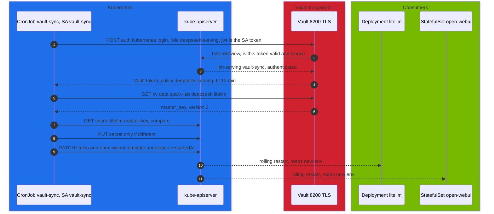

# Volume 32 — HashiCorp Vault for the DeepSeek Stack: Kubernetes Auth, a Least-Privilege Sync, and Secret Rotation That Rolls Its Consumers

> **Module 03 · Part VIII — Automation and operations** · Prev: [31 Ansible one-click](31-ansible-one-click-deployment-playbook.md) · Next: [33 Weight sync & day-2 ops](33-automated-weight-sync-and-day2-ops.md)

| | |
|---|---|
| **You will build** | The stack's secrets (Hugging Face token, LiteLLM master key, Open WebUI signing key) kept in the 01 Ansible lab's Vault. A CronJob logs in with its own Kubernetes ServiceAccount, with no static Vault credential anywhere, and writes only the Secrets it's allowed to. When a value changes it rolls the workloads that read it. Then you rotate the LiteLLM key end to end and prove that other ServiceAccounts are refused |
| **Hardware** | spark-01 (Vault from 01 Ansible runs there) |
| **Time** | 75 min |
| **Risk** | Medium. Rotating the LiteLLM master key invalidates the old one. Have the new value ready |
| **Lab files** | [`scripts/vault-k8s-auth-setup.sh`](lab/scripts/vault-k8s-auth-setup.sh), [`k8s/ops/vault-sync.yaml`](lab/k8s/ops/vault-sync.yaml), [`tools/vault_sync.py`](lab/tools/vault_sync.py), [`tests/mock_vault_k8s.py`](lab/tests/mock_vault_k8s.py) |

---

## 1. Why Vault in front of Kubernetes Secrets

Kubernetes Secrets are fine as the **last hop** to a pod (02 Vol 03 encrypts them at rest in etcd). They're a poor **system of record**: no versioning, no lease or TTL, coarse audit, and they tend to end up in Git as placeholders that someone forgets to replace. Vault adds:

| Property | Kubernetes Secret alone | Vault + sync |
|---|---|---|
| source of truth | the cluster | Vault KV v2, versioned (`vault kv get -version=N`) |
| who can read | RBAC on Secrets | Vault policy per path. Pods log in with their ServiceAccount, no shared password |
| audit | API server audit (if enabled) | Vault audit device: every read, by whom |
| rotation | edit YAML, remember to restart | `vault kv put` → sync → Secret updated → consumers rolled |
| blast radius | anyone with `get secrets` in the namespace | the sync SA can touch **three named Secrets** and **two named workloads** |

---

## 2. Architecture — HLD



---

## 3. LLD

### 3.1 Vault objects (`vault-k8s-auth-setup.sh`)

| Object | Value | Purpose |
|---|---|---|
| auth method | `kubernetes/` | Vault validates pod tokens with the API server's TokenReview |
| reviewer | SA `vault-token-reviewer` + ClusterRoleBinding `system:auth-delegator` | lets Vault call TokenReview |
| config | `kubernetes_host`, `kubernetes_ca_cert`, `token_reviewer_jwt` | where and how to verify |
| policy `deepseek-serving` | `read` on `kv/data/spark-lab/deepseek/*`, `list/read` on its metadata | nothing else |
| role `deepseek-serving` | bound to SA **`vault-sync`** in **`llm-serving`** only. Token TTL 10 min | other SAs are refused |

### 3.2 Paths and the Secrets they feed

| Vault path (KV v2) | Key | Kubernetes Secret | Rolled on change |
|---|---|---|---|
| `kv/spark-lab/deepseek/hf` | `token` | `hf-token` | none: read by each prefetch Job at start |
| `kv/spark-lab/deepseek/litellm` | `master_key` | `litellm-master-key` | `deployment/litellm`, `statefulset/open-webui` |
| `kv/spark-lab/deepseek/webui` | `secret_key` | `open-webui-secret` | `statefulset/open-webui` |

The API path for KV v2 reads is `kv/data/<path>`. That's what `SYNC_MAP` uses.

### 3.3 Kubernetes RBAC for the sync (Role `vault-sync`)

| Resource | Names | Verbs |
|---|---|---|
| secrets | `hf-token`, `litellm-master-key`, `open-webui-secret` | get, update |
| secrets | (any, needed for first creation) | create |
| deployments, statefulsets | `litellm`, `open-webui` | patch |

### 3.4 Why "roll the consumers"

Env vars from Secrets are copied into a container at start. A changed Secret does **nothing** to a running pod. `vault_sync.py` therefore patches `spec.template.metadata.annotations["vault-sync/restartedAt"]` on each listed workload, which is exactly what `kubectl rollout restart` does. The restart happens only when the Secret's data actually changed.

### 3.5 Alternatives

| Tool | Model | When |
|---|---|---|
| this CronJob (≈100 lines, stdlib) | pull every 15 min, write Secrets | learning, small clusters, full transparency |
| Vault Secrets Operator (HashiCorp) | CRDs (`VaultStaticSecret`), event-driven refresh, rollout restarts built in | production with Vault |
| External Secrets Operator | CRDs, many backends (Vault, cloud KMS…) | multi-backend estates |
| Vault Agent injector / CSI provider | secrets as files in the pod, no Secret object | when Secrets must not exist in etcd at all |

---

## 4. Integrations

- **01 Ansible Vols 03 and 19**: Vault itself (TLS, init and unseal, KV v2 at `kv/`, audit device), plus `.cache/spark-lab-ca.crt` and `.cache/vault-init.json`.
- **Vols 27–28**: consumers of `open-webui-secret` and `litellm-master-key`.
- **Drill D05**: a gated model fails until the real HF token arrives through this path.
- **Vol 33**: the same CronJob pattern for day-2 jobs.

---

## 5. Lab

### 5.1 Connect to Vault from the control node

```bash
cd "01 Ansible/lab"
export VAULT_ADDR=https://10.10.10.11:8200 VAULT_CACERT=$PWD/.cache/spark-lab-ca.crt
export VAULT_TOKEN=$(jq -r .root_token .cache/vault-init.json)     # lab only; use an admin token in production
vault status | grep -E 'Sealed|Version'
cd "../../03 DeepSeek/lab"
```

### 5.2 Enable Kubernetes auth and write the secrets

```bash
scripts/vault-k8s-auth-setup.sh
vault kv put kv/spark-lab/deepseek/hf token=hf_xxxxxxxxxxxxxxxx          # your HF token (read scope)
vault kv put kv/spark-lab/deepseek/litellm master_key=sk-$(openssl rand -hex 16)
vault kv put kv/spark-lab/deepseek/webui secret_key=$(openssl rand -hex 32)
vault policy read deepseek-serving
vault read auth/kubernetes/role/deepseek-serving | grep -E 'bound_service_account|token_ttl|policies'
```

### 5.3 Deploy the sync and run it now

```bash
kubectl -n llm-serving create configmap vault-ca --from-file=ca.crt="../../01 Ansible/lab/.cache/spark-lab-ca.crt"
kubectl apply -k . && kubectl apply -f k8s/ops/vault-sync.yaml
kubectl -n llm-serving create job --from=cronjob/vault-sync vs-now
kubectl -n llm-serving logs -f job/vs-now
```

```text
vault login ok: policies=['default', 'deepseek-serving'] ttl=600s
synced   kv/data/spark-lab/deepseek/hf → secret/hf-token (token)
synced   kv/data/spark-lab/deepseek/litellm → secret/litellm-master-key (key)
restart  deployment/litellm (secret/litellm-master-key changed)
restart  statefulset/open-webui (secret/litellm-master-key changed)
synced   kv/data/spark-lab/deepseek/webui → secret/open-webui-secret (secret-key)
restart  statefulset/open-webui (secret/open-webui-secret changed)
3 secret(s) updated
```

Run it again: every line reads `unchanged …` and nothing restarts.

### 5.4 Rotate the LiteLLM master key end to end

```bash
OLD=$(kubectl -n llm-serving get secret litellm-master-key -o jsonpath='{.data.key}' | base64 -d)
vault kv put kv/spark-lab/deepseek/litellm master_key=sk-$(openssl rand -hex 16)
kubectl -n llm-serving create job --from=cronjob/vault-sync vs-rotate && kubectl -n llm-serving logs -f job/vs-rotate
kubectl -n llm-serving rollout status deploy/litellm
NEW=$(kubectl -n llm-serving get secret litellm-master-key -o jsonpath='{.data.key}' | base64 -d)
curl -s -o /dev/null -w 'old key: %{http_code}\n' http://api.lab.local/v1/models -H "Authorization: Bearer $OLD"
curl -s -o /dev/null -w 'new key: %{http_code}\n' http://api.lab.local/v1/models -H "Authorization: Bearer $NEW"
vault kv metadata get kv/spark-lab/deepseek/litellm | grep -E 'current_version'
```

Expected: `old key: 401`, `new key: 200`, and the KV version incremented. Virtual keys created in Vol 28 keep working: they live in PostgreSQL, not in the master key.

### 5.5 Prove the least privilege

```bash
# another ServiceAccount in the same namespace can't use the role
TOKEN=$(kubectl -n llm-serving create token default)
vault write auth/kubernetes/login role=deepseek-serving jwt="$TOKEN"          # → permission denied
# the sync SA can't read other Secrets
kubectl auth can-i get secret/litellm-db -n llm-serving --as=system:serviceaccount:llm-serving:vault-sync   # no
kubectl auth can-i patch deploy/vllm -n llm-serving --as=system:serviceaccount:llm-serving:vault-sync       # no
```

### 5.6 Audit trail

```bash
vault audit list
sudo tail -n 50 /var/log/vault/audit.log | jq -c 'select(.request.path|test("spark-lab/deepseek")) | {time, type, path: .request.path, sa: .auth.metadata.service_account_name}' | tail -5
```

Expected: reads by `service_account_name: vault-sync`, one per path per run. (The audit file path comes from the 01 Ansible Vault role.)

### 5.7 Drill D05 — gated model

```bash
scripts/breakfix.sh inject D05        # serves llama-3.1-8b with the placeholder token
scripts/breakfix.sh hint D05
# accept the Meta licence on huggingface.co, store a token with access, sync, retry:
vault kv put kv/spark-lab/deepseek/hf token=hf_with_access
kubectl -n llm-serving create job --from=cronjob/vault-sync vs-d05
scripts/serve-model.sh llama-3.1-8b
scripts/breakfix.sh reset D05
```

---

## 6. Verify

| Check | Expected |
|---|---|
| login | `policies=[… deepseek-serving]`, `ttl=600s` |
| idempotency | second run: all `unchanged`, no restarts |
| rotation | old key 401, new key 200, consumers rolled |
| least privilege | other SA login denied. `can-i` no for unrelated Secrets and workloads |
| audit | Vault audit lines for each sync read |
| offline test | `tests/run-local-checks.sh` covers create → unchanged → rotate → restart against a mock |

---

## 7. Troubleshooting

| Symptom | Cause | Fix |
|---|---|---|
| `permission denied` at login from vault-sync | role bound to a different SA/namespace, or reviewer JWT expired | re-run `vault-k8s-auth-setup.sh`. Check `vault read auth/kubernetes/role/deepseek-serving` |
| `x509: certificate signed by unknown authority` | `vault-ca` ConfigMap missing or wrong CA | recreate it from `01 Ansible/lab/.cache/spark-lab-ca.crt` |
| `403` updating a Secret | the Secret's name isn't in the Role's `resourceNames` | add it to the Role *and* `SYNC_MAP` |
| `403` on PATCH of a workload | workload not listed in the apps rule | add it to `resourceNames` |
| Secret updated, app still uses the old value | consumer not listed under `restart` | add it. Or the app caches the value: restart it |
| `connection refused` to 10.10.10.11:8200 | Vault sealed or down | `vault status`. Unseal (01 Ansible Vol 19) |
| `KeyError: 'master_key'` | key name differs in Vault | `vault kv get kv/spark-lab/deepseek/litellm` and fix `SYNC_MAP` |

---

## 8. Scale-out path

| One Spark | Production |
|---|---|
| CronJob every 15 min | Vault Secrets Operator with event-driven refresh and built-in rollout restarts |
| KV v2 static secrets | dynamic secrets where possible (database credentials with leases). PKI for service certificates |
| one Vault on spark-01 | Vault HA (Raft) across nodes, auto-unseal (KMS/HSM), DR replication |
| root token in a file (lab) | OIDC login for humans. AppRole/Kubernetes auth for machines. Root token revoked |

---

## 9. Checklist

- [ ] No static Vault credential exists in the cluster.
- [ ] The sync can touch only its three Secrets and two workloads, and I've proven it.
- [ ] Rotating a secret in Vault reaches the running app without manual steps.
- [ ] I can find who read which secret in the Vault audit log.
