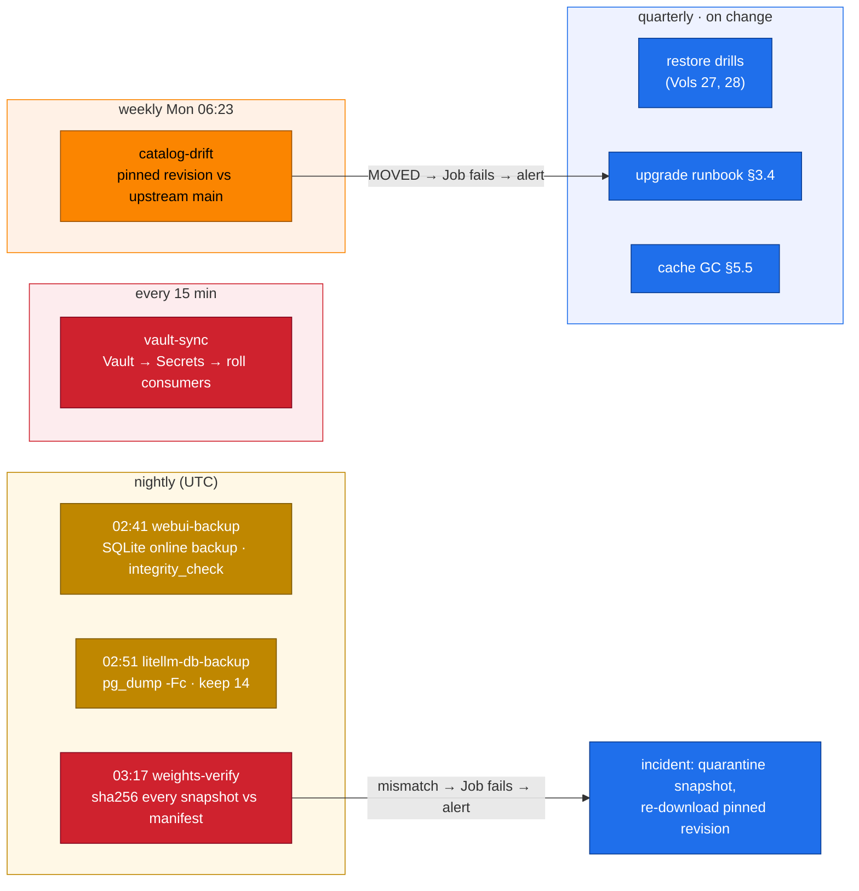
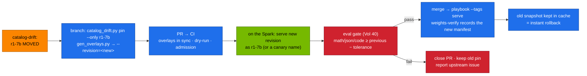

# Volume 33 — Day-2 Operations: Pinned Weights, Upstream Drift Detection, Integrity Checks, Backups and an Upgrade Runbook

> **Module 03 · Part VIII — Automation and operations** · Prev: [32 Vault](32-hashicorp-vault-secrets-integration.md) · Next: [34 DeepSeek vs Llama 3](34-deepseek-vs-meta-llama3.md)

| | |
|---|---|
| **You will build** | The routine that keeps the stack trustworthy after day 1. Every catalog model is pinned to an exact Hugging Face commit. A weekly job reports when upstream moves. A nightly job proves the cached weights haven't changed by a single byte. The chat and gateway databases are backed up and restore-tested. A written upgrade runbook goes from "upstream changed" to "new revision serving, old one ready for rollback" |
| **Hardware** | spark-01 |
| **Time** | 90 min |
| **Risk** | Low. The tamper drill modifies a *copy* of a weight file |
| **Lab files** | [`tools/catalog_drift.py`](lab/tools/catalog_drift.py), [`tools/weights_verify.py`](lab/tools/weights_verify.py), [`k8s/ops/`](lab/k8s/ops/) (`catalog-drift`, `weights-verify`, `webui-backup`, `litellm-db-backup`, `vault-sync`), [`models.yaml`](lab/models.yaml) (`revision`), [`02 …/60-storage/model-prefetch-job.yaml`](../02%20Kubernetes/lab/manifests/60-storage/model-prefetch-job.yaml) (`REVISION`) |

---

## 1. Why day-2 is where AI stacks fail quietly

| Failure | How it happens | What catches it here |
|---|---|---|
| model changes under you | `main` on Hugging Face gets a new commit (re-uploaded weights, new chat template) and the next prefetch silently pulls it | `revision:` pins in the catalog. `catalog-drift` reports upstream moves weekly |
| weights corrupted or tampered with | disk error, partial copy, malicious edit | `weights-verify`: sha256 of every file against a manifest recorded at download |
| keys and chats lost | PVC deleted, node rebuilt | nightly `webui-backup` and `litellm-db-backup` + quarterly restore drill |
| stale secrets | leaked key never rotated | `vault-sync` every 15 min, rotation drill (Vol 32) |
| disk full | every model and revision ever tried stays cached | `hf cache scan` / `hf cache delete` against the catalog |
| upgrade breaks quality | new revision behaves differently | upgrade runbook with an eval gate before rollout (§3.4) |

---

## 2. Architecture — HLD

### 2.1 The schedule



### 2.2 A model upgrade, end to end



---

## 3. LLD

### 3.1 Pinning

| Where | What changes with `revision: <sha>` |
|---|---|
| `models.yaml` | `revision:` under the model (written by `catalog_drift.py pin`) |
| overlay (generated) | vLLM gets `--revision=<sha> --tokenizer-revision=<sha>` |
| prefetch Job | `hf download <repo> --revision <sha>` (env `REVISION`, set by `serve-model.sh` and the playbook) |
| cache | `/models/hf/models--…/snapshots/<sha>/`: several revisions can coexist |

Unpinned entries keep working (`main`), and the drift report lists them as `UNPINNED`.

### 3.2 Integrity: trust on first use

`weights-verify` walks every `snapshots/<sha>/` directory. The first time it sees one, it writes `/models/manifests/<repo>@<sha>.json` with a sha256 for every file. Every later run recomputes and compares, and **any** missing, extra or changed file fails the Job. Record the manifest right after a known-good download (`kubectl create job --from=cronjob/weights-verify …`).

### 3.3 Backups

| Data | Job | Format | Restore | Drill |
|---|---|---|---|---|
| Open WebUI `webui.db` | `webui-backup` | SQLite online backup + `integrity_check` | copy file back with the app scaled to 0 | Vol 27 §5.6 |
| LiteLLM Postgres | `litellm-db-backup` | `pg_dump -Fc` | `pg_restore --clean -d litellm` | §5.4 |
| Qdrant index | rebuildable | — | re-run `rag-ingest` (alias swap) | Vol 29 |
| model weights | rebuildable | — | prefetch the pinned revision | §5.3 |
| Vault | 01 Ansible (Raft snapshot) | — | 01 Ansible runbook | 01 Ansible |

### 3.4 Upgrade runbook (checklist)

1. **Detect**: the `catalog-drift` Job fails with `MOVED <name>`.
2. **Read upstream**: model card and commit diff. Chat template changes are the most common breaking change.
3. **Pin in a branch**: `catalog_drift.py pin --only <name>`, then `gen_overlays.py`, then a PR. CI must be green.
4. **Stage**: serve the new revision on the Spark (`serve-model.sh <name>` from the branch).
5. **Gate**: `eval_harness.py` on the same suites as the last accepted run. Accept if no suite drops by more than your tolerance (e.g. 2 points).
6. **Promote**: merge, then run the playbook with `--tags serve`. Record the new manifest (`weights-verify`).
7. **Keep rollback**: leave the previous snapshot in the cache for at least one release. Rollback = re-pin the old sha and redeploy.

---

## 4. Integrations

- **Vol 15**: the catalog and generator gained `revision`. **Vol 31**: the playbook passes it to prefetch.
- **Vol 32**: `vault-sync` is the 15-minute job in the schedule.
- **Vol 38**: kube-prometheus-stack's `KubeJobFailed` alert turns a failed day-2 Job into a notification.
- **Vol 40**: the eval gate used in step 5.
- **02 Vol 11 / Vol 20**: cache layout and NVMe capacity.

---

## 5. Lab

```bash
cd "03 DeepSeek/lab"
kubectl apply -k .                                 # tools + catalog ConfigMaps
kubectl apply -f k8s/ops/                          # all day-2 CronJobs
kubectl -n llm-serving get cronjobs
```

Expected: `catalog-drift`, `litellm-db-backup`, `vault-sync`, `webui-backup`, `weights-verify` with the schedules from §2.1.

### 5.1 Pin a model

On a workstation with internet access:

```bash
python3 tools/catalog_drift.py report
python3 tools/catalog_drift.py pin --only r1-7b
python3 scripts/gen_overlays.py && git diff models.yaml k8s/models/r1-7b
```

Expected: a `revision:` line under r1-7b, and two new args in its overlay (`--revision=…`, `--tokenizer-revision=…`).

### 5.2 Serve the pinned revision and record its manifest

```bash
scripts/serve-model.sh r1-7b
kubectl -n llm-serving logs job/model-prefetch | tail -1          # downloaded …@<sha>
kubectl -n llm-serving create job --from=cronjob/weights-verify wv-pin && kubectl -n llm-serving logs -f job/wv-pin
```

### 5.3 Tamper drill

Corrupt a byte in a copy of the snapshot (never the live one), then verify the copy against the real manifest:

```bash
kubectl -n llm-serving run tamper --rm -it --restart=Never --image=python:3.12-slim \
  --overrides '{"spec":{"containers":[{"name":"t","image":"python:3.12-slim","stdin":true,"tty":true,
    "command":["bash"],"volumeMounts":[{"name":"m","mountPath":"/models"},{"name":"t","mountPath":"/tools"}]}],
    "volumes":[{"name":"m","persistentVolumeClaim":{"claimName":"model-cache"}},{"name":"t","configMap":{"name":"deepseek-tools"}}]}}'
# inside the pod:
S=$(ls -d /models/hf/models--deepseek-ai--DeepSeek-R1-Distill-Qwen-7B/snapshots/*/ | head -1)
M=/models/manifests/$(echo "$S" | sed 's|/models/hf/models--||; s|/snapshots/|@|; s|/$||; s|/|_|g').json
cp -rL "$S" /tmp/snap && printf '\x00' | dd of=/tmp/snap/config.json bs=1 seek=10 conv=notrunc
python3 /tools/weights_verify.py verify /tmp/snap "$M"; echo "exit $?"
```

Expected: a mismatch on `config.json` and exit 1. In production that's an incident: quarantine the snapshot, re-download the pinned revision, then find out how it changed.

### 5.4 Back up and restore LiteLLM's database

```bash
kubectl -n llm-serving create job --from=cronjob/litellm-db-backup ldb-now && kubectl -n llm-serving logs -f job/ldb-now
```

Restore drill: delete a virtual key (`POST /key/delete`), restore, and check that it works again:

```bash
F=$(kubectl -n llm-serving logs job/ldb-now | awk '/litellm-.*\.dump/{print $NF}' | tail -1)
kubectl -n llm-serving scale deploy litellm --replicas=0
kubectl -n llm-serving run ldb-restore --rm -i --restart=Never --image=postgres:16.10-alpine \
  --overrides '{"spec":{"securityContext":{"runAsUser":70},"containers":[{"name":"r","image":"postgres:16.10-alpine",
    "command":["sh","-c","pg_restore --clean --if-exists -h litellm-db -U litellm -d litellm '"$F"'"],
    "env":[{"name":"PGPASSWORD","valueFrom":{"secretKeyRef":{"name":"litellm-db","key":"password"}}}],
    "volumeMounts":[{"name":"b","mountPath":"/backups"}]}],
    "volumes":[{"name":"b","persistentVolumeClaim":{"claimName":"litellm-db-backups"}}]}}'
kubectl -n llm-serving scale deploy litellm --replicas=1
```

Record the restore time. That's your recovery time for gateway keys.

### 5.5 Cache garbage collection

```bash
kubectl -n llm-serving run hfgc --rm -it --restart=Never --image=python:3.12-slim \
  --overrides '{"spec":{"containers":[{"name":"g","image":"python:3.12-slim","stdin":true,"tty":true,"command":["bash"],
    "env":[{"name":"HOME","value":"/tmp"}],"volumeMounts":[{"name":"m","mountPath":"/models"}]}],
    "volumes":[{"name":"m","persistentVolumeClaim":{"claimName":"model-cache"}}]}}'
# inside:
pip install -q "huggingface_hub[cli]==0.35.3" && export PATH=$HOME/.local/bin:$PATH
hf cache scan --dir /models/hf
hf cache delete --dir /models/hf          # interactive: keep every repo/revision in models.yaml plus the previous pin
```

### 5.6 Drift detection end to end

```bash
kubectl -n llm-serving create job --from=cronjob/catalog-drift cd-now && kubectl -n llm-serving logs -f job/cd-now
```

Expected: `ok` for pinned models still at upstream, `UNPINNED` for the rest. If anything shows `MOVED`, the Job fails, so you get the `KubeJobFailed` alert in Vol 38. Follow §3.4.

---

## 6. Verify

| Check | Expected |
|---|---|
| CronJobs | five present, last schedules successful |
| pin | overlay has `--revision`. Prefetch log shows `@<sha>` |
| integrity | real snapshot passes. Tampered copy fails |
| backups | both Jobs `Complete`. Files in their PVCs. Restores tested and timed |
| drift | report runs. A moved pin fails the Job |
| offline tests | `run-local-checks.sh` covers pin/report/drift against a mock Hub |

---

## 7. Troubleshooting

| Symptom | Cause | Fix |
|---|---|---|
| `Revision not found` in prefetch | sha typo, or a gated repo without a token | `catalog_drift.py report`. HF token via Vault |
| vLLM loads, tokenizer mismatch warnings | revision pinned for weights only | the generator pins both (`--tokenizer-revision`) |
| `weights-verify` fails after an intentional upgrade | new snapshot without a manifest (fine), or the old manifest reused | each snapshot has its own manifest keyed by sha. Check the file name |
| `catalog-drift` HTTP 401/403 for meta-llama | gated repo | `hf-token` Secret with a token that accepted the licence |
| `pg_dump: server version mismatch` | client older than server | same major version image as the server (16) |
| backup Jobs Pending on a two-node cluster | PVC bound to the other node | schedule on the node that holds the PVC, or use a shared storage class |

---

## 8. Scale-out path

| One Spark | Production |
|---|---|
| Hugging Face + local pin | internal model registry/mirror (Artifactory, NGC private registry, S3) with signed artifacts and approval workflow |
| sha256 manifests | signatures (Sigstore model signing), SBOM for models, admission policy that only allows signed revisions |
| CronJobs + `KubeJobFailed` | the same jobs with on-call routing, and backup copies off-node or off-site |

---

## 9. Checklist

- [ ] Every production model is pinned to a commit, and I know when upstream moves.
- [ ] A changed byte in cached weights fails a job I'll hear about.
- [ ] Chat history and gateway keys are backed up, and I've timed a restore of each.
- [ ] I can upgrade a model through a gate and roll it back.
