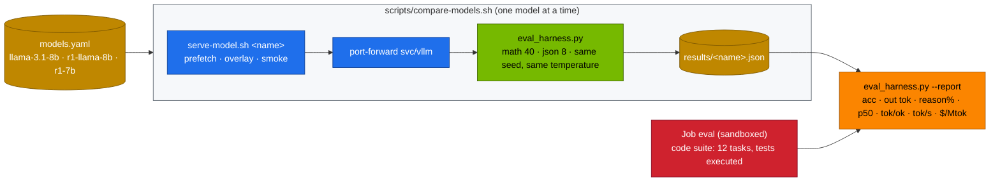

# Volume 34 — DeepSeek vs Meta Llama 3: Same Base Model, With and Without R1 Distillation, Measured on One GB10

> **Module 03 · Part IX — Model comparisons** · Prev: [33 Day-2 ops](33-automated-weight-sync-and-day2-ops.md) · Next: [35 DeepSeek vs Qwen2.5](35-deepseek-vs-alibaba-qwen25.md)

| | |
|---|---|
| **You will build** | A controlled comparison that isolates what DeepSeek's R1 distillation adds. Llama-3.1-8B-Instruct vs DeepSeek-R1-Distill-Llama-8B (the same Llama-3.1-8B base, fine-tuned on R1 reasoning traces), with R1-Distill-Qwen-7B as a third point. All three are served by the same vLLM on the same Spark and scored on the same suites, and you'll get accuracy, tokens per correct answer, latency, throughput and $/1M tokens. Optional: the 70B pair across two Sparks |
| **Hardware** | spark-01 (spark-02 for the 70B pair) |
| **Time** | 2 h (mostly unattended) |
| **Risk** | Low. Llama repos are gated: accept the licence and sync the token first (Vol 32, drill D05) |
| **Lab files** | [`scripts/compare-models.sh`](lab/scripts/compare-models.sh), [`tools/eval_harness.py`](lab/tools/eval_harness.py), [`tools/model_math.py`](lab/tools/model_math.py), [`models.yaml`](lab/models.yaml) (`llama-3.1-8b`, `r1-llama-8b`, `r1-7b`), [`k8s/jobs/eval.yaml`](lab/k8s/jobs/eval.yaml), [`k8s/multinode/lws-vllm-70b.yaml`](lab/k8s/multinode/lws-vllm-70b.yaml) |

---

## 1. Why this comparison is more interesting than "which is better"

DeepSeek released R1-Distill models built on *other companies'* bases: Qwen2.5 and Llama 3. DeepSeek-R1-Distill-Llama-8B starts from **Llama-3.1-8B (base)** and is fine-tuned on ~800K samples generated by DeepSeek-R1. Comparing it with Meta's own **Llama-3.1-8B-Instruct** holds the architecture, tokenizer and pre-training constant. The difference is (almost entirely) the post-training recipe:

| | Llama-3.1-8B-Instruct | R1-Distill-Llama-8B | R1-Distill-Qwen-7B |
|---|---|---|---|
| Base | Llama-3.1-8B | Llama-3.1-8B | Qwen2.5-Math-7B |
| Post-training | Meta SFT + RLHF/DPO (chat, tools, safety) | SFT on R1 reasoning traces only (no RL) | SFT on R1 reasoning traces only |
| Output style | direct answer | `<think>` chain, then answer | `<think>` chain, then answer |
| Tool calling | yes (`llama3_json`) | not trained for it | not trained for it |
| Licence | Llama 3.1 Community Licence (gated, acceptable-use policy) | inherits the Llama 3.1 licence | Apache 2.0 base + MIT (DeepSeek) |
| Recommended sampling | temperature ~0.6, system prompt OK | temperature 0.6, top-p 0.95, **no system prompt**, all instructions in the user turn | same as left |

The hypothesis to test: distillation buys accuracy on multi-step problems and pays for it in output tokens and latency.

---

## 2. Architecture — HLD



---

## 3. LLD

### 3.1 Architecture numbers (`model_math.py --compare`)

| Model | Params | Attention | KV per token (bf16) | Weights (bf16) | Concurrent 32K seqs at util 0.30 |
|---|---|---|---|---|---|
| Llama-3.1-8B / R1-Distill-Llama-8B | 8.03 B | GQA 32 q / 8 kv heads, 32 layers | 128 KiB | 15.0 GiB | 4 |
| R1-Distill-Qwen-7B | 7.6 B | GQA 28 q / 4 kv heads, 28 layers | 56 KiB | ~14 GiB | ~10 |
| Llama-3.3-70B / R1-Distill-Llama-70B | 70.6 B | GQA 64 / 8, 80 layers | 320 KiB | ~131 GiB | needs 2 Sparks (bf16) or FP8 |

The Qwen-based 7B stores less than half the KV per token of the Llama 8B, because it has 4 KV heads instead of 8 and fewer layers. At long reasoning lengths, that's a real concurrency difference on the same memory.

### 3.2 Fair-comparison rules (built into `compare-models.sh`)

| Rule | Setting |
|---|---|
| same engine, image, memory budget | vLLM 25.09, util 0.30, max-model-len 32K |
| same prompts | the harness's suites. Instructions in the user turn (works for R1, harmless for Llama) |
| same sampling | temperature 0.6 (the harness default). `max_tokens` 8192 so R1 chains aren't cut |
| same concurrency | 8 |
| same grading | exact integer (math), exact fields (json), executed unit tests (code, in a pod) |
| report tokens, not just accuracy | `tok/ok` = output tokens spent per correct answer |

### 3.3 Reading the report

| Column | Meaning |
|---|---|
| `<suite> acc` | fraction correct |
| `out tok` | mean completion tokens (thinking + answer) |
| `reason%` | share of output that was thinking (`reasoning_content`) |
| `p50 s` | median request latency |
| `tok/ok` | total output tokens ÷ correct answers: the real cost of a right answer |
| `tok/s` | aggregate generation throughput at concurrency 8 |
| `$/Mtok` | local cost per 1M output tokens (power + amortised hardware) |

---

## 4. Integrations

- **Vol 15**: all three are catalog entries. `r1-llama-8b` was added for this volume.
- **Vol 32**: Llama repos are gated, so `hf-token` must come from Vault with a token that accepted Meta's licence.
- **Vol 30**: if you need tool calling, Llama-3.1-8B-Instruct does it natively (`llama3_json`). The R1 distills don't.
- **Vol 37**: the same harness compares against hosted APIs.

---

## 5. Lab

### 5.1 Predict before you measure

```bash
cd "03 DeepSeek/lab"
python3 tools/model_math.py --compare llama-3.1-8b deepseek-r1-distill-llama-8b deepseek-r1-distill-qwen-7b
for m in llama-3.1-8b deepseek-r1-distill-llama-8b deepseek-r1-distill-qwen-7b; do
  python3 tools/model_math.py $m --util 0.30 --ctx 32768 | grep -E 'KV cache|verdict'; done
```

Write down which you expect to win on math accuracy, on tokens per answer, and on latency.

### 5.2 Run the head-to-head (math + json)

```bash
MAX_TOKENS=8192 POWER_W=200 scripts/compare-models.sh llama-3.1-8b r1-llama-8b r1-7b
```

Expected shape of the final table (**record yours**: numbers depend on image, sampling and your Spark):

```text
model            json acc  math acc  out tok  reason%  p50 s  tok/ok   tok/s  $/Mtok
------------------------------------------------------------------------------------
llama-3.1-8b       …         …          …       0%      …      …        …      …
r1-llama-8b        …         …          …      ~80–95%  …      …        …      …
r1-7b              …         …          …      ~80–95%  …      …        …      …
```

Questions to answer from your table:

1. How many points of math accuracy did distillation add to the *same* Llama base?
2. How many times more output tokens per correct answer (`tok/ok`) did it cost?
3. Did JSON extraction (a short, non-reasoning task) get better, worse or stay the same?
4. Qwen-based vs Llama-based distill: which wins on accuracy, and which on `tok/s` at equal memory?

### 5.3 The code suite, sandboxed

```bash
for m in llama-3.1-8b r1-llama-8b; do
  scripts/serve-model.sh $m
  kubectl -n llm-serving delete job eval --ignore-not-found
  yq ".spec.template.spec.containers[0].args[3] = \"$m\" | .spec.template.spec.containers[0].args += [\"--suites\",\"code\"]" k8s/jobs/eval.yaml | kubectl apply -f -
  kubectl -n llm-serving wait --for=condition=complete job/eval --timeout=60m
  kubectl -n llm-serving logs job/eval | grep -E '^code|tok/s'
done
```

### 5.4 Sampling sensitivity (why "temperature 0" is a trap for R1)

```bash
scripts/serve-model.sh r1-llama-8b
kubectl -n llm-serving port-forward svc/vllm 8000 &
for t in 0 0.6 1.0; do
  python3 tools/eval_harness.py --url http://localhost:8000 --model r1-llama-8b --suites math --limit 20 \
    --temperature $t --max-tokens 8192 | grep -E '^math'
done
```

Expected: at temperature 0, some chains loop until `max_tokens` (drill D06), so accuracy drops and output tokens spike. 0.6 is the sweet spot DeepSeek recommends. Repeat with `llama-3.1-8b`: the instruct model is much less sensitive.

### 5.5 (2×) The 70B pair

R1-Distill-Llama-70B (derived from Llama-3.3-70B-Instruct) vs Llama-3.3-70B-Instruct. The LWS manifest serves the R1 distill in FP8 (~71 GB) split TP=2 across both Sparks over the CX-7 link, as `r1-70b`. For the Llama side, swap the checkpoint and served name:

```bash
kubectl apply -f k8s/multinode/lws-vllm-70b.yaml                     # r1-70b
# … run the harness against it, then:
sed -e 's|RedHatAI/DeepSeek-R1-Distill-Llama-70B-FP8-dynamic|RedHatAI/Llama-3.3-70B-Instruct-FP8-dynamic|' \
    -e 's|--served-model-name r1-70b|--served-model-name llama-3.3-70b|' k8s/multinode/lws-vllm-70b.yaml | kubectl apply -f -
```

Use the same harness settings as §5.2. On a single Spark, either FP8 70B fits at util 0.75 with ~21 GiB of KV (2 sequences at 32K, per `model_math.py llama-3.3-70b --dtype fp8 --util 0.75`). That's tight but usable for a low-concurrency comparison.

---

## 6. Verify

| Check | Expected |
|---|---|
| fairness | all three ran with the same suites, sampling, concurrency and `max_tokens` |
| table | filled in, including `tok/ok` and `p50 s` |
| conclusion | one sentence each on accuracy gain, token cost and latency cost of distillation |
| sampling | temperature 0 visibly hurts the R1 distill |

---

## 7. Troubleshooting

| Symptom | Cause | Fix |
|---|---|---|
| `401/403 … gated repo` on prefetch | licence not accepted, or placeholder token | accept on huggingface.co, sync the token (Vol 32), drill D05 |
| R1 distill answers inside `content` with `<think>` | reasoning parser missing | catalog entry has `--reasoning-parser=deepseek_r1` (D01) |
| R1 math accuracy suspiciously low, `out tok` ≈ `max_tokens` | truncation or loops | raise `MAX_TOKENS`. Temperature 0.6 (D06) |
| Llama answers "ANSWER: …" missing | instruct model ignored the format line | it counts as wrong. That's part of the result |
| `tok/s` very different between runs | other pods sharing the GPU slice | run comparisons with only one chat model and nothing else heavy |

---

## 8. Scale-out path

| One Spark | Production evaluation |
|---|---|
| 60 small original items | standard suites (lm-eval-harness: GSM8K, MATH-500, MMLU-Pro, IFEval) plus your own domain set |
| 8B class | 70B class on 2 Sparks or FP8. Full R1/V3 needs datacenter scale (Vol 14) |
| one run per model | ≥ 3 seeds and confidence intervals before deciding |

---

## 9. Checklist

- [ ] I can explain what R1 distillation changes on a fixed base model.
- [ ] I measured accuracy *and* tokens per correct answer *and* latency.
- [ ] I know which of the three I'd deploy for math-heavy, JSON-heavy and tool-heavy workloads.
- [ ] I've seen why R1-style models need temperature ~0.6.
