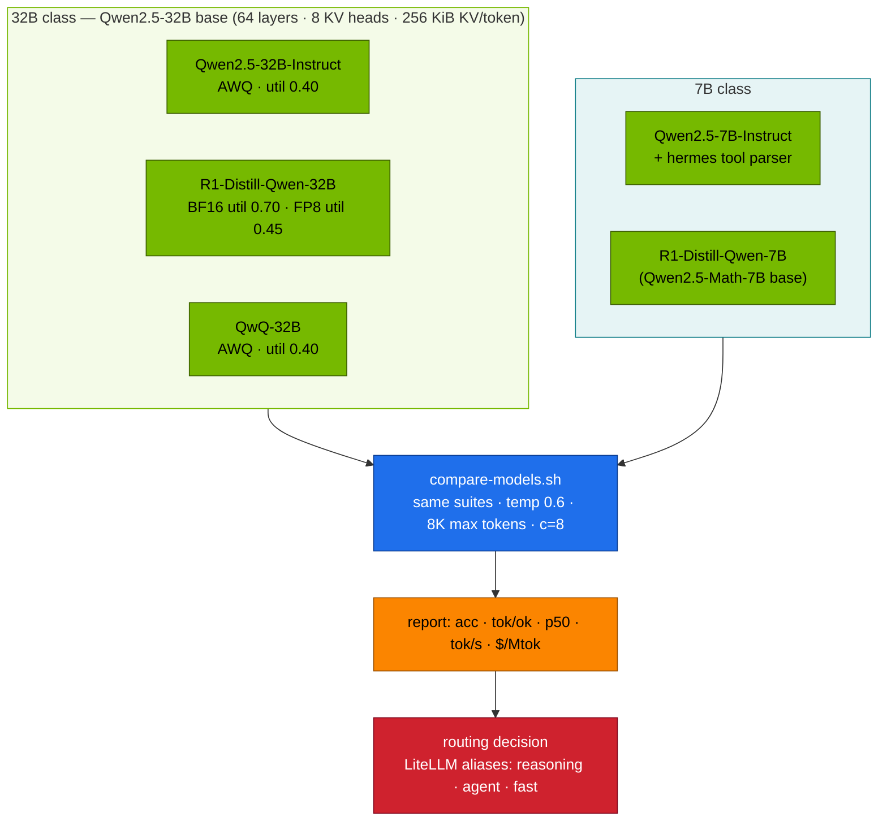

# Volume 35 — DeepSeek vs Alibaba Qwen2.5: Distilled Reasoner, RL-Trained Reasoner and Instruct Model on the Same Qwen Base

> **Module 03 · Part IX — Model comparisons** · Prev: [34 DeepSeek vs Llama 3](34-deepseek-vs-meta-llama3.md) · Next: [36 DeepSeek vs Mistral](36-deepseek-vs-mistral-and-mixtral.md)

| | |
|---|---|
| **You will build** | Two controlled comparisons on Qwen2.5 bases. At 32B: DeepSeek-R1-Distill-Qwen-32B (SFT on R1 traces) vs Qwen's QwQ-32B (Qwen's own RL-trained reasoner) vs Qwen2.5-32B-Instruct (no reasoning). At 7B: R1-Distill-Qwen-7B vs Qwen2.5-7B-Instruct with tool calling. You'll measure accuracy, token cost, latency and memory, separate the effect of quantisation from the effect of the model, and end with a routing decision you can implement in LiteLLM |
| **Hardware** | spark-01 |
| **Time** | 2.5 h (mostly unattended) |
| **Risk** | Low |
| **Lab files** | [`scripts/compare-models.sh`](lab/scripts/compare-models.sh), [`tools/eval_harness.py`](lab/tools/eval_harness.py), [`models.yaml`](lab/models.yaml) (`r1-32b`, `r1-32b-fp8`, `qwq-32b-awq`, `qwen2.5-32b-awq`, `r1-7b`, `qwen2.5-7b-tools`), [`tools/agent_tools.py`](lab/tools/agent_tools.py), [`k8s/apps/litellm.yaml`](lab/k8s/apps/litellm.yaml) |

---

## 1. Why Qwen is the natural comparison

Most R1-Distill models sit on Qwen2.5 bases (1.5B, 7B, 14B, 32B), and Qwen built its own reasoning model, QwQ-32B, on the same Qwen2.5-32B base using reinforcement learning. That makes three post-training philosophies comparable on identical architecture and tokenizer:

| | Qwen2.5-32B-Instruct | DeepSeek-R1-Distill-Qwen-32B | Qwen QwQ-32B |
|---|---|---|---|
| Base | Qwen2.5-32B | Qwen2.5-32B | Qwen2.5-32B |
| Post-training | SFT + RLHF for chat, tools, JSON | **SFT on ~800K R1-generated samples** (no RL) | **large-scale RL** with outcome rewards (math/code), then general RL |
| Thinking | no | `<think>` | `<think>` |
| Tool calling | yes (hermes) | not trained | trained for agentic use (function calling) |
| Licence | Qwen licence (Apache 2.0 for most sizes) | MIT + base licence | Apache 2.0 |
| Lab checkpoint | AWQ int4 | BF16 and FP8 | AWQ int4 |

### 1.1 The quantisation confound, and how to control it

The catalog has the R1 distill in BF16/FP8 and the Qwen models in AWQ int4 (they fit more comfortably). Weight format alone can move accuracy by a point or two and changes speed a lot. So first measure **BF16 vs FP8 for the same R1 model** (§5.2). That tells you how much of any later gap is format rather than model.

---

## 2. Architecture — HLD



---

## 3. LLD

### 3.1 Memory and concurrency on one GB10 (`model_math.py`)

| Entry | Weights | util | KV left | 32K sequences |
|---|---|---|---|---|
| r1-32b (BF16) | ~61 GiB | 0.70 | ~20 GiB | ~2 (catalog caps context at 16K) |
| r1-32b-fp8 | ~31 GiB | 0.45 | ~20 GiB | ~2 |
| qwq-32b-awq / qwen2.5-32b-awq | ~15–18 GiB | 0.40 | ~27–30 GiB | ~3 |
| r1-7b / qwen2.5-7b | ~14 GiB | 0.30 | ~19 GiB | ~10 |

Same architecture means the same KV per token (256 KiB at 32B, 56 KiB at 7B). Only the weight format changes how much is left for KV.

### 3.2 What each comparison isolates

| Comparison | Held constant | Varies | Answers |
|---|---|---|---|
| r1-32b vs r1-32b-fp8 | model | weight format | cost of FP8 (accuracy, speed) |
| r1-32b-fp8 vs qwq-32b-awq | base, "reasoning" | distillation vs RL (and FP8 vs AWQ) | which reasoning recipe wins on your tasks |
| qwq-32b-awq vs qwen2.5-32b-awq | base, AWQ | reasoning vs instruct | what thinking buys and costs |
| r1-7b vs qwen2.5-7b-tools | size class | reasoning vs instruct + tools | which to put behind `reasoning-fast` vs `agent` |

---

## 4. Integrations

- **Vol 15**: all entries are in the catalog. `qwq-32b-awq` was added for this volume (with the `deepseek_r1` reasoning parser, which also understands QwQ's `<think>` output).
- **Vol 28**: the outcome becomes LiteLLM aliases. Clients don't change when you swap the model behind an alias.
- **Vol 30**: the tool-calling part uses `agent_tools.py`.
- **Vol 12**: the memory numbers above come from the same math.

---

## 5. Lab

```bash
cd "03 DeepSeek/lab"
python3 tools/model_math.py --compare qwen2.5-32b deepseek-r1-distill-qwen-32b qwq-32b qwen2.5-7b deepseek-r1-distill-qwen-7b
```

### 5.1 Run the 32B triangle (plus the format control)

```bash
MAX_TOKENS=8192 LIMIT=0 scripts/compare-models.sh r1-32b r1-32b-fp8 qwq-32b-awq qwen2.5-32b-awq
```

This takes a while. The 32B models generate long chains at modest tok/s. Run it unattended and come back to the table (**record yours**):

| model | math acc | json acc | out tok | reason% | p50 s | tok/ok | tok/s |
|---|---|---|---|---|---|---|---|
| r1-32b (BF16) | | | | | | | |
| r1-32b-fp8 | | | | | | | |
| qwq-32b-awq | | | | | | | |
| qwen2.5-32b-awq | | | | | | | |

### 5.2 Read the format control first

Compare `r1-32b` vs `r1-32b-fp8`:

- accuracy difference (usually within noise for FP8 with dynamic per-token activation scales)
- `tok/s` difference (FP8 reads half the bytes per token, so decode is faster on a bandwidth-bound GB10)

Only a gap *larger* than this one between R1 and QwQ says something about the models rather than the formats.

### 5.3 The 7B pair and tools

```bash
MAX_TOKENS=8192 scripts/compare-models.sh r1-7b qwen2.5-7b-tools
scripts/serve-model.sh qwen2.5-7b-tools
kubectl -n llm-serving port-forward svc/vllm 8000 &
python3 tools/agent_tools.py "What share of 4 GPU slices is 3, in percent, and what is 17% of 119.7 GiB?" --model qwen2.5-7b-tools
```

Then try the same agent loop with `r1-7b` (serve it, `--model r1-7b`, and add `--enable-auto-tool-choice --tool-call-parser=hermes` to its args if you want to give it a fair chance). Expected: the instruct model emits clean `tool_calls`. The distill often reasons *about* tools in text instead.

### 5.4 Turn the results into routing

A typical outcome on a single Spark, which you should confirm or overturn with your own table:

| Alias (LiteLLM) | Pick | Because |
|---|---|---|
| `reasoning` | the 32B reasoner with the best math acc at acceptable `p50` | hard multi-step questions |
| `reasoning-fast` | r1-7b | most reasoning at a fraction of the latency |
| `agent` | qwen2.5-7b-tools | reliable tool calls and JSON, few tokens |
| `chat` (optional) | qwen2.5-32b-awq | quality answers without long thinking |

Edit `k8s/apps/litellm.yaml` accordingly and `kubectl apply -k k8s/apps`. Only one chat model runs at a time on one Spark, so aliases that point at a model that isn't serving fail over (Vol 28).

---

## 6. Verify

| Check | Expected |
|---|---|
| format control | BF16 vs FP8 difference recorded before any model conclusion |
| table | all four 32B rows and both 7B rows filled in |
| tools | instruct model produces structured `tool_calls`. Distill result noted |
| decision | one alias table, with a one-line reason per row taken from your numbers |

---

## 7. Troubleshooting

| Symptom | Cause | Fix |
|---|---|---|
| QwQ thinking appears in `content` | reasoning parser missing | catalog entry includes `--reasoning-parser=deepseek_r1` |
| QwQ very long outputs, `finish_reason=length` | QwQ thinks at length | raise `MAX_TOKENS` (QwQ's card recommends large budgets). Compare at equal `max_tokens` |
| AWQ model fails to load: `awq_marlin` not supported | image or arch support | `--quantization=awq` (slower kernel), or a newer vLLM image |
| R1 32B BF16 OOM | util 0.70 plus other pods | scale bge-m3 and other GPU pods to 0 for this run |
| identical scores across models | harness pointed at the wrong model, or one served name reused | `curl /v1/models` before each run. `compare-models.sh` checks via the smoke test |

---

## 8. Scale-out path

| One Spark | More capacity |
|---|---|
| one 32B at a time | two Sparks: reasoner on one, tool model on the other, routed by LiteLLM |
| AWQ/FP8 for fit | BF16 everywhere on bigger memory. Newer generations (e.g. Qwen3 with switchable thinking, DeepSeek-V3.x/R1 updates) slot into the same catalog and harness |
| 60 items | domain eval set plus public benchmarks, several seeds |

---

## 9. Checklist

- [ ] I measured the weight-format effect before comparing models.
- [ ] I can state, from my numbers, how distillation and RL compare on the same base.
- [ ] I know which model I'd put behind each LiteLLM alias, and why.
- [ ] I've seen the difference between a tool-trained model and a reasoner trying to use tools.
