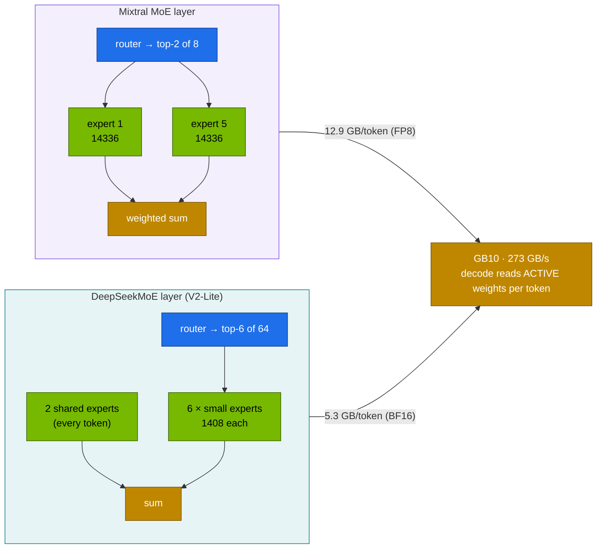

# Volume 36 — DeepSeek vs Mistral and Mixtral: Two Kinds of MoE, One Dense Baseline, and the Bandwidth Math That Predicts Their Speed

> **Module 03 · Part IX — Model comparisons** · Prev: [35 DeepSeek vs Qwen2.5](35-deepseek-vs-alibaba-qwen25.md) · Next: [37 DeepSeek vs o1 and Claude](37-deepseek-vs-openai-o1-and-claude.md)

| | |
|---|---|
| **You will build** | A comparison of mixture-of-experts designs on the GB10: Mixtral-8x7B (8 large experts, top-2, GQA) vs DeepSeek-V2-Lite (64 fine-grained experts + 2 shared, top-6, MLA), with Mistral-7B and R1-Distill-Qwen-7B as dense references. You'll predict each model's single-stream decode speed from memory bandwidth, measure it, and then watch MoE's advantage change as concurrency rises |
| **Hardware** | spark-01 |
| **Time** | 2 h |
| **Risk** | Low |
| **Lab files** | [`tools/model_math.py`](lab/tools/model_math.py) (`decode ceiling`), [`tools/stream_probe.py`](lab/tools/stream_probe.py), [`scripts/compare-models.sh`](lab/scripts/compare-models.sh), [`models.yaml`](lab/models.yaml) (`mistral-7b`, `mixtral-8x7b-fp8`, `v2-lite`, `r1-7b`), [`tools/moe_router_demo.py`](lab/tools/moe_router_demo.py) |

---

## 1. Why compare Mistral's and DeepSeek's MoE

Both companies bet on sparse mixture-of-experts. They made different choices, and those choices show up directly in memory, speed and quality on a single GB10:

| Design choice | Mixtral-8x7B | DeepSeek-V2-Lite (DeepSeekMoE, Vol 02) |
|---|---|---|
| Experts per MoE layer | 8 routed | 64 routed + **2 shared** (always on) |
| Active per token | top-2 | top-6 routed + 2 shared |
| Expert size (FFN width) | 14,336 (large) | 1,408 (fine-grained) |
| Total / active parameters | 46.7 B / 12.9 B | 15.7 B / ~2.7 B |
| Attention | GQA, 8 KV heads, 32 layers | **MLA**, 512-dim latent + 64 RoPE, 27 layers |
| KV per token (bf16) | 128 KiB | 30.4 KiB |
| Licence | Apache 2.0 | DeepSeek model licence |
| Lab checkpoint | FP8 (~44 GiB) | BF16 (~29 GiB) |

**Mistral-7B** (dense, GQA, sliding-window heritage, Apache 2.0) and **R1-Distill-Qwen-7B** (dense reasoner) are the dense baselines at similar per-token cost to Mixtral's active set.

---

## 2. Architecture — HLD



---

## 3. LLD

### 3.1 The bandwidth model

Single-stream decode on a GB10 is memory-bandwidth-bound. Each new token must read every **active** weight once, plus the sequence's KV cache:

```text
tok/s (one stream) ≤ 273 GB/s ÷ (active_params × bytes_per_param + KV_bytes_for_context)
```

`model_math.py` prints this as `decode ceiling` (with a 4K-token context):

| Model (lab format) | Active weights per token | Ceiling (1 stream) | Measured (**record yours**) |
|---|---|---|---|
| Mistral-7B (BF16) | 14.5 GB | ≈ 18 tok/s | |
| R1-Distill-Qwen-7B (BF16) | 15.2 GB | ≈ 18 tok/s | |
| Mixtral-8x7B (FP8) | 12.9 GB | ≈ 20 tok/s | |
| DeepSeek-V2-Lite (BF16) | 5.3 GB | ≈ 50 tok/s | |

Real numbers land below the ceiling (kernel efficiency, routing overhead, attention compute). The *ranking* should hold.

### 3.2 Why MoE's advantage shrinks with batch size

With batch size 1, Mixtral reads 2 of 8 experts per layer. With 8 concurrent sequences, the union of experts touched per layer is close to all 8, so the step reads nearly the **full 44 GiB**, but for 8 tokens at once. Dense and MoE models both become more compute-bound as batch grows, and MoE's "fewer bytes per token" advantage narrows. DeepSeekMoE's 64 small experts have the same property, with a different curve (Vol 09's EPLB exists because of this at datacenter scale).

| | batch 1 | batch 8 |
|---|---|---|
| Mixtral experts read per layer | 2 of 8 | ≈ 7–8 of 8 |
| V2-Lite experts read per layer | 6 of 64 + 2 shared | ≈ 30–40 of 64 + 2 shared |

### 3.3 Memory and concurrency (`model_math.py`)

| Entry | util | Weights | KV left | Sequences at max length |
|---|---|---|---|---|
| mistral-7b | 0.30 | 13.5 GiB | ~19 GiB | ~4 at 32K |
| mixtral-8x7b-fp8 | 0.55 | 43.5 GiB | ~19 GiB | 4 at 32K |
| v2-lite | 0.45 | ~29 GiB | ~22 GiB | **45 at 16K** (MLA) |

---

## 4. Integrations

- **Vol 01–02**: MLA and DeepSeekMoE, with the router demo this volume reuses.
- **Vol 12**: the memory math. `model_math.py` gained the decode ceiling for this volume.
- **Vol 21**: `stream_probe.py` measures single-stream ITL (1000 ÷ ITL p50 ≈ tok/s).
- **Vol 34–35**: same harness and rules. Results go in the same `results/` folder.

---

## 5. Lab

### 5.1 Predict

```bash
cd "03 DeepSeek/lab"
python3 tools/model_math.py --compare mistral-7b mixtral-8x7b deepseek-v2-lite deepseek-r1-distill-qwen-7b
for a in "mistral-7b" "deepseek-r1-distill-qwen-7b" "mixtral-8x7b --dtype fp8 --util 0.55" "deepseek-v2-lite --util 0.45"; do
  python3 tools/model_math.py $a | grep -E '^model|decode ceiling'; done
```

### 5.2 Measure single-stream speed

```bash
for m in mistral-7b mixtral-8x7b-fp8 v2-lite r1-7b; do
  scripts/serve-model.sh $m
  kubectl -n llm-serving port-forward svc/vllm 8000 >/dev/null & pf=$!; sleep 3
  python3 tools/stream_probe.py --url http://localhost:8000 --model $m --max-tokens 512 \
    --prompt "Explain, in about 300 words, how a mixture-of-experts router chooses experts." | grep -E 'ITL|total'
  kill $pf
done
```

Fill in the "Measured" column of §3.1 with `1000 / ITL p50`. Expected ranking: V2-Lite clearly fastest, then Mixtral FP8 ≈ the dense 7Bs.

### 5.3 Throughput as concurrency rises

```bash
for m in mixtral-8x7b-fp8 v2-lite mistral-7b; do
  scripts/serve-model.sh $m
  kubectl -n llm-serving port-forward svc/vllm 8000 >/dev/null & pf=$!; sleep 3
  for c in 1 4 16; do
    python3 tools/eval_harness.py --url http://localhost:8000 --model $m --suites json --limit 8 \
      --concurrency $c --max-tokens 512 | grep 'tok/s aggregate' | sed "s/^/$m c=$c  /"
  done
  kill $pf
done
```

| model | c=1 tok/s | c=4 | c=16 | scaling c16/c1 |
|---|---|---|---|---|
| mixtral-8x7b-fp8 | | | | |
| v2-lite | | | | |
| mistral-7b | | | | |

Expected: all three scale well with concurrency. The dense model's relative gain is usually largest, because MoE pays its "touch more experts" tax as the batch grows (§3.2).

### 5.4 Quality

```bash
MAX_TOKENS=4096 scripts/compare-models.sh mistral-7b mixtral-8x7b-fp8 v2-lite r1-7b
```

Questions for your table: does Mixtral's larger total capacity beat V2-Lite's on math and JSON? How far ahead is the R1 reasoner on math, and what does it cost in `tok/ok`?

### 5.5 Routing behaviour (optional, connects to Vol 02)

```bash
python3 tools/moe_router_demo.py --experts 8 --topk 2 --groups 1 --limited 1 --steps 40       # Mixtral-like
python3 tools/moe_router_demo.py --experts 64 --topk 6 --groups 1 --limited 1 --steps 40      # V2-Lite-like
```

Compare the load imbalance each layout produces before balancing kicks in.

---

## 6. Verify

| Check | Expected |
|---|---|
| prediction | ceilings computed for all four |
| measurement | measured single-stream speed below each ceiling, same ranking |
| scaling | throughput table at c = 1, 4, 16 |
| quality | comparison table from `compare-models.sh` |

---

## 7. Troubleshooting

| Symptom | Cause | Fix |
|---|---|---|
| Mistral-7B fails: tokenizer/config errors | needs Mistral's native formats | catalog args `--tokenizer-mode=mistral --config-format=mistral --load-format=mistral` |
| Mixtral FP8 repo not found | repo renamed or moved | search Hugging Face for an FP8 or AWQ Mixtral-8x7B-Instruct and update `hf:` |
| V2-Lite fails without `--trust-remote-code` | custom modelling code | catalog includes it. Review the code before trusting it in production |
| measured speed above the ceiling | prefix-cache hits or speculative decoding | use unique prompts. Turn off speculative decoding for this test |
| measured speed far below the ceiling | another GPU workload sharing the slice | scale other GPU pods to 0 |

---

## 8. Scale-out path

| One Spark | Datacenter |
|---|---|
| one MoE model on one GPU, all experts local | expert parallelism across GPUs. All-to-all token dispatch. EPLB to balance hot experts (Vol 09) |
| bandwidth-bound decode | batch-heavy serving where compute and interconnect dominate |
| Mixtral-8x7B, V2-Lite | Mixtral-8x22B, DeepSeek-V3/R1 (671B, 37B active) across 2+ Sparks or HGX/GB200 systems (Vol 14) |

---

## 9. Checklist

- [ ] I can predict single-stream decode speed from active parameters and bandwidth.
- [ ] I measured it and explained the gap to the ceiling.
- [ ] I can explain why MoE's speed advantage narrows as batch size grows.
- [ ] I can contrast Mixtral's coarse experts with DeepSeekMoE's fine-grained + shared experts.
