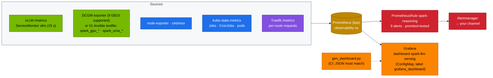

# Volume 38 — Telemetry for the DeepSeek Stack: vLLM Metrics, GB10 and Unified-Memory Signals, Day-2 Job Health, Tested Alerts and One Dashboard

> **Module 03 · Part X — Operate and practise** · Prev: [37 DeepSeek vs hosted APIs](37-deepseek-vs-openai-o1-and-claude.md) · Next: [39 Master troubleshooting](39-master-troubleshooting-playbook.md)

| | |
|---|---|
| **You will build** | Observability for everything Module 03 deployed. vLLM's serving metrics (throughput, TTFT, inter-token latency, reasoning length, KV pressure, finish reasons), GB10 health and power from DCGM or the 01 Ansible textfile collector, unified-memory pressure, gateway traffic, and the day-2 CronJobs. You'll get a 27-panel Grafana dashboard generated from code, nine alerts with promtool unit tests, and a load test you watch move every panel |
| **Hardware** | spark-01 |
| **Time** | 90 min |
| **Risk** | Low |
| **Lab files** | [`observability/rules.yaml`](lab/observability/rules.yaml), [`observability/rules.test.yaml`](lab/observability/rules.test.yaml), [`observability/gen_dashboard.py`](lab/observability/gen_dashboard.py), [`observability/deepseek-serving-dashboard.json`](lab/observability/deepseek-serving-dashboard.json), [`02 …/95-observability/`](../02%20Kubernetes/lab/manifests/root/95-observability/), [`02 …/addons/dcgm-exporter-values.md`](../02%20Kubernetes/lab/addons/dcgm-exporter-values.md) |

---

## 1. Why reasoning models need different telemetry

Classic API monitoring watches request rate, errors and latency. For reasoning models those three hide the important facts:

| Question | Misleading signal | Right signal |
|---|---|---|
| "Is it slow?" | end-to-end latency (minutes is *normal* for R1) | TTFT (queue + prefill) and inter-token latency (decode health) |
| "Are answers complete?" | HTTP 200 | `finished_reason="length"` share (chains cut off at `max_tokens`) |
| "Do we have capacity?" | GPU utilisation (a time-sliced GB10 reads ~100 % whenever anything runs) | `num_requests_waiting`, KV cache usage, preemptions |
| "Is the box healthy?" | node up | UMA available vs page cache, Xid events, clock-throttle reasons |
| "Is day-2 working?" | nothing (CronJobs fail silently) | failed Jobs, hours since last successful run per CronJob |
| "Is it efficient?" | tokens/s alone | tokens per joule |

---

## 2. Architecture — HLD



---

## 3. LLD

### 3.1 The vLLM metrics that matter

| Metric | Type | Use |
|---|---|---|
| `vllm:generation_tokens_total`, `vllm:prompt_tokens_total` | counter | output/input tokens/s |
| `vllm:time_to_first_token_seconds` | histogram | TTFT p50/p95: queueing + prefill |
| `vllm:inter_token_latency_seconds` (older: `time_per_output_token_seconds`) | histogram | decode health. 1/ITL ≈ tok/s per stream |
| `vllm:e2e_request_latency_seconds` | histogram | whole request. Dominated by reasoning length |
| `vllm:request_generation_tokens` | histogram | reasoning length distribution |
| `vllm:num_requests_running` / `_waiting` | gauge | concurrency and queue (the KEDA trigger, Vol 22) |
| `vllm:kv_cache_usage_perc` (older: `gpu_cache_usage_perc`) | gauge | KV pressure. Near 1.0 → preemptions |
| `vllm:num_preemptions_total` | counter | sequences evicted for lack of KV |
| `vllm:request_success_total{finished_reason}` | counter | `stop` vs `length` (truncation) |
| `vllm:prefix_cache_hits_total` / `_queries_total` | counter | prefix-cache effectiveness (Vol 16) |
| `vllm:spec_decode_num_accepted_tokens_total` / `_draft_tokens_total` | counter | speculative acceptance α (Vol 03) |

Metric names changed between vLLM releases. The dashboard queries use `or` across old and new names where needed.

### 3.2 GB10 and UMA signals

| Signal | DCGM (if supported) | 01 Ansible textfile fallback |
|---|---|---|
| utilisation | `DCGM_FI_DEV_GPU_UTIL` | `spark_gpu_utilization_ratio` |
| power | `DCGM_FI_DEV_POWER_USAGE` | `spark_gpu_power_watts` |
| temperature | `DCGM_FI_DEV_GPU_TEMP` | `spark_gpu_temperature_celsius` |
| clock events | — | `spark_gpu_throttle_reasons_bitmask` (bit 0 = idle) |
| Xid errors | `DCGM_FI_DEV_XID_ERRORS` | `spark_gpu_xid_events_24h` |
| unified memory | — (no separate framebuffer) | `spark_uma_available_bytes`, `spark_uma_page_cache_bytes` |

On the GB10, "GPU memory used" from frame-buffer metrics is not the number to watch. The CPU and GPU share LPDDR5x, so **MemAvailable** is the real headroom.

### 3.3 Alerts (`rules.yaml`)

| Alert | Fires when | First action |
|---|---|---|
| `ReasoningTruncated` | > 20 % of requests end with `length` for 15 min | raise `max_tokens`. Check temperature (D06) |
| `VLLMDown` | no vLLM target up for 5 min | `kubectl -n llm-serving get pods -l app=vllm` |
| `PrefixCacheIneffective` | hit rate < 5 % at real traffic | variable text before the shared prefix (Vol 16) |
| `ReasoningTTFTSlow` | p95 TTFT > 10 s for 15 min | queue depth, prompt sizes, scale out |
| `SparkGPUXid` | any Xid in 24 h | `journalctl -k | grep -i xid` (02 Vol 19) |
| `SparkGPUThrottling` | throttle bits beyond idle while > 50 % busy for 15 min | airflow, power, ambient |
| `DayTwoJobFailed` | a day-2 Job failed | its logs + the Vol 33 runbook |
| `VaultSyncStale` | no successful `vault-sync` for 1 h | Vault sealed or auth broken (Vol 32) |
| `BackupStale` | no successful backup for 2 days | backup CronJob logs |

02's platform rules (`SparkUMAPressure`, `VLLMQueueBacklog`, `VLLMKVCacheFull`, etcd…) complement these.

### 3.4 Dashboard rows (27 panels)

| Row | Panels |
|---|---|
| Throughput | output tokens/s, prompt tokens/s |
| Latency | TTFT p50/p95, ITL p50/p95, e2e p95, generated tokens per request (reasoning length) |
| Capacity | running/waiting, KV usage, preemptions/s |
| Quality signals | finish reasons, prefix-cache hit rate, speculative acceptance, **output tokens per joule** |
| GB10 and unified memory | utilisation, power and temperature, throttle and Xid, UMA available vs page cache, pod working sets |
| Gateway and day-2 jobs | Traefik requests/s by route, failed day-2 Jobs, hours since each CronJob last succeeded |

---

## 4. Integrations

- **02 Vols 16 and 19 + `95-observability`**: kube-prometheus-stack, ServiceMonitors, host exporters and the platform dashboard. **01 Ansible** installs the GPU textfile collector.
- **Vol 22**: KEDA scales on the same `num_requests_*` series the dashboard shows.
- **Vols 32–33**: the day-2 panels and alerts watch their CronJobs.
- **Vol 39**: each alert maps to a section of the troubleshooting playbook.

---

## 5. Lab

### 5.1 Deploy rules and dashboard

```bash
cd "03 DeepSeek/lab"
python3 observability/gen_dashboard.py | diff -q - observability/deepseek-serving-dashboard.json && echo "dashboard in sync"
kubectl apply -k observability
kubectl -n observability get prometheusrule spark-reasoning -o jsonpath='{.spec.groups[*].name}'; echo
kubectl -n observability get cm deepseek-serving-dashboard -o jsonpath='{.metadata.labels}'; echo
```

Expected: groups `spark-reasoning spark-gb10 spark-day2`, and label `grafana_dashboard: "1"` so the Grafana sidecar loads it.

### 5.2 Check every source is scraped

```bash
kubectl -n observability port-forward svc/kps-prometheus 9090 &
for q in 'up{job=~".*vllm.*"}' 'spark_gpu_up' 'DCGM_FI_DEV_GPU_UTIL' 'kube_cronjob_status_last_successful_time{namespace="llm-serving"}' \
         'traefik_service_requests_total'; do
  printf '%-75s %s\n' "$q" "$(curl -s localhost:9090/api/v1/query --data-urlencode "query=$q" | jq '.data.result | length')"
done
```

Expected: non-zero for vLLM, `spark_gpu_up` (or DCGM if enabled), CronJobs and Traefik. If DCGM shows 0, that's fine when the textfile collector is in use (see `dcgm-exporter-values.md`).

### 5.3 Unit-test the alerts

```bash
python3 -c "
import yaml; g=[x for d in yaml.safe_load_all(open('observability/rules.yaml')) for x in d['spec']['groups']]
open('observability/rules.extracted.yaml','w').write(yaml.safe_dump({'groups': g}))"
(cd observability && promtool test rules rules.test.yaml) && rm observability/rules.extracted.yaml
```

Expected: `SUCCESS`. The tests prove that 30 % truncation fires `ReasoningTruncated`, 5 % doesn't, a failed `weights-verify` Job fires `DayTwoJobFailed`, and an idle-only throttle bit stays quiet.

### 5.4 Load it and watch the panels move

```bash
scripts/serve-model.sh r1-7b
kubectl -n llm-serving port-forward svc/vllm 8000 &
python3 tools/eval_harness.py --url http://localhost:8000 --model r1-7b --suites math --concurrency 16 --max-tokens 8192
```

Open Grafana → **Spark · LLM serving (DeepSeek)**. During the run (**record yours**):

| Panel | Value under load |
|---|---|
| output tokens/s | |
| TTFT p95 | |
| ITL p50 | |
| generated tokens p95 | |
| KV cache usage peak | |
| tokens per joule | |
| UMA available (min) | |

### 5.5 Make an alert fire for real

```bash
python3 tools/eval_harness.py --url http://localhost:8000 --model r1-7b --suites math --concurrency 8 --max-tokens 256 --temperature 0
```

`max_tokens 256` truncates almost every R1 chain. Within ~15 minutes of sustained traffic, `ReasoningTruncated` goes Pending, then Firing. Check `localhost:9090/alerts` and Alertmanager. The `finish reasons` panel shows `length` dominating.

### 5.6 Day-2 panels

```bash
kubectl -n llm-serving create job --from=cronjob/catalog-drift cd-test
```

With an unpinned or moved catalog the Job may fail on purpose (Vol 33). Watch **Failed day-2 Jobs** and `DayTwoJobFailed`. Then delete the Job.

---

## 6. Verify

| Check | Expected |
|---|---|
| rules loaded | PrometheusRule `spark-reasoning`: three groups, nine rules |
| dashboard | 27 panels. Generated JSON matches the committed file (CI) |
| sources | vLLM, GPU (DCGM or textfile), kube-state-metrics, Traefik all return series |
| alert tests | `promtool test rules` SUCCESS |
| live alert | `ReasoningTruncated` fired under §5.5 and cleared afterwards |

---

## 7. Troubleshooting

| Symptom | Cause | Fix |
|---|---|---|
| no vLLM series | ServiceMonitor missing the `release: kps` label, or wrong port name | the base Deployment's ServiceMonitor has both. `kubectl get servicemonitor -A` |
| panels empty, others fine | metric renamed in your vLLM version | `curl localhost:8000/metrics | grep vllm:` and adjust `gen_dashboard.py` |
| GPU panels empty | DCGM off and textfile collector not installed | 01 Ansible `gpu_telemetry` role |
| dashboard not in Grafana | sidecar label/namespace mismatch | label `grafana_dashboard: "1"` in a namespace the sidecar watches |
| `promtool test` fails after editing an alert | annotation text or labels changed | update `rules.test.yaml`. That's the test doing its job |
| tokens/J looks absurd | power metric missing (division by empty) | check the `POWER` expression sources |

---

## 8. Scale-out path

| One Spark | Fleet |
|---|---|
| one Prometheus | Prometheus per cluster + long-term store (Thanos/Mimir) |
| alerts to one channel | SLOs (TTFT, ITL, truncation rate) with error budgets and burn-rate alerts per tenant |
| GPU via textfile | DCGM exporter everywhere. Per-GPU and per-NVLink metrics on HGX/GB200 |
| request metrics | distributed tracing (OpenTelemetry) through gateway → LiteLLM → engine |

---

## 9. Checklist

- [ ] I watch TTFT, ITL, truncation and queue depth, not just latency and errors.
- [ ] I know which memory number is real headroom on a GB10.
- [ ] Day-2 jobs can't fail silently.
- [ ] My alerts have unit tests, and I've seen one fire for real.
