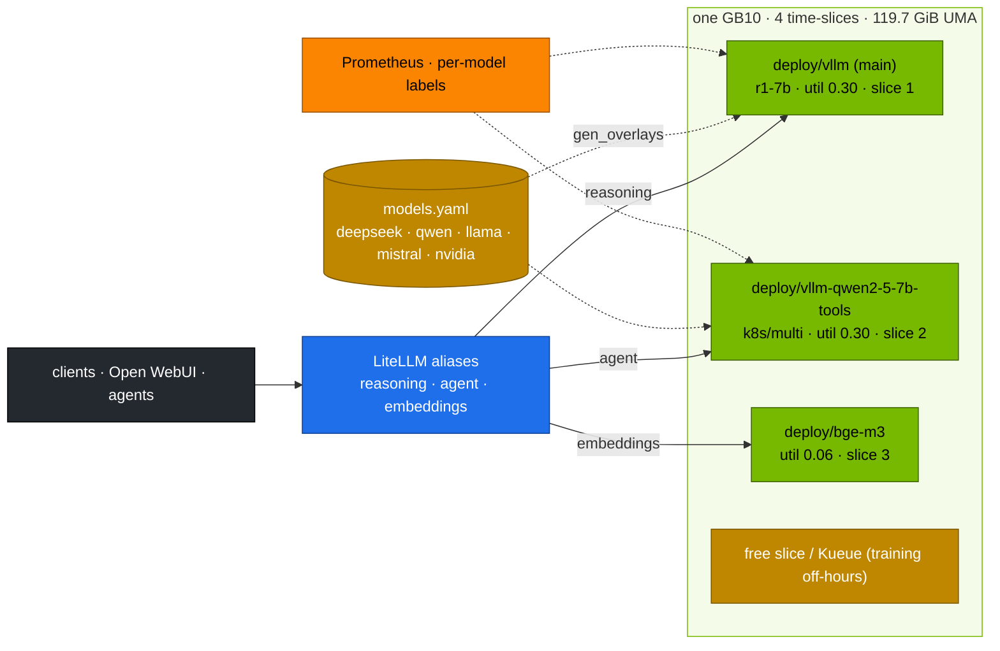

# Volume 41 — One Platform, Many Model Families: DeepSeek, Qwen, Llama, Mistral and NVIDIA Nemotron Side by Side on a DGX Spark

> **Module 03 · Part X — Operate and practise** · Prev: [40 Hands-on workbook](40-hands-on-exercises-workbook.md) · Next: [Module 04 — Qwen](../04%20Qwen/README.md)

| | |
|---|---|
| **You will build** | A multi-vendor serving setup that treats every model family the same way: one catalog, one gateway, one eval harness, one dashboard. Each family's quirks (chat templates, parsers, sampling, licences) live in catalog flags. Two models run **at the same time** on one GB10 (a reasoner and a tool model), each behind its own LiteLLM alias, and you measure how they interfere. NVIDIA's Nemotron joins with its system-prompt reasoning switch, plus an optional NIM path |
| **Hardware** | spark-01 (spark-02 removes the co-location trade-offs) |
| **Time** | 2 h |
| **Risk** | Medium. Two engines share UMA and GPU time. Stay inside the budget in §3.2 |
| **Lab files** | [`models.yaml`](lab/models.yaml), [`k8s/multi/`](lab/k8s/multi/), [`k8s/apps/litellm.yaml`](lab/k8s/apps/litellm.yaml), [`scripts/compare-models.sh`](lab/scripts/compare-models.sh), [`tools/stream_probe.py`](lab/tools/stream_probe.py), [`tools/model_math.py`](lab/tools/model_math.py) |

---

## 1. Why a multi-ecosystem platform

No single model family wins everything (Vols 34–37): DeepSeek's distills reason, Qwen calls tools reliably, Llama has the broadest ecosystem, Mistral is permissively licensed and efficient, and NVIDIA's Nemotron is tuned for NVIDIA's stack with a switchable reasoning mode. An enterprise platform should make adding or swapping a family a **catalog change**, not a new project:

| Concern | Where it lives on this platform |
|---|---|
| weights and revision | `models.yaml` (`hf`, `revision`) |
| engine flags per family | `models.yaml` `args` → generated overlay |
| memory budget | `util` + the playbook's budget guard (Vol 31) |
| client-facing name | LiteLLM alias (Vol 28) |
| access and cost | LiteLLM keys and budgets |
| quality | the same harness and gate (Vol 40) |
| licence and gating | catalog notes + Vault-held HF token (Vol 32) |

---

## 2. Architecture — HLD



---

## 3. LLD

### 3.1 Family differences, captured as catalog flags

| Family (catalog entry) | Chat/output style | vLLM flags in the catalog | Sampling | Licence / access |
|---|---|---|---|---|
| DeepSeek R1 distills (`r1-*`) | `<think>` then answer | `--reasoning-parser=deepseek_r1` | temp 0.6, top-p 0.95, no system prompt | MIT (+ base licence: Apache 2.0 Qwen, Llama licence for Llama bases) |
| DeepSeek V2-Lite / Coder-V2-Lite | chat, MLA + MoE | `--trust-remote-code` | defaults | DeepSeek model licence |
| Qwen2.5 Instruct (`qwen2.5-*`) | chat + `<tool_call>` | `--enable-auto-tool-choice --tool-call-parser=hermes` | temp 0.7 | Apache 2.0 (most sizes) |
| Qwen QwQ (`qwq-32b-awq`) | `<think>` then answer | AWQ + `deepseek_r1` parser | temp 0.6 | Apache 2.0 |
| Llama 3.1 (`llama-3.1-8b`) | chat + JSON tool calls | (`--tool-call-parser=llama3_json` when tools are needed) | temp 0.6 | Llama 3.1 Community Licence, **gated** |
| Mistral (`mistral-7b`, `mixtral-8x7b-fp8`) | chat | `--tokenizer-mode/--config-format/--load-format=mistral` (7B) | temp 0.7 | Apache 2.0 |
| NVIDIA Nemotron Nano (`nemotron-nano-8b`) | reasoning **switch**: system prompt `detailed thinking on/off` | none (Llama-3.1 architecture) | on: temp 0.6, top-p 0.95. Off: greedy | NVIDIA Open Model Licence + Llama 3.1 licence |

Check each model card when you pin a revision (Vol 33). Recommendations change between releases.

### 3.2 Running two chat models at once: the budget

| Workload | util | ≈ GiB | Slice |
|---|---|---|---|
| main `vllm` (r1-7b) | 0.30 | 36 | 1 |
| `vllm-qwen2-5-7b-tools` (k8s/multi) | 0.30 | 36 | 1 |
| bge-m3 | 0.06 | 7 | 1 |
| **sum** | **0.66** | **79** | **3 of 4** |
| OS, k3s, Prometheus, Qdrant, Postgres, WebUI | — | ~15–20 | — |

That leaves ~20 GiB and one slice. Not enough for Kueue training at the same time (its quota is 2 slices), so co-location and daytime training are mutually exclusive on one Spark. The office-hours pattern (Vol 22) or spark-02 resolves this.

### 3.3 How `k8s/multi` overlays avoid collisions

| Problem | Fix in the overlay |
|---|---|
| same Deployment name `vllm` | `nameSuffix: -<model>` → `vllm-qwen2-5-7b-tools` |
| `svc/vllm` (selector `app: vllm`) would also pick the new pods | labels `app: vllm-<model>` with `includeSelectors: true` |
| second copy of the `hf-token` Secret | `$patch: delete`. Both Deployments read the shared, Vault-synced Secret |
| metrics scraping | ServiceMonitor selector patched to the new `app` label. Dashboards key on `model_name`, so both appear |

### 3.4 Interference: time-slicing is not isolation

Both engines submit kernels to the same GPU. Time-slicing alternates between them, so one model's load raises the other's inter-token latency. Unified memory is shared too. §5.3 measures this, and is why production puts latency-sensitive models on separate GPUs (or MIG on datacenter GPUs. The GB10 has no MIG).

---

## 4. Integrations

- **Vols 15, 19**: catalog and generated overlays. `k8s/multi` composes on top of them.
- **Vol 28**: LiteLLM aliases point at the right Service per family.
- **Vol 31**: the playbook deploys the main model. Side-by-side models are an extra `kubectl apply -k`.
- **Vols 34–37**: the comparisons that justify which family sits behind which alias.
- **Modules 04 (Qwen), 05 (NeMo), 06 (Gemma), 07 (NVIDIA)**: deeper dives per ecosystem on this same platform.

---

## 5. Lab

### 5.1 Plan the budget

```bash
cd "03 DeepSeek/lab"
for m in deepseek-r1-distill-qwen-7b qwen2.5-7b; do python3 tools/model_math.py $m --util 0.30 --ctx 32768 | grep -E '^model|verdict|decode'; done
python3 - <<'PY'
import yaml
cat = {m["name"]: m for m in yaml.safe_load(open("models.yaml"))["models"]}
plan = ["r1-7b", "qwen2.5-7b-tools"]
total = sum(cat[n]["util"] for n in plan) + 0.06          # + bge-m3
print("plan", plan, "+ bge-m3 → util", round(total, 2), "OK" if total <= 0.80 else "OVER BUDGET")
PY
```

### 5.2 Two families at once

```bash
scripts/serve-model.sh r1-7b                                   # main
kubectl apply -k k8s/multi/qwen2.5-7b-tools                    # side by side
kubectl -n llm-serving rollout status deploy/vllm-qwen2-5-7b-tools --timeout=30m
kubectl -n llm-serving get deploy -L model -l 'app in (vllm, vllm-qwen2-5-7b-tools, bge-m3)'
free -g
```

Point the LiteLLM `agent` alias at the side Service and apply:

```bash
sed -i 's|model: hosted_vllm/qwen2.5-7b-tools, api_base: http://vllm.llm-serving:8000/v1|model: hosted_vllm/qwen2.5-7b-tools, api_base: http://vllm-qwen2-5-7b-tools.llm-serving:8000/v1|' k8s/apps/litellm.yaml
kubectl apply -k k8s/apps && kubectl -n llm-serving rollout restart deploy/litellm
```

Now `reasoning-fast` (r1-7b) and `agent` (Qwen tools) answer at the same time through one endpoint:

```bash
KEY=<LiteLLM key allowed to use agent and reasoning-fast>; API=http://api.lab.local
python3 tools/agent_tools.py "What share of 4 slices is 3, in percent?" --url $API --api-key $KEY --model agent &
python3 tools/stream_probe.py --url $API --api-key $KEY --model reasoning-fast --max-tokens 1024
wait
```

### 5.3 Measure interference

```bash
kubectl -n llm-serving port-forward svc/vllm 8000 &                      # r1-7b
kubectl -n llm-serving port-forward svc/vllm-qwen2-5-7b-tools 8001:8000 &
# A: r1-7b alone
python3 tools/stream_probe.py --url http://localhost:8000 --model r1-7b --max-tokens 512 | grep ITL
# B: r1-7b while Qwen is under load
python3 tools/eval_harness.py --url http://localhost:8001 --model qwen2.5-7b-tools --suites json --limit 8 --concurrency 16 --max-tokens 1024 >/dev/null &
sleep 5; python3 tools/stream_probe.py --url http://localhost:8000 --model r1-7b --max-tokens 512 | grep ITL; wait
```

| | r1-7b ITL p50 (ms) | r1-7b ITL p99 (ms) |
|---|---|---|
| alone (**record yours**) | | |
| with Qwen at c=16 | | |

Expected: ITL rises noticeably under the neighbour's load. Decide whether that's acceptable for your users or whether the second model belongs on spark-02.

### 5.4 NVIDIA Nemotron: reasoning on demand

```bash
kubectl delete -k k8s/multi/qwen2.5-7b-tools                  # free the memory
scripts/serve-model.sh nemotron-nano-8b
kubectl -n llm-serving port-forward svc/vllm 8000 &
for mode in on off; do
  curl -s localhost:8000/v1/chat/completions -H 'Content-Type: application/json' -d "{\"model\":\"nemotron-nano-8b\",
    \"messages\":[{\"role\":\"system\",\"content\":\"detailed thinking $mode\"},
                  {\"role\":\"user\",\"content\":\"A run checkpoints every 7 steps. How many checkpoints after 100 steps?\"}],
    \"max_tokens\":2048,\"temperature\":$([[ $mode == on ]] && echo 0.6 || echo 0)}" \
  | jq -r --arg m "$mode" '"thinking \($m): \(.usage.completion_tokens) tokens → \(.choices[0].message.content | .[-80:])"'
done
```

Expected: "on" produces a `<think>` section and many more tokens. "off" answers directly. One model, two cost/latency profiles, chosen per request. (No reasoning parser is set for Nemotron, so the thinking stays in `content`. Add `--reasoning-parser=deepseek_r1` in the catalog if your vLLM version handles its tags.)

### 5.5 All families, one table

```bash
MAX_TOKENS=8192 scripts/compare-models.sh r1-7b r1-llama-8b qwen2.5-7b-tools llama-3.1-8b mistral-7b nemotron-nano-8b
```

Add a column by hand for licence/access from §3.1, and you have the input for an architecture decision record.

### 5.6 (Optional) NVIDIA NIM

NVIDIA NIM packages a model, an optimised engine (TensorRT-LLM or vLLM) and an OpenAI-compatible API into one container. If the NGC catalog lists a **DGX Spark** NIM for a model you need:

1. Store the NGC API key in Vault (`kv/spark-lab/deepseek/ngc`) and sync it to a Secret (Vol 32).
2. Deploy the NIM following its NGC page (image, cache volume, GPU request), in `llm-serving`, with `priorityClassName: spark-serving`.
3. Register it in LiteLLM as `openai/<served-name>` at its Service, and run the same harness through the gateway.

The comparison you care about is the one in §5.5: same suites, same gate, whichever engine is underneath.

---

## 6. Verify

| Check | Expected |
|---|---|
| budget | planned util ≤ 0.80 before deploying |
| co-location | both Deployments Ready. `svc/vllm` endpoints contain only the main pod |
| routing | `reasoning-fast` and `agent` answer from different models at the same time |
| interference | ITL alone vs under neighbour load recorded |
| Nemotron | thinking on vs off token counts recorded |
| table | six families compared with one harness |

```bash
kubectl -n llm-serving get endpoints vllm -o jsonpath='{.subsets[*].addresses[*].targetRef.name}'; echo   # only vllm-… main pod
```

---

## 7. Troubleshooting

| Symptom | Cause | Fix |
|---|---|---|
| main `svc/vllm` sometimes answers as Qwen | side overlay without the `app` relabel | use `k8s/multi/*` as provided. Check endpoints |
| side Deployment Pending: `Insufficient nvidia.com/gpu` | slices taken by Kueue jobs | scale training down or remove the side model |
| OOM after adding the second model | util sum too high, page cache | stay ≤ 0.80. Drop caches. Smaller or FP8 models |
| Mistral-7B load errors | missing Mistral formats | catalog flags (Vol 36) |
| Nemotron ignores the switch | system prompt not exactly `detailed thinking on/off` | match the model card wording |
| Llama 403 | gated, token missing | Vol 32, drill D05 |

---

## 8. Scale-out path

| One Spark | Two Sparks | Datacenter |
|---|---|---|
| ≤ 2 chat models + embeddings, shared slices | one family per Spark, no interference. LiteLLM routes across both | dozens of models across GPU pools. Per-model autoscaling. MIG isolation on datacenter GPUs |
| catalog per lab | same | central model registry with approvals per family and licence |
| manual aliasing | same | policy-driven routing by task, tenant and cost |

---

## 9. Checklist

- [ ] Adding a model family is a catalog change plus an eval run, not a project.
- [ ] I ran two families at once on one GB10 and measured the interference.
- [ ] Each family's quirks are captured as flags, sampling defaults and licence notes.
- [ ] I can justify which family serves which alias, with numbers.
