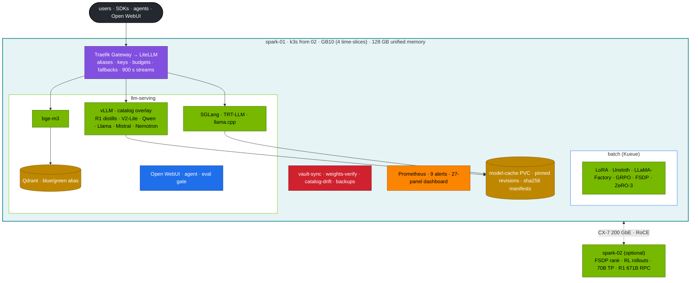
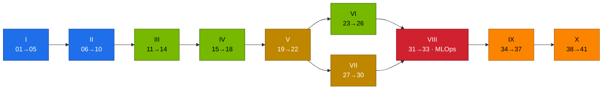

# Module 03 — DeepSeek on NVIDIA DGX Spark: Architecture Proved in Code, Served, Tuned, Operated

Forty-one practical volumes that take DeepSeek from the research papers to a production-style service on one DGX Spark (a second is optional). You prove the architecture ideas (MLA, DeepSeekMoE, MTP, FP8, GRPO) with runnable code. Then you size, serve and compare the models that fit a GB10, fine-tune and RL-train them, build the application stack around them (gateway, chat UI, RAG, agents), and operate it: automation, secrets, day-2 jobs, telemetry, drills and GitOps. Every volume has the same shape: **why → HLD → LLD → integrations → step-by-step lab → verification with expected results → troubleshooting → scale-out path → checklist**. Every command runs against the files in [`lab/`](lab/README.md), on the platform built by [01 Ansible](../01%20Ansible/README.md) and [02 Kubernetes](../02%20Kubernetes/README.md).

**Start here:** [00 · Step-by-step guide](00-deepseek-step-by-step-guide.md) (shortest correct path) · [`lab/README.md`](lab/README.md) · [40 · Workbook](40-hands-on-exercises-workbook.md) (prove it) · [Production MLOps](28-production-mlops-and-gitops.md) (run it like a team)

---

## The stack at a glance

**Diagram colour key** (all volumes): blue = control/automation · teal = host/node · green = GPU work · purple = network · amber = storage · orange = observability · red = security/policy · black = external.

---

## Curriculum

### Part I — Architecture, proved in code

| # | Volume | You build |
|---|---|---|
| 01 | [Multi-head Latent Attention](01-multi-head-latent-attention-mla.md) | MHA vs MLA vs absorbed MLA, same output. KV/token 68.6 KiB vs 5,856 KiB. Decode benchmark |
| 02 | [DeepSeekMoE routing](02-deepseek-moe-fine-grained-routing.md) | group-limited top-8 router, aux-loss-free balancing, a real V2-Lite router probe |
| 03 | [Multi-token prediction](03-multi-token-prediction-mtp.md) | speculative speed-up model, draft and n-gram overlays, measured acceptance |
| 04 | [FP8 mixed precision](04-fp8-mixed-precision-framework.md) | per-tensor vs 128×128 block scaling with outliers, FP8 GEMMs on GB10 |
| 05 | [R1 and GRPO](05-deepseek-r1-and-grpo-reasoning.md) | GRPO on verifiable rewards, R1 sampling rules, distills |

### Part II — DeepSeek's infrastructure ideas

| # | Volume | You build |
|---|---|---|
| 06 | [FlashMLA](06-flash-mla-decoding-kernel.md) | what the kernel does, what runs on sm_121 instead, absorbed-decode timing |
| 07 | [DeepGEMM](07-deepgemm-fp8-library.md) | grouped-GEMM benchmark (loop vs padded vs grouped) |
| 08 | [Context parallelism](08-context-parallelism-and-long-context-attention.md) | ring attention verified with torchrun, 128K serving, needle test |
| 09 | [EPLB](09-eplb-expert-parallelism-load-balancer.md) | expert placement simulation, redundant experts |
| 10 | [3FS](10-3fs-fire-flyer-file-system.md) | CRAQ and the storage design, mapped to the Spark's NVMe/NFS-RDMA |

### Part III — Models on one GB10

| # | Volume | You build |
|---|---|---|
| 11 | [R1-32B and Qwen-32B](11-deepseek-r1-32b-and-qwen-32b-models.md) | 32B BF16 vs FP8 served and evaluated |
| 12 | [Memory math](12-memory-math-for-30b-32b-on-gb10.md) | weights + KV + overhead → fits / sequences / decode ceiling |
| 13 | [Coder-V2 and Math](13-deepseek-coder-v2-and-math-models.md) | MoE coder served, code suite in a sandbox |
| 14 | [V3/R1 671B sharding](14-deepseek-v3-671b-moe-sharding.md) | TP/PP/EP math, R1 at 1.58 bit across two Sparks with llama.cpp RPC |

### Part IV — Serving engines

| # | Volume | You build |
|---|---|---|
| 15 | [vLLM catalog](15-vllm-serving-deepseek-and-qwen.md) | 14-model catalog → generated overlays, parsers, drills D01–D03 |
| 16 | [SGLang](16-sglang-and-radix-attention-serving.md) | RadixAttention vs prefix caching, schema-constrained JSON |
| 17 | [llama.cpp and Ollama](17-ollama-and-llamacpp-local-gguf.md) | sm_121 build, quantisation sweep, c=1 vs c=16 |
| 18 | [TensorRT-LLM](18-tensorrt-llm-compilation-for-deepseek.md) | `trtllm-serve`, a three-engine comparison |

### Part V — Platform integration

| # | Volume | You build |
|---|---|---|
| 19 | [Kubernetes manifests](19-kubernetes-manifests-for-deepseek.md) | the base Deployment field by field, three admission layers |
| 20 | [NVMe and weight caching](20-nvme-local-storage-and-weight-caching.md) | cold/warm loads, page cache on UMA, NFS-RDMA share |
| 21 | [Ingress and streaming](21-ingress-and-realtime-streaming-gateways.md) | SSE timing per hop, timeouts, catching a buffering proxy |
| 22 | [Autoscaling with KEDA, Kueue, KServe](22-autoscaling-with-kserve-and-kueue.md) | serve by day, train by night. Preemption. InferenceService |

### Part VI — Fine-tuning and RL

| # | Volume | You build |
|---|---|---|
| 23 | [LoRA and QLoRA sizing](23-peft-lora-qlora-parameter-sizing.md) | sizing calculator, adapter trained, published, served next to its base |
| 24 | [Unsloth and LLaMA-Factory](24-unsloth-and-llama-factory-workflows.md) | the same fine-tune three ways, measured. Hot-loaded adapters |
| 25 | [RL rollout infrastructure](25-distributed-rl-rollout-infrastructure.md) | GRPO with HF generate vs colocated vLLM vs a rollout server on spark-02 |
| 26 | [FSDP and ZeRO-3](26-distributed-deepspeed-zero3-and-fsdp.md) | 7B full fine-tune: FSDP across two Sparks, or ZeRO-3 with NVMe offload on one |

### Part VII — Applications

| # | Volume | You build |
|---|---|---|
| 27 | [Open WebUI](27-open-webui-deployment-and-integration.md) | approval workflow, visible thinking, RAG on bge-m3, tested backups |
| 28 | [LiteLLM gateway](28-litellm-proxy-gateway-load-balancing.md) | aliases, virtual keys with budgets and limits, fallbacks, load balancing |
| 29 | [Enterprise RAG](29-enterprise-rag-with-qdrant-and-bge.md) | blue/green re-index, quality gate, hit@k/MRR, rollback |
| 30 | [Tool calling and agents](30-tool-calling-and-agentic-json.md) | schema-validated tools, audit log, least-privilege in-cluster agent |

### Part VIII — Automation and operations

| # | Volume | You build |
|---|---|---|
| 31 | [Ansible one-click](31-ansible-one-click-deployment-playbook.md) | preflight guards, check mode, tags, rollback. Linted and dry-run in CI |
| 32 | [Vault](32-hashicorp-vault-secrets-integration.md) | Kubernetes auth, least-privilege sync, rotation that rolls consumers |
| 33 | [Day-2 operations](33-automated-weight-sync-and-day2-ops.md) | revision pinning, upstream drift, integrity, backups, upgrade runbook |
| — | [Production MLOps](28-production-mlops-and-gitops.md) | Argo CD for models, PostSync eval gate, canary, revert |

### Part IX — Model comparisons

| # | Volume | You build |
|---|---|---|
| 34 | [vs Meta Llama 3](34-deepseek-vs-meta-llama3.md) | same Llama base with and without R1 distillation |
| 35 | [vs Alibaba Qwen2.5](35-deepseek-vs-alibaba-qwen25.md) | distilled vs RL-trained (QwQ) vs instruct on one base. Routing decision |
| 36 | [vs Mistral and Mixtral](36-deepseek-vs-mistral-and-mixtral.md) | two MoE designs, bandwidth-predicted vs measured decode speed |
| 37 | [vs hosted reasoning APIs](37-deepseek-vs-openai-o1-and-claude.md) | same harness through LiteLLM, break-even economics, hybrid fallback |

### Part X — Operate and practise

| # | Volume | You build |
|---|---|---|
| 38 | [Telemetry](38-dcgm-prometheus-and-grafana-telemetry.md) | reasoning-aware metrics, GB10/UMA signals, tested alerts, one dashboard |
| 39 | [Troubleshooting playbook](39-master-troubleshooting-playbook.md) | decision tree, `llm-triage.sh`, eight drills |
| 40 | [Workbook](40-hands-on-exercises-workbook.md) | 30 graded exercises, release gate, capstone |
| 41 | [Multi-ecosystem](41-multi-ecosystem-qwen-llama-nemo-deployment.md) | two families at once, interference measured, Nemotron's reasoning switch |

---

## Learning order

The short path through all of it is the [step-by-step guide](00-deepseek-step-by-step-guide.md).

---

## Reference lab

| Item | Value |
|---|---|
| Nodes | spark-01 `192.168.0.100`. Optional spark-02 `192.168.0.101` |
| CX-7 | `192.168.100.0/24` + `192.168.101.0/24`, RoCE, NCCL GID index 3 |
| GPU | GB10, sm_121 / compute capability 12.1, 4 time-slices, no MIG, ≈119.7 GiB visible to CUDA, ~273 GB/s |
| Entry points | `api.lab.local` (LiteLLM), `webui.lab.local` (Open WebUI) via the 02 Gateway |
| Namespaces | `llm-serving` (baseline PSA), `batch` (Kueue `train`), `llm-multinode` (two-Spark), `observability` |
| Versions | [`lab/versions.env`](lab/versions.env) (NGC 25.09 vLLM and PyTorch, SGLang Spark build, TRL 0.23, Transformers 4.56.2, LiteLLM 1.77.5, Open WebUI 0.6.30, Qdrant 1.13.4) + platform from 02 |

## How this module was verified

Without a Spark attached, every tool was run for real: architecture demos on CPU (and the decode, grouped-GEMM and ring-attention benchmarks in torchrun), and the eval harness, gate, stream probe, agent, format check, RAG (against a real Qdrant binary, with blue/green, gate and rollback), vault-sync rotation and catalog drift against mock servers. Every manifest passed kubeconform, a **server-side dry run on a real Kubernetes 1.32 API server** with the 02 platform applied, and a pod-template admission check (PodSecurity, policies, quotas). Alerts passed `promtool test rules`. The Ansible playbook passed `ansible-lint` (production profile) and a check-mode run against that cluster. All Mermaid diagrams render. CI ([`deepseek-lab-ci.yml`](../.github/workflows/deepseek-lab-ci.yml), [`docs-ci.yml`](../.github/workflows/docs-ci.yml)) repeats all of this on kind with a fake GB10 node on every PR. Results that need the GPU (throughput, TTFT, accuracy, power, NCCL bandwidth) are marked **"record yours"** in the volumes. Those are the numbers to measure on your Spark.
