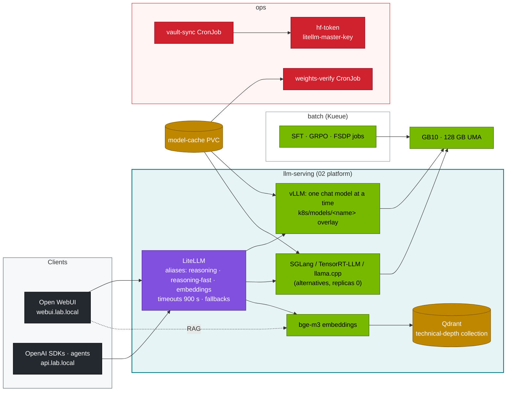

# DeepSeek Lab: runnable companion to Module 03

Everything the 41 volumes teach, as tools, manifests and drills that run on the platform built by
[01 Ansible](../../01%20Ansible/lab/README.md) and [02 Kubernetes](../../02%20Kubernetes/lab/README.md):
one DGX Spark (a second one is optional). Every code block in the volumes comes from this directory.

```
lab/
├── versions.env            # images and Python packages pinned for this module
├── models.yaml             # model catalog: HF repo, vLLM memory fraction, context, flags      (Vol 11-19, 34-37, 41)
├── kustomization.yaml      # ships tools/ + data/ into the cluster as ConfigMaps
├── tools/                  # Python, mostly stdlib; architecture demos run on CPU
│   ├── model_math.py           params (total/active), weight GiB, KV bytes/token, fit on 1-2 Sparks  (Vol 01, 02, 11-14)
│   ├── mla_attention_demo.py   MHA vs MLA vs absorbed MLA: same output, KV cache 9.6× smaller         (Vol 01, 06)
│   ├── moe_router_demo.py      DeepSeek-V3 router + aux-loss-free bias balancing on skewed traffic    (Vol 02)
│   ├── moe_router_probe.py     hook the real router of DeepSeek-V2-Lite on the GB10                   (Vol 02, 09)
│   ├── spec_decode_calc.py     MTP / speculative decoding speed-up from acceptance rate               (Vol 03)
│   ├── fp8_blockscale.py       per-tensor vs 128×128 block FP8 scaling; FP8 vs BF16 GEMM on GB10      (Vol 04, 07)
│   ├── ring_attention_demo.py  context parallelism with ring attention, verified vs full attention    (Vol 08)
│   ├── eplb_sim.py             expert placement: naive vs replicate+pack vs DeepSeek's eplb.py        (Vol 09)
│   ├── grpo_tiny.py            GRPO with rule-based rewards on verifiable arithmetic (TRL)            (Vol 05, 25)
│   ├── sft_lora.py · lora_calc.py · fsdp_finetune.py   LoRA SFT, memory sizing, FSDP2 full fine-tune (Vol 23, 24, 26)
│   ├── eval_harness.py         math / code / JSON suites + reasoning-token and $/Mtok accounting      (Vol 34-37, 40)
│   ├── rag_demo.py             chunk → bge-m3 → Qdrant → cited answers                                 (Vol 29)
│   ├── agent_tools.py          OpenAI tool-calling loop with safe calculator / kubectl / search tools   (Vol 30)
│   ├── vault_sync.py           Vault KV → Kubernetes Secrets via the Kubernetes auth method           (Vol 32)
│   └── weights_verify.py       sha256 manifests for model snapshots                                    (Vol 33)
├── data/                   # original eval sets: 40 math, 12 code (with tests), 8 JSON extraction
├── k8s/
│   ├── models/<name>/      # GENERATED vLLM overlays of 02's Deployment, one per catalog entry     (Vol 15, 19)
│   ├── sglang/ · trtllm/ · llamacpp/   other engines (SGLang FP8, TensorRT-LLM, llama.cpp + RPC)  (Vol 16-18)
│   ├── multinode/          # LeaderWorkerSet + Ray: 70B with tensor parallelism over 2 Sparks       (Vol 14)
│   ├── apps/               # bge-m3 embeddings, LiteLLM gateway, Open WebUI                       (Vol 27-29)
│   ├── jobs/               # eval, RAG ingest, GPU probes, SFT, GRPO, FSDP on 2 Sparks              (Vol 23-26, 29, 40)
│   └── ops/                # Vault sync CronJob, nightly weight verification                       (Vol 32, 33)
├── observability/          # reasoning-specific alerts + "Spark · LLM serving" dashboard (generated) (Vol 38)
├── ansible/deploy-deepseek.yml   # the whole stack in one playbook                                 (Vol 31)
├── scripts/                # serve-model.sh, verify.sh, breakfix.sh (D01-D08), gen_overlays.py, Vault setup
├── breakfix/               # fault-injection overlays                                             (Vol 39)
└── tests/                  # run-local-checks.sh + mock OpenAI servers for GPU-free CI
```

## How the pieces fit



## Quick start

```bash
cd "03 DeepSeek/lab"
tests/run-local-checks.sh                  # no Spark needed: tool tests, data checks, manifests
# on the platform from 02 (scripts/apply-lab.sh done):
kubectl apply -k .                         # tools + eval data as ConfigMaps
scripts/serve-model.sh list
scripts/serve-model.sh r1-7b               # prefetch → drop cache → vLLM overlay → smoke test
kubectl apply -k k8s/apps                  # embeddings, LiteLLM, Open WebUI
scripts/verify.sh
```

Or the whole stack in one go (Vol 31):

```bash
cd "01 Ansible/lab" && ansible-playbook "../../03 DeepSeek/lab/ansible/deploy-deepseek.yml" -e deepseek_model=r1-32b-fp8
```

## One chat model at a time

The GB10's 128 GB is shared by the OS, the platform and every model. The catalog's `util` values keep a single
chat model plus bge-m3 (0.06) under about 0.75 of the pool. `serve-model.sh` scales SGLang and TensorRT-LLM to 0
before it switches vLLM. Bigger models (70B FP8 with tensor parallelism, DeepSeek-R1 671B at 1.58 bit) need two Sparks:
see `k8s/multinode/` and `k8s/llamacpp/rpc-2spark.yaml`.

## What needs a real Spark

CI runs every tool on CPU against mock servers, plus RAG against a real Qdrant and a server-side dry run of every
manifest and pod template. Anything that loads model weights onto the GB10 is marked **record yours** in the volumes:
throughput, TTFT, eval accuracy, FP8 GEMM speed, router histograms and NCCL bandwidth. Image tags in `versions.env`
must have arm64 builds with sm_121 support. Check NGC before a fresh build.
