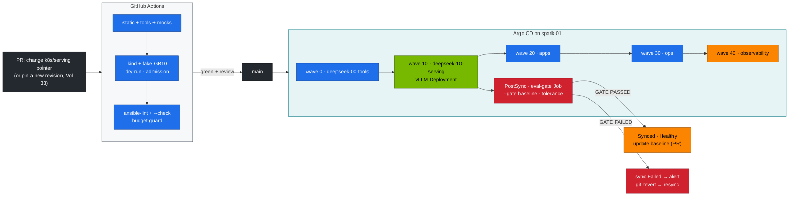

# Production MLOps for the DeepSeek Stack: GitOps for Models, an Eval Gate on Every Sync, Canaries Through the Gateway, and Rollback by Revert

> **Module 03 · companion** · builds on [02 Production MLOps](../02%20Kubernetes/28-production-mlops-and-gitops.md), [31 Ansible](31-ansible-one-click-deployment-playbook.md), [33 Day-2 ops](33-automated-weight-sync-and-day2-ops.md), [40 Workbook](40-hands-on-exercises-workbook.md)

| | |
|---|---|
| **You will build** | Git as the only way to change what the Spark serves. Argo CD syncs the DeepSeek layers in order. The served model is one line in `k8s/serving/kustomization.yaml`. A PostSync hook runs the eval gate against a recorded baseline and fails the sync on regression. A canary runs a candidate model next to production behind LiteLLM. Rollback is `git revert` |
| **Hardware** | spark-01 + a GitHub fork of this repo |
| **Time** | 90 min |
| **Risk** | Medium. With `selfHeal`, manual `serve-model.sh` and drills get reverted. Pause the app first (§5.7) |
| **Lab files** | [`gitops/applications.yaml`](lab/gitops/applications.yaml), [`k8s/serving/`](lab/k8s/serving/kustomization.yaml) (pointer + [`eval-gate-hook.yaml`](lab/k8s/serving/eval-gate-hook.yaml)), [`k8s/multi/`](lab/k8s/multi/), [`.github/workflows/deepseek-lab-ci.yml`](../.github/workflows/deepseek-lab-ci.yml), [`tools/eval_harness.py`](lab/tools/eval_harness.py) (`--gate`) |

---

## 1. Why models need their own delivery pipeline

02's MLOps companion covers platform changes. A model change is riskier in a specific way: the YAML can be perfect and the **behaviour** still regress, through a new revision, a new quantisation, a new engine image or a new chat template. So the pipeline needs a behavioural gate, not just a schema check:

| Stage | Catches | Mechanism |
|---|---|---|
| PR checks (no GPU) | broken manifests, admission violations, drifted overlays, broken tools, alert regressions | `deepseek-lab-ci.yml` (Vol 40 §0) |
| Ansible check mode (CI) | unknown models, over-budget memory | playbook guards on kind (Vol 31) |
| Sync (Argo CD) | cluster drift. Ordering of dependencies | sync waves 0 → 40, `selfHeal` |
| PostSync eval gate | accuracy regression on your suites | `eval-gate` hook → `eval_harness.py --gate` |
| Canary | latency and behaviour on real traffic | `k8s/multi` + LiteLLM weighted pool |
| Rollback | anything above, after the fact | `git revert` → resync → gate passes on the old model |

---

## 2. Architecture — HLD



---

## 3. LLD

### 3.1 Argo CD Applications (`gitops/applications.yaml`)

| Application | Wave | Path | Contents |
|---|---|---|---|
| `deepseek-00-tools` | 0 | `03 DeepSeek/lab` | ConfigMaps: tools, eval data, catalog |
| `deepseek-10-serving` | 10 | `…/k8s/serving` | the served model's overlay + PostSync `eval-gate` |
| `deepseek-20-apps` | 20 | `…/k8s/apps` | bge-m3, LiteLLM + Postgres, Open WebUI |
| `deepseek-30-ops` | 30 | `…/k8s/ops` | day-2 CronJobs |
| `deepseek-40-observability` | 40 | `…/observability` | PrometheusRule + dashboard |

All use `automated: {prune: true, selfHeal: true}` and server-side apply. The 02 platform Applications (waves -10 … 10 in 02) must be synced first.

### 3.2 The serving pointer

```yaml
# k8s/serving/kustomization.yaml
resources:
  - ../models/r1-7b          # ← the only line a model switch changes
  - eval-gate-hook.yaml
```

Weights download on first start into the shared cache (the startupProbe allows 30 min). For large models, run the prefetch Job before merging (Vol 20). `serve-model.sh` stays the tool for *unmanaged* labs.

### 3.3 The eval gate hook

| Property | Value |
|---|---|
| when | `argocd.argoproj.io/hook: PostSync`, so after the Deployment is Healthy |
| what | asks vLLM which model it serves, runs math + json with the harness |
| baseline | ConfigMap `deepseek-eval-baseline` (key `baseline.json`), optional. Missing = bootstrap run, which passes and prints the result |
| decision | `--gate … --tolerance 0.05`. Any suite lower by more than 5 points fails the Job, which fails the sync |
| sandbox | non-root, read-only root, no SA token (no code suite here. Code runs in the separate eval Job) |

The baseline is kept outside the image and updated deliberately (§5.4): a person accepts a new baseline, the gate doesn't.

### 3.4 Canary through the gateway

| Step | Change in Git | Signal |
|---|---|---|
| 1 | add `k8s/multi/<candidate>` to an Application (or a canary app) | candidate Ready next to production. Budget within 0.80 |
| 2 | LiteLLM `reasoning-pool` with production (`rpm` high) and candidate (`rpm` low) | `x-litellm-model-id` shows the split |
| 3 | watch the dashboard per `model_name`: TTFT p95, ITL, truncation, errors | equal or better for 24 h |
| 4 | move the pointer to the candidate, remove the canary | PostSync gate passes |

On one Spark both models must fit at once (Vol 41 §3.2). With spark-02, the canary runs there without interference.

---

## 4. Integrations

- **02 production-mlops**: platform GitOps, conventions, Argo CD install.
- **Vol 33**: revision pinning and the upgrade runbook. This companion automates its "stage → gate → promote".
- **Vol 38**: a failed sync or `eval-gate` Job raises `KubeJobFailed`/Argo CD notifications. Dashboards compare canary and production by `model_name`.
- **Vol 31**: Ansible stays the bootstrap and break-glass path. Don't run both against the same objects at once.

---

## 5. Lab

### 5.1 Install and point at your fork

Argo CD as in [02 production-mlops §2.1](../02%20Kubernetes/28-production-mlops-and-gitops.md), then:

```bash
cd "03 DeepSeek/lab"
sed -i 's|github.com/cloudone365/technical-depth.git|github.com/<you>/technical-depth.git|' gitops/applications.yaml
kubectl apply -n argocd -f gitops/applications.yaml
kubectl -n argocd get applications -l '!app' -o custom-columns=APP:.metadata.name,WAVE:.metadata.annotations.argocd\.argoproj\.io/sync-wave,SYNC:.status.sync.status,HEALTH:.status.health.status | grep deepseek
```

Expected: five `deepseek-*` apps reach `Synced`. `deepseek-10-serving` turns `Healthy` once vLLM is Ready, then the PostSync hook runs.

### 5.2 Bootstrap the baseline

```bash
kubectl -n llm-serving logs -f job/eval-gate
```

Expected: `no baseline yet — this run is the bootstrap`, the per-suite lines, then the JSON. Accept it as the baseline:

```bash
kubectl -n llm-serving logs job/eval-gate | sed -n '/^---- run/,$p' | tail -n 1 > results/baseline-r1-7b.json
python3 -m json.tool results/baseline-r1-7b.json >/dev/null && \
kubectl -n llm-serving create configmap deepseek-eval-baseline --from-file=baseline.json=results/baseline-r1-7b.json
```

The hook prints a compact baseline (model + per-suite accuracy), which is all `--gate` reads. A full `eval_harness.py --out` file from Vol 40 §3.2 works as a baseline too.

### 5.3 A model change, the GitOps way

```bash
git checkout -b serve-r1-32b-fp8
sed -i 's|../models/r1-7b|../models/r1-32b-fp8|' k8s/serving/kustomization.yaml
git commit -am "serve r1-32b-fp8" && git push -u origin serve-r1-32b-fp8      # open a PR; CI must be green; merge
kubectl -n argocd get application deepseek-10-serving -w
kubectl -n llm-serving logs -f job/eval-gate
```

Expected: `deepseek-10-serving` OutOfSync → Syncing → Healthy, then the gate compares the 32B against the 7B baseline (it should pass on math). Record `GATE PASSED` and the per-suite numbers.

### 5.4 A regression, caught

Simulate a bad change: serve a deliberately weaker model under the same baseline.

```bash
sed -i 's|../models/r1-32b-fp8|../models/r1-1.5b|' k8s/serving/kustomization.yaml   # PR + merge as above
kubectl -n argocd get application deepseek-10-serving -o jsonpath='{.status.operationState.phase}{"\n"}'
```

Expected: the hook prints `GATE FAILED`, and the operation phase is `Failed`. Recover:

```bash
git revert HEAD && git push        # Argo CD re-syncs to the previous pointer; the gate passes again
```

### 5.5 Canary (optional, memory permitting)

```bash
kubectl apply -k k8s/multi/r1-1.5b      # or add it to a canary Application in Git
# LiteLLM: add a second reasoning-pool deployment pointing at http://vllm-r1-1-5b.llm-serving:8000/v1 with rpm: 6
kubectl apply -k k8s/apps && kubectl -n llm-serving rollout restart deploy/litellm
for i in $(seq 30); do curl -si http://api.lab.local/v1/chat/completions -H "Authorization: Bearer $KEY" -H 'Content-Type: application/json' \
  -d '{"model":"reasoning-pool","max_tokens":32,"messages":[{"role":"user","content":"hi"}]}' | grep -i '^x-litellm-model-id'; done | sort | uniq -c
```

### 5.6 Drift is corrected

```bash
kubectl -n llm-serving set env deploy/vllm SERVED_NAME=oops
kubectl -n argocd get application deepseek-10-serving -w      # OutOfSync → Synced; env back to the catalog value
```

### 5.7 Pause GitOps for drills

```bash
kubectl -n argocd patch application deepseek-10-serving --type merge -p '{"spec":{"syncPolicy":{"automated":null}}}'
# … breakfix.sh drills, serve-model.sh experiments …
kubectl apply -n argocd -f gitops/applications.yaml            # resume
```

---

## 6. Verify

| Check | Expected |
|---|---|
| apps | five `deepseek-*` Applications Synced/Healthy after the 02 apps |
| baseline | `deepseek-eval-baseline` ConfigMap holds an accepted run |
| change | pointer PR → sync → `GATE PASSED` |
| regression | weaker model → `GATE FAILED` → operation Failed → revert restores |
| drift | manual edit reverted by self-heal |

---

## 7. Troubleshooting

| Symptom | Cause | Fix |
|---|---|---|
| `deepseek-10-serving` Degraded for 30+ min | first download inside the pod | prefetch before merging (Vol 20). Check `kubectl -n llm-serving logs deploy/vllm` |
| hook never runs | the Deployment never became Healthy | fix the serving problem first. PostSync waits for health |
| hook fails `Connection refused` | vLLM Service not ready yet | the hook retries nothing by design. Re-sync once Ready |
| gate fails on tiny differences | 40 items, so one item is 2.5 points | tolerance 0.05, or average several runs for the baseline |
| `serve-model.sh` changes vanish | `selfHeal` | pause the app (§5.7) or make the change in Git |
| Argo CD can't read the path | spaces in the path, or a fork without the files | paths are quoted in `applications.yaml`. Check the branch |

---

## 8. Scale-out path

| Lab | Production |
|---|---|
| one pointer file | an ApplicationSet per cluster/GPU pool. The catalog decides placement |
| PostSync gate with 48 items | a staged gate: smoke (minutes) → full suite (hours, async) → human sign-off for baselines |
| LiteLLM rpm-weighted canary | Argo Rollouts/Flagger with Prometheus analysis on TTFT/ITL/truncation, automatic abort |
| ConfigMap baseline | results store (object storage + metadata DB). Baselines versioned with the model revision |
| manual revert | automatic rollback when the gate or canary analysis fails |

---

## 9. Checklist for a production model change

- [ ] The change is a PR: pointer, catalog pin or engine image. CI green.
- [ ] Weights prefetched for big models before merge.
- [ ] PostSync gate passed against the accepted baseline.
- [ ] Canary watched by `model_name` for TTFT, ITL, truncation and errors (when used).
- [ ] Rollback path known: `git revert`, and the previous snapshot still cached (Vol 33).
- [ ] New baseline accepted by a person, in a separate change.
