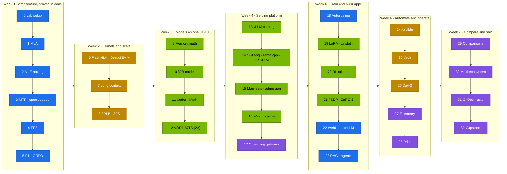

# Step-by-Step: DeepSeek on the DGX Spark, from Architecture to an Operated Reasoning Platform

> **Module 03 companion guide.** The shortest correct path through the DeepSeek lab, in the order that avoids rework. Each step lists the commands, what "done" looks like, and the volume that explains it. Prerequisite: the [02-Kubernetes step-by-step guide](../02-Kubernetes/00-kubernetes-step-by-step-guide.md) through its Step 15 (vLLM serving on k3s).



**One Spark or two?** Everything works on one. Steps marked **(2×)** have an optional second part that needs spark-02 and the QSFP cable.

---

## Step 0 · Lab setup (30 min) → [lab README](lab/README.md)

```bash
cd "technical-depth/03-DeepSeek/lab"
tests/run-local-checks.sh                 # CPU-only: schemas, tools, mocks — must end "ALL LOCAL CHECKS PASSED"
kubectl apply -k .                        # tool + eval-data ConfigMaps
scripts/verify.sh platform                # 02 platform present, model-cache PVC, ConfigMaps
```

**Done when:** `verify.sh platform` is all `PASS`.

## Step 1 · MLA (60 min) → [01](01-multi-head-latent-attention-mla.md)

```bash
python3 tools/mla_attention_demo.py                       # three forms agree
python3 tools/model_math.py --compare deepseek-v3 qwen2.5-32b
```

**Done when:** you can state the KV bytes per token for MLA vs MHA and why the absorbed form decodes faster.

## Step 2 · DeepSeekMoE routing (60 min) → [02](02-deepseek-moe-fine-grained-routing.md)

```bash
python3 tools/moe_router_demo.py --steps 200
kubectl apply -f k8s/jobs/gpu-probes.yaml                 # includes the real V2-Lite router probe
```

**Done when:** the aux-loss-free bias balances expert load in the simulation, and you have per-expert loads from the real router.

## Step 3 · MTP and speculative decoding (45 min) → [03](03-multi-token-prediction-mtp.md)

```bash
python3 tools/spec_decode_calc.py --sweep
kubectl apply -k k8s/spec-decode/r1-7b-draft              # then r1-7b-ngram; compare tok/s
```

## Step 4 · FP8 (45 min) → [04](04-fp8-mixed-precision-framework.md)

```bash
python3 tools/fp8_blockscale.py
```

**Done when:** you can explain why 128×128 block scales survive outliers that break per-tensor scaling.

## Step 5 · R1 and GRPO (90 min) → [05](05-deepseek-r1-and-grpo-reasoning.md)

```bash
python3 tools/grpo_tiny.py --dry-run
kubectl apply -f k8s/jobs/train-common.yaml -f k8s/jobs/grpo.yaml   # Kueue admits it in batch/train
```

**Done when:** reward rises over the run and the model's outputs follow the `<think>/<answer>` format.

## Step 6 · FlashMLA and DeepGEMM on sm_121 (60 min) → [06](06-flash-mla-decoding-kernel.md), [07](07-deepgemm-fp8-library.md)

```bash
python3 tools/mla_attention_demo.py --decode-bench 8192 --batch 8 --device cuda
python3 tools/grouped_gemm_bench.py
```

**Done when:** you know which DeepSeek kernels target SM90/SM100 only, and what the GB10 uses instead.

## Step 7 · Long context (60 min) → [08](08-context-parallelism-and-long-context-attention.md)

```bash
torchrun --nproc-per-node 2 tools/ring_attention_demo.py --seq 4096
kubectl apply -k k8s/long-context/r1-7b-128k
python3 tools/needle_test.py --url http://localhost:8000 --model r1-7b-128k
```

## Step 8 · EPLB and 3FS (60 min) → [09](09-eplb-expert-parallelism-load-balancer.md), [10](10-3fs-fire-flyer-file-system.md)

```bash
python3 tools/eplb_sim.py --experts 256 --gpus 32 --redundant 32
```

## Step 9 · Memory math (30 min) → [12](12-memory-math-for-30b-32b-on-gb10.md)

```bash
python3 tools/model_math.py deepseek-r1-distill-qwen-32b --util 0.70 --ctx 16384
```

**Done when:** you can predict, before deploying, whether a model and context fit at a given `--gpu-memory-utilization`.

## Step 10 · 32B models (75 min) → [11](11-deepseek-r1-32b-and-qwen-32b-models.md)

```bash
scripts/serve-model.sh r1-32b-fp8
python3 tools/eval_harness.py --url http://localhost:8000 --model r1-32b-fp8 --suites math json --out results/r1-32b-fp8.json
```

## Step 11 · Coder and Math models (60 min) → [13](13-deepseek-coder-v2-and-math-models.md)

```bash
scripts/serve-model.sh coder-v2-lite
kubectl apply -f k8s/jobs/eval.yaml                       # code suite runs sandboxed in a pod
```

## Step 12 · V3/R1 671B across two Sparks (2×, 2–3 h) → [14](14-deepseek-v3-671b-moe-sharding.md)

```bash
kubectl apply -f k8s/llamacpp/rpc-2spark.yaml             # IQ1_S GGUF over llama.cpp RPC
```

On one Spark: do the sharding math in §3 and skip the deployment.

## Step 13 · vLLM catalog (90 min) → [15](15-vllm-serving-deepseek-and-qwen.md)

```bash
python3 scripts/gen_overlays.py --check
scripts/serve-model.sh r1-7b
scripts/breakfix.sh inject D01                            # then D02, D03
```

**Done when:** you can add a model to `models.yaml` and serve it with one command, and D01–D03 are solved.

## Step 14 · Other engines (3 h) → [16](16-sglang-and-radix-attention-serving.md), [17](17-ollama-and-llamacpp-local-gguf.md), [18](18-tensorrt-llm-compilation-for-deepseek.md)

Run the same weights and eval suites on SGLang, llama.cpp and TensorRT-LLM. Fill in the comparison tables in each volume.

## Step 15 · Manifests and admission (60 min) → [19](19-kubernetes-manifests-for-deepseek.md)

```bash
API=1 tests/run-local-checks.sh                           # schema → server dry-run → pod templates
```

## Step 16 · Weight cache (75 min) → [20](20-nvme-local-storage-and-weight-caching.md)

```bash
kubectl apply -f k8s/ops/weights-verify.yaml
kubectl -n llm-serving create job --from=cronjob/weights-verify wv-now
```

## Step 17 · Streaming gateway (60 min) → [21](21-ingress-and-realtime-streaming-gateways.md)

```bash
kubectl apply -k k8s/apps
python3 tools/stream_probe.py --url http://api.lab.local --api-key "$KEY" --model reasoning-fast
scripts/breakfix.sh inject D04
```

**Done when:** TTFT, time-to-first-answer and ITL are recorded at every hop, and D04 is solved.

## Step 18 · Autoscaling and queues (90 min) → [22](22-autoscaling-with-kserve-and-kueue.md)

```bash
"../../02-Kubernetes/lab/scripts/install-addons.sh" keda
kubectl apply -f k8s/autoscale/vllm-office-hours.yaml
kubectl apply -f k8s/jobs/train-common.yaml -f k8s/jobs/sft.yaml -f k8s/jobs/grpo.yaml
kubectl -n batch get workloads
```

**Done when:** vLLM scales to 0 outside the window and Kueue preempts a routine Job for an urgent one.

## Step 19 · Adapters (3 h) → [23](23-peft-lora-qlora-parameter-sizing.md), [24](24-unsloth-and-llama-factory-workflows.md)

```bash
python3 tools/lora_calc.py deepseek-r1-distill-qwen-7b --method full      # ✗ — why LoRA exists
scripts/publish-adapter.sh sft-lora && kubectl apply -k k8s/lora/r1-1.5b-sft
python3 tools/format_check.py --url http://localhost:8000 --model r1-sft -n 50
```

**Done when:** the adapter beats the base on format %, and the TRL/Unsloth/LLaMA-Factory table is filled in.

## Step 20 · RL rollouts (2.5 h) → [25](25-distributed-rl-rollout-infrastructure.md)

```bash
kubectl apply -f k8s/jobs/grpo.yaml        # then k8s/jobs/grpo-vllm.yaml; (2×) k8s/rl/grpo-2spark.yaml
```

## Step 21 · Full fine-tuning beyond one GB10 (2.5 h) → [26](26-distributed-deepspeed-zero3-and-fsdp.md)

```bash
kubectl apply -f k8s/jobs/zero3-nvme.yaml   # (2×) k8s/jobs/fsdp-2spark.yaml
```

## Step 22 · Chat UI and gateway (2.5 h) → [27](27-open-webui-deployment-and-integration.md), [28](28-litellm-proxy-gateway-load-balancing.md)

```bash
kubectl apply -k k8s/apps && kubectl apply -f k8s/ops/webui-backup.yaml
# team + scoped key: Vol 28 §5.1
```

**Done when:** a tenant key gets 401 for a disallowed model and 429 above its RPM, and a WebUI restore drill has been timed.

## Step 23 · RAG and agents (3 h) → [29](29-enterprise-rag-with-qdrant-and-bge.md), [30](30-tool-calling-and-agentic-json.md)

```bash
kubectl apply -f k8s/jobs/rag-ingest.yaml
python3 tools/rag_demo.py eval --qdrant http://localhost:6333 --embed-url http://localhost:8001
kubectl apply -f k8s/jobs/agent.yaml
```

**Done when:** hit@5 ≥ 0.6 behind the quality gate, and the in-cluster agent answers while `can-i delete pods` says no.

## Step 24 · One-click deployment (60 min) → [31](31-ansible-one-click-deployment-playbook.md)

```bash
cd "../../01-Ansible/lab" && ansible-playbook "../../03-DeepSeek/lab/ansible/deploy-deepseek.yml" --check -e deepseek_model=r1-32b-fp8
```

## Step 25 · Secrets (75 min) → [32](32-hashicorp-vault-secrets-integration.md)

```bash
scripts/vault-k8s-auth-setup.sh && kubectl apply -f k8s/ops/vault-sync.yaml
```

**Done when:** rotating the LiteLLM key in Vault reaches the running gateway without manual steps.

## Step 26 · Day-2 (90 min) → [33](33-automated-weight-sync-and-day2-ops.md)

```bash
python3 tools/catalog_drift.py pin --only r1-7b && python3 scripts/gen_overlays.py
kubectl apply -f k8s/ops/
```

## Step 27 · Telemetry (90 min) → [38](38-dcgm-prometheus-and-grafana-telemetry.md)

```bash
kubectl apply -k observability
```

**Done when:** `ReasoningTruncated` has fired for real and resolved, and the dashboard shows tokens per joule.

## Step 28 · Drills (2 h) → [39](39-master-troubleshooting-playbook.md)

```bash
scripts/llm-triage.sh
scripts/breakfix.sh inject D04      # … all eight
```

## Step 29 · Comparisons (unattended runs) → [34](34-deepseek-vs-meta-llama3.md), [35](35-deepseek-vs-alibaba-qwen25.md), [36](36-deepseek-vs-mistral-and-mixtral.md), [37](37-deepseek-vs-openai-o1-and-claude.md)

```bash
MAX_TOKENS=8192 scripts/compare-models.sh llama-3.1-8b r1-llama-8b r1-7b
```

**Done when:** you've written a one-page model recommendation with tokens per correct answer, latency and cost.

## Step 30 · Multi-ecosystem (2 h) → [41](41-multi-ecosystem-qwen-llama-nemo-deployment.md)

```bash
kubectl apply -k k8s/multi/qwen2.5-7b-tools
```

## Step 31 · GitOps with an eval gate (90 min) → [production-mlops](production-mlops.md)

```bash
kubectl apply -n argocd -f gitops/applications.yaml
```

**Done when:** a weaker model merged into the serving pointer fails the PostSync gate, and `git revert` restores service.

## Step 32 · Capstone → [40](40-hands-on-exercises-workbook.md)

Rebuild, baseline, upgrade through the gate, survive an unannounced drill, and write the report. Four hours.
