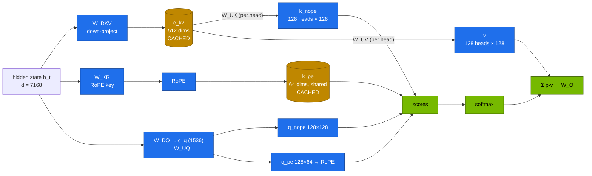
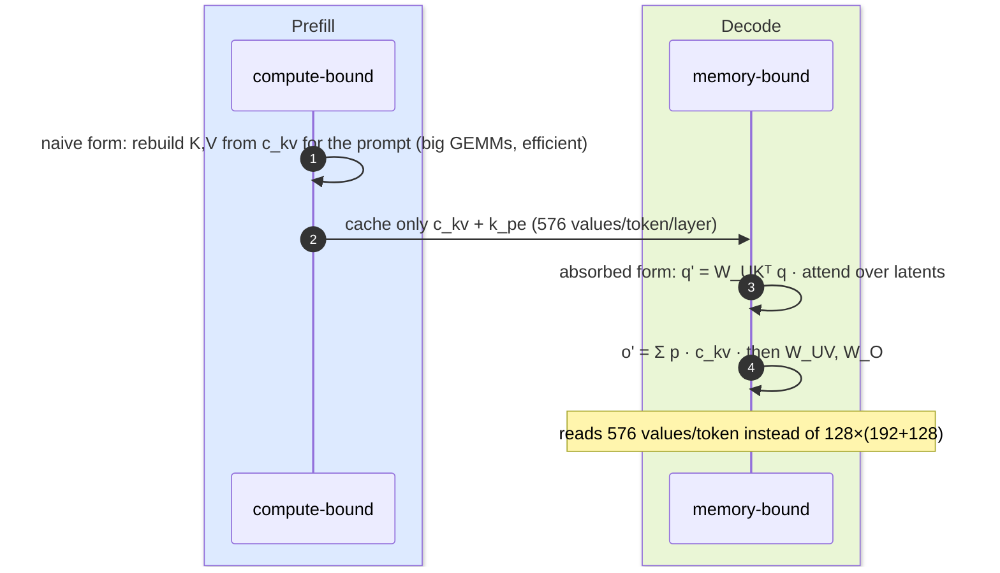

# Volume 01 — Multi-head Latent Attention (MLA): Why DeepSeek's KV Cache Is 85× Smaller, Proved in Code

> **Module 03 · Part I — Architecture** · Next: [02 DeepSeekMoE](02-deepseek-moe-fine-grained-routing.md) · Guide: [00 step-by-step](00-deepseek-step-by-step-guide.md)

| | |
|---|---|
| **You will build** | An MLA layer from scratch in three forms: plain MHA, MLA with reconstructed K/V, and the "absorbed" form used at decode time. You'll check numerically that all three give the same output, then measure what MLA does to KV-cache memory and concurrency on a GB10 |
| **Hardware** | Laptop/CPU for §5.1–5.2, spark-01 for §5.3–5.4 |
| **Time** | 60 min |
| **Risk** | None |
| **Lab files** | [`tools/mla_attention_demo.py`](lab/tools/mla_attention_demo.py), [`tools/model_math.py`](lab/tools/model_math.py), [`k8s/jobs/gpu-probes.yaml`](lab/k8s/jobs/gpu-probes.yaml), [`k8s/models/v2-lite`](lab/k8s/models/v2-lite/kustomization.yaml) |

---

## 1. Why this matters on a Spark

During decoding, every new token attends to the keys and values of every previous token. Those K/V tensors are cached, and the **KV cache**, not the weights, is what limits how many users and how much context a box can serve. On a GB10 the KV cache competes for the same 128 GB as the weights, the OS and every other pod.

| Attention type | What is cached per token per layer | Example model | KV per token (BF16, all layers) |
|---|---|---|---|
| MHA (multi-head) | K and V for every head | DeepSeek-V3 *if it used MHA*: 128 heads × 192 + 128 | **5,856 KiB** |
| GQA (grouped-query) | K and V for a few shared KV heads | Qwen2.5-32B: 8 KV heads × 128 | 256 KiB |
| **MLA** | one compressed latent `c_kv` (512) + one shared RoPE key (64) | **DeepSeek-V3**: 61 layers × 576 | **68.6 KiB** |

That's an **85× reduction** versus MHA for the same model (numbers from `model_math.py`). DeepSeek-V3 caches less per token than a dense 7B model with GQA (Qwen2.5-7B: 56 KiB with 28 layers vs V3's 61).

---

## 2. Architecture — HLD



**Two ideas make MLA work:**

1. **Low-rank compression.** Keys and values for all 128 heads are generated from a 512-dimensional latent `c_kv`. Only `c_kv` is cached. Per-head K and V can always be rebuilt from it.
2. **Decoupled RoPE.** Rotary position embedding can't pass through the low-rank projection (it depends on position and wouldn't commute with `W_UK`). So 64 dimensions per head carry position through a separate, *shared* key `k_pe`, which is cached too.

### 2.1 The absorption trick (what decode kernels actually do)

`q_nope · k_nope = q_nope · (W_UK c_kv) = (W_UKᵀ q_nope) · c_kv`. Fold `W_UK` into the query, and `W_UV` into the output projection, and attention runs **directly on the 576-wide latent**, without materialising per-head K/V for thousands of cached tokens. This is the form FlashMLA (Vol 06) and vLLM's MLA backends implement.



---

## 3. LLD

### 3.1 DeepSeek-V3 attention dimensions (from `inference/configs/config_671B.json`)

| Symbol | Config key | Value |
|---|---|---|
| hidden size d | `dim` | 7168 |
| heads h | `n_heads` | 128 |
| latent rank r (KV) | `kv_lora_rank` | 512 |
| query latent rank | `q_lora_rank` | 1536 |
| non-RoPE head dim | `qk_nope_head_dim` | 128 |
| RoPE head dim | `qk_rope_head_dim` | 64 |
| value head dim | `v_head_dim` | 128 |
| layers | `n_layers` | 61 |

DeepSeek-V2-Lite (the MLA model that fits one Spark, Vol 11) uses the same `kv_lora_rank` 512 and RoPE 64 with 16 heads, 27 layers and **no query compression** (`q_lora_rank` 0).

### 3.2 What MLA buys on one GB10

From `tools/model_math.py` at the catalog's settings:

| Model | Attention | Weights | KV/token | KV budget | Tokens in cache | Concurrent seqs |
|---|---|---|---|---|---|---|
| DeepSeek-V2-Lite (15.7B MoE), util 0.45 | MLA | 29.3 GiB | **30.4 KiB** | 21.6 GiB | **745,986** | 45 @ 16K |
| R1-Distill-Qwen-7B, util 0.30 | GQA (4 KV heads) | 14.2 GiB | 56 KiB | 18.7 GiB | 350,621 | 10 @ 32K |
| R1-Distill-Qwen-32B, util 0.70 | GQA (8 KV heads) | 61.0 GiB | 256 KiB | 19.8 GiB | 80,952 | 4 @ 16K |

The MLA model holds **twice the tokens of the 7B** in a similar budget, and roughly 9× those of the 32B.

---

## 4. Integrations

- **vLLM** detects MLA models (`DeepseekV2ForCausalLM`, `DeepseekV3ForCausalLM`) and picks an MLA attention backend. The startup log names it. On GB10 (sm_121), FlashMLA's SM90/SM100 kernels don't apply, so expect a Triton-based MLA backend (Vol 06).
- **Context parallelism (Vol 08)** and **disaggregated serving (02 Vol 24)** both move KV caches around. MLA makes them about 85× cheaper to move.
- **`model_math.py`** reads any Hugging Face `config.json` (`--config`), so you can size new MLA models (DeepSeek-V3.1, V3.2 and successors) the same way.

---

## 5. Lab

### 5.1 Prove the three forms are identical (CPU)

```bash
cd "03-DeepSeek/lab"
python3 tools/mla_attention_demo.py
```

Expected:

```text
device=cpu dtype=torch.float64 d=512 heads=8 nope=32 rope=16 v=32 latent r=64 tokens=64
max rel. |naive - absorbed| = …e-16   max rel. |naive - MHA| = …e-16
✓ all three formulations produce the same output

KV cache per token per layer (elements):
  MHA (8 heads)       :    768
  GQA (8 KV heads)      :    768
  MLA (latent + rope)   :     80   → 9.6× smaller than MHA
```

Read the code alongside the diagram. `out_abs` never builds `k_nope` or `v` for the cached tokens: it contracts with `W_UK_h` on the query side and `W_UV_h` on the output side.

### 5.2 Compare KV/token across the catalog

```bash
python3 tools/model_math.py --compare deepseek-v2-lite deepseek-v3 qwen2.5-7b qwen2.5-32b llama-3.1-8b llama-3.3-70b
```

```text
model                            kind      total B  active B   KV/token  MHA-equiv
deepseek-v2-lite                 mla-moe      15.7       2.7     30.4KiB    324.0KiB
deepseek-v3                      mla-moe     671.0      37.6     68.6KiB   5856.0KiB
qwen2.5-7b                       gqa           7.6       7.6     56.0KiB    392.0KiB
qwen2.5-32b                      gqa          32.8      32.8    256.0KiB   1280.0KiB
llama-3.1-8b                     gqa           8.0       8.0    128.0KiB    512.0KiB
llama-3.3-70b                    gqa          70.6      70.6    320.0KiB   2560.0KiB
```

(`active` counts embeddings. DeepSeek quotes 2.4B active for V2-Lite and 37B for V3, excluding or rounding them.)

### 5.3 Run the demo at DeepSeek-V3 size on the GB10

```bash
kubectl apply -k .                                     # tools ConfigMap
kubectl apply -f k8s/jobs/gpu-probes.yaml
kubectl -n llm-serving logs -f job/gpu-probes | head -8
```

`--v3` uses d=7168, 128 heads and r=512 in FP32 on CUDA. The relative agreement drops to ~1e-6 (FP32 rounding), the KV ratio goes to 85×, and the job then continues into the FP8 and router probes (Vol 04, 02).

### 5.4 See MLA in a served model

```bash
scripts/serve-model.sh v2-lite
kubectl -n llm-serving logs deploy/vllm | grep -iE 'MLA|attention backend|KV cache|GPU KV'
```

Record the backend name and the logged KV-cache token capacity. Compare with §3.2's prediction of ~746K tokens. vLLM's real figure is a little lower: activation workspace and CUDA graphs take their share.

---

## 6. Verify

| Check | Expected |
|---|---|
| `mla_attention_demo.py` | both relative errors < 1e-10 on CPU (< 1e-3 in FP32 on the GPU), `✓ all three` |
| `model_math.py deepseek-v3` | KV/token 68.6 KiB, MHA-equivalent 5,856 KiB |
| vLLM log for v2-lite | an MLA backend is selected. KV capacity in the hundreds of thousands of tokens |

---

## 7. Troubleshooting

| Symptom | Cause | Fix |
|---|---|---|
| vLLM: `Model architectures ['DeepseekV2ForCausalLM'] … trust_remote_code` | older transformers mapping | the catalog passes `--trust-remote-code` for V2-Lite/Coder-V2-Lite |
| `No MLA backend available for … compute capability 12.1` / falls back to slow path | FlashMLA/FlashInfer MLA kernels not built for sm_121 | use an image built for DGX Spark. Check `vllm.__version__` release notes for Blackwell consumer (sm_120/121) MLA support |
| Demo error ~1e-3 on GPU | TF32 matmul in FP32 | expected order of magnitude for TF32. CPU float64 is the exactness proof |
| KV estimate far above vLLM's log | `--max-model-len` × `--max-num-seqs` activations, CUDA graphs, sampler buffers | `--overhead-gib` in `model_math.py`. Compare after warm-up |

---

## 8. Scale-out path

| On one Spark | In a datacenter |
|---|---|
| MLA lets a 16B MoE hold ~750K cached tokens | V3/R1 on 8×H200/B200: MLA plus FP8 KV fits 128K context for many users |
| decode on Triton MLA kernels | FlashMLA on Hopper/Blackwell datacenter GPUs, paged latent cache with block size 64 |
| KV transfer over CX-7 (Vol 08, 02 Vol 24) is small | prefill/decode disaggregation is far cheaper with 70 KB/token than 5.8 MB/token |

---

## 9. Checklist

- [ ] I can explain which two tensors MLA caches, and why RoPE needs its own path.
- [ ] I ran the three-way equivalence test and can point at the absorption step in the code.
- [ ] I computed KV/token for MLA, GQA and MHA models and turned it into concurrency on a GB10.
- [ ] I found the MLA backend line in vLLM's log.
