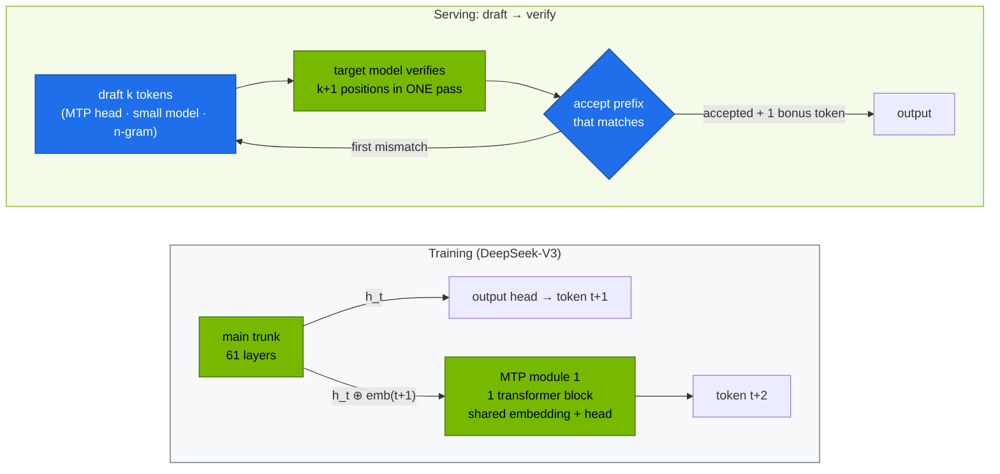

# Volume 03 — Multi-Token Prediction (MTP) and Speculative Decoding: Turning Spare Compute into Tokens

> **Module 03 · Part I — Architecture** · Prev: [02 DeepSeekMoE](02-deepseek-moe-fine-grained-routing.md) · Next: [04 FP8 training](04-fp8-mixed-precision-framework.md)

| | |
|---|---|
| **You will build** | An estimate of the speed-up any draft method can give from its acceptance rate. You'll run speculative decoding on the Spark with a 1.5B draft for the R1 7B, compare it with draft-free n-gram lookup, and read the acceptance rate from vLLM's metrics |
| **Hardware** | CPU for §5.1. spark-01 for §5.2–5.4 |
| **Time** | 60 min |
| **Risk** | None |
| **Lab files** | [`tools/spec_decode_calc.py`](lab/tools/spec_decode_calc.py), [`k8s/spec-decode/`](lab/k8s/spec-decode/), [`k8s/models/r1-7b`](lab/k8s/models/r1-7b/kustomization.yaml), [`k8s/models/r1-1.5b`](lab/k8s/models/r1-1.5b/kustomization.yaml) |

---

## 1. Why this matters on a Spark

Decoding one token means reading every active weight once, and doing very little arithmetic per byte. On a GB10 with ~273 GB/s of memory bandwidth, a 7B BF16 model (≈15 GB) is limited to roughly `273 / 15 ≈ 18` forward passes per second for a single stream, **however many TFLOPS sit idle**. Speculative decoding spends that idle compute: guess several tokens cheaply, verify them all in **one** forward pass of the big model, and keep the ones it agrees with.

DeepSeek-V3 builds the guesser into the model: **Multi-Token Prediction (MTP)** modules trained to predict token t+2 from the main model's hidden state at t+1. In training MTP is an auxiliary objective that densifies the signal. In serving the MTP module becomes a built-in draft. DeepSeek reports an 85–90 % acceptance rate for the second token, which gives about 1.8× decode throughput.

---

## 2. Architecture — HLD



**Output quality is unchanged.** With rejection sampling, the verified sequence follows exactly the target model's distribution. Speculation changes speed, never the answer distribution.

---

## 3. LLD

### 3.1 The speed-up formula

With per-token acceptance rate α, k drafted tokens and draft cost c (relative to one target pass):

`E[tokens per target pass] = (1 − α^(k+1)) / (1 − α)`, and `speed-up ≈ E / (1 + k·c)`.

`spec_decode_calc.py --sweep --draft-cost 0.1`:

| α | k=1 | k=2 | k=3 | k=4 | k=6 |
|---|---|---|---|---|---|
| 0.5 | 1.36× | 1.46× | 1.44× | 1.38× | 1.24× |
| 0.7 | 1.55× | 1.82× | 1.95× | 1.98× | 1.91× |
| 0.8 | 1.64× | 2.03× | 2.27× | 2.40× | 2.47× |
| 0.9 | 1.73× | 2.26× | 2.65× | 2.93× | 3.26× |

Two lessons: **acceptance rate dominates**, and past the optimum, extra draft tokens cost more than they save.

### 3.2 Draft methods in vLLM

| Method | `--speculative-config` | Draft cost | Typical α | Best for |
|---|---|---|---|---|
| Built-in MTP (DeepSeek-V3/R1) | `{"method": "deepseek_mtp", "num_speculative_tokens": 1}` | ~1 block | high (0.85–0.9 for token 2) | V3/R1 full models (Vol 14) |
| Small draft model | `{"model": "<draft>", "num_speculative_tokens": 4}` | 0.05–0.15 | 0.5–0.8 | same tokenizer family: R1-1.5B → R1-7B/32B |
| n-gram / prompt lookup | `{"method": "ngram", "num_speculative_tokens": 4, "prompt_lookup_max": 4}` | ~0 | high on copy-heavy output, ~0 otherwise | RAG, code edits, summarisation |
| EAGLE-style heads | `{"method": "eagle3", "model": "<eagle head>", …}` | small | 0.6–0.8 | when a trained head exists for your model |

### 3.3 UMA cost of a draft model

| Config | Util | What's resident |
|---|---|---|
| r1-7b alone | 0.30 | 14.2 GiB weights + KV |
| r1-7b + 1.5B draft | 0.36 | + 3.4 GiB draft weights + draft KV |

---

## 4. Integrations

- **Metrics (Vol 38):** `vllm:spec_decode_num_accepted_tokens_total / vllm:spec_decode_num_draft_tokens_total` is α in practice. Add it to the serving dashboard when you run speculation.
- **Eval harness (Vol 40):** quality must not move. Run the same suite with and without speculation as a regression check on your configuration.
- **Reasoning models** emit long `<think>` chains, so decode time dominates and they benefit most from speculation.

---

## 5. Lab

### 5.1 Predict before you measure

```bash
cd "03-DeepSeek/lab"
python3 tools/spec_decode_calc.py --alpha 0.85 --k 1 --draft-cost 0.05     # V3-style MTP
python3 tools/spec_decode_calc.py --sweep --draft-cost 0.1                 # 1.5B draft for 7B
```

```text
α=0.85 k=1 c=0.05: 1.85 tokens/step, ≈1.76× decode speed-up
```

### 5.2 Baseline: R1-7B without speculation

```bash
scripts/serve-model.sh r1-1.5b            # downloads the draft weights into model-cache too
scripts/serve-model.sh r1-7b
kubectl apply -f "../../02-Kubernetes/lab/manifests/llms/90-serving/vllm/vllm-bench.yaml"
kubectl -n llm-serving logs -f job/vllm-bench | grep -E 'max-concurrency|Output token throughput|Mean TPOT'
```

The bench Job's defaults target `qwen2.5-0.5b`. Edit `--model r1-7b --tokenizer deepseek-ai/DeepSeek-R1-Distill-Qwen-7B` in a copy of the Job first, or use the harness:

```bash
kubectl -n llm-serving port-forward svc/vllm 8000 &
python3 tools/eval_harness.py --url http://localhost:8000 --model r1-7b --suites math --concurrency 1 --out results/r1-7b-base.json
```

Note the `tok/s aggregate` line at concurrency 1 (single-stream decode speed).

### 5.3 With a draft model, then with n-gram lookup

```bash
kubectl apply -k k8s/spec-decode/r1-7b-draft
kubectl -n llm-serving rollout status deploy/vllm --timeout=30m
python3 tools/eval_harness.py --url http://localhost:8000 --model r1-7b --suites math --concurrency 1 --out results/r1-7b-draft.json
curl -s localhost:8000/metrics | grep -E '^vllm:spec_decode_num_(accepted|draft)_tokens_total'

kubectl apply -k k8s/spec-decode/r1-7b-ngram && kubectl -n llm-serving rollout status deploy/vllm --timeout=20m
python3 tools/eval_harness.py --url http://localhost:8000 --model r1-7b --suites math --concurrency 1 --out results/r1-7b-ngram.json
python3 tools/eval_harness.py --report results/r1-7b-*.json
```

Compute α = accepted / draft from the metrics, then plug it into `spec_decode_calc.py --alpha <α> --k 4 --draft-cost 0.1` and compare the prediction with the measured `tok/s`. Accuracy should be identical within run-to-run noise. If it isn't, something is wrong with the configuration, not the method.

### 5.4 Check where speculation stops paying

Repeat §5.3 at `--concurrency 16`. At high batch the GPU is no longer idle between passes, so verification competes with real work and the gain shrinks or turns negative. vLLM can disable speculation above a batch size for this reason. Check `--speculative-config` options such as `disable_by_batch_size` in your vLLM version.

```bash
scripts/serve-model.sh r1-7b      # back to the plain overlay
```

---

## 6. Verify

| Check | Expected |
|---|---|
| calculator | 1.85 tokens/step, ≈1.76× for α=0.85, k=1, c=0.05 |
| draft run | `vllm:spec_decode_num_accepted_tokens_total` > 0. Single-stream tok/s above baseline |
| quality | math accuracy unchanged (± a problem or two at temperature 0.6) |

---

## 7. Troubleshooting

| Symptom | Cause | Fix |
|---|---|---|
| `Speculative decoding … vocab size mismatch` | draft and target tokenizers differ | draft from the same family (R1-Qwen 1.5B ↔ R1-Qwen 7B/32B, not Llama ↔ Qwen) |
| OOM at start after enabling the draft | two models + two KV caches | raise util slightly (overlay uses 0.36), or shorter `--max-model-len` |
| α ≈ 0 with n-gram | output doesn't repeat input text | expected for open-ended reasoning. Use a draft model instead |
| slower at high concurrency | GPU already busy | disable speculation above a batch size, or serve without it |
| flag rejected | `--speculative-config` keys changed between vLLM versions | check `vllm serve --help=speculative` in your image |

---

## 8. Scale-out path

| One Spark | Datacenter |
|---|---|
| 1.5B draft for 7B, n-gram for RAG | MTP heads on V3/R1 (`deepseek_mtp`), EAGLE-3 heads trained per model |
| fixed k | dynamic speculation length per request. Speculation off at high load |
| α from metrics by hand | α tracked per model and per prompt type, feeding capacity planning |

---

## 9. Checklist

- [ ] I can compute expected tokens per step and speed-up from α, k and draft cost.
- [ ] I ran speculative decoding with a draft model and with n-gram lookup, and measured α.
- [ ] I confirmed answer quality didn't change.
- [ ] I know why speculation helps single-stream latency on a bandwidth-bound GB10 more than high-batch throughput.
