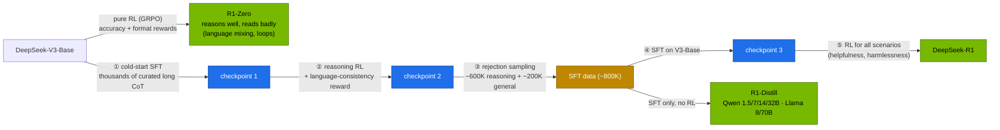
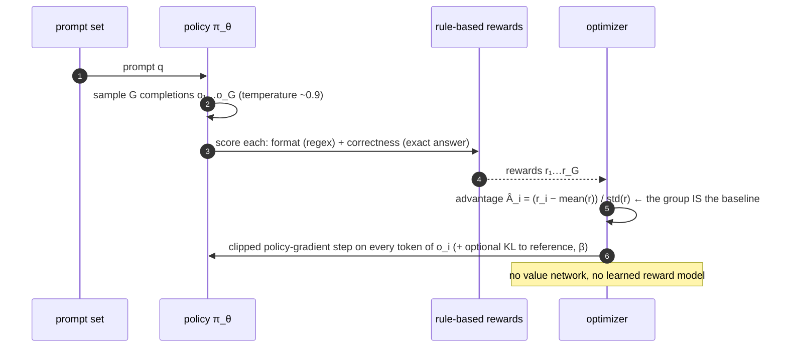

# Volume 05 — DeepSeek-R1 and GRPO: Reasoning from Rule-Based Rewards, Reproduced Small

> **Module 03 · Part I — Architecture** · Prev: [04 FP8](04-fp8-mixed-precision-framework.md) · Next: [06 FlashMLA](06-flash-mla-decoding-kernel.md)

| | |
|---|---|
| **You will build** | A working GRPO loop that teaches a 0.5B model to answer in `<think>…</think><answer>…</answer>` form and get arithmetic right, using only verifiable, rule-based rewards. You'll also serve an R1 distill with its reasoning separated from the answer, and learn the sampling settings R1 models need |
| **Hardware** | CPU for §5.1. spark-01 for §5.2–5.5 (GRPO run ≈ 1–2 h on one GPU slice) |
| **Time** | 3 h including the training run |
| **Risk** | Low. The training Job runs in `batch` under Kueue |
| **Lab files** | [`tools/grpo_tiny.py`](lab/tools/grpo_tiny.py), [`k8s/jobs/grpo.yaml`](lab/k8s/jobs/grpo.yaml), [`k8s/jobs/train-common.yaml`](lab/k8s/jobs/train-common.yaml), [`k8s/models/r1-7b`](lab/k8s/models/r1-7b/kustomization.yaml), [`tools/eval_harness.py`](lab/tools/eval_harness.py) |

---

## 1. Why this matters

DeepSeek-R1 showed that strong step-by-step reasoning can be grown with **reinforcement learning on checkable rewards**: no human-labelled reasoning traces, and no learned reward model for maths and code. The algorithm, **GRPO** (Group Relative Policy Optimization, from DeepSeekMath), is cheap enough to run on one Spark at small scale. The *distilled* R1 models (Qwen 1.5B–32B, Llama 8B/70B) are the most useful reasoning models a Spark can serve.

### 1.1 The R1 pipeline



---

## 2. Architecture — GRPO (HLD)



| | PPO (RLHF classic) | **GRPO** |
|---|---|---|
| Baseline for the advantage | learned value network (as big as the policy) | **mean reward of G samples for the same prompt** |
| Reward | learned reward model | **rules**: exact-match answers, unit tests, format regex |
| Memory | policy + reference + value + reward model | policy + (optional) reference |
| Fits one Spark at small scale | hardly | ✅ |

---

## 3. LLD

### 3.1 The lab's task and rewards (`grpo_tiny.py`)

| Piece | Implementation |
|---|---|
| Prompts | generated on the fly: shop totals, GPUs after draining, checkpoint counts. Answers are integers, always computable |
| System prompt | "think inside `<think></think>`, then give only the final number inside `<answer></answer>`" |
| `reward_format` | 1.0 if the whole output matches `^<think>.+?</think>\s*<answer>\s*-?\d+\s*</answer>$` |
| `reward_correct` | 2.0 if the number in `<answer>` equals ground truth |
| Model | `Qwen/Qwen2.5-0.5B-Instruct` |
| GRPOConfig | G = 8 completions per prompt, lr 1e-6, β = 0 (no KL), max completion 256 tokens, BF16 |
| Optional | `--vllm`: rollouts generated by a colocated vLLM engine (`vllm_gpu_memory_utilization 0.2`), much faster |

### 3.2 Serving R1 distills correctly

| Setting | Value | Why |
|---|---|---|
| `--reasoning-parser deepseek_r1` | catalog default for `r1-*` | moves `<think>…</think>` into `message.reasoning_content`. Clients see a clean `content` |
| temperature | **0.6** (0.5–0.7) | greedy decoding makes R1 models repeat inside `<think>` until `max_tokens` (drill D06) |
| top_p | 0.95 | DeepSeek's recommendation |
| system prompt | avoid. Put instructions in the user turn | recommended for the R1 distills |
| maths prompts | "Please reason step by step, and put your final answer within \boxed{}." | the format the models were trained with |
| `max_tokens` | thousands | chains of thought are long. Too low → truncated answers (alert `ReasoningTruncated`) |

---

## 4. Integrations

- **Kueue (02 Vol 05):** the GRPO Job is created suspended in `batch` and admitted whole.
- **Vol 25** scales this loop: rollout workers separate from learners, with weight sync.
- **Vol 23/24:** SFT for format first (cold start), then GRPO for correctness. That's the R1 recipe in miniature (`sft_lora.py` builds the same task's CoT data).
- **Eval harness (Vol 40)** measures your trained checkpoint on the lab's math set, and reports `reasoning_share`, the fraction of output spent thinking.

---

## 5. Lab

### 5.1 Rewards first (CPU)

```bash
cd "03-DeepSeek/lab"
python3 tools/grpo_tiny.py --dry-run
```

```text
example prompt : A cluster has 26 nodes with 2 GPUs each. 15 GPUs are drained for maintenance. How many GPUs are available?
ground truth   : 37
✓ rewards behave: format and correctness are verifiable without a model
```

Read the reward functions. They're the entire supervision signal, and in real projects most of the work (and most of the reward-hacking risk) lives here.

### 5.2 Run GRPO on the Spark

```bash
kubectl apply -k .                                          # deepseek-train ConfigMap in batch
kubectl apply -f k8s/jobs/train-common.yaml -f k8s/jobs/grpo.yaml
kubectl -n batch get workloads                              # admitted by Kueue
kubectl -n batch logs -f job/grpo | grep -E "'(reward|rewards/reward_format/mean|rewards/reward_correct/mean|completions/mean_length)'" 
```

TRL logs a dict every 5 steps. Watch three numbers (**record yours**):

| Step | `rewards/reward_format/mean` | `rewards/reward_correct/mean` | `completions/mean_length` |
|---|---|---|---|
| 5 | low (≈0.0–0.3) | low | |
| 100 | rising towards 1.0 | rising | |
| 200 | ≈1.0 | > step-5 value | |

With `log_completions=True` you'll also see sample outputs gain `<think>` tags. The checkpoint lands in `/ckpt/grpo-tiny` on the `deepseek-ckpt` PVC.

### 5.3 Serve an R1 distill properly

```bash
scripts/serve-model.sh r1-7b
kubectl -n llm-serving port-forward svc/vllm 8000 &
curl -s localhost:8000/v1/chat/completions -H 'Content-Type: application/json' -d '{
  "model":"r1-7b","temperature":0.6,"top_p":0.95,"max_tokens":4096,
  "messages":[{"role":"user","content":"A cluster has 12 nodes with 4 GPUs each and 7 are drained. How many GPUs are available? Please reason step by step, and put your final answer within \\boxed{}."}]}' \
 | jq '{reasoning_chars: (.choices[0].message.reasoning_content|length), answer: .choices[0].message.content, usage}'
```

Expected: hundreds to thousands of reasoning characters, an answer containing `\boxed{41}`, and `completion_tokens` far larger than the visible answer. You pay for thinking tokens.

### 5.4 Measure the cost of thinking

```bash
python3 tools/eval_harness.py --url http://localhost:8000 --model r1-7b --suites math json --out results/r1-7b.json
scripts/serve-model.sh qwen2.5-7b-tools
python3 tools/eval_harness.py --url http://localhost:8000 --model qwen2.5-7b-tools --suites math json --out results/qwen7b.json
python3 tools/eval_harness.py --report results/r1-7b.json results/qwen7b.json
```

Same base architecture (Qwen2.5-7B), with and without R1 distillation. Compare accuracy, `out tok` and `reason%`. Reasoning usually wins on maths and costs many more tokens. On simple extraction (JSON) it can be slower for no gain. That's the routing argument behind LiteLLM's `reasoning` and `reasoning-fast` aliases (Vol 28).

### 5.5 Drill: the temperature-0 loop

```bash
scripts/breakfix.sh inject D06      # prints a harness command at temperature 0
```

Run it, compare `finish_reason`/token counts with temperature 0.6, then `scripts/breakfix.sh answer D06`.

---

## 6. Verify

| Check | Expected |
|---|---|
| dry run | `✓ rewards behave` |
| GRPO run | format reward → ~1.0. Correctness reward above its step-5 value |
| R1 serving | non-empty `reasoning_content`, clean `content` |
| harness | `reasoning_share` > 0.5 for r1-7b on math, ≈ 0 for qwen2.5-7b-tools |

---

## 7. Troubleshooting

| Symptom | Cause | Fix |
|---|---|---|
| all rewards 0, no learning | model never produces the format (reward too sparse) | SFT cold start (Vol 24), or add partial-credit format rewards |
| reward goes up, real accuracy doesn't | **reward hacking**: e.g. format satisfied with empty think | tighten the regex (`.+?` in think), add length or quality checks, eval separately |
| `std(r) = 0` warnings, no gradient | all G samples got the same reward | bigger G, higher temperature, harder or easier prompt mix |
| OOM in GRPO | G × completion length × batch too big | lower `max_completion_length`, G, or use `--vllm` colocated generation with a small util |
| R1 answers contain `<think>` text | no reasoning parser (drill D01) | `--reasoning-parser deepseek_r1` |

---

## 8. Scale-out path

| One Spark | Datacenter |
|---|---|
| 0.5B policy, G=8, synthetic arithmetic | 7B–671B policies, G=16–64, maths/code/agent tasks with sandboxed verifiers |
| generation and training share one GPU | separate rollout fleet (vLLM/SGLang) and learner fleet (FSDP/Megatron), weight sync over the network (Vol 25) |
| rule-based rewards | + process/outcome reward models, unit-test sandboxes, multi-turn tool environments |

---

## 9. Checklist

- [ ] I can explain GRPO's advantage estimate and why no value network is needed.
- [ ] I ran GRPO and watched format and correctness rewards climb.
- [ ] I serve R1 distills with the reasoning parser and the recommended sampling settings.
- [ ] I measured how many extra tokens reasoning costs on my tasks.
