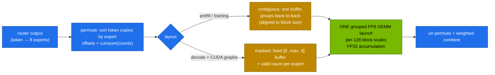

# Volume 07 — DeepGEMM and the GEMMs Behind MoE: Block-Scaled FP8, Grouped Layouts, and What Runs on a GB10

> **Module 03 · Part II — DeepSeek infrastructure** · Prev: [06 FlashMLA](06-flash-mla-decoding-kernel.md) · Next: [08 Context parallelism](08-context-parallelism-and-long-context-attention.md)

| | |
|---|---|
| **You will build** | A measured view of the two GEMM problems DeepGEMM solves: FP8 with fine-grained scales, and many small per-expert GEMMs in one launch. You'll run both on your GB10 with PyTorch's own kernels, see why padding and per-expert loops waste the GPU, and learn which kernels the serving stack really uses on sm_121 |
| **Hardware** | CPU for §5.1. spark-01 for §5.2–5.3 |
| **Time** | 45 min |
| **Risk** | None |
| **Lab files** | [`tools/grouped_gemm_bench.py`](lab/tools/grouped_gemm_bench.py), [`tools/fp8_blockscale.py`](lab/tools/fp8_blockscale.py), [`k8s/jobs/gpu-probes.yaml`](lab/k8s/jobs/gpu-probes.yaml) |

---

## 1. Why this matters on a Spark

Nearly all of an LLM's FLOPs are matrix multiplies (GEMMs). DeepSeek-V3 needs two kinds that standard libraries handled poorly when it was built:

1. **FP8 GEMMs with per-block scales** (Vol 04). cuBLAS's FP8 path originally assumed one scale per tensor.
2. **Grouped GEMMs for MoE**: 256 experts each multiply a different, *variable* number of tokens. One launch per expert wastes time, and padding to the busiest expert wastes FLOPs.

**DeepGEMM** is DeepSeek's answer: a small library (~300 lines of core kernel) that is **JIT-compiled** at runtime for the exact shapes. It covers normal, grouped "contiguous" (prefill/training: tokens sorted by expert) and grouped "masked" (decode with CUDA graphs: fixed buffers plus a count per expert) layouts.

Like FlashMLA, DeepGEMM targets **SM90 (Hopper) and SM100 (datacenter Blackwell)**. The GB10 (sm_121) isn't one of them, so serving engines on a Spark use other kernels: vLLM's Triton/CUTLASS fused-MoE and FP8 kernels, and PyTorch's `_scaled_mm`. The *problems* are the same, so this volume measures them with what does run.

---

## 2. Architecture — HLD



| Approach | Launches | Wasted FLOPs | GPU utilisation |
|---|---|---|---|
| loop over experts | E (64–256) | none | poor: small GEMMs, launch overhead, idle SMs |
| pad to busiest expert, batched GEMM | 1 | `E × max / Σcounts − 1` (often 100s of %) | high, but on zeros |
| **grouped GEMM** | 1 | none (only alignment) | high on real work |

---

## 3. LLD

### 3.1 CPU run of `grouped_gemm_bench.py` (16 experts, top-6, zipf skew 1.2)

```text
device=cpu experts=16 routed tokens=12288 (top-6) busiest expert=4409 quietest=172 padding waste=474%
  loop    :    11.72 ms       0.3 TFLOPS (useful)   max|Δ| vs loop 0.0e+00
  padded  :   127.85 ms       0.0 TFLOPS (useful)   max|Δ| vs loop 0.0e+00
  grouped : unavailable in this PyTorch build (torch._grouped_mm needs CUDA + recent PyTorch)
```

With realistic skew, padding does 5.7× the useful work, which is why nobody pads in production.

### 3.2 Kernels that run on the GB10

| Need | DeepSeek's kernel (SM90/100) | On a Spark |
|---|---|---|
| dense FP8 GEMM, block scales | DeepGEMM | vLLM CUTLASS/Triton FP8 kernels. `torch._scaled_mm` (per-tensor or row-wise scales) |
| grouped MoE GEMM | DeepGEMM contiguous/masked | vLLM `fused_moe` (Triton), `torch._grouped_mm` where built |
| MoE all-to-all across GPUs | DeepEP | not needed on one GPU. NCCL across two Sparks |

---

## 4. Integrations

- **Vol 04** explains block scaling. `fp8_blockscale.py --gemm` measures FP8 vs BF16 throughput on your GPU.
- **Vol 02 / 09**: the skew in this benchmark is the same expert-load imbalance the router and EPLB fight.
- **vLLM** tunes its Triton fused-MoE kernel per GPU with JSON configs. For a new GPU (like GB10) without a shipped config, it uses defaults. vLLM's benchmark scripts can tune them, which is an advanced exercise.

---

## 5. Lab

### 5.1 The grouping problem (CPU)

```bash
cd "03-DeepSeek/lab"
python3 tools/grouped_gemm_bench.py
python3 tools/grouped_gemm_bench.py --skew 0.0          # uniform load: padding waste ≈ small
python3 tools/grouped_gemm_bench.py --skew 2.0          # extreme skew
```

Note how `padding waste` tracks skew. Load balancing (Vol 02, 09) makes MoE kernels efficient as well as GPUs.

### 5.2 On the GB10: grouped GEMM and FP8 GEMM

```bash
kubectl apply -k . && kubectl apply -f k8s/jobs/gpu-probes.yaml
kubectl -n llm-serving logs job/gpu-probes | sed -n '/BF16 GEMM/,/grouped /p'
```

Fill in (**record yours**):

| Kernel | ms | TFLOPS |
|---|---|---|
| BF16 dense 8192³ | | |
| FP8 dense 8192³ | | |
| MoE loop (64 experts, V2-Lite sizes) | | |
| MoE padded | | |
| MoE grouped (`torch._grouped_mm`) | | (or "unavailable on sm_121") |

### 5.3 See the MoE kernel in vLLM

```bash
scripts/serve-model.sh v2-lite
kubectl -n llm-serving logs deploy/vllm | grep -iE 'moe|fused|config file|triton' | head
```

A message like `Using default MoE config. Performance might be sub-optimal! Config file not found at …` means no tuned kernel config ships for your GPU and expert shape. That's normal for a new architecture, and a real tuning opportunity.

---

## 6. Verify

| Check | Expected |
|---|---|
| all three paths agree | `max|Δ| vs loop` ≈ 0 (CPU) / small (BF16 GPU) |
| skew sweep | padding waste grows with `--skew` |
| GPU probe | FP8 dense > BF16 dense. Grouped (if available) beats loop |

---

## 7. Troubleshooting

| Symptom | Cause | Fix |
|---|---|---|
| `pip install deep_gemm` builds but fails at runtime on GB10 | arch not supported (SM90/SM100 only) | expected. Use the engine's built-in kernels |
| `_grouped_mm … not supported` | PyTorch build or arch limits | the probe reports and continues |
| vLLM MoE throughput low | default (untuned) fused-MoE config | tune with vLLM's MoE benchmark/tuning script for your shapes, then mount the JSON |

---

## 8. Scale-out path

| One Spark | Datacenter |
|---|---|
| Triton fused MoE, one GPU | DeepGEMM grouped FP8 + DeepEP all-to-all over NVLink/IB, expert parallelism across nodes |
| measure | auto-tuned kernel configs per GPU type, shipped with the serving image |

---

## 9. Checklist

- [ ] I can explain contiguous vs masked grouped layouts and when each is used.
- [ ] I measured why per-expert loops and padding are both wasteful.
- [ ] I know which FP8 and MoE kernels my GB10 actually runs, and why DeepGEMM isn't one of them.
