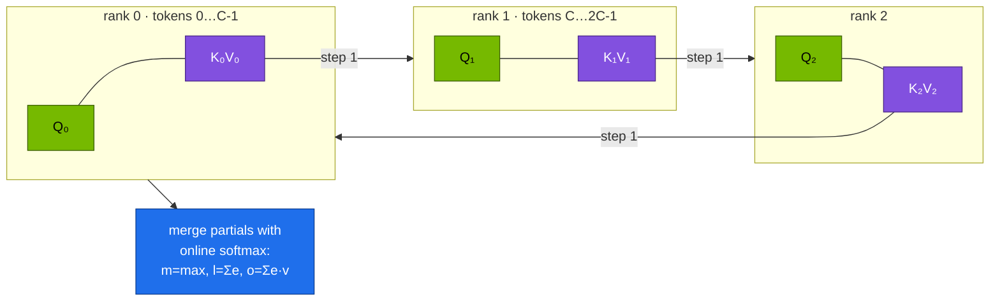

# Volume 08 — Long Context: Ring Attention / Context Parallelism, 128K Serving on One Spark, and Needle Tests

> **Module 03 · Part II — DeepSeek infrastructure** · Prev: [07 DeepGEMM](07-deepgemm-fp8-library.md) · Next: [09 EPLB](09-eplb-expert-parallelism-load-balancer.md)

| | |
|---|---|
| **You will build** | Ring attention from scratch, verified bit-for-bit against full attention on 2–4 ranks (CPU, then across two Sparks over NCCL). You'll serve an R1 distill with its full 128K window on one GB10, and check that it really uses that window with a needle-in-a-haystack sweep |
| **Hardware** | CPU for §5.1. spark-01 for §5.2–5.3. 2 Sparks for §5.4 |
| **Time** | 75 min |
| **Risk** | None |
| **Lab files** | [`tools/ring_attention_demo.py`](lab/tools/ring_attention_demo.py), [`tools/needle_test.py`](lab/tools/needle_test.py), [`k8s/long-context/r1-7b-128k`](lab/k8s/long-context/r1-7b-128k/kustomization.yaml), [`tools/model_math.py`](lab/tools/model_math.py) |

---

## 1. Why this matters on a Spark

Long context costs memory in two places:

| Phase | Cost grows like | On a GB10 |
|---|---|---|
| **Prefill** (reading the prompt) | attention compute ∝ L² | a 128K prompt is a big one-time compute job. Chunked prefill keeps it from blocking other users |
| **Decode** (each new token) | KV-cache memory ∝ L, and reads ∝ L per token | 128K × 56 KiB = **7 GiB** for one R1-7B sequence. 128K × 256 KiB = **32 GiB** for R1-32B |

When one device can't hold a sequence's activations or KV, **context parallelism (CP)** splits the *sequence* across GPUs. Each GPU keeps a chunk of queries, and keys/values circulate in a ring. DeepSeek and others use CP to train at 128K. Serving engines use CP and its relatives for very long prompts.

---

## 2. Architecture — HLD



At each of W steps, a rank attends its queries to the K/V chunk it holds, then passes that chunk to the next rank (`isend`/`irecv`), overlapping communication with compute. Partial results combine exactly with the **online softmax** (FlashAttention's trick): keep a running max `m`, denominator `l` and numerator `o`, and rescale when the max changes. Causal masking means a rank skips chunks from the future.

| Long-context technique | Splits | Communication | Used for |
|---|---|---|---|
| Ring attention / CP | sequence, K/V passed in a ring | P2P, W−1 steps | training and prefill of very long inputs |
| Ulysses (sequence parallel) | sequence ↔ heads via all-to-all | 2 all-to-alls per layer | training with many heads |
| Chunked prefill (one GPU) | prompt into chunks over time | none | serving: keep decode latency steady during long prefills |
| RoPE scaling (YaRN etc.) | — | — | extending a model's trained window |

---

## 3. LLD

### 3.1 Long-context settings for the lab's models

| Model | Native window | KV/token | KV at full window, 1 seq | Fits one Spark? |
|---|---|---|---|---|
| R1-Distill-Qwen-7B | 131,072 | 56 KiB | 7 GiB | ✅ `k8s/long-context/r1-7b-128k` |
| R1-Distill-Qwen-32B (BF16, util 0.70) | 131,072 | 256 KiB | 32 GiB | ❌ only ~19.8 GiB of KV (drill D03). Use FP8 weights + FP8 KV |
| DeepSeek-V2-Lite (MLA) | 32,768 (Lite) | 30.4 KiB | 1 GiB at 32K | ✅ |
| DeepSeek-V3/R1 (MLA) | 131,072 | 68.6 KiB | 8.6 GiB | the weights don't fit (Vol 14) |

### 3.2 The 128K overlay

| Flag | Value | Why |
|---|---|---|
| `--max-model-len` | 131072 | full trained window |
| `--enable-chunked-prefill` | on | 128K prompts are processed in pieces between decode steps |
| `--max-num-batched-tokens` | 8192 | chunk size: smaller means smoother decode latency, larger means faster prefill |

---

## 4. Integrations

- **Vol 01 (MLA)**: MLA's tiny KV is what makes 128K serving of V3/R1 practical at all.
- **02 Vol 17 (NCCL over CX-7)**: the 2-Spark run uses the same `NCCL_*` environment.
- **RAG (Vol 29)** and agents (Vol 30) are the realistic consumers of long context. The needle test tells you whether to rely on the window or on retrieval.

---

## 5. Lab

### 5.1 Ring attention equals full attention (CPU)

```bash
cd "03-DeepSeek/lab"
python3 tools/ring_attention_demo.py --world 2 --seq 1024
python3 tools/ring_attention_demo.py --world 4 --seq 1024 --port 29544
torchrun --nproc-per-node 2 tools/ring_attention_demo.py --seq 1024        # same code under torchrun
```

```text
world=4 seq=1024 heads=4 dim=64
backend=gloo device=cpu
max |ring - full| = 4.44e-16  → ✓ identical
K/V held per rank (bf16): 0.2 MiB instead of 1.0 MiB
```

Read `ring_attention`: the four lines that update `m`, `l` and `o` are the whole algorithm.

### 5.2 Serve 128K on one Spark

```bash
scripts/serve-model.sh r1-7b                         # cache weights + baseline
kubectl apply -k k8s/long-context/r1-7b-128k
kubectl -n llm-serving rollout status deploy/vllm --timeout=30m
kubectl -n llm-serving logs deploy/vllm | grep -E 'max_model_len|Maximum concurrency|KV cache size'
```

vLLM logs the maximum concurrency at 131,072 tokens per request. Compare with `model_math.py deepseek-r1-distill-qwen-7b --util 0.30 --ctx 131072`.

### 5.3 Does the model actually use the window?

```bash
kubectl -n llm-serving port-forward svc/vllm 8000 &
python3 tools/needle_test.py --url http://localhost:8000 --model r1-7b \
  --lengths 4000 16000 64000 120000 --depths 0.1 0.5 0.9
```

Fill in (**record yours**):

| tokens ≈ | depth 0.1 | 0.5 | 0.9 | TTFT at 0.5 |
|---|---|---|---|---|
| 4K | | | | |
| 16K | | | | |
| 64K | | | | |
| 120K | | | | |

Expect TTFT to grow roughly quadratically and hit rates to drop at the longest lengths or middle depths. That's the data you need before telling users "paste the whole document".

### 5.4 (2 Sparks) Ring attention over the CX-7 link

On each Spark (or as a 2-pod hostNetwork Job, like 02's `two-spark` overlay):

```bash
export NCCL_SOCKET_IFNAME=enp1s0f1np1 NCCL_IB_HCA=rocep1s0f1,roceP2p1s0f1 NCCL_IB_GID_INDEX=3
torchrun --nnodes 2 --node-rank <0|1> --nproc-per-node 1 --master-addr 192.168.100.11 --master-port 29500 \
  tools/ring_attention_demo.py --backend nccl --seq 65536 --heads 32 --dim 128
```

Each GB10 holds half the K/V, and chunks travel over RDMA. Agreement is checked in FP32 (tolerance 1e-4).

---

## 6. Verify

| Check | Expected |
|---|---|
| ring vs full (CPU) | `✓ identical` for world 2 and 4, and under torchrun |
| vLLM 128K | starts with `max_model_len=131072` |
| needle sweep | a table you trust for your model, with TTFT per length |

---

## 7. Troubleshooting

| Symptom | Cause | Fix |
|---|---|---|
| `ValueError: … max_model_len … larger than the maximum number of tokens that can be stored in KV cache` | window × KV/token > budget (drill D03) | lower `--max-model-len`, FP8 KV, more util, or a smaller model |
| other users' tokens stall during a long prompt | prefill hogs the GPU | chunked prefill, smaller `--max-num-batched-tokens` |
| model ignores mid-document facts | training-length or position effects ("lost in the middle") | retrieval (Vol 29) instead of one giant prompt. Put key facts near the start or end |
| ring demo hangs on 2 Sparks | NCCL can't connect | 02 Vol 17 checklist: IFNAME, HCA, GID, MTU |

---

## 8. Scale-out path

| On Spark(s) | Datacenter |
|---|---|
| 128K on one GPU with chunked prefill | 1M-token contexts: CP across 8–64 GPUs, Ulysses + ring hybrids, sparse attention (DeepSeek-V3.2's DSA) |
| ring over one CX-7 link | rings within NVLink domains, hierarchical across IB rails |

---

## 9. Checklist

- [ ] I can derive the online-softmax merge and explain why ring attention is exact.
- [ ] I served a 128K window on one Spark and know its KV cost per sequence.
- [ ] I measured where my model's long-context recall breaks down.
