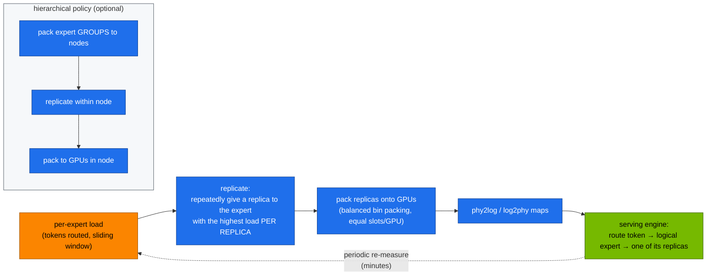

# Volume 09 — EPLB: Placing Experts So No GPU Waits, with Real Router Loads from Your Spark

> **Module 03 · Part II — DeepSeek infrastructure** · Prev: [08 Long context](08-context-parallelism-and-long-context-attention.md) · Next: [10 3FS](10-3fs-fire-flyer-file-system.md)

| | |
|---|---|
| **You will build** | An expert-placement simulator that compares naive placement, replicate-and-pack, and DeepSeek's own `eplb.py` (global and hierarchical policies). You'll feed it synthetic loads and the real per-expert loads you measured on DeepSeek-V2-Lite in Vol 02, and quantify the step-time gain |
| **Hardware** | CPU (the loads come from the GB10 run in Vol 02 §5.3) |
| **Time** | 45 min |
| **Risk** | None |
| **Lab files** | [`tools/eplb_sim.py`](lab/tools/eplb_sim.py), [`tools/moe_router_probe.py`](lab/tools/moe_router_probe.py), DeepSeek's [EPLB](https://github.com/deepseek-ai/EPLB) `eplb.py` |

---

## 1. Why this matters

With **expert parallelism (EP)**, a model's experts are spread across GPUs: V3 serving at scale puts 256 routed experts on dozens to hundreds of GPUs. Every MoE layer waits for the slowest GPU, and real traffic is skewed: some experts are hot, some cold (you saw ~3× max/mean in V2-Lite's router on four domains). **EPLB** (Expert-Parallelism Load Balancer) fixes placement:

1. **Replicate** hot experts into spare "redundant" slots, so their load splits across copies.
2. **Pack** the resulting replicas onto GPUs so every GPU gets about the same total load.
3. Optionally respect topology (**hierarchical** policy): keep expert *groups* on one node, so group-limited routing (Vol 02) still bounds cross-node traffic.

The router's bias balancing (Vol 02) evens out *routing* during training. EPLB evens out *placement* during serving. You need both.

---

## 2. Architecture — HLD



---

## 3. LLD

### 3.1 Results on a Zipf-skewed load (256 experts, 32 GPUs, 32 redundant slots)

| Placement | max/mean GPU load | Step-time multiplier vs perfect |
|---|---|---|
| naive contiguous (8 experts/GPU) | **6.86** | 6.86× |
| eplb-lite (this lab: replicate + LPT pack) | 1.01 | 1.01× |
| DeepSeek `eplb.py`, global policy (`--nodes 1`) | 1.01 | 1.01× |
| DeepSeek `eplb.py`, hierarchical (4 nodes, 4 groups) | 1.58 | 1.58× |

The hierarchical result isn't worse engineering. It answers a different question: it keeps each expert group on one node to bound inter-node all-to-all traffic, and pays some compute balance for it. On a fast intra-node fabric with a slower inter-node one, that trade usually wins.

### 3.2 Inputs and outputs

| | Meaning |
|---|---|
| `weight[layer][expert]` | measured token count per logical expert |
| `num_replicas` | logical experts + redundant slots (must divide evenly by GPUs) |
| `phy2log[layer][slot]` | which logical expert each physical slot holds |
| `logcnt[layer][expert]` | replica count per expert |

---

## 4. Integrations

- **Vol 02 §5.3** produces real loads (`LOADS_JSON` line in the GPU probe's log).
- **vLLM** implements EPLB for expert-parallel deployments (`--enable-expert-parallel` with `--enable-eplb` in recent versions). It measures loads online and rebalances periodically. That's a datacenter feature, since one GPU has nothing to balance across.
- **Vol 14** applies EP when DeepSeek-V3/R1 spans many GPUs.

---

## 5. Lab

### 5.1 Synthetic skew

```bash
cd "03-DeepSeek/lab"
git clone --depth 1 https://github.com/deepseek-ai/EPLB /tmp/eplb
python3 tools/eplb_sim.py --upstream /tmp/eplb/eplb.py                 # hierarchical, 4 nodes
python3 tools/eplb_sim.py --upstream /tmp/eplb/eplb.py --nodes 1       # global
```

Compare your output with §3.1.

### 5.2 How much redundancy is enough?

```bash
for r in 0 8 16 32 64; do
  printf "redundant=%-3s " $r; python3 tools/eplb_sim.py --redundant $r | grep eplb-lite
done
```

(`--redundant 0` still repacks experts with LPT and doesn't replicate.) Expect diminishing returns: the first slots go to the hottest experts and do most of the work. Each redundant slot costs one expert's weights (≈ 44 MB per V3 expert in FP8) on that GPU.

### 5.3 Real loads from DeepSeek-V2-Lite

```bash
# from Vol 02 §5.3 (GPU probe run on the Spark):
kubectl -n llm-serving logs job/gpu-probes | sed -n 's/^LOADS_JSON: //p' > /tmp/loads.json
python3 tools/eplb_sim.py --experts 64 --gpus 8 --redundant 8 --loads /tmp/loads.json --upstream /tmp/eplb/eplb.py --nodes 1
```

This answers a concrete question: "if I served V2-Lite with EP=8 on eight GPUs, how much would placement cost me with this traffic mix?" (**record yours**)

### 5.4 Read DeepSeek's code

Open `/tmp/eplb/eplb.py` and find `replicate_experts` (greedy: highest load-per-replica first) and `balanced_packing`. Compare with `eplb_lite` in `tools/eplb_sim.py`. They follow the same two-step idea.

---

## 6. Verify

| Check | Expected |
|---|---|
| naive vs balanced | ≥ 3× step-time improvement on skewed loads |
| global upstream vs eplb-lite | both ≈ 1.0 |
| hierarchical upstream | higher than global. You can explain why |

---

## 7. Troubleshooting

| Symptom | Cause | Fix |
|---|---|---|
| `AssertionError` in `eplb_sim.py` | experts or replicas not divisible by GPUs | choose `--redundant` so `(experts + redundant) % gpus == 0` |
| upstream import error | `eplb.py` needs torch | the lab's CPU torch is enough |
| rebalance helps little | loads nearly uniform, or skew is per-batch noise | measure over longer windows. Placement needs stable skew |

---

## 8. Scale-out path

| Here | Datacenter |
|---|---|
| offline simulation from one probe | online load counters per layer, rebalancing every few minutes without dropping requests |
| 8 GPUs hypothetical | DeepSeek's published serving: prefill EP32 and decode EP144-class deployments, with redundant experts per GPU |

---

## 9. Checklist

- [ ] I can explain replicate-then-pack, and why the slowest GPU sets the step time.
- [ ] I compared naive, global and hierarchical placement and can explain the hierarchical trade-off.
- [ ] I ran the simulator on real router loads from my Spark.
