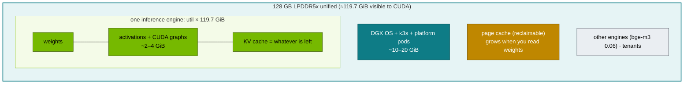

# Volume 12 — Memory Math on a GB10: From config.json to `--gpu-memory-utilization`, and Checking It Against vLLM

> **Module 03 · Part III — Models & memory** · Prev: [11 32B models](11-deepseek-r1-32b-and-qwen-32b-models.md) · Next: [13 Coder-V2 & maths](13-deepseek-coder-v2-and-math-models.md)

| | |
|---|---|
| **You will build** | A repeatable method, and a tool, that turns any model's `config.json` into weight memory, KV bytes per token, a `--gpu-memory-utilization` value and a concurrency estimate for one or two Sparks. You'll check the prediction against what vLLM reports and what the host sees |
| **Hardware** | CPU for §5.1–5.2. spark-01 for §5.3–5.4 |
| **Time** | 60 min |
| **Risk** | None |
| **Lab files** | [`tools/model_math.py`](lab/tools/model_math.py), [`models.yaml`](lab/models.yaml), [`02-Kubernetes/lab/scripts/uma-watch.sh`](../02-Kubernetes/lab/scripts/uma-watch.sh) |

---

## 1. The budget on a GB10



**Rule of thumb for this lab:** the sum of all engines' `--gpu-memory-utilization` stays ≤ 0.75, and the page cache is dropped before a big load (`serve-model.sh` does it).

---

## 2. The formulas (what `model_math.py` computes)

| Quantity | Formula | Example: R1-Distill-Qwen-32B |
|---|---|---|
| Parameters (dense GQA) | `vocab·d·(1 or 2) + L·(attn + 3·d·inter)` with `attn = d·h·hd + 2·d·kv·hd + h·hd·d (+ bias)` | 32.76 B |
| Weight bytes | params × bytes/param (bf16 2, fp8 1, int4 ≈0.5 + scales, Q4_K_M ≈ 0.61) | 61.0 GiB bf16 · 30.5 fp8 · ~17–19 int4 |
| KV per token (GQA) | `2 · L · kv_heads · head_dim · bytes` | 2·64·8·128·2 = **256 KiB** |
| KV per token (MLA) | `L · (kv_lora_rank + rope_dim) · bytes` | V3: 61·576·2 = 68.6 KiB |
| KV budget | `util × 119.7 GiB − weights − overhead` | 0.70 → 19.8 GiB |
| Tokens in cache | KV budget ÷ KV/token | 80,952 |
| Concurrency at context C | tokens ÷ C (worst case: every sequence at full length) | 4 at 16K |

---

## 3. LLD: the 32B in every format (util 0.65, 16K context)

| Format | Weights | KV budget | Tokens | Full-length seqs |
|---|---|---|---|---|
| BF16 | 61.0 GiB | 13.8 GiB | 56,437 | 3 |
| FP8 | 30.5 GiB | 44.3 GiB | 181,419 | 11 |
| AWQ INT4 (≈, + scales) | ~15–19 GiB | ~56–60 GiB | ~230–244K | 14 |
| GGUF Q4_K_M (llama.cpp) | 18.5 GiB | 56.3 GiB | 230,631 | 14 |
| FP8 weights + **FP8 KV**, util 0.45, 32K | 30.5 GiB | 20.4 GiB | 166,722 | 5 at 32K |

Real concurrency is usually higher than "full-length seqs", because most requests don't use the whole window. vLLM allocates KV blocks on demand (PagedAttention).

---

## 4. Integrations

- **`models.yaml`** stores the chosen `util`, `max_len` and pod memory limit per model. They came from this volume's method.
- **02 Vol 12** asked whether CUDA allocations count against a pod's memory limit on UMA. The catalog sets *both* a pod limit and an engine fraction, so it's safe either way.
- **Vol 14** uses the same tool for multi-Spark and 671B planning (`--sparks 2`, `--dtype iq1_s`).

---

## 5. Lab

### 5.1 Size a model from its real config

```bash
cd "03-DeepSeek/lab"
python3 tools/model_math.py --list
python3 tools/model_math.py deepseek-r1-distill-qwen-32b --util 0.70 --ctx 16384
# from a downloaded config (after any serve-model.sh run):
kubectl -n llm-serving exec deploy/vllm -- sh -c 'cat /models/hf/models--deepseek-ai--DeepSeek-R1-Distill-Qwen-7B/snapshots/*/config.json' > /tmp/config.json
python3 tools/model_math.py --config /tmp/config.json --util 0.30 --ctx 32768
```

### 5.2 Sweep formats and contexts

```bash
for d in bf16 fp8 awq q4_k_m; do
  python3 tools/model_math.py deepseek-r1-distill-qwen-32b --dtype $d --util 0.65 --ctx 16384 | grep -E 'weights|KV cache'
done
python3 tools/model_math.py deepseek-r1-distill-qwen-32b --dtype fp8 --kv-dtype fp8 --util 0.45 --ctx 32768
```

### 5.3 Prediction vs vLLM vs host

```bash
scripts/serve-model.sh r1-32b-fp8
kubectl -n llm-serving logs deploy/vllm | grep -E 'Model loading took|Available KV cache memory|GPU KV cache size|Maximum concurrency'
free -g                                     # on the Spark
```

| | Predicted (`model_math`) | vLLM log | Host |
|---|---|---|---|
| weights | 30.5 GiB | `Model loading took … GiB` | — |
| KV memory | 20.4 GiB (util 0.45, 3 GiB overhead) | `Available KV cache memory` | — |
| KV tokens | 83,361 at BF16 KV | `GPU KV cache size: … tokens` | — |
| used memory | — | — | `free -g` used |

If vLLM reports less KV than predicted, the difference is activation peak during profiling and CUDA graphs. Raise `--overhead-gib` to match, and your future predictions get better.

### 5.4 Watch the pool during a load

```bash
"../../02-Kubernetes/lab/scripts/uma-watch.sh" llm-serving "$(kubectl -n llm-serving get pod -l app=vllm -o name | cut -d/ -f2)" 2
# in another terminal:
kubectl -n llm-serving rollout restart deploy/vllm
```

Watch `MemAvailable` fall in two steps (weights, then KV pre-allocation) and the page cache rise as the safetensors files are read.

---

## 6. Verify

| Check | Expected |
|---|---|
| `model_math.py` vs vLLM | weights within a few %, KV tokens within ~15 % after calibrating overhead |
| catalog sanity | for every model you serve, Σ util of running engines ≤ 0.75 |

---

## 7. Troubleshooting

| Symptom | Cause | Fix |
|---|---|---|
| `insufficient memory … gpu_memory_utilization` at start (drill D02) | the fraction asks for memory others use | lower util. Drop page cache. Stop other engines |
| KV tokens much lower than predicted | big `--max-num-seqs` × `--max-num-batched-tokens` activation peak | lower those, or account for them in `--overhead-gib` |
| model fits but node goes `MemoryPressure` | pod limits too low/high vs real use, or page cache plus engine | 02 Vol 12 UMA experiment. Leave ≥ 20 GiB headroom |

---

## 8. Scale-out path

| Here | Beyond |
|---|---|
| 1 Spark: util × 119.7 GiB | 2 Sparks with TP=2: weights halve per GPU, KV budget doubles (Vol 14) |
| worst-case concurrency | measured length distributions → realistic concurrency, SLO-driven admission |

---

## 9. Checklist

- [ ] I can compute weights, KV/token and concurrency for any GQA or MLA model from `config.json`.
- [ ] I compared my prediction with vLLM's log and calibrated the overhead.
- [ ] I can pick a format (BF16/FP8/INT4/GGUF) for a target context and concurrency on one Spark.
