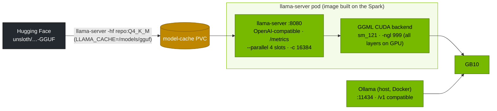

# Volume 17 — llama.cpp and Ollama on a GB10: GGUF Quantisation, Building for sm_121, and Where They Beat vLLM

> **Module 03 · Part IV — Serving engines** · Prev: [16 SGLang](16-sglang-and-radix-attention-serving.md) · Next: [18 TensorRT-LLM](18-tensorrt-llm-compilation-for-deepseek.md)

| | |
|---|---|
| **You will build** | llama.cpp compiled for the GB10 (sm_121, with RPC), a GGUF R1-7B served in Kubernetes, a quantisation sweep with `llama-bench`, Ollama as the zero-config alternative, and a head-to-head with vLLM at concurrency 1 and 16 |
| **Hardware** | spark-01 |
| **Time** | 90 min (the build takes ~15 min) |
| **Risk** | Low |
| **Lab files** | [`k8s/llamacpp/Dockerfile`](lab/k8s/llamacpp/Dockerfile), [`k8s/llamacpp/llama-server.yaml`](lab/k8s/llamacpp/llama-server.yaml), [`tools/eval_harness.py`](lab/tools/eval_harness.py) |

---

## 1. Why GGUF on a Spark

| | vLLM / SGLang | llama.cpp / Ollama |
|---|---|---|
| Strength | many concurrent users: continuous batching, PagedAttention | one or a few users, tiny footprint, **any quantisation from 1.5 to 8 bits** |
| Formats | safetensors (BF16, FP8, AWQ, GPTQ, NVFP4) | GGUF (Q2_K … Q8_0, IQ1_S…IQ4_XS, imatrix-calibrated) |
| Start time | minutes (compile, CUDA graphs) | seconds |
| Multi-node | TP/PP with NCCL | RPC backend (Vol 14 runs R1 671B with it) |
| Best for | shared API | personal assistant, edge, huge models at very low bit-width |

---

## 2. Architecture — HLD



---

## 3. LLD

### 3.1 GGUF quantisation types (approx. bits per weight)

| Type | ≈ bits/weight | R1-Distill-Qwen-7B size | Typical use |
|---|---|---|---|
| Q8_0 | 8.5 | ~8.1 GB | near-lossless reference |
| Q6_K | 6.6 | ~6.3 GB | high quality |
| **Q4_K_M** | 4.85 | ~4.7 GB | the default sweet spot |
| IQ4_XS | 4.25 | ~4.2 GB | smaller, needs an imatrix |
| Q3_K_M | 3.9 | ~3.8 GB | memory-starved devices |
| IQ1_S (Unsloth "dynamic", mixed per layer) | ~1.6 avg | R1 671B: ~131 GB | giant MoE models (Vol 14) |

### 3.2 Build and serve settings

| Setting | Value | Why |
|---|---|---|
| `CMAKE_CUDA_ARCHITECTURES` | 121 | native SASS for the GB10 |
| `GGML_RPC=ON` | on | multi-Spark offload (Vol 14) |
| `-ngl 999` | all layers on GPU | UMA: there's no separate "CPU RAM" to save |
| `--parallel 4 -c 16384` | 4 slots sharing a 16K context (4K each) | llama.cpp splits `-c` across slots |
| `--jinja` | use the model's chat template | correct R1/Qwen formatting |
| `--metrics` | Prometheus endpoint | Vol 38 |

---

## 4. Integrations

- **Vol 14** reuses this image for the 671B RPC deployment across two Sparks.
- **LiteLLM** can route a `local-small` alias to `llama-server:8080/v1`.
- **Open WebUI** talks to Ollama natively if you enable `ENABLE_OLLAMA_API` (the lab disables it and goes through LiteLLM).

---

## 5. Lab

### 5.1 Build llama.cpp for sm_121 and import into k3s (on the Spark)

```bash
cd "03-DeepSeek/lab/k8s/llamacpp"
docker build -t spark-local/llama.cpp:server-sm121 --build-arg LLAMACPP_REF=b6500 .
docker save spark-local/llama.cpp:server-sm121 | sudo k3s ctr images import -
sudo k3s crictl images | grep llama.cpp
```

Pin `LLAMACPP_REF` to a recent release tag (llama.cpp tags builds `bNNNN`). Newer tags carry newer model support.

### 5.2 Quantisation sweep with `llama-bench`

```bash
mkdir -p /data/k8s/gguf && cd /data/k8s/gguf
for q in Q8_0 Q4_K_M Q3_K_M; do
  hf download unsloth/DeepSeek-R1-Distill-Qwen-7B-GGUF --include "*${q}.gguf" --local-dir .
done
docker run --rm --gpus all -v /data/k8s/gguf:/m --entrypoint llama-bench spark-local/llama.cpp:server-sm121 \
  -m /m/DeepSeek-R1-Distill-Qwen-7B-Q8_0.gguf,/m/DeepSeek-R1-Distill-Qwen-7B-Q4_K_M.gguf,/m/DeepSeek-R1-Distill-Qwen-7B-Q3_K_M.gguf \
  -ngl 999 -p 512 -n 128
```

(**Record yours**) `pp512` (prompt tokens/s) and `tg128` (generated tokens/s) per quant. On a bandwidth-bound GPU, `tg` should rise roughly in proportion to the shrinking file size.

### 5.3 Serve GGUF in Kubernetes

```bash
cd "03-DeepSeek/lab"
kubectl -n llm-serving scale deploy vllm --replicas=0
kubectl apply -f k8s/llamacpp/llama-server.yaml
kubectl -n llm-serving logs -f deploy/llama-server | grep -E 'offloaded|model size|listening'
kubectl -n llm-serving port-forward svc/llama-server 8080 &
python3 tools/eval_harness.py --url http://localhost:8080 --model r1-7b-q4 --suites math json --concurrency 1 --out results/llamacpp-q4-c1.json
python3 tools/eval_harness.py --url http://localhost:8080 --model r1-7b-q4 --suites math json --concurrency 16 --out results/llamacpp-q4-c16.json
```

### 5.4 Same model in vLLM (BF16) for comparison

```bash
kubectl -n llm-serving scale deploy llama-server --replicas=0
scripts/serve-model.sh r1-7b
kubectl -n llm-serving port-forward svc/vllm 8000 &
for c in 1 16; do python3 tools/eval_harness.py --url http://localhost:8000 --model r1-7b --suites math json --concurrency $c --out results/vllm-bf16-c$c.json; done
python3 tools/eval_harness.py --report results/llamacpp-q4-c*.json results/vllm-bf16-c*.json
```

| | llama.cpp Q4_K_M | vLLM BF16 |
|---|---|---|
| tok/s at c=1 | | |
| tok/s at c=16 | | |
| math acc | | |
| memory (`free -g` delta) | | |

Typical pattern: llama.cpp is competitive or faster at c=1 (smaller weights to read), and vLLM pulls ahead at c=16 (continuous batching).

### 5.5 Ollama in two commands

```bash
docker run -d --gpus=all -p 11434:11434 -v ollama:/root/.ollama --name ollama ollama/ollama
docker exec ollama ollama run deepseek-r1:7b "In one sentence, what is MLA?"
python3 tools/eval_harness.py --url http://localhost:11434 --model deepseek-r1:7b --suites json --limit 4
docker rm -f ollama
```

---

## 6. Verify

| Check | Expected |
|---|---|
| image | `llama-server --version` runs. `nvidia-smi` shows the process during inference |
| llama-bench | tg128 rises as quant size falls |
| comparison table | filled in for c=1 and c=16 |

---

## 7. Troubleshooting

| Symptom | Cause | Fix |
|---|---|---|
| `no kernel image is available` | built without arch 121, or a prebuilt amd64/x86 image | build from the Dockerfile on the Spark |
| everything on CPU (`offloaded 0/29 layers`) | `-ngl` missing, or CUDA not found in the container | `-ngl 999`. Run with `--gpus all` / k3s nvidia runtime |
| truncated answers | per-slot context = `-c / --parallel` too small for R1 thinking | raise `-c` or lower `--parallel` |
| `ErrImageNeverPull` in k8s | image not imported into k3s containerd | `docker save … | sudo k3s ctr images import -` on that node |

---

## 8. Scale-out path

| One Spark | More |
|---|---|
| 7B Q4 for one user | 2 Sparks with RPC for models over 120 GB (Vol 14) |
| llama-server pod | fleet APIs on vLLM/SGLang. llama.cpp for edge and laptops |

---

## 9. Checklist

- [ ] I built llama.cpp for sm_121 and served a GGUF model in Kubernetes.
- [ ] I measured how quantisation level changes speed on a bandwidth-bound GPU.
- [ ] I know when llama.cpp beats vLLM, and when it doesn't.
