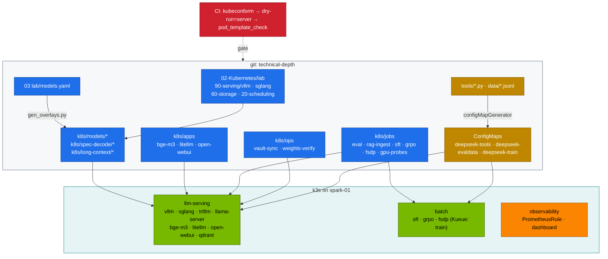

# Volume 19 — Kubernetes Manifests for DeepSeek: The Lab's Layout, the Base Deployment Line by Line, and Admission-Checked Overlays

> **Module 03 · Part V — Platform integration** · Prev: [18 TensorRT-LLM](18-tensorrt-llm-compilation-for-deepseek.md) · Next: [20 NVMe & weight caching](20-nvme-local-storage-and-weight-caching.md)

| | |
|---|---|
| **You will build** | A full read-through of every manifest the DeepSeek lab ships. You'll learn how the 02 platform's vLLM Deployment becomes fourteen model overlays, how tools reach Jobs without custom images, and how CI catches a broken pod template before the ReplicaSet does. Then you'll break and fix a manifest with drill D08 |
| **Hardware** | spark-01 (any kind cluster works for §5.1–5.3) |
| **Time** | 60 min |
| **Risk** | Low. Read-only until §5.4 |
| **Lab files** | [`lab/kustomization.yaml`](lab/kustomization.yaml), [`lab/k8s/`](lab/k8s/), [`02 …/90-serving/vllm/vllm.yaml`](../02-Kubernetes/lab/manifests/llms/90-serving/vllm/vllm.yaml), [`02 …/tests/pod_template_check.py`](../02-Kubernetes/lab/tests/pod_template_check.py), [`tests/run-local-checks.sh`](lab/tests/run-local-checks.sh) |

---

## 1. Why this volume exists

Volumes 11–18 deployed things with one command. Production teams have to *own* those manifests: review them, patch them and explain every field to an auditor. This volume covers three rules that keep the lab maintainable:

| Rule | How the lab applies it |
|---|---|
| **One base, many overlays** | 02's `vllm.yaml` is the only hand-written vLLM Deployment. Every model is a generated JSON-patch overlay |
| **No custom images for tools** | Python tools and eval data ship as ConfigMaps (`kubectl apply -k "03-DeepSeek/lab"`) and mount into stock images |
| **Admission is tested, not hoped for** | `kubeconform` (schemas) → server-side dry-run (API objects) → `pod_template_check.py` (PodSecurity, quota and policies on the *pods*) |

---

## 2. Architecture — HLD



---

## 3. LLD

### 3.1 The base vLLM Deployment, field by field

| Field | Value | Why it's there |
|---|---|---|
| `strategy.type` | `Recreate` | a rolling update would run two copies and double UMA use. Plan for ~1–5 min downtime per switch |
| `priorityClassName` | `spark-serving` (50000) | serving preempts batch (10000) when memory or slices run short |
| `terminationGracePeriodSeconds` | 120 | longer than a long generation, so streams finish |
| `lifecycle.preStop` | `sleep 15` | the pod leaves the EndpointSlice before SIGTERM, so new requests stop arriving first |
| `startupProbe` | `/health`, 10 s × 180 | up to 30 min for first download + CUDA-graph capture, without liveness killing it |
| `readinessProbe` / `livenessProbe` | `/health` 5 s / 15 s × 4 | traffic only when the engine is up. Restart a hung engine after ~1 min |
| `resources.requests` | cpu 4, memory 16Gi, `nvidia.com/gpu: 1` | 1 of 4 time-slices. The memory request is for the *host-side* process |
| `resources.limits.memory` | 48Gi, patched per model (r1-7b 32Gi, r1-32b larger) | a cgroup limit. On UMA it also bounds pinned/host allocations |
| `/dev/shm` | `emptyDir: Memory`, 8Gi | NCCL and PyTorch dataloaders. The 64 MiB default breaks them |
| `env.MODEL`, `env.SERVED_NAME` | overlay-patched | args use `$(MODEL)` so patches touch env, not the whole arg list |
| `HF_TOKEN` | from Secret `hf-token` | gated models. Synced from Vault (Vol 32) |
| volume `models` | PVC `model-cache` (500Gi, `local-nvme-retain`) | weights survive pod and PVC deletion (Vol 20) |
| ServiceMonitor | `release: kps`, 15 s | `/metrics` → Prometheus (Vol 38) |

### 3.2 What an overlay changes

`gen_overlays.py` writes six JSON-patch operations per model: `args`, `env[0]` (MODEL), `env[1]` (SERVED_NAME), `limits.memory`, and the `model` label on the Deployment and the pod template. Nothing else changes, so a security fix in the base reaches all fourteen models.

### 3.3 Namespaces, PSA and who runs where

| Namespace | PSA enforce | Lab workloads | Notes |
|---|---|---|---|
| `llm-serving` | baseline | engines, apps, eval, rag-ingest, vault-sync, weights-verify | eval runs model-written code: non-root, no SA token, read-only root FS, all caps dropped |
| `batch` | privileged (warn baseline) | sft, grpo, fsdp | fsdp needs `hostNetwork` + `IPC_LOCK` for RoCE |
| `llm-multinode` | privileged | LWS 70B, llama.cpp RPC | two-Spark only |
| `observability` | — | PrometheusRule `spark-reasoning`, dashboard ConfigMap | label `release: kps` |

### 3.4 Three layers of validation

| Layer | Tool | Catches | Misses |
|---|---|---|---|
| Schema | `kubeconform -strict` + CRD catalog | typos, wrong types, unknown fields | anything cluster-specific |
| API | `kubectl apply --dry-run=server` | missing namespaces/CRDs, webhook rejections, immutable-field changes | pod-level admission for controllers' pods |
| Pod | `pod_template_check.py` | PSA violations, ValidatingAdmissionPolicy, ResourceQuota/LimitRange on the *pod* | runtime faults (OOM, image pull) |

---

## 4. Integrations

- **02 platform**: namespaces, priority classes, Kueue (`train` LocalQueue), quotas, the Gateway and the `model-cache` PVC all come from `02-Kubernetes/lab/scripts/apply-lab.sh`.
- **Vol 31 (Ansible)** applies exactly these kustomizations through `kubernetes.core.kustomize`.
- **CI**: `.github/workflows/deepseek-lab-ci.yml` runs all three validation layers on a kind cluster with a fake GPU node.

---

## 5. Lab

### 5.1 Render everything and count it

```bash
cd "03-DeepSeek/lab"
kubectl kustomize . | yq -N '.kind + "/" + .metadata.name'
for d in k8s/models/* k8s/apps; do printf '%-28s %s objects\n' "$d" "$(kubectl kustomize "$d" | grep -c '^kind:')"; done
```

Expected: three ConfigMaps from the root kustomization, and four objects per model overlay (Secret `hf-token`, Deployment, Service, ServiceMonitor from the base).

### 5.2 Diff two models

```bash
diff <(kubectl kustomize k8s/models/r1-7b) <(kubectl kustomize k8s/models/r1-32b-fp8)
```

Expected: only the args, env values, memory limit and `model` labels differ. If anything else shows up, someone edited a generated file. `python3 scripts/gen_overlays.py --check` will flag it.

### 5.3 The three validation layers

```bash
tests/run-local-checks.sh                     # schema + tool tests (no cluster needed)
API=1 tests/run-local-checks.sh               # + server-side dry-run + pod templates
python3 "../../02-Kubernetes/lab/tests/pod_template_check.py" k8s/models/r1-7b k8s/jobs/eval.yaml k8s/jobs/fsdp-2spark.yaml
```

```text
3 pod templates checked, 0 rejected
```

Now break it on purpose. Add `hostNetwork: true` to `k8s/jobs/eval.yaml` and run the last command again: the Job object passes `--dry-run=server`, but the pod check rejects it (`violates PodSecurity "baseline:latest": host namespaces`). Without that check you'd only find out from a ReplicaSet/Job stuck at 0 pods. Revert the change.

### 5.4 Apply and inspect the live objects

```bash
kubectl apply -k .                               # ConfigMaps
scripts/serve-model.sh r1-7b
kubectl -n llm-serving get deploy,svc,servicemonitor,pvc -l 'app in (vllm)' -o wide
kubectl -n llm-serving get pod -l app=vllm -o jsonpath='{.items[0].spec.containers[0].args}' | tr ',' '\n'
kubectl -n llm-serving describe pod -l app=vllm | grep -E 'Priority|QoS|Limits|Requests' -A2
```

Expected: `Priority: 50000`, `QoS Class: Burstable`, `nvidia.com/gpu: 1` in both requests and limits.

### 5.5 Drill D08 — 404 model not found

```bash
kubectl -n llm-serving port-forward svc/vllm 8000 &
scripts/breakfix.sh inject D08     # prints a command that uses the HF repo id as the model name
python3 tools/eval_harness.py --url http://localhost:8000 --model deepseek-ai/DeepSeek-R1-Distill-Qwen-7B --suites json --limit 2
curl -s localhost:8000/v1/models | jq -r '.data[].id'
scripts/breakfix.sh answer D08
```

---

## 6. Verify

| Check | Command | Expected |
|---|---|---|
| overlays in sync | `python3 scripts/gen_overlays.py --check` | `14 overlays checked, 0 drifted` |
| admission | `API=1 tests/run-local-checks.sh` | `0 rejected`. PodSecurity *warnings* in `batch` are advisory |
| live | `scripts/verify.sh platform serving` | all `PASS` |

---

## 7. Troubleshooting

| Symptom | Cause | Fix |
|---|---|---|
| `kubectl kustomize` error: `accumulating resources … no such file` | overlay resolves the base by a relative path, which breaks when the folder is moved | keep the repo layout. Run from the lab directory |
| `error: … is immutable` on a Job | Job templates can't be patched | `kubectl delete job <name>` then apply (the playbook does this for prefetch) |
| Deployment `0/1`, no pod, event `FailedCreate … forbidden: violates PodSecurity` | pod-level admission | run `pod_template_check.py` on it. Fix securityContext or move to the right namespace |
| `exceeded quota` on the ReplicaSet | 02 ResourceQuota in `llm-serving` | `kubectl describe quota -n llm-serving`. Scale another engine to 0 |
| a ConfigMap change doesn't reach the Job | ConfigMaps mount at pod start | re-run the Job. `disableNameSuffixHash` keeps names stable |

---

## 8. Scale-out path

| One Spark | Fleet |
|---|---|
| kustomize overlays applied by script or Ansible | the same overlays rendered by Argo CD ApplicationSets per cluster/GPU type |
| pod-template check in CI | the same policies enforced by Kyverno/Gatekeeper or ValidatingAdmissionPolicy, tested by CI |
| `Recreate` | rolling updates with `maxSurge: 1` once a second Spark gives memory headroom |

---

## 9. Checklist

- [ ] I can explain every field of the base vLLM Deployment.
- [ ] I can show that overlays differ only in model-specific fields.
- [ ] I've seen a pod-level admission failure that server-side dry-run missed.
- [ ] I solved D08.
