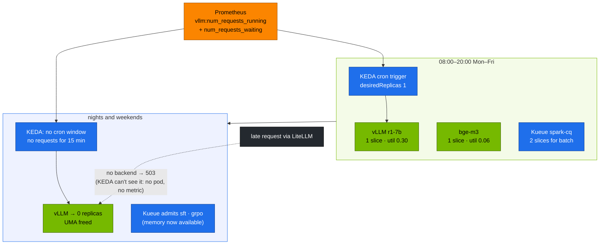

# Volume 22 — Autoscaling on One GB10: Serve by Day, Train by Night, with KEDA, Kueue and KServe

> **Module 03 · Part V — Platform integration** · Prev: [21 Ingress & streaming](21-ingress-and-realtime-streaming-gateways.md) · Next: [23 LoRA/QLoRA sizing](23-peft-lora-qlora-parameter-sizing.md)

| | |
|---|---|
| **You will build** | A one-box capacity plan that shares the GB10 between serving and training on a schedule. KEDA scales vLLM to zero outside office hours and brings it back on demand. Kueue admits fine-tuning Jobs within a quota and preempts low-priority work for urgent runs. KServe serves the same R1 distill through an `InferenceService`, so you can compare the two serving APIs |
| **Hardware** | spark-01 (spark-02 raises `maxReplicaCount` to 2) |
| **Time** | 90 min |
| **Risk** | Medium. Scaling vLLM to 0 makes the API unavailable until it scales back. Do it outside your own working hours or adjust the cron window |
| **Lab files** | [`k8s/autoscale/vllm-office-hours.yaml`](lab/k8s/autoscale/vllm-office-hours.yaml), [`k8s/kserve/r1-1.5b.yaml`](lab/k8s/kserve/r1-1.5b.yaml), [`k8s/jobs/sft.yaml`](lab/k8s/jobs/sft.yaml), [`k8s/jobs/grpo.yaml`](lab/k8s/jobs/grpo.yaml), [`02 …/20-scheduling/kueue.yaml`](../02-Kubernetes/lab/manifests/llms/20-scheduling/kueue.yaml), [`02 …/90-serving/`](../02-Kubernetes/lab/manifests/llms/90-serving/) |

---

## 1. Why "autoscaling" means something different on one box

In a datacenter, autoscaling adds replicas on more GPUs. A single DGX Spark has one GB10 and 128 GB of unified memory, so you can't add capacity. You can only **move it between jobs over time**:

| Lever | What it does here | Tool |
|---|---|---|
| Scale serving to zero when idle | frees a time-slice and 36–55 GiB of UMA | KEDA (cron + Prometheus triggers) |
| Queue training until capacity is free | jobs wait instead of OOM-killing the server | Kueue (quota + gang admission) |
| Priority | urgent runs preempt routine ones, serving outranks batch | PriorityClass (pods) + WorkloadPriorityClass (Kueue) |
| Standard serving API | one CRD for any model server, with HPA built in | KServe `InferenceService` (RawDeployment) |

The same YAML scales out unchanged when spark-02 joins: raise `maxReplicaCount`, add a second ResourceFlavor, and the policies stay the same.

---

## 2. Architecture — HLD



The dotted arrow is the main limitation of scale-to-zero: once vLLM is at 0 there's no pod to queue requests, so the Prometheus trigger never fires. Something in front has to hold the request and signal demand (KEDA's HTTP add-on, or a gateway-side queue). This lab uses a **schedule** instead, because it's predictable and the GPU is shared with training anyway.

---

## 3. LLD

### 3.1 Capacity budget (time-slices and memory)

| Consumer | Slices | UMA (approx.) | Who decides |
|---|---|---|---|
| vLLM r1-7b | 1 | 0.30 × 119.7 ≈ 36 GiB + host process | KEDA (0 or 1) |
| bge-m3 | 1 | 0.06 × 119.7 ≈ 7 GiB | always on |
| Kueue `spark-cq` | **2** (nominal quota) | requests ≤ 64Gi (quota), limits up to 48Gi per Job | Kueue |
| OS, k3s, Prometheus, Qdrant | — | ≈ 15–20 GiB | — |

Time-slicing shares **compute** and does **not** partition memory. The memory quota in Kueue and the `limits.memory` on each pod are the only guards against the box running out of UMA. GPU memory isn't a Kubernetes resource on the GB10, so a Job's *GPU* allocations count against its cgroup only through unified memory.

### 3.2 The ScaledObject (`k8s/autoscale/vllm-office-hours.yaml`)

| Field | Value | Why |
|---|---|---|
| name | `vllm` | replaces 02's ScaledObject on the same Deployment (only one ScaledObject per target) |
| `minReplicaCount` / `maxReplicaCount` | 0 / 1 | 2 when spark-02 joins |
| cron trigger | Mon–Fri 08:00–20:00, `desiredReplicas: 1` | predictable availability |
| prometheus trigger | running + waiting, threshold 16, `activationThreshold: 0` | an in-flight request keeps the pod alive past 20:00 |
| `cooldownPeriod` | 900 s | a model reload costs minutes. Don't flap |
| `ignoreNullValues` | true | with 0 pods there's no series. Treat it as 0, not as an error |

KEDA takes the **maximum** across triggers. Inside the window the cron trigger holds 1. Outside it the Prometheus trigger decides.

### 3.3 Kueue objects (from 02)

| Object | Name | Key settings |
|---|---|---|
| ResourceFlavor | `gb10` | nodes labelled `nvidia.com/gpu.product: GB10` |
| ClusterQueue | `spark-cq` | cpu 8, memory 64Gi, `nvidia.com/gpu` 2. `BestEffortFIFO`. Preempts `LowerPriority` within the queue |
| LocalQueue | `batch/train` | where `sft`, `grpo`, `fsdp` submit (label `kueue.x-k8s.io/queue-name: train`) |
| WorkloadPriorityClass | `urgent` (1000), `routine` (100) | set per Job with label `kueue.x-k8s.io/priority-class`. The lab's `sft`, `grpo` and `fsdp` carry `routine` |

Without that label, Kueue uses the pod's PriorityClass (`spark-batch` = 10000) as the workload priority, which would outrank `urgent`. Always set the label when you rely on Kueue preemption.

Jobs are created with `suspend: true`. Kueue unsuspends them when the whole Job fits, which is gang admission.

### 3.4 KServe vs the lab's Deployment

| | Lab Deployment (Vol 15/19) | KServe `InferenceService` |
|---|---|---|
| Object | kustomize overlay of 02's base | one CRD per model, runtime shared |
| Weights | prefetch Job → PVC | `storageUri` (hf://, s3://, pvc://) → storage-initializer init container |
| Autoscaling | KEDA ScaledObject | HPA (RawDeployment) or Knative (serverless mode) |
| Endpoint | `svc/vllm:8000` | `svc/<name>-predictor:80` |
| Best for | one box, full control over every flag | many models and teams, one standard API |

---

## 4. Integrations

- **02 Vol 05** (Kueue) and **02 Vol 23** (KServe) installed the controllers and the `vllm-spark` ServingRuntime.
- **Vols 23–26** submit their training Jobs to `batch/train`. This volume is what makes them safe to run on the same box as serving.
- **Vol 38** graphs `kube_deployment_status_replicas{deployment="vllm"}` next to Kueue's `kueue_admitted_active_workloads`.

---

## 5. Lab

### 5.1 Install the controllers

```bash
cd "02-Kubernetes/lab"
scripts/install-addons.sh keda
scripts/install-addons.sh kserve          # cert-manager + KServe in RawDeployment mode
kubectl get clusterqueue spark-cq          # Kueue from 02 Vol 05
cd "../../03-DeepSeek/lab"
```

### 5.2 Office hours for vLLM

Edit the timezone and window in `k8s/autoscale/vllm-office-hours.yaml` first. To see the scale-down now, set `start`/`end` to a window that ends a few minutes from now.

```bash
scripts/serve-model.sh r1-7b
kubectl apply -f k8s/autoscale/vllm-office-hours.yaml
kubectl -n llm-serving get scaledobject vllm
kubectl -n llm-serving get hpa keda-hpa-vllm -w
```

Expected: `READY True`, `ACTIVE True` inside the window. After the window ends and 15 min pass with no requests, the Deployment goes to `0/0`:

```bash
kubectl -n llm-serving get deploy vllm -w
free -g                                     # used memory drops by roughly the vLLM footprint
```

### 5.3 Measure the cold start you just paid for

```bash
kubectl -n llm-serving scale deploy vllm --replicas=1   # or wait for the window to open
time kubectl -n llm-serving rollout status deploy/vllm --timeout=30m
```

| Model | Cold start to Ready (**record yours**) |
|---|---|
| r1-1.5b | |
| r1-7b | |
| r1-32b-fp8 | |

This is the latency the first morning user would see if you scaled to zero on demand instead of on a schedule.

### 5.4 Train while serving is scaled down

```bash
kubectl apply -k .                                       # deepseek-train ConfigMap in batch
kubectl apply -f k8s/jobs/train-common.yaml -f k8s/jobs/sft.yaml -f k8s/jobs/grpo.yaml
kubectl -n batch get workloads -o wide
kubectl get clusterqueue spark-cq -o jsonpath='{.status.flavorsUsage}' | jq
```

Expected: both workloads `ADMITTED`. Usage shows `nvidia.com/gpu: 2`, `cpu: 8`, `memory: 48Gi`, which is the queue's GPU and CPU quota used in full.

### 5.5 Urgent run preempts routine work

```bash
yq '.metadata.name = "grpo-urgent" | .metadata.labels."kueue.x-k8s.io/priority-class" = "urgent"
    | .spec.template.spec.containers[0].args[0] |= sub("--steps 200"; "--steps 20")' k8s/jobs/grpo.yaml \
  | kubectl apply -f -
kubectl -n batch get workloads -w
kubectl -n batch get events --field-selector reason=Preempted
```

Expected: one of `sft`/`grpo` is evicted (`Preempted`, back to pending), `grpo-urgent` is admitted, and after it finishes the evicted Job is re-admitted and starts from the beginning. That's why Vol 26's training script checkpoints.

Clean up: `kubectl -n batch delete job sft grpo grpo-urgent`.

### 5.6 The same model through KServe

Free a slice first (Kueue's 2 + vLLM + bge-m3 already use all 4):

```bash
kubectl -n batch delete job --all
kubectl apply -f "../../02-Kubernetes/lab/manifests/llms/90-serving/kserve/inferenceservice.yaml"   # runtime vllm-spark (+ demo qwen-small)
kubectl -n llm-serving delete isvc qwen-small
kubectl apply -f k8s/kserve/r1-1.5b.yaml
kubectl -n llm-serving get isvc r1-1-5b -w                 # READY True after download + load
kubectl -n llm-serving port-forward svc/r1-1-5b-predictor 8080:80 &
python3 tools/stream_probe.py --url http://localhost:8080 --model r1-1-5b
```

Expected: the reasoning and answer phases split correctly, because KServe appends `--reasoning-parser=deepseek_r1` to the runtime's args (the later flag wins). Look at what KServe generated:

```bash
kubectl -n llm-serving get deploy,svc,hpa -l serving.kserve.io/inferenceservice=r1-1-5b
kubectl -n llm-serving get pod -l serving.kserve.io/inferenceservice=r1-1-5b -o jsonpath='{.items[0].spec.initContainers[0].name}'   # storage-initializer
```

Clean up: `kubectl -n llm-serving delete isvc r1-1-5b`.

---

## 6. Verify

| Check | Command | Expected |
|---|---|---|
| ScaledObject | `kubectl -n llm-serving get so vllm` | `READY True` |
| scale to zero | `kubectl -n llm-serving get deploy vllm` outside the window | `0/0` |
| Kueue quota | `kubectl get cq spark-cq -o yaml` | usage never above the nominal quota |
| preemption | events | `Preempted` on a routine Job when `urgent` arrives |
| KServe | `kubectl get isvc r1-1-5b` | `READY True`, answers with `reasoning_content` |

---

## 7. Troubleshooting

| Symptom | Cause | Fix |
|---|---|---|
| `ScaledObject … already managed by ScaledObject` | 02's `vllm` ScaledObject still exists under another name | only one ScaledObject per Deployment. This lab's file reuses the name `vllm` |
| vLLM never scales to 0 | an open request, a scraping probe sending traffic, or still inside the cron window | check `vllm:num_requests_running`. Check the timezone |
| first morning request fails with 503 | scaled to 0 and nothing holds requests | open the cron window ~15 min before people arrive. LiteLLM retries |
| Job stays `Suspended`, workload `Pending` | quota full, or the Job asks for more than the whole quota | `kubectl describe workload -n batch <name>` names the resource |
| Job admitted but pod `Pending` with `Insufficient nvidia.com/gpu` | Kueue's quota (2) plus serving pods exceed the 4 slices | keep Kueue quota + serving slices ≤ 4. Scale serving down first |
| OOM-killed training pod while vLLM is up | memory limits sum past UMA | lower `--gpu-memory-utilization`, or train only outside the window |
| `isvc` stuck `storage-initializer` | gated repo or no `HF_TOKEN` in the KServe secret | use a public model, or wire the HF token secret into KServe's service account |

---

## 8. Scale-out path

| One Spark | Two Sparks | Fleet |
|---|---|---|
| schedule-based 0↔1 | `maxReplicaCount: 2`, RollingUpdate | request-driven scaling with an inference gateway that queues during cold start |
| one ResourceFlavor, quota 2 slices | per-node flavors, cohorts sharing unused quota | Kueue cohorts across teams, borrowing and fair sharing, MultiKueue across clusters |
| KServe RawDeployment | same | KServe serverless (Knative) or llm-d, with scale-to-zero and model caching |

---

## 9. Checklist

- [ ] I can explain why time-slicing doesn't protect memory, and what does.
- [ ] I scaled vLLM to zero on a schedule and measured the cold start.
- [ ] I watched Kueue admit, queue and preempt training Jobs.
- [ ] I served the same model through KServe and know when each API fits.
