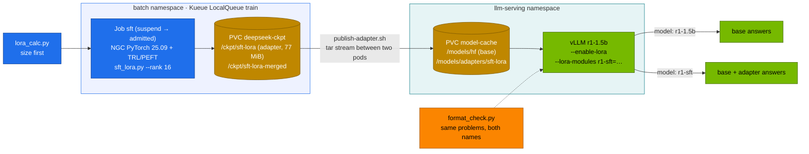

# Volume 23 — LoRA and QLoRA on a GB10: Sizing Before You Train, Training an Adapter, and Serving Base + Adapter from One vLLM

> **Module 03 · Part VI — Fine-tuning and RL** · Prev: [22 Autoscaling](22-autoscaling-with-kserve-and-kueue.md) · Next: [24 Unsloth & LLaMA-Factory](24-unsloth-and-llama-factory-workflows.md)

| | |
|---|---|
| **You will build** | A sizing habit and a full adapter lifecycle. You'll predict memory for LoRA, QLoRA and full fine-tuning with `lora_calc.py`, train a rank-16 LoRA on R1-Distill-Qwen-1.5B as a Kueue Job, publish the adapter into the model cache, serve base and adapter side by side from one vLLM, and measure what the adapter changed with `format_check.py` |
| **Hardware** | spark-01 |
| **Time** | 2 h (≈30 min of it is training) |
| **Risk** | Low. Training runs in `batch` under Kueue's quota |
| **Lab files** | [`tools/lora_calc.py`](lab/tools/lora_calc.py), [`tools/sft_lora.py`](lab/tools/sft_lora.py), [`tools/format_check.py`](lab/tools/format_check.py), [`k8s/jobs/sft.yaml`](lab/k8s/jobs/sft.yaml), [`scripts/publish-adapter.sh`](lab/scripts/publish-adapter.sh), [`k8s/lora/r1-1.5b-sft`](lab/k8s/lora/r1-1.5b-sft/kustomization.yaml) |

---

## 1. Why parameter-efficient fine-tuning

Full fine-tuning updates every weight. With mixed-precision AdamW that costs about **16 bytes per parameter** (bf16 weights + bf16 grads + two fp32 Adam moments + fp32 master weights) before activations. For a 7B model that's ~114 GiB, which is the entire GB10.

LoRA freezes the base model and learns a low-rank update for selected matrices:

```text
W' = W + (α / r) · B · A        A: r × d_in,  B: d_out × r,  r ≪ d
trainable params per matrix = r · (d_in + d_out)
```

QLoRA goes further and stores the frozen base in 4-bit NF4, so a 32B or 70B model fits for training on one Spark. What you trade:

| Method | Trainable | Frozen base | Quality vs full FT | Typical use |
|---|---|---|---|---|
| Full | 100 % | — | reference | new domain, continued pre-training |
| LoRA | 0.3–2 % | bf16 | close for format, style, tasks | most instruction/format tuning |
| QLoRA | same as LoRA | 4-bit NF4 | slightly lower. Slower steps (dequantisation) | large models on small memory |

---

## 2. Architecture — HLD



---

## 3. LLD

### 3.1 Sizing results (`lora_calc.py`, seq 2048, batch 1, gradient checkpointing on)

| Model | LoRA r16 | QLoRA r16 | Full FT | Trainable (r16) |
|---|---|---|---|---|
| R1-Distill-Qwen-1.5B | 5.1 GiB | 2.7 GiB | 28.0 GiB ✓ | 18.5 M (1.04 %) |
| R1-Distill-Qwen-7B | 16.7 GiB | 6.4 GiB | 115.4 GiB ✗ (2 Sparks) | 40.4 M (0.53 %) |
| R1-Distill-Qwen-32B | 66.7 GiB | 22.4 GiB | 491.9 GiB ✗ | 134.2 M (0.41 %) |
| Llama-3.3-70B | — | 45.2 GiB | ✗ | — |

These are estimates. Leave 15–20 % headroom for the CUDA context, allocator fragmentation and the host. Then **record yours** from `nvidia-smi` and `free -g` during the run.

### 3.2 What drives the numbers (7B, LoRA)

| Knob | Change | Memory | Notes |
|---|---|---|---|
| rank 8 → 256 | 20 M → 646 M trainable | 16.4 → 25.7 GiB | adapter file 38 MiB → 1.2 GiB |
| seq 2048 → 8192, batch 1 → 4 | 16× tokens per step | 16.7 → 45.6 GiB | logits (vocab 152K) become a major term |
| gradient checkpointing off | (seq 8192, batch 4) | 45.6 → 131.3 GiB | recomputation trades ~30 % speed for memory |

### 3.3 The lab's SFT recipe (`sft_lora.py`)

| Setting | Value |
|---|---|
| Base | `deepseek-ai/DeepSeek-R1-Distill-Qwen-1.5B` |
| Data | 5,000 synthetic GPU-arithmetic problems with explicit reasoning, in `<think>…</think><answer>N</answer>` form |
| Target modules | `q,k,v,o,gate,up,down_proj` (all linear layers) |
| r / α / dropout | 16 / 32 / 0.05 |
| Optimiser | AdamW, lr 2e-4, cosine, warmup 5 % |
| Batch | 8 × grad-accum 2 = 16 sequences/step, max length 512, bf16, gradient checkpointing |
| Steps | 300 |
| Outputs | `/ckpt/sft-lora` (adapter), `/ckpt/sft-lora-merged` (with `--merge`) |

### 3.4 Serving adapters: merge or attach?

| | Merge (`merge_and_unload`) | Attach (`--enable-lora`) |
|---|---|---|
| Serving cost | a full model copy per variant | one base + N small adapters in the same KV/compute budget |
| Speed | base speed | a few % slower (extra low-rank matmuls) |
| Switching | redeploy | per request: `model: r1-sft` |
| Use when | one variant, maximum speed | many tenants or tasks on one GPU |

---

## 4. Integrations

- **Vol 22**: the Job is gang-admitted by Kueue (`batch/train`, priority `routine`).
- **Vol 24**: Unsloth and LLaMA-Factory produce the same PEFT adapter format, so publishing and serving don't change.
- **Vol 25**: GRPO starts from this SFT checkpoint in the R1 recipe (SFT for format, then RL for correctness).
- **Vol 28**: LiteLLM can expose `r1-sft` as a tenant-specific alias.

---

## 5. Lab

### 5.1 Size it before you submit

```bash
cd "03-DeepSeek/lab"
python3 tools/lora_calc.py deepseek-r1-distill-qwen-1.5b --method lora --rank 16
python3 tools/lora_calc.py deepseek-r1-distill-qwen-7b --method full
python3 tools/lora_calc.py deepseek-r1-distill-qwen-32b --method qlora --seq 4096
```

Expected (7B full):

```text
total ≈ 115.4 GiB of 119.7 GiB unified memory → ✗ needs 2 Sparks (FSDP/ZeRO-3) or a lighter method
```

### 5.2 Look at the training data

```bash
python3 tools/sft_lora.py --dry-run
```

```text
A cluster has 10 nodes with 3 GPUs each. 10 GPUs are drained for maintenance. How many GPUs are available?
  → <think>Total GPUs = 10 × 3 = 30. Drained = 10. Available = 30 − 10 = 20.</think><answer>20</answer>
```

### 5.3 Baseline: how well does the base model follow the format?

```bash
scripts/serve-model.sh r1-1.5b
kubectl -n llm-serving port-forward svc/vllm 8000 &
python3 tools/format_check.py --url http://localhost:8000 --model r1-1.5b -n 50
```

Record format % and correct %. The base model reasons well but rarely wraps its answer in `<answer>` tags.

### 5.4 Train (Kueue admits it)

```bash
kubectl apply -k .
kubectl apply -f k8s/jobs/train-common.yaml -f k8s/jobs/sft.yaml
kubectl -n batch get workload -w                        # Admitted
kubectl -n batch logs -f job/sft | grep -E "trainable params|'loss'|merged"
```

Expected: `print_trainable_parameters` reports ≈18.5 M trainable of ≈1.8 B (≈1.03 %, matching §3.1), then loss falling from ~1.5 to < 0.1 over 300 steps (**record yours**: step time, peak `free -g` used).

### 5.5 Publish and serve base + adapter

```bash
scripts/publish-adapter.sh sft-lora
kubectl apply -k k8s/lora/r1-1.5b-sft
kubectl -n llm-serving rollout status deploy/vllm --timeout=20m
curl -s localhost:8000/v1/models | jq -r '.data[].id'          # r1-1.5b and r1-sft
```

### 5.6 Measure the change

```bash
python3 tools/format_check.py --url http://localhost:8000 --model r1-1.5b -n 50
python3 tools/format_check.py --url http://localhost:8000 --model r1-sft  -n 50
```

| Model | format % | correct % |
|---|---|---|
| r1-1.5b (base) | | |
| r1-sft (base + adapter) | | |

Expected pattern: format jumps to ~100 % with the adapter, while correctness changes much less. SFT teaches the *shape* of the answer. Vol 25 uses RL to push correctness.

### 5.7 (Optional) Merged weights

The Job wrote `/ckpt/sft-lora-merged`. Publish it and serve it as its own model if you need base-model speed:

```bash
scripts/publish-adapter.sh sft-lora-merged
kubectl apply -k k8s/models/r1-1.5b
kubectl -n llm-serving set env deploy/vllm MODEL=/models/adapters/sft-lora-merged SERVED_NAME=r1-sft-merged
python3 tools/format_check.py --url http://localhost:8000 --model r1-sft-merged -n 50   # same scores, base-model speed
```

---

## 6. Verify

| Check | Expected |
|---|---|
| sizing | you predicted the Job's memory within ~20 % |
| Job | `Complete`. `/ckpt/sft-lora/adapter_config.json` exists |
| serving | `/v1/models` lists both `r1-1.5b` and `r1-sft` |
| effect | format % clearly higher for `r1-sft` |

---

## 7. Troubleshooting

| Symptom | Cause | Fix |
|---|---|---|
| Job `OOMKilled` | limits.memory (48Gi) below the real footprint | re-run `lora_calc.py` with your seq/batch. Lower batch, raise grad-accum |
| loss is NaN | fp16 overflow or lr too high | bf16 (default). lr 1e-4 |
| `ValueError: LoRA rank 32 is greater than max_lora_rank 16` | adapter rank > `--max-lora-rank` | raise `--max-lora-rank` to the adapter's `r` |
| `r1-sft` 404 | adapter path wrong, or vLLM started before publishing | `ls /models/adapters/sft-lora` in the pod. Restart vLLM |
| adapter loads but answers look like base | wrong `target_modules`, or adapter trained on a different base | check `base_model_name_or_path` in `adapter_config.json` |
| QLoRA step much slower than LoRA | 4-bit dequantisation every forward pass | expected. Use LoRA when bf16 weights fit |
| `bitsandbytes` import fails on arm64 | wheel without aarch64/CUDA support | use the NGC image's build, or a recent `bitsandbytes` with aarch64 wheels |

---

## 8. Scale-out path

| One Spark | Two Sparks | Datacenter |
|---|---|---|
| LoRA/QLoRA to 70B | full FT of 7B with FSDP (Vol 26) | full FT with FSDP/ZeRO-3 + TP across nodes |
| adapters on a PVC | NFS-RDMA share | adapter registry (object store + metadata), hot-loaded with vLLM's dynamic LoRA API |
| `format_check.py` | same | eval gate in CI before an adapter is promoted |

---

## 9. Checklist

- [ ] I size every training run before submitting it.
- [ ] I can explain the 16 bytes/parameter of full fine-tuning and what LoRA removes.
- [ ] I trained, published and served an adapter next to its base.
- [ ] I measured what the adapter changed on held-out problems.
