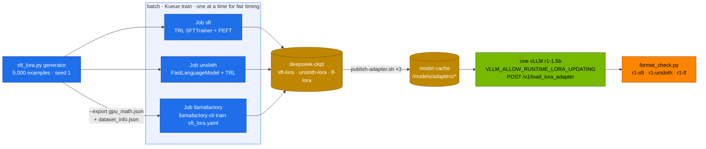

# Volume 24 — Unsloth and LLaMA-Factory: The Same Fine-Tune Three Ways, Measured, and Served from One Base

> **Module 03 · Part VI — Fine-tuning and RL** · Prev: [23 LoRA/QLoRA sizing](23-peft-lora-qlora-parameter-sizing.md) · Next: [25 RL rollout infrastructure](25-distributed-rl-rollout-infrastructure.md)

| | |
|---|---|
| **You will build** | Volume 23's LoRA SFT run three ways with identical data, rank, batch and steps: plain TRL + PEFT, Unsloth (fused kernels) and LLaMA-Factory (YAML recipe, no code). You'll compare wall time, peak memory and result quality, then hot-load all three adapters into one running vLLM with the runtime LoRA API |
| **Hardware** | spark-01 |
| **Time** | 2.5 h (three ≈20–40 min training runs) |
| **Risk** | Low. Pinned versions install on top of the NGC PyTorch image without replacing its torch |
| **Lab files** | [`k8s/jobs/unsloth.yaml`](lab/k8s/jobs/unsloth.yaml), [`k8s/jobs/llamafactory.yaml`](lab/k8s/jobs/llamafactory.yaml), [`tools/unsloth_sft.py`](lab/tools/unsloth_sft.py), [`tools/sft_lora.py`](lab/tools/sft_lora.py) (`--export`), [`tools/format_check.py`](lab/tools/format_check.py) |

---

## 1. Why three tools for one job

| Tool | What it is | Strength | Watch out for |
|---|---|---|---|
| **TRL + PEFT** | Hugging Face's trainer library and adapter library | the reference. Every other tool builds on it | you write the Python |
| **Unsloth** | patches HF models with hand-written Triton kernels (RoPE, RMSNorm, fused cross-entropy, LoRA matmuls) and its own gradient checkpointing | less memory, faster steps on one GPU. Easy QLoRA. GGUF export | monkey-patching: import it first. Versions are tightly coupled to transformers/trl |
| **LLaMA-Factory** | a CLI/web UI that turns one YAML file into an SFT, DPO, KTO, PPO or reward-model run | 100+ model templates, dataset registry, no code. Good for repeatable recipes | template choice matters. Its pins can lag the ecosystem |

All three produce the **same PEFT adapter format** (`adapter_config.json` + `adapter_model.safetensors`), so publishing and serving are identical (Vol 23).

---

## 2. Architecture — HLD



---

## 3. LLD

### 3.1 Held constant across the three runs

| Setting | Value |
|---|---|
| Base | DeepSeek-R1-Distill-Qwen-1.5B, bf16 |
| Data | 5,000 generated examples (`sft_lora.py`, seed 1) |
| LoRA | r 16, α 32, all linear projections |
| Batch | 8 × grad-accum 2, max length 512 |
| Optimiser | AdamW 2e-4, cosine, warmup 5 %, 300 steps |
| Image | `nvcr.io/nvidia/pytorch:25.09-py3` |
| Pod | 4 CPU, 48Gi limit, 1 time-slice |

### 3.2 Version pins and why

| Job | Pins | Reason |
|---|---|---|
| `sft` | trl 0.23.0, peft 0.17.1, transformers 4.56.2, accelerate 1.10.1, datasets 4.1.1 | the lab baseline (`versions.env`) |
| `unsloth` | baseline + unsloth 2025.9.11, unsloth_zoo 2025.9.14 (`--no-deps`), bitsandbytes 0.48.1 | unsloth 2025.9.11 supports transformers ≤ 4.56.2 and trl ≤ 0.23.0. `--no-deps` keeps NVIDIA's torch/triton. bitsandbytes 0.48.1 ships an aarch64 wheel |
| `llamafactory` | llamafactory 0.9.4 + baseline, but **datasets 4.0.0** | 0.9.4 requires `datasets<=4.0.0` |

When you bump versions, check each package's declared requirements first (`pip download --no-deps pkg==X` and read `METADATA`), as was done for this table.

### 3.3 LLaMA-Factory recipe essentials

| Key | Value | Note |
|---|---|---|
| `stage` / `finetuning_type` | `sft` / `lora` | `dpo`, `kto`, `ppo`, `rm` are other stages |
| `lora_target` | `all` | every linear layer, same as the other two runs |
| `template` | `deepseekr1` | must match the base model's chat format. A wrong template trains on the wrong prompt layout |
| `dataset` / `dataset_dir` | `gpu_math` / `/ckpt/data` | resolved through `dataset_info.json` (ShareGPT form with OpenAI-style `role`/`content` tags) |
| `max_steps` | 300 | overrides epochs |

### 3.4 What to compare (**record yours**)

| | TRL + PEFT | Unsloth | LLaMA-Factory |
|---|---|---|---|
| wall time for 300 steps | | | |
| steps/s | | | |
| peak CUDA memory (GiB) | | | |
| final train loss | | | |
| format % / correct % (`format_check.py`, n=50) | | | |

Where to read each figure: `STATS {…}` at the end of the `sft` and `unsloth` logs, and `train_runtime`, `train_steps_per_second` in `/ckpt/lf-lora/all_results.json`.

---

## 4. Integrations

- **Vol 22**: each Job is a Kueue workload with priority `routine`. Run them one at a time for timing, or let Kueue run two together if you only care about results.
- **Vol 23**: same publishing script and serving pattern.
- **Vol 17**: Unsloth can also export GGUF (`model.save_pretrained_gguf`) for llama.cpp/Ollama. That needs a llama.cpp build in the image.

---

## 5. Lab

```bash
cd "03-DeepSeek/lab"
kubectl apply -k .                                     # deepseek-train ConfigMap (now with unsloth_sft.py)
kubectl apply -f k8s/jobs/train-common.yaml
```

### 5.1 Run 1 — TRL + PEFT (skip if done in Vol 23)

```bash
kubectl -n batch delete job sft --ignore-not-found
kubectl apply -f k8s/jobs/sft.yaml
kubectl -n batch wait --for=condition=complete job/sft --timeout=2h
kubectl -n batch logs job/sft | grep STATS
```

### 5.2 Run 2 — Unsloth

```bash
kubectl apply -f k8s/jobs/unsloth.yaml
kubectl -n batch logs -f job/unsloth | grep -E 'Unsloth|Trainable|loss|STATS'
```

Expected: an Unsloth banner listing the GPU and patched model, then the same loss curve shape as run 1. Compare the `STATS` lines.

### 5.3 Run 3 — LLaMA-Factory

```bash
kubectl apply -f k8s/jobs/llamafactory.yaml
kubectl -n batch logs -f job/llamafactory | grep -E 'wrote|trainable params|loss|train_runtime'
```

### 5.4 Publish all three and hot-load them

```bash
for a in sft-lora unsloth-lora lf-lora; do scripts/publish-adapter.sh $a; done
kubectl apply -k k8s/lora/r1-1.5b-sft                  # base + r1-sft
kubectl -n llm-serving set env deploy/vllm VLLM_ALLOW_RUNTIME_LORA_UPDATING=True
kubectl -n llm-serving rollout status deploy/vllm --timeout=20m
kubectl -n llm-serving port-forward svc/vllm 8000 &
for n in unsloth lf; do
  curl -s localhost:8000/v1/load_lora_adapter -H 'Content-Type: application/json' \
    -d "{\"lora_name\":\"r1-$n\",\"lora_path\":\"/models/adapters/$n-lora\"}"; echo
done
curl -s localhost:8000/v1/models | jq -r '.data[].id'    # r1-1.5b r1-sft r1-unsloth r1-lf
```

Runtime loading is convenient but unauthenticated on the vLLM port. Keep that env var off in production, or only expose vLLM behind LiteLLM (Vol 28).

### 5.5 Compare quality

```bash
for m in r1-1.5b r1-sft r1-unsloth r1-lf; do
  python3 tools/format_check.py --url http://localhost:8000 --model $m -n 50 --show 0
done
```

Expected: all three adapters land within a few points of each other on format and correctness. Same recipe, same data. If one is far off, suspect the chat template (LLaMA-Factory) or a patching/version issue (Unsloth) before suspecting the method.

---

## 6. Verify

| Check | Expected |
|---|---|
| three Jobs | `Complete`. Each wrote `adapter_config.json` |
| comparison table | filled in, with peak memory and steps/s for each |
| serving | four model ids on one vLLM |
| quality | adapters within noise of each other |

---

## 7. Troubleshooting

| Symptom | Cause | Fix |
|---|---|---|
| `pip` starts downloading `torch-…-aarch64.whl` | a package's deps pulled a new torch over NVIDIA's | `--no-deps` for unsloth/unsloth_zoo. Pin compatible versions |
| `Unsloth: Please import unsloth before transformers` warning, no speed-up | import order | `from unsloth import FastLanguageModel` first (the script does) |
| Unsloth `NotImplementedError`/kernel errors on sm_121 | Triton/kernel support lagging new GPUs | newer NGC PyTorch image + newer unsloth, or fall back to TRL |
| LLaMA-Factory `… version mismatch` and exits | its dependency check | pin as in §3.2, or `DISABLE_VERSION_CHECK=1` (set in the Job) after checking compatibility yourself |
| LLaMA-Factory `Cannot find dataset gpu_math` | `dataset_info.json` not next to the data | the Job copies it to `/ckpt/data`. Check `ls /ckpt/data` |
| adapter answers in the wrong format | wrong `template` | `deepseekr1` for R1 distills. `qwen` for Qwen2.5 instruct |
| `load_lora_adapter` 404 | env var not set, or older vLLM | `VLLM_ALLOW_RUNTIME_LORA_UPDATING=True`. Restart |
| `bitsandbytes` CUDA setup error | wheel without your CUDA/arch | bitsandbytes ≥ 0.48 aarch64 wheel. Or skip `--qlora` |

---

## 8. Scale-out path

| One Spark | Two Sparks | Datacenter |
|---|---|---|
| single-GPU LoRA with any of the three | LLaMA-Factory/accelerate with FSDP across both (Vol 26) | LLaMA-Factory or NeMo with DeepSpeed/FSDP. Unsloth for single-GPU experiments |
| runtime LoRA loading by hand | same | adapter registry + gated promotion. vLLM loads adapters per request |

---

## 9. Checklist

- [ ] I ran the same fine-tune with three tools and filled in the comparison.
- [ ] I can install Unsloth and LLaMA-Factory on an NGC image without breaking its torch.
- [ ] I can write a LLaMA-Factory recipe and dataset registration from scratch.
- [ ] I hot-loaded several adapters into one vLLM and evaluated each.
