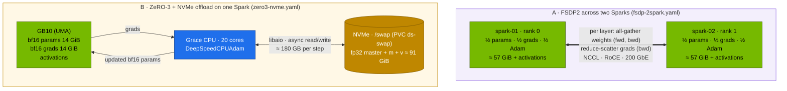

# Volume 26 — Full Fine-Tuning Beyond One GB10: FSDP2 Across Two Sparks, DeepSpeed ZeRO-3, and NVMe Offload on One

> **Module 03 · Part VI — Fine-tuning and RL** · Prev: [25 RL rollouts](25-distributed-rl-rollout-infrastructure.md) · Next: [27 Open WebUI](27-open-webui-deployment-and-integration.md)

| | |
|---|---|
| **You will build** | Full-parameter fine-tuning of R1-Distill-Qwen-7B, which needs ~114 GiB of training state, two ways: FSDP2 sharding across two Sparks over the CX-7 link, and DeepSpeed ZeRO-3 with the optimizer offloaded to NVMe on a single Spark. You'll see sharding in per-rank memory, measure what each layout costs per step, and learn why "CPU offload" buys nothing on unified memory |
| **Hardware** | spark-01 (§5.1, §5.3). spark-02 + QSFP cable for §5.2 |
| **Time** | 2.5 h |
| **Risk** | Medium. §5.3 writes ~180 GB per step to the NVMe. Fine for a lab run of 30 steps. Don't leave it running for days |
| **Lab files** | [`tools/fsdp_finetune.py`](lab/tools/fsdp_finetune.py), [`tools/sft_lora.py`](lab/tools/sft_lora.py) (`--full --deepspeed`), [`k8s/jobs/fsdp-1spark.yaml`](lab/k8s/jobs/fsdp-1spark.yaml), [`k8s/jobs/fsdp-2spark.yaml`](lab/k8s/jobs/fsdp-2spark.yaml), [`k8s/jobs/zero3-nvme.yaml`](lab/k8s/jobs/zero3-nvme.yaml), [`tools/lora_calc.py`](lab/tools/lora_calc.py) |

---

## 1. Why sharding and offload exist

Mixed-precision AdamW keeps, per parameter:

| State | Bytes |
|---|---|
| bf16 weights (forward/backward) | 2 |
| bf16 gradients | 2 |
| fp32 master weights | 4 |
| fp32 Adam first moment (m) | 4 |
| fp32 Adam second moment (v) | 4 |
| **total** | **16** |

7.6 B parameters × 16 B ≈ **114 GiB** before activations, which is the whole GB10. You have three ways out:

| Technique | Idea | Cost |
|---|---|---|
| **LoRA** (Vols 23–24) | don't train most weights | not a full fine-tune |
| **Shard** (FSDP, ZeRO-3) | each of N ranks keeps 1/N of the states. Weights are all-gathered just in time per layer | network traffic every layer, every step |
| **Offload** (ZeRO-Offload/Infinity) | put optimizer states (and optionally params) in a bigger, slower tier | bandwidth to that tier every step |

FSDP2 (PyTorch-native `fully_shard`) and DeepSpeed ZeRO-3 implement the same idea, sharding all three of params, grads and optimizer state. They differ in API, ecosystem and offload support.

---

## 2. Architecture — HLD



---

## 3. LLD

### 3.1 Memory per layout (7B, seq 512, batch 8, gradient checkpointing)

| Layout | Per-GB10 state | Where the rest is | Fits? |
|---|---|---|---|
| plain AdamW, 1 Spark | ~114 GiB + activations | — | ✗ (`lora_calc.py … --method full`) |
| FSDP2, world 2 | ~57 GiB + activations | the other Spark | ✓ |
| ZeRO-3 + optimizer → NVMe, 1 Spark | ~28 GiB + activations + pinned buffers | ~91 GiB on NVMe | ✓, slowly |
| ZeRO-3 + optimizer → "CPU", 1 Spark | ~114 GiB | the same LPDDR5x | ✗: on UMA "CPU memory" *is* GPU memory |

### 3.2 Traffic per optimiser step

| Layout | What moves | Approx. volume (7B) | Link |
|---|---|---|---|
| FSDP2 ×2 | all-gather params forward + backward, reduce-scatter grads | ≈ 3 × 15 GB ≈ 45 GB total, half of it per rank | CX-7 RoCE (**record** NCCL bus bandwidth from 02 Vol 17) |
| ZeRO-3 NVMe ×1 | read and write m, v and master weights | ≈ 2 × 91 GB ≈ 182 GB | NVMe (**record** seq read/write from Vol 20's fio) |

Rough step-time floor = volume ÷ bandwidth, plus compute. With ~20 GB/s RoCE and ~5 GB/s NVMe the floors are ≈ 1–2 s for FSDP and ≈ 35–40 s for NVMe offload. That's why offload is a capacity tool, not a speed tool.

### 3.3 FSDP2 in `fsdp_finetune.py`

| Line | Purpose |
|---|---|
| `fully_shard(layer, mp_policy=mp)` per decoder block, then the root | each block is its own all-gather/free unit, so only ~one block is unsharded at a time |
| `MixedPrecisionPolicy(param_dtype=bf16, reduce_dtype=fp32)` | compute in bf16, reduce gradients in fp32 for stability |
| `gradient_checkpointing_enable()` | recompute activations in backward |
| per-rank `max_memory_allocated` print | evidence that each rank holds ~half |

### 3.4 DeepSpeed config (`deepspeed-configs` ConfigMap)

| Key | Value | Why |
|---|---|---|
| `zero_optimization.stage` | 3 | shard (or offload) params, grads and optimizer state |
| `offload_optimizer.device` | `nvme`, `nvme_path: /swap` | ZeRO-Infinity: optimizer state on disk |
| `aio.*` | 1 MiB blocks, queue depth 16 | async I/O via libaio (`apt-get install libaio-dev` in the Job) |
| `optimizer` | `AdamW` with `"auto"` params | DeepSpeed builds DeepSpeedCPUAdam (vectorised on Grace) to update offloaded state |
| `stage3_gather_16bit_weights_on_model_save` | true | `save_model` writes a normal HF checkpoint |
| `"auto"` values | filled by the HF Trainer from `SFTConfig` | one source of truth for lr and batch |

---

## 4. Integrations

- **02 Vol 17**: NCCL over CX-7. `fsdp-2spark.yaml` uses the same `NCCL_*` variables and hostNetwork.
- **Vol 20**: the NVMe bandwidth you measured bounds §5.3's step time. `ds-swap` uses the `local-nvme` (Delete) class.
- **Vol 22**: all three Jobs are Kueue workloads. `fsdp-2spark` needs 2 GPUs of quota, which is all of `spark-cq`.
- **Vol 23**: `lora_calc.py --method full` predicts the single-Spark failure.

---

## 5. Lab

```bash
cd "03-DeepSeek/lab"
kubectl apply -k . && kubectl apply -f k8s/jobs/train-common.yaml
python3 tools/lora_calc.py deepseek-r1-distill-qwen-7b --method full      # ✗ needs 2 Sparks …
```

### 5.1 Baseline: FSDP on one Spark (no actual sharding)

```bash
kubectl apply -f k8s/jobs/fsdp-1spark.yaml
kubectl -n batch logs -f job/fsdp-1spark | grep -E 'rank|done'
```

```text
rank 0/1 step 0 loss 1.9… peak mem 2x.x GiB
…
done in …s
```

World size 1 means each "shard" is the whole model. Peak memory ≈ the 1.5B full-FT estimate (~28 GiB). **Record yours.**

### 5.2 FSDP2 across two Sparks (2×)

```bash
kubectl apply -f k8s/jobs/fsdp-2spark.yaml
kubectl -n batch get pods -l job-name=fsdp -o wide          # one pod per Spark
kubectl -n batch logs -f -l job-name=fsdp --prefix | grep -E 'NCCL INFO.*NET|rank|done'
```

Expected: `rank 0/2` and `rank 1/2` each report a peak around half the 7B training state plus activations (≈ 60–70 GiB). Neither Spark could hold the whole thing. NCCL logs show the `NET/IB` transport. While it runs, on either Spark:

```bash
watch -n1 "ethtool -S enp1s0f1np1 | grep -E 'rx_bytes_phy|tx_bytes_phy'"
```

| | per-rank peak (GiB) | s/step | link GB/s during step |
|---|---|---|---|
| FSDP2 ×2, 7B (**record yours**) | | | |

### 5.3 ZeRO-3 + NVMe offload on one Spark

```bash
kubectl apply -f k8s/jobs/zero3-nvme.yaml
kubectl -n batch logs -f job/zero3-nvme | grep -E 'async_io|cpu_adam|ZeRO|nvme|loss|STATS'
```

Expected: `ds_report` shows `async_io … [OKAY]` and `cpu_adam` buildable, then DeepSpeed logs the swap path `/swap`. In another shell:

```bash
iostat -xm 2 | grep -E 'Device|nvme'                       # sustained read+write during each optimizer step
free -g                                                    # well under 119 GiB used
```

| | GB10 peak (GiB) | s/step | NVMe MB/s during step |
|---|---|---|---|
| ZeRO-3 NVMe ×1, 7B (**record yours**) | | | |

Compare with §5.2: same model and data, a fraction of the memory per box, many times slower per step.

### 5.4 (Optional) See why CPU offload doesn't help on UMA

Edit a copy of `zero3-nvme.json` with `"device": "cpu"` and run it. Expected: the Job is OOM-killed (or the node runs out of memory). The "offloaded" states land in the same LPDDR5x the GPU uses. On a discrete-GPU server the same config would move ~91 GiB into host RAM and succeed.

### 5.5 Use the result

`/ckpt/r1-7b-full-zero3` is a normal HF checkpoint. Publish and evaluate it like Vol 23's merged model:

```bash
scripts/publish-adapter.sh r1-7b-full-zero3
kubectl apply -k k8s/models/r1-7b
kubectl -n llm-serving set env deploy/vllm MODEL=/models/adapters/r1-7b-full-zero3 SERVED_NAME=r1-7b-ft
```

---

## 6. Verify

| Check | Expected |
|---|---|
| prediction | `lora_calc.py` says full 7B doesn't fit one Spark |
| FSDP ×2 | two ranks, each ≈ half the state, loss falling |
| ZeRO-3 NVMe | completes 30 steps. GB10 peak far below 119 GiB. NVMe busy during optimizer steps |
| comparison | the step-time ratio between §5.2 and §5.3 roughly matches link vs NVMe bandwidth |

---

## 7. Troubleshooting

| Symptom | Cause | Fix |
|---|---|---|
| FSDP ranks hang at init | rendezvous on the wrong IP, or a firewall | `--master-addr 192.168.100.11`, hostNetwork, port 29500 open |
| NCCL uses `NET/Socket`, slow | RDMA not picked | `NCCL_IB_HCA`, `NCCL_IB_GID_INDEX=3`, `IPC_LOCK`. Check `ibv_devices` |
| `fsdp` pod Pending: anti-affinity | only one node | needs spark-02 |
| `async_io … [NO]` in `ds_report` | libaio missing | `apt-get install libaio-dev` (in the Job) |
| `cpu_adam` build fails | compiler/CUDA headers missing | use the NGC PyTorch image. Check `ds_report` |
| ZeRO-3 step time ≫ estimate | NVMe shared with model loads or another job, or `/swap` on a slow path | run alone. Confirm the `ds-swap` PV is on the NVMe |
| OOM with NVMe offload | pinned buffers + activations + other pods | lower batch, `buffer_count` 2. Scale serving down (Vol 22) |
| `save_model` writes shards, not HF weights | ZeRO-3 gather disabled | `stage3_gather_16bit_weights_on_model_save: true` |

---

## 8. Scale-out path

| One Spark | Two Sparks | Datacenter |
|---|---|---|
| ZeRO-3 NVMe for capacity, LoRA for speed | FSDP2 full FT of 7B | FSDP2/ZeRO-3 within a node + TP/PP across nodes (Megatron, NeMo), HSDP (shard in-node, replicate across) |
| `local-nvme` swap | NVMe on both | parallel file system for checkpoints. Offload rarely needed with HBM pools |

---

## 9. Checklist

- [ ] I can derive the 16 bytes per parameter of mixed-precision AdamW.
- [ ] I saw per-rank memory halve with FSDP across two Sparks.
- [ ] I ran a full 7B fine-tune on one Spark with NVMe offload and know its cost.
- [ ] I can explain why CPU offload adds no capacity on unified memory.
